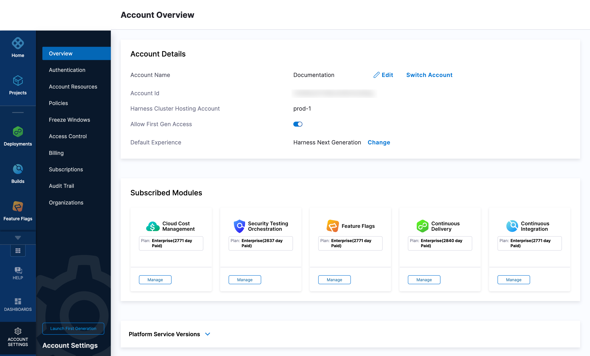

Harness provides a summary of your account information and enables you to subscribe to downtime alerts for the cluster hosting your Harness account.

To view your an overview of your account information, do the following:

1. In Harness, select **Account Settings**.

2. Select **Overview** to see an overview of your Harness account:

   
   
   You can see your account details, check hosting status, and view licensing for different Harness modules.

To view site status and subscribe to alerts, do the following:

1. In Harness, select **Help**, and then select **Site Status**. The operational status of the cluster hosting your account is displayed.

   
   
2. Select **Subscribe to Updates** to get instant updates of the cluster's status.
