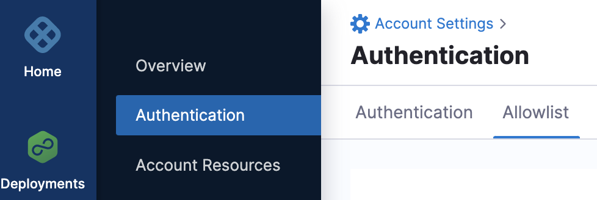

:::important
Currently, this feature is behind the feature flag `PL_IP_ALLOWLIST_NG`. Contact Harness Support to enable the feature.
:::


Management of the IP allowlist involves reviewing and updating the list of approved IP addresses regularly to ensure that only authorized users are granted access. After you add and enable an IP allowlist, only users connecting from the IP address/CIDR (Classless Inter-Domain Routing) block may log into Harness.

Following are some key benefits of IP allowlist management:

- Increased security: By limiting access to approved IP addresses only, you can prevent unauthorized access to sensitive data and resources. This protects against data breaches, cyber-attacks, and other security threats.

- Improved network performance: By limiting access to approved IP addresses only, you can reduce the number of requests your network receives, which improves network speed and reduces latency.


:::important
Harness IP allowlisting is for user connections to a Harness account. It will not perform IP allowlisting for Harness Delegate connections.
:::


This topic explains how to set up IP allowlist in Harness.

## Important
- Make sure you have **View**, **Create/Edit**, and **Delete** permissions for **Authentication Settings** to add and manage IP allowlist.
- Harness returns a status code of HTTP 401 if an IP address is not allowlisted but tries to access Harness.
- An allowlist can be based on IPv4 or IPv6 or a mix of both.
- Following are the exceptions to the IP allowlist in Harness:
  - Calls corresponding to SCIM.
  - Calls corresponding to Identity providers.
  - API calls corresponding to Harness admin.
- Harness uses an in-memory cache. All caches expire after 5 minutes. Every update takes 5 minutes because there are no manual cache updates.

## Add IP addresses in the allowlist

To add IP allowlist in Harness: 

1. Select **ACCOUNT SETTINGS** and then select **Authentication**.
2. Select **Allowlist**.
   
   

3. To add IP addresses, select **Add IP Addresses**.
   The **IP Allowlist** settings appear.
4. Enter **Name** for the allowlist.
5. Select **Continue**.

   

## Define the IP range

1. In **IP Address/CIDR**, enter a CIDR or an individual IP address or a block of IP addresses. 
2. You can select one of the following for the allowlist application: 
   - **UI**: Harness allows or blocks the IP address based on the UI request.
   - **API**: Harness checks the API key in the request and allows or blocks the IP address.
3. Select **Save and Continue**.

   
  
## Test IP

1. Enter an IP address to check if it falls within the IP address range configured in the previous step.
2. Select **Test**.
3. Select **Finish**.

   

   You can create multiple allowlists and enable or disable them as needed.

## Manage IP allowlist

The IP addresses configured in the allowlist now appear in the **IP Allowlist**.

1. Toggle enable or disable beside the allowlist to enable or disable an allowlist.
2. Select the 3 dot menu to edit or delete an allowlist.
   Select **Check any IP for allowlist** to check if an IP address is allowed.

   

   Enter an IP address or a range of IP addresses and select **Check**.
   
   
   :::important
   Make sure that your current IP address is allowlisted in all enabled configurations, otherwise, they may get locked out.
   :::

## Harness Manager

Users of the Harness Manager browser client need access to **app.harness.io** and **static.harness.io**. This is not a Harness Delegate requirement. It's simply for users to use the browser-based Harness Manager.

## Vanity URL

If you are using a Harness vanity URL, like **mycompany.harness.io**, you can allowlist it also.

## Allowlist Harness SaaS IPs

The following list is optional. You can allowlist these IPs if needed.

```
35.201.91.229  
162.159.134.64  
162.159.135.64  
2606:4700:7::a29f:8640  
2606:4700:7::a29f:8740
```

:::caution
Harness will not change IPs without 30 days notice to all customers. If a security emergency requires a change, all customers will be notified.

:::

