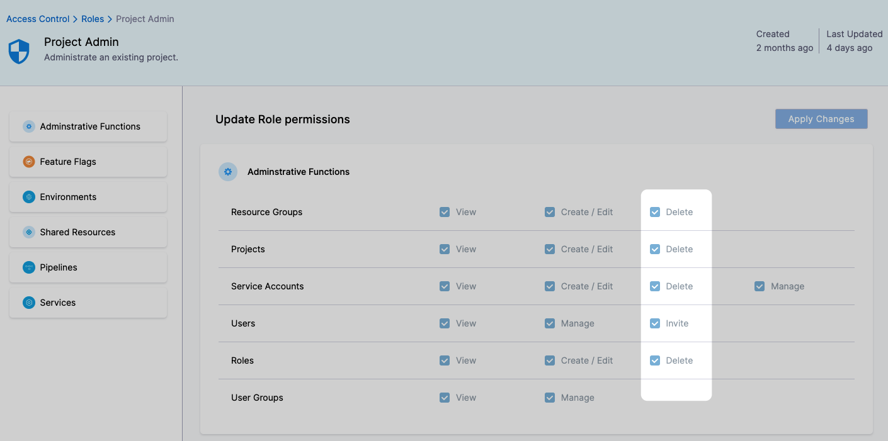
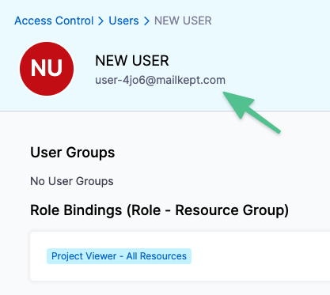

This topic covers the rules governing the deletion of Harness entities.

### Entity Connections

Entities are connected. A Role entity is applied to User entities. Deleting an entity, such as a Role, impact Users.

As a result of the connection between entities, deleting an entity can make another entity not able to do its job.

Harness will warn you if you try to delete an entity that is used by another entity or resource.

If you try to delete the following entity types, Harness will warn you if the entity is used elsewhere:

* User groups
* Connectors
* Secrets
* Templates
* Infrastructures
* Services

If the entity is used, Harness will show you where.

For example:

* A Pipeline that uses a Connector.
* A Connector that uses a Secret.

Harness provides you with the option to delete the entity from all dependent entities (bulk removal).

### Permissions

The ability to delete an entity depends on the Role permissions you have. You can see the Delete permissions in any role:

In some cases, you might try to delete an entity, but the entity is used by another entity that you do not have permission to change.

Harness will identify that you do not have permission to edit the other entity, and so you cannot delete this entity.

### Deletion of Roles

When attempting to delete a role, you will see all the Groups assigned to it.

Role Id has the following deletion rules:

* The role’s Id can't be used until it is completely removed from the database (based on the retention policy).
* If the deleted role effects active users, they are prevented from performing the operations granted by the removed role’s permissions.   
For example, if a user was assigned to a role that had the Create/Edit Pipeline permission, and the role is removed, then the user can no longer create or edit Pipelines.

### Deletion of Users

A User entity is identified by their Id. The Id is the email address used to invite and sign up the User:

A User and its Id can be deleted. 

When a User is deleted, their Id (email address) can’t be used until the User is completely removed from the system. See [Entity Retention Policy](entity-retention-policy.md).

### Deletion of Pipelines

When you delete a Pipeline, Harness will list all the related entities that will be deleted from Harness.

Pipeline deletion has the following rules:

* All runtime entities (deployments) are deleted from the Harness and are not available in any reports.
* When there is a reference to a deleted deployment, such as in a report, there is an indication that the deployment is deleted.
* The Pipeline is removed from Harness and is not available.
* All [Input Sets and Overlays](../8_Pipelines/run-pipelines-using-input-sets-and-overlays.md) in the deleted Pipeline are deleted also.

### Deletion of Projects

When you delete a Project, Harness will list all the related entities that will be deleted from Harness.

Project deletion has the following rules:

* All Project resources (Pipelines, Services, Environments, etc) are deleted.
* Project Delegates are deleted from Harness. You will have to remove the Harness Delegate(s) from your environment.
* All Project Users are notified via email that the Project was deleted.

### See also

* [Harness Entity Reference](harness-entity-reference.md)
* [Entity Retention Policy](entity-retention-policy.md)
* [Entity Identifier Reference](entity-identifier-reference.md)

