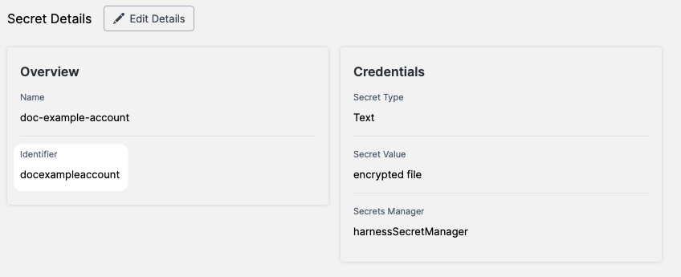

Many Harness entities and resources include a unique Id (entity Identifier) that's immutable once the entity is created.

Identifiers provide a permanent way to refer to an entity, and avoid issues that can arise when a name is changed.

### Identifier limits and requirements

Identifiers have naming and usage limitations that you should be aware of.

#### Identifier creation

When you name an entity, Harness automatically generates its identifier.

You can edit the Identifier when you are creating the entity, but not after the entity is saved.

If you rename the entity, the Identifier remains the same.

The generated Identifier is based on the entity name and meets the identifier naming restrictions.

If an entity name cannot be used because it's already occupied by another entity, Harness automatically adds a prefix in the form of `-1`, `-2`, etc.

#### Entities use identifiers to interact with each other

The `identifier` field is immutable because Harness Entities use this field to interact with each other. If you delete an Entity, or create a copy with a new identifier, references to that Entity will not get updated. For example, each Trigger has a `pipelineIdentifier` field that specifies the Pipeline for that Trigger. If you create a copy of the original Pipeline (with a new identifier) and then delete the original, any Triggers that reference the original will no longer work.

#### Identifier restrictions

Identifiers have the following restrictions:

* Identifiers must start with a-z, A-Z, or \_. Identifiers can then be followed by 0-9, a-z, A-Z, \_ or $.

	:::note
	Custom roles cannot start with an underscore( _ ) because Harness-managed role identifiers start with an underscore.
	:::

* Identifiers are case-sensitive. 
* Identifiers shouldn't be any of the following words:
	+ or
	+ and
	+ eq
	+ ne
	+ lt
	+ gt
	+ le
	+ ge
	+ div
	+ mod
	+ not
	+ null
	+ true
	+ false
	+ new
	+ var
	+ return
	+ step
	+ parallel
	+ stepGroup
	+ org
	+ account

#### Identifier uniqueness

Identifiers are unique for the scope in which they are created.

When you name an entity or a resource and Harness automatically generates an Identifier, the Identifier will be unique.

If you want to edit the Identifier before you save the new entity or resource, you should know the following restrictions:

* There cannot be 2 or more Organizations with the same Identifier within the Account.
* There cannot be 2 or more Projects with the same Identifier within the Organization.
* There cannot be 2 or more Pipelines with the same Identifier within the Project.
* There cannot be 2 or more Stages with the same Identifier within the Pipeline.
* There cannot be 2 or more steps with the same Identifier within the Stage.

If you edit an identifier so that it is not unique or invalid, Harness will alert you.

#### Identifier reuse

Identifiers cannot be reused within the same scope, even if one entity was deleted.

### Identifier examples

Here's a secret with its Identifier in both the Visual and YAML editors.


YAML Editor:


```
secret:  
  type: SecretText  
  name: doc-example-account  
 **identifier: docexampleaccount**  tags: {}  
  description: ""  
  spec:  
    secretManagerIdentifier: harnessSecretManager  
    valueType: Inline
```
### References

* [Harness Entity Reference](harness-entity-reference.md)

