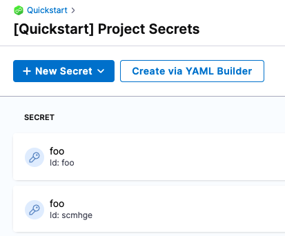
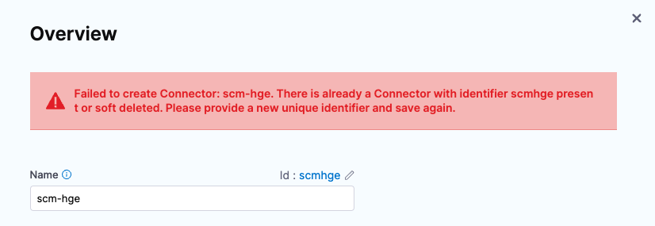
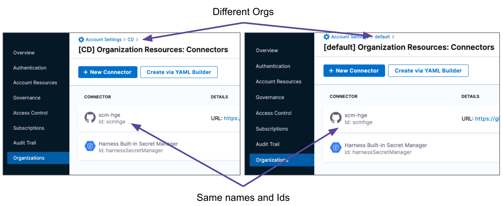
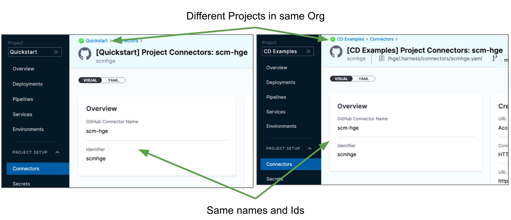
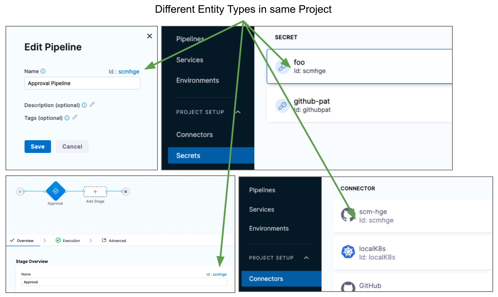

Entities and Resources in Harness have names and Ids ([entity Identifier](harness-entity-reference.md)). For example, here's a GitHub Connector with the name **scm-hge** and the Id **scmhge**:

Entity Ids are used to refer to Harness entities in [Harness variable expressions](../12_Variables-and-Expressions/harness-variables.md).

Ids are immutable once the entity has been created, but names can be changed at any time.

Once the entity is created, you can change the name but the Id remains the same.

There are some important rules to know:

* [Entities of the same type in the same Project cannot use use Identical Ids](renaming-entities-and-resources.md#entities-of-the-same-type-in-the-same-project-cannot-use-use-identical-ids)
* [You can use the Same Id in Different Orgs and Projects](renaming-entities-and-resources.md#you-can-use-the-same-id-in-different-orgs-and-projects)
* [Different Types of Entities can have Identical Ids](renaming-entities-and-resources.md#different-types-of-entities-can-have-identical-ids)

### Entities of the same type in the same Project cannot use use Identical Ids

Entities of the same type in the same Project can have the same names but must have different Ids. For example, these secrets are both named **foo**, but they have different Ids:

For example, if you try to add a Connector to a Project that already has a Connector with the same Id, you will get an error:

### You can use the Same Id in Different Orgs and Projects

Entities in different Harness Orgs can use identical Ids, and entities in the different Projects in the same Org can use identical Ids.

For information on Organizations and Projects, see [Organizations and Projects Overview](../1_Organizations-and-Projects/1-projects-and-organizations.md).For example, here are two GitHub Connectors with the same names and Ids but in different Harness Orgs:

You can also have identical entities in different Projects in the same Org:

### Different Types of Entities can have Identical Ids

Two entities of the same type, like Connectors, cannot have identical Ids in the same Project.

Two entities of different types, like Connectors and Pipelines, or even Pipelines and Stages, can have identical Ids in the same Project.

For example, in this Project there are four different types of entities with identical Ids:

### See also

* [Organizations and Projects Overview](../1_Organizations-and-Projects/1-projects-and-organizations.md)
* [Entity Deletion Reference](entity-deletion-reference.md)
* [Entity Retention Policy](entity-retention-policy.md)
* [Entity Identifier Reference](entity-identifier-reference.md)

