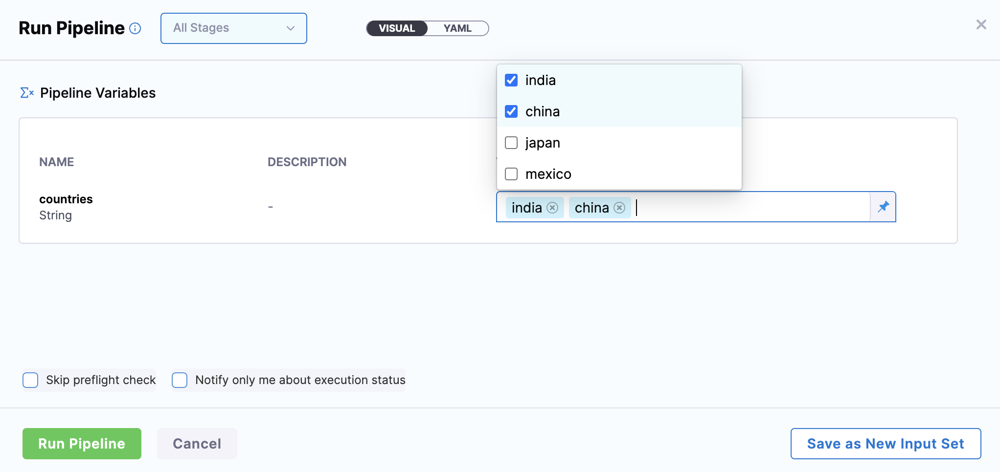
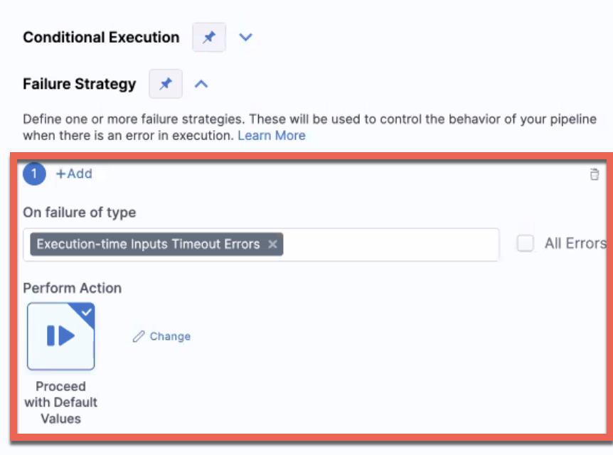

Most settings in Harness Pipelines allow you to use Fixed Values, Runtime Inputs, and Expressions.


This topic describes each of these options.

### Fixed values

Fixed Values are simply values that you enter manually when you configure a setting and do not change at runtime.

These are settings you don't need to change based on some other step or runtime operation.

For example, here'a a **Timeout** setting:


You can enter a value for this setting such as `10m 30s`. That value is fixed and nothing that happens at runtime will change it.

### Runtime inputs

When you use Runtime Inputs, you are setting placeholders for values that will be provided when you start a Pipeline execution.


You can template (or templatize) your Pipeline using Runtime Inputs, enabling users to select different values for each execution. For example, you can turn the Infrastructure Definition settings into Runtime Inputs and have users provide Dev, QA, and Prod values with each execution.

This templating is different from the Harness Template Library feature.Furthermore, you can create Input Sets for the Runtime Inputs. Harness Input Sets are collections of runtime variables and values that can be provided to Pipelines before execution. You set up Input Sets for different Pipeline uses cases, and then simply select the Input Set you want to use at runtime.

See [Run Pipelines using Input Sets and Overlays](../8_Pipelines/run-pipelines-using-input-sets-and-overlays.md).

Sometimes, the inputs and settings for all of the stages in a Pipeline aren't known before you deploy. Some inputs and settings can depend on the execution of the previous stages in the Pipeline.

For example, you might have an Approval step as part of the stage or Pipeline. Once the approval is received, you want to resume the next stage of the Pipeline execution by providing new inputs.

To do this, when you add certain stage settings to your Pipeline, use Runtime Inputs.

#### How do runtime inputs work?

You select Runtime Input as the option for a setting.

The Runtime Input is identified using the expression `<+input>`.

When you run a Pipeline, you provide the value for the input.

You can enter a value for the variable or use a Harness expression.

Later, if you choose to rerun a Pipeline, the Pipeline will run using the Runtime Inputs you provided the last time it ran.

#### Use runtime inputs in a stage or pipeline

Using Runtime Inputs templates some or all of a stage or Pipeline's settings. The same Pipeline can be run using different values for all of the Runtime Inputs.

#### CI example

You can use Runtime Inputs in a CI stage's Infrastructure. Here's an example using a Runtime Input in the **Namespace** setting.


#### CD example

You can use Runtime Inputs for the Service in a CD stage's Service settings.


#### Using allowed values, default values, and multiple selection in runtime inputs

You can set allowed values and a default value for a runtime input. The default value should be present in the list of allowed values. 

Allowed values are specified for an input using the `allowedValues()` method. For example, `<+input>.allowedValues(\'bengaluru\',\'newyork\')`.

A default value can also be specified for an input, using the `default()` method. For example, `<+input>.default(\'bengaluru\')`.

Both allowed values and defaults can be specified for the same input set. In this case, the default value must be present in the list of allowed values. For example, `<+input>.default(\'london\').allowedValues(\'bengaluru\',\'newyork\',\'london\')`. 

Commas are supported in both allowed and default values. A string with a comma must be wrapped within `\'   \'`. 

For example, `<+input>.default(\'london,uk\').allowedValues(\'bengaluru,india\',\'newyork,usa\',\'london,uk\')`.

You can use JSON body as a string for the variable runtime input default value. 

:::info note

Harness does not support using a nested JSON body as a string for the variable runtime input default value. 

For example, you can use the following JSON string for a runtime input.

`<+input>.default('{\"risk\": 100,\"availabilityVsCost\": \"balanced\",\"drainingTimeout\": 120,\"lifetimePeriod\": \"days\", \"fallbackToOd\": true}')` 

Harness does not support the following JSON string for a runtime input.

`"<+input>.default('{\"risk\": 100,\"availabilityVsCost\": \"balanced\",\"drainingTimeout\": 120,\"lifetimePeriod\": \"days\", \"fallbackToOd\": true,\"scalingStrategy\": {\"terminationPolicy\": \"default\" }}')"` 

:::

Multiple selection is allowed for runtime inputs defined for pipelines, stages, and shell script variables. You must specify the allowed values in the input as mentioned in the above examples. 

The multiple selection functionality is currently behind the feature flag, `PIE_MULTISELECT_AND_COMMA_IN_ALLOWED_VALUES`. Contact [Harness Support](mailto:support@harness.io) to enable the feature.



You can also create default values in templates and later override them during the pipeline execution. 

Here's a YAML example of a stage template with default value, `<+input>.default(“ABC”)`. You can override this default value during pipeline execution. 
```
pipeline:
  name: UsingStageTempWithDefaults
  identifier: UsingStageTempWithDefaults
  projectIdentifier: svcredesignhinger
  orgIdentifier: harness
  tags: {}
  stages:
    - stage:
        name: s1
        identifier: s1
        template:
          templateRef: stageTempDefaults1
          versionLabel: v1
          templateInputs:
            type: Custom
            variables:
              - name: var1
                type: String
                default: ABC
                value: <+input>.default(ABC).executionInput()
 ```

### Supplying runtime inputs during execution

:::info

Currently, this feature is behind the feature flag `NG_EXECUTION_INPUT`. Contact [Harness Support](mailto:support@harness.io) to enable the feature. 

:::

#### Limitations and requirements

The following limitations and requirements apply to this feature:

- A Harness user must have the **Pipeline Execute** permission to be able to submit runtime inputs during execution.

#### Configure runtime inputs

You can configure runtime inputs to a pipeline to be supplied during a step or stage execution. For example, you can configure a custom stage with a Shell Script step with a runtime input field with this property, you will be prompted to enter the input during the execution just before starting the Shell Script step.

If a custom stage is set up with runtime input, you can enter a shell script when prompted by Harness during execution. 

If a Harness Approval step is set up with runtime input, you can specify the Harness groups that will approve that step during pipeline execution.

To configure runtime inputs in the Harness Pipeline Studio:

 1. Select **Runtime input** for an input field.
 2. Select the settings icon next to the input field. 
 3. In the **Configure Options** window, enable the **Request input value when the Stage/Step is being executed** option. 
 
 
 
 4. Select **Submit**.

You can configure the same in YAML by adding the `executionInput()` method to an input field. For example, `<+input>.executionInput()`. 

This method can be used in combination with allowed values and default values. For example:  

* `<+input>.allowedValues(value1,value2).executionInput()` - During execution, you will be prompted to enter `value 1` and `value 2` inputs. Only `value1` and `value2` values will be allowed as valid inputs.
* `<+input>.allowedValues(value1,value2).default(value1).executionInput()` - During execution, you will be prompted to enter `value 1` and `value 2` inputs. Only `value1` and `value2` values will be allowed as valid inputs. `value1` is the default input in this example, so it appears as the default input in the prompt.  

If you're using the default method along with the execution input method, when the execution time input times out, the step fails instead of automatically applying the default. 

To automatically use the default value during such timeouts: 
* In **Failure Strategy** > **On failure of type**, select the **Execution-time Inputs Timeout Errors** error. 
* In **Perform Action**, select **Proceed with Default Values**.




#### Using runtime input during execution with a shell script

If a runtime input was specified for a step with execution input, you are prompted to enter the values before the step begins. Harness prompts you for values in the step details. The pipeline runs when the values are entered.

When you create a pipeline with a custom stage, add a variable to the step and select **Running input**. To specify an input as runtime input during execution, add the following to the input by substituting the value within the quotes:

`<+input>.default("abc").executiontimeInput()`

The **Value** field is populated with <+input>.

In the **Configure Options** window, click the checkbox for **Request input value when the stage/step is being executed** and click **Submit**.


In **Execution**, click **Add Step for a Shell Script**, select **Shell Script**, and add a name for the shell script. In the **Script** window, add the variable that was created. For example:

`<<stage.variables.Variable1>`


Save and run the pipeline.

#### Using runtime input with an Approval step

To add a runtime input with an Approval step, create a new pipeline, add an Approval stage, and then click **Set Up Stage**.

In the workflow for Execution, click **Approval**.

In **Manual Approval**, enter a name for this step.


For Approvers, click **User Groups** and select **Runtime input**.

Click the settings icon for **User Groups**.

In **Configure Options**, select **Request input value** when the stage/step is being executed, and click **Submit**.

Save the pipeline and run it for the approval step.

### Expressions

With Expressions you can use Harness input, output, and execution variables in a setting.

All of these variables represent settings and values in the Pipeline before and during execution.

See [Built-in Harness Variables Reference](../12_Variables-and-Expressions/harness-variables.md).

When you select **Expression**, you type `<+` and a value and the list of available variables appears.


Simply click a variable name to use it as the value for this setting.

At runtime, Harness will replace the variable with the runtime value.

### See also

* [Platform Technical Reference](/docs/category/references)

