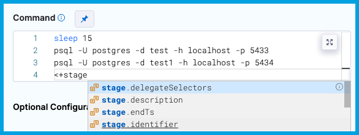
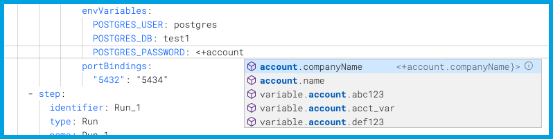
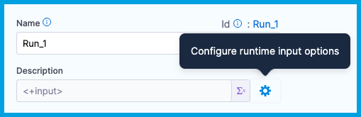

```mdx-code-block
import Tabs from '@theme/Tabs';
import TabItem from '@theme/TabItem';
```

For most settings in Harness pipelines, you can use fixed values, runtime inputs, or expressions.

```mdx-code-block
<Tabs>
  <TabItem value="Visual" label="Visual">
```

In the Pipeline Studio's Visual Editor, you can use the **Value type selector** to select **Fixed Values**, **Runtime Input**, or **Expression**.


The **[Expression](#expressions)** option is especially useful, because it enables suggestions for built-in expressions as you type.


In free-text fields, such as **Command**, you can directly enter values using the appropriate syntax, such as `<+input>` for [runtime input](#runtime-inputs), without changing the value type.



```mdx-code-block
  </TabItem>
  <TabItem value="YAML" label="YAML" default>
```

When writing pipelines in YAML, enter the value using the appropriate syntax, such as `<+input>` for [runtime input](#runtime-inputs).

When you type `<+`, Harness provides suggestions for built-in [expressions](#expressions) as you type.



```mdx-code-block
  </TabItem>
</Tabs>
```

## Fixed values

Fixed Values are values that you define when you configure a setting. These values don't change at runtime.

Use fixed values for settings you don't need to change based on the build context, other steps, or runtime operations.

## Runtime inputs

Runtime input provides a placeholder with the expectation that you'll define this value at runtime. For example, if you set the Kubernetes cluster **Namespace** setting to runtime input (`<+input>`), you'll need to provide the **Namespace** value when you run the pipeline.


Runtime input is especially useful for templatizing your pipelines, because runtime inputs can have different values each time the pipeline runs. For example, you can set all Infrastructure settings to runtime input so that users provide relevant dev, QA, or prod values with each run. This way, users don't need to edit the actual pipeline, they just supply the necessary values for that run.

:::note

Using runtime input for templatizing is different from the [Harness Template Library feature](/docs/platform/Templates/template).

:::

You can also create [input sets and overlays](/docs/platform/Pipelines/input-sets) to quickly populate runtime inputs with sets of preconfigured values. You can create input sets for different pipeline use cases, and then select the relevant input set at runtime.

### Use runtime inputs

```mdx-code-block
<Tabs>
  <TabItem value="Visual" label="Visual">
```

In the Pipeline Studio's Visual Editor, you can use the **Value type selector** to select **Runtime Input**.


In free-text fields, you can directly enter `<+input>` to specify runtime input without changing the value type.

```mdx-code-block
  </TabItem>
  <TabItem value="YAML" label="YAML" default>
```

When writing pipelines in YAML, enter `<+input>` for the value to indicate runtime input.

```yaml
              - step:
                  identifier: Run_1
                  type: Run
                  name: Run_1
                  spec:
                    shell: <+input>
                    command: <+input>
```

```mdx-code-block
  </TabItem>
</Tabs>
```

When you run the pipeline, you're prompted to provide values for any `<+input>`. You can use specific values or [expressions](#expressions).

If you rerun this pipeline, the pipeline uses the same inputs you provided for the initial run.

### Default values

By default, runtime input is free text input with no restrictions. You can specify a default value to avoid empty values.

```mdx-code-block
<Tabs>
  <TabItem value="Visual" label="Visual">
```

1. In the Pipeline Studio's Visual Editor, use the **Value type selector** to select **Runtime Input**.

   

2. Select the **Settings** icon next to the field.

   

3. Enter the **Default value**, and select **Submit**.

```mdx-code-block
  </TabItem>
  <TabItem value="YAML" label="YAML" default>
```

When writing pipelines in YAML, specify a default value by appending the `.default()` method to `<+input>`. For example: `<+input>.default('bengaluru')`.

If your default value has a comma, you must escape the value string using the format `\'VALUE\'`. For example: `<+input>.default(\'london,uk\')`.

```yaml
              - step:
                  identifier: Run_1
                  type: Run
                  name: <+input>.default('bengaluru')
                  ...
```

```mdx-code-block
  </TabItem>
</Tabs>
```

#### Default values in templates

You can specify default values in [templates](/docs/platform/Templates/template). If you want to be able to override these values at runtime, append the `.executionInput()` method. For example, the following YAML example uses a stage template that includes `<+input>.default('new york').executionInput()`. The default value is `new york`, but it can be changed at runtime.

```yaml
pipeline:
  name: UseStageTemplate
  identifier: UseStageTemplate
  projectIdentifier: default
  orgIdentifier: default
  tags: {}
  stages:
    - stage:
        name: stage1
        identifier: stage1
        template:
          templateRef: stageTempDefault1
          versionLabel: v1
          templateInputs:
            type: Custom
            variables:
              - name: var1
                type: String
                default: ABC
                value: <+input>.default('new york').executionInput()
```

### Allowed values

Use allowed values to provide a fixed range of acceptable values for a runtime input.

```mdx-code-block
<Tabs>
  <TabItem value="Visual" label="Visual">
```

1. In the Pipeline Studio's Visual Editor, use the **Value type selector** to select **Runtime Input**.

   

2. Select the **Settings** icon next to the field.

   

3. For **Validation**, select **Allowed values**, and then enter all allowed values.
4. If you also specify a [default value](#default-values), you must include the default value in your allowed values.
5. Select **Submit**.

```mdx-code-block
  </TabItem>
  <TabItem value="YAML" label="YAML" default>
```

When writing pipelines in YAML, define allowed values by appending the `.allowedValues()` method to `<+input>`. For example: `<+input>.allowedValues('bengaluru','newyork')`.

If your values include commas, you must escape the value strings using the format `\'VALUE\'`. For example: `<+input>.allowedValues(\'bengaluru,india\',\'newyork,usa\',\'london,uk\')`.

If you specify allowed values *and* a [default value](#default-values), the default value must be present in the list of allowed values. To specify both an allowed value and a default value, append both the `.default()` and `.allowedValues()` methods to `<+input>`, and make sure the list of allowed values includes the default value. For example: `<+input>.default('london').allowedValues('bengaluru','newyork','london')`.

```mdx-code-block
  </TabItem>
</Tabs>
```

### Multiple selection

:::note

Currently, multiple selection for runtime inputs is behind the feature flag `PIE_MULTISELECT_AND_COMMA_IN_ALLOWED_VALUES`. Contact [Harness Support](mailto:support@harness.io) to enable the feature.

:::

Use multiple selection if you want to choose one or more values from the list of [allowed values](#allowed-values). You can use multiple selection for runtime inputs in pipelines, stages, and shell script variables only. Multiple selection is an extension of allowed values; you must specify allowed values to use multiple selection.


## Supply runtime input during execution

:::note

Currently, this feature is behind the feature flag `NG_EXECUTION_INPUT`. Contact [Harness Support](mailto:support@harness.io) to enable the feature.

:::

Sometimes you might not know the value for a runtime input at the beginning of the pipeline run. For example:

* Some values depend on the output of previous steps or stages in the pipeline.
* Your pipeline includes an Approval step, and you want to specify the approval groups when the Approval step runs.
* You have a custom stage with a Shell Script step that takes runtime input, and you need to provide the script when that strep runs, rather than at the beginning of the entire pipeline.

In these cases, you might need to provide runtime input during pipeline execution.

You must have a role with **Pipeline Execute** [permission](/docs/platform/role-based-access-control/permissions-reference/) to be able to submit runtime inputs during execution.

### Configure execution inputs

You must configure runtime inputs to allow specification during pipeline execution.

```mdx-code-block
<Tabs>
  <TabItem value="Visual" label="Visual">
```

1. In the Pipeline Studio's Visual Editor, use the **Value type selector** to select **Runtime Input**.

   

2. Select the **Settings** icon next to the field.

   

3. Select **Request input value when stage/step is being executed**.

   

4. Specify allowed values or a default value, if necessary.
5. Select **Submit**.

```mdx-code-block
  </TabItem>
  <TabItem value="YAML" label="YAML" default>
```

When writing pipelines in YAML, append the `executionInput()` method to `<+input>`. For example, `<+input>.executionInput()`.

You can use mid-run input along with [allowed values](#allowed-values) and [default values](#default-values). For example:

* Select mid-run input from a list of allowed values: `<+input>.allowedValues('value1','value2').executionInput()`
* Provide a default value and provide a list of allowed values for mid-run input: `<+input>.allowedValues('value1','value2').default('value1').executionInput()`

```mdx-code-block
  </TabItem>
</Tabs>
```

#### Use the default value instead of failing

There is a time limit for mid-run input. Pipelines don't wait indefinitely for mid-run input. If no input is provided before the input time elapses, the pipeline fails.

If you allow mid-run input *and* you specify a default values, you can configure the pipeline to use the default values instead of failing if the input time elapses. To do this:

1. Go to the stage or step with the execution input.
2. Add a [failure strategy](/docs/platform/Pipelines/define-a-failure-strategy-on-stages-and-steps).
3. For **On failure of type**, select **Execution-time Inputs Timeout Errors**.
4. Under **Perform Action**, select **Proceed with Default Values**.
To automatically use the default value during such timeouts: 

<!--  -->

<docimage path={require('./static/execution-time-error-configuration.png')} />

#### Use execution input in a script

Use [expressions](#expressions) to reference runtime input from other fields in scripts (the **Command** field). To do this, use an expression that references the field that is configured for execution or runtime input. For example, `<+execution.steps.run1.spec.shell>` references the `shell` setting in the `run1` step. You can include this expression in a `command` to pull that value into the command during pipeline execution.


#### Use execution input with approvals

To change the approval group during the pipeline run, edit the **Manual Approval** step and set the **User Group** field to [use execution input](#configure-execution-inputs).

## Expressions

Use expressions to reference Harness input, output, and execution variables. These variables represent settings and values that exist in the pipeline before and during execution.

For more information, go to the [built-in and custom Harness variables reference](../12_Variables-and-Expressions/harness-variables.md).

```mdx-code-block
<Tabs>
  <TabItem value="Visual" label="Visual">
```

In the Pipeline Studio's Visual Editor, you can use the **Value type selector** to select **Expression**.


Harness provides suggestions for built-in expressions as you type.


In free-text fields, such as **Command**, you can directly enter values using the appropriate syntax without changing the value type.


```mdx-code-block
  </TabItem>
  <TabItem value="YAML" label="YAML" default>
```

When writing pipelines in YAML, enter the expression using the appropriate syntax.

When you type `<+`, Harness provides suggestions for built-in expressions as you type.


```mdx-code-block
  </TabItem>
</Tabs>
```

You can continue typing or select the expression from the list of suggestions.

At runtime, Harness replaces the expression with the runtime value.
