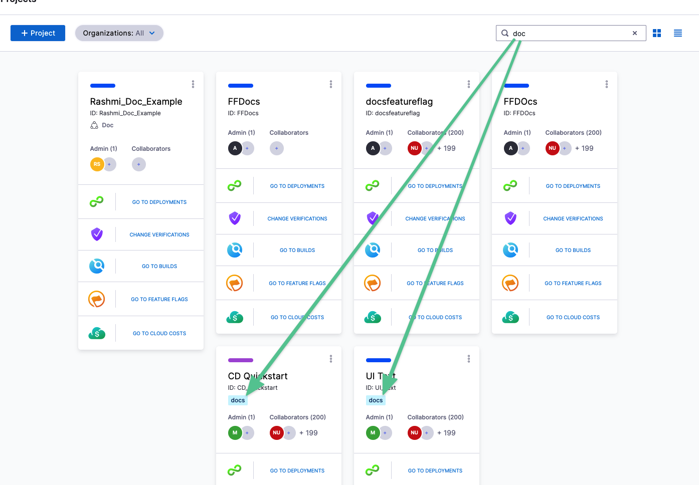

You can add Tags to Harness entities and then use the Tags to search for all matching entities. For example, you can add a Tag to a Harness Project and then filter the list of Projects by Tag.

### What are Tags?

Tags are simply metadata added to Harness entities. They are strings that can contain any characters.

Harness Tags are applied to entities and then used to filter them. Multiple Tags can be added to an entity, creating a list of Tags.

For example, the Tag **docs** has been added to two Projects and so a search for **doc** returns Projects with name and Tags that match:

### Limitations

* [Runtime inputs](runtime-inputs.md) (`<+input>`) are not supported in Tags.
* Harness variable expressions cannot be used in Tags. See [Built-in Harness Variables Reference](../12_Variables-and-Expressions/harness-variables.md).

### Delegate Tags and General Tags

Delegate Tags are different from general Tags in the following ways:

* Delegate Tags are Tags added to Delegates.
* Delegate Tags are not used in searches.
* Delegates are only tagged with Delegate Tags. General Tags are not applied to Delegates.

### Tag Expressions

You can reference Tags using [Harness expressions](../12_Variables-and-Expressions/harness-variables.md).

You simply reference the tagged entity and then use `tags.[tag name]`, like `<+pipeline.tags.docs>`

For example, here are several different references:

* `<+pipeline.tags.[tag name]>`
* `<+stage.tags.[tag name]>`
* `<+pipeline.stages.s1.tags.[tag name]>`
* `<+serviceConfig.service.tags.[tag name]>`

### Related Reference Material

* [Built-in Harness Variables Reference](../12_Variables-and-Expressions/harness-variables.md)

