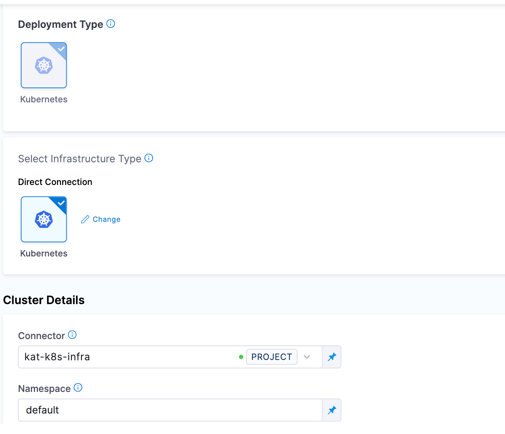
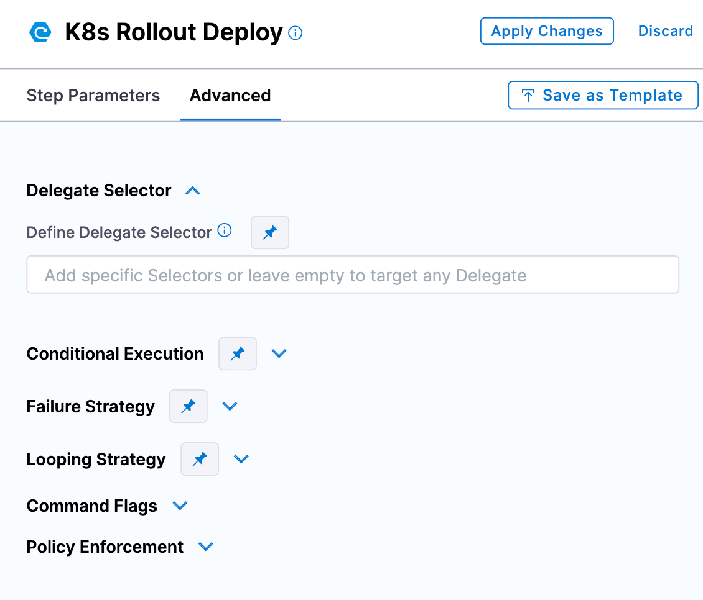
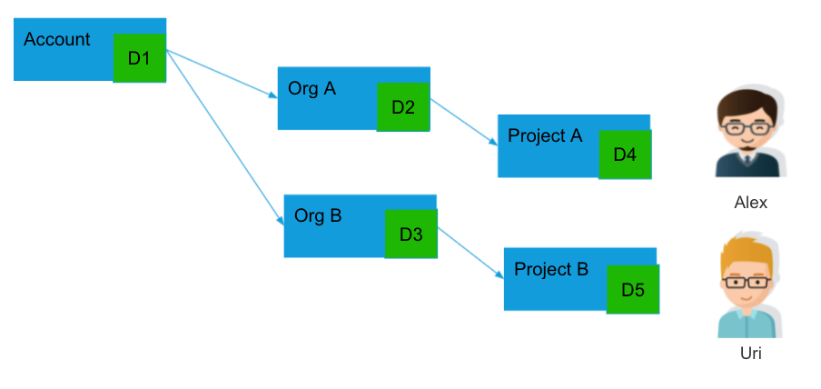
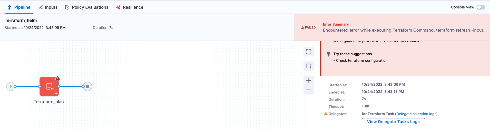

Harness Delegate is a service you run in your local network or VPC to connect your artifacts, infrastructure, collaboration, verification, and other providers, with Harness Manager. The first time you connect Harness to a third-party resource, Harness Delegate is installed in your target infrastructure, for example, a Kubernetes cluster. After the delegate is installed, you connect to third-party resources. The delegate performs all operations, including deployment and integration.

### System requirements

Go to [Delegate system requirements](./delegate-requirements.md).

### Communication with Harness Manager

Harness Delegate connects to Harness Manager over an outbound HTTPS/WSS connection.


The delegate connects to Harness Manager (via SaaS) over a Secure WebSockets channel (WebSockets over TLS). The channel is used to send notifications of delegate task events and to exchange connection heartbeats. The channel is not used to send task data itself.

Delegate communication includes the following functions:

* **Heartbeat:** The delegate sends a [heartbeat](https://en.wikipedia.org/wiki/Heartbeat_(computing)) to notify Harness Manager that it is running.
* **Deployment data:** The delegate sends information retrieved from API calls to Harness Manager for display on the **Deployments** page.
* **Time series and log data for Continuous Verification:** The delegate connects to the verification providers you configure and sends the data retrieved from those providers to Harness Manager for display in Harness Continuous Verification.

### Where to install?

* **Evaluating Harness:** When evaluating Harness, you might want to install the delegate locally. Ensure that it has access to the artifact sources, deployment environments, and verification providers you want to use with Harness.
* **Development, QA, and Production:** The delegate should be installed behind your firewall and in the same VPC as the micro-services you are deploying. The delegate must have access to the artifact servers, deployment environments, and cloud providers it needs.

### Delegate images

Harness Delegate does not have a root image. There are two non-root images that use similar tags. For example:

* `harness/delegate:22.03.74411`: Includes client tools like `kubectl`, Helm, and ChartMuseum. 
* `harness/delegate:22.03.74411.minimal`: Does not include client tools. If you want to add tools to the image, Harness recommends that you create a custom image.

### Install a delegate

The video below shows how to install a delegate.

<!-- Video:
https://harness-1.wistia.com/medias/frzea22qdc-->
<docvideo src="https://harness-1.wistia.com/medias/frzea22qdc" /> 

For basic information on installing Harness Delegate, go to the following:

* [Delegate installation overview](../install-delegates/overview.md)
* [Install a legacy Kubernetes delegate](../install-delegates/install-a-kubernetes-delegate.md)

For advanced installation topics, go to the following:

* [Automate delegate installation](../install-delegates/automate-delegate-installation.md)
* [Install a delegate with third-party custom tool binaries](../install-delegates/install-a-delegate-with-3-rd-party-tool-custom-binaries.md)

### Delegate sizes

One delegate size does not fit all use cases, so Harness lets you pick from several options:

| Replicas | Required memory / CPU | Maximum parallel deployments and builds across replicas |
| :--: |  :--: | :--: |
| 1 | 2 GB / 0.5 CPU | 10 |
| 2 | 4 GB / 1 CPU | 20 |
| 4 | 8 GB / 2 CPU | 40 |
| 8 | 16 GB / 4 CPU | 80 |

Remember that the memory and CPU requirements are for the delegate only. Your delegate host/pod/container will need more computing resources for its operations systems and other services, such as Docker or Kubernetes.

### How Harness Manager picks delegates

Harness uses delegates for all operations. For example:

* **Connectors:** Connectors are used for all third-party connections.
* **Pipeline Services and Infrastructure:** Connectors are used in Pipeline Service connections to repos and Pipeline Infrastructure connections to target environments (deployment targets, build farms, etc).
* **Pipeline Steps:** You can select a delegate in each pipeline step to ensure that the step only uses that delegate to perform its operation.

In the case of all these delegate uses, you can select one or more specific delegates to perform the operation (using delegate tags). If you do not specify specific delegates, Harness assigns the task to a delegate.

#### Task assignment

In cases where you select specific delegates to perform the task, Harness uses those delegates only. If the delegates cannot perform the task, Harness does not use another delegate.

In cases where you do not select specific delegates, Harness selects an available delegate to perform the task based on the following:

* **Heartbeats:** Running delegates send heartbeats to the Harness Manager in one minute intervals. If the Manager does not have a heartbeat for a delegate when a task is ready to be assigned, it does not assign the task to that delegate.
* **Tags:** For more information, go to [Select delegates with tags](/docs/platform/2_Delegates/manage-delegates/select-delegates-with-selectors.md).
* **Capability:** The delegate checks connectivity to your external systems to determine whether it can carry out the task. This process allows other delegates to assist in case access issues are found.

#### Delegate selection in pipelines

Delegates are selected in **Service** and **Infrastructure** connectors and in steps.

For example, in the **Infrastructure** section of a stage, there is a **Connector** setting. For Harness CD, this is the connector to the target infrastructure. For Harness CI, this is the connector to the build farm.



When you add connectors to Harness, you can select several or all delegates for the connector to use.

Each CD step in the stage execution has a **Delegate Selector** setting.



Here you use delegate tags to select the delegate(s) to use.

#### Which delegate is used during pipeline execution?

The delegates assigned to connectors and steps are used during pipeline execution.

If no delegates are selected, then the delegates are selected as described in [Task assignment](/docs/platform/2_Delegates/delegate-concepts/delegate-overview.md#task-assignment).

If no delegates are selected for a CD step in its **Delegate Selector** setting, Harness prioritizes the delegate used successfully for the infrastructure connector.

Harness will try this delegate first for the step task because this delegate has been successful in the target environment.

import Selector from '/docs/platform/2_Delegates/shared/selector-infrastructure.md'

<Selector />

Most CI steps use connectors to pull the image of the container where the step will run. The delegates used for the step's connector are not necessarily used for running the step. In general, the delegate(s) used for the connector in the **Infrastructure** build farm is used to run the step.

### Delegate high availability (HA)

You might need to install multiple delegates depending on how many Continuous Delivery tasks you do concurrently, and on the compute resources you are providing to each delegate. Typically, you will need one delegate for every 300-500 service instances across your applications.

In addition to compute considerations, you can enable HA for Harness Delegates. HA involves installing multiple delegates in your environment.

For example, your Kubernetes deployment could include two Kubernetes delegates, each running in its own pod in the same target cluster. 

To add delegates to your deployment, increase the desired count of delegate replica pods in the **spec** section of the `harness-kubernetes.yaml` file that you download from Harness:


```yaml
...  
apiVersion: apps/v1beta1  
kind: Deployment  
metadata:  
  labels:  
    harness.io/app: harness-delegate  
    harness.io/account: xxxx  
    harness.io/name: test  
  name: test-zeaakf  
  namespace: harness-delegate  
spec:  
  replicas: 2  
  selector:  
    matchLabels:  
      harness.io/app: harness-delegate  
...
```

You only need one Kubernetes delegate in a cluster. Do not install additional delegates to create HA. Instead, you should increase the number of replicas pods. 

If you want to install Kubernetes delegates in separate clusters, make sure they do not use the same `harness-kubernetes.yaml` file and name. Download a new Kubernetes YAML `spec` from Harness for each delegate you want to install. This avoids name conflicts. 

In every case, delegates must be identical in terms of permissions, keys, connectivity, and so on. With two or more delegates running in the same target environment, you get HA by default. One delegate can go down without impacting Harness' ability to perform deployments. If you want more availability, you can set up three delegates to handle the loss of two delegates, and so on.

Two delegates in different locations with different connectivity do not support HA. For example, if you have a delegate in a Dev environment and another in a Prod environment, there is no communication between the two delegates. If either delegate fails, Harness stops operating in that environment.

### Delegate scope

Delegates are scoped in the following way:

#### Project/Org/Accounts

You can add delegates at the Project, Org, and Account level. Delegate availability then becomes subject to Harness implicit Project, Org, and Account hierarchy.

For example, let's look at two users, Alex and Uri, and the delegates (D*n*) available to them:



Alex's Pipelines can use delegates D1, D2, or D4.

Uri's Pipelines can use delegates D1, D3, or D5.

### Delegate tags

When Harness makes a connection via its delegates, it selects the best delegate according to [How  Harness Manager picks delegates](#how-harness-manager-picks-delegates).

To ensure a specific delegate is used by a Harness entity, you can add tags to delegates and then reference the tags in commands and connectors.

For more information, go to [Use delegate selectors](/docs/platform/2_Delegates/manage-delegates/select-delegates-with-selectors.md).

### Delegate log file

The delegate creates a new log file each day, named **delegate.log**, and its maximum size is 50MB. 

The log file is saved with the day's date. If a log file grows beyond 50MB in a day, the log file is renamed with today's date, and a new log file is created.

Harness keeps log files for today and the previous 10 days (up to one 1GB).

The delegate logs are available in the Harness UI. When a pipeline runs and an error occurs due to the delegate, the **View Delegate Tasks Logs** option becomes available.



### Delegate permissions

You can set permissions on delegates using [Harness RBAC](/docs/platform/4_Role-Based-Access-Control/1-rbac-in-harness.md).

You create roles and then assign them to Harness users.

Delegate role permissions are Create/Edit, Delete, and View.

:::info note
You cannot disable the delegate View permission. Every user has the permission to view the delegate.
:::

Access to a delegate can also be restricted by downstream resource types:

- **Pipelines:** Execute
- **Secrets:** Access
- **Connectors:** Access

This means that if a role does not have these permissions, the user with that role cannot use the related delegates in these pipelines, secrets, or connectors.

### Delegate task capacity

Harness enables you to configure a maximum number of tasks for each delegate. This allows Harness Manager to use the task capacity to determine whether to assign a task to the delegate or queue it. You can configure the maximum number of tasks using the environment variable, `DELEGATE_TASK_CAPACITY`. 

For example, if you set `DELEGATE_TASK_CAPACITY` to a value of 2 and execute 6 tasks in parallel, Harness Manager only executes 2 tasks at a time. If you don't configure `DELEGATE_TASK_CAPACITY`, Harness Manager executes all 6 tasks in parallel. 

:::info note
   This functionality is currently behind the feature flag `DELEGATE_TASK_CAPACITY_CHECK`. Contact [Harness Support](mailto:support@harness.io) to enable the feature. When the feature flag is enabled, the task is broadcast every minute in Harness Manager until it expires.
:::

### Third-party tools installed with the delegate

For details about the SDKs and third-party tools installed with the delegate, go to [Third-party tools included in the delegate image type](/docs/platform/delegates/delegate-concepts/delegate-image-types/#third-party-tools-included-in-the-delegate-image-type).
