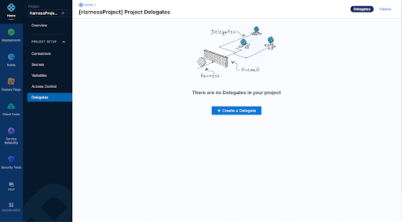
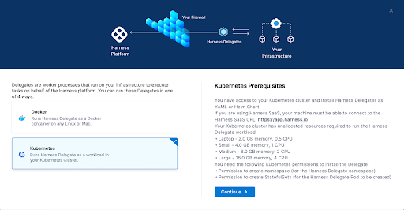
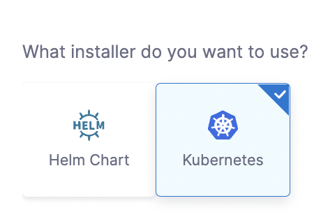
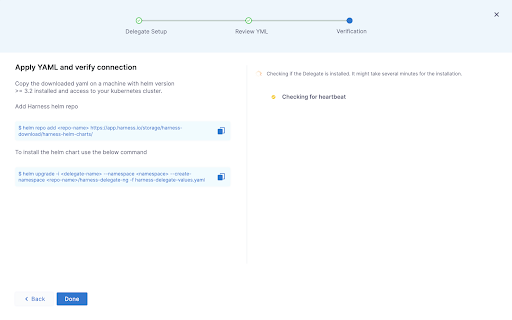
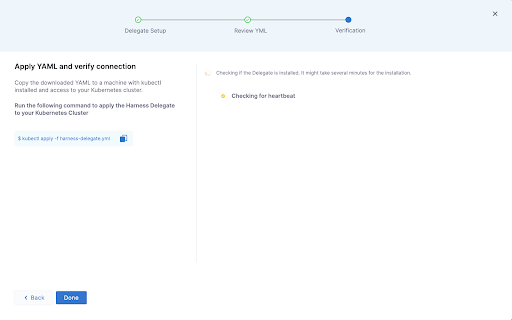

This document explains how to install Harness Delegate into Harness NextGen. The delegate is installed into Kubernetes environments using Helm or a Kubernetes manifest. This document steps through both installation methods.

Harness Delegate offers some configurable settings to support proxied environments and delegate auto-upgrade.

Harness supports a version skew of up to *n*-2 delegate versions, for which *n* is the current version of the installed delegate. For example, with monthly releases, Harness supports your June installation through August. Harness Delegate includes an algorithm that automatically expires delegates three months after installation. These limitations help to ensure compatibility between the delegate and Harness components, including Harness Manager.

Delegate auto-upgrade status and expiration dates are shown in Harness Manager for each installed delegate where they apply.

For an introduction to delegates, see [Delegate Overview](../delegates-overview.md). For more information about the delegate automatic update process, see [Delegate Auto-Update](../delegate-guide/delegate-auto-update.md).

### Install Process

Harness Delegate is deployed using Harness Manager. This document describes the requirements for the process, explains the installation screens, and provides steps you can use to verify or troubleshoot the process.

The delegate is added to the target cluster. Kubernetes Cluster Connector uses the delegate to connect to the cluster. By default, Harness delegates install and run with cluster root access.

The following diagram shows the integration of Harness Delegate into a Kubernetes deployment.

### Requirements

This section describes the requirements for Harness Delegate.

#### Permissions

Harness Delegate requires the following access and permissions:

* A machine configured for access to the Harness SaaS URL: <https://app.harness.io>.
* Access to the target Kubernetes cluster with installation by Kubernetes manifest (YAML) or Helm chart.
* A [ClusterRole](https://kubernetes.io/docs/reference/access-authn-authz/rbac/) that permits creation of the following:
	+ A namespace to host the delegate
	+ [Deployment](https://kubernetes.io/docs/reference/kubernetes-api/workload-resources/deployment-v1/) resources, including the [StatefulSet](https://kubernetes.io/docs/reference/kubernetes-api/workload-resources/stateful-set-v1/) objects required to manage the delegate

#### Compute Resources

The compute resources that the delegate workload requires depend on the scale of your deployment and the number of replica pods to be deployed.

* Deploy to laptop: 0.5 CPU with 2.0 GB memory
* Small-scale deployment: 1.0 CPU with 4.0 GB memory
* Medium-scale deployment: 2.0 CPU with 8.0 GB memory
* Large-scale deployment: 4.0 CPU with 16.0 GB memory

### Installation

Harness Delegate for Helm is installed using a Kubernetes manifest or by deploying a Helm chart. The installation process requires you to configure the deployment and, if you are using a proxy, to configure proxy settings. Harness deploys the delegate and listens for a heartbeat to confirm the delegate is running. If you receive a message that the delegate could not be installed, see the final section of this document for links to troubleshooting information.

For basic information on Harness Delegate, see [Delegate Requirements and Limitations](../delegates-overview.md).

**To install the Delegate**

1. Open the target project and select **Delegates**. 
In this example, **Harness Project** is the target of the deployment.
2. Click **Create a Delegate**.
3. Review the prerequisites and click **Continue**.
4. Enter the name of your delegate.  
The name is populated into the **ID** field. You can change the name of the delegate after it is deployed; you cannot change the delegate ID.
5. (Optional) Enter a description and create tags to be associated with your delegate.
6. In **Delegate Size**, select the size of the deployment.
   
   
   
   In this example, the target deployment is of medium size.

7. In **Delegate Permissions**, select the access level you want to grant the delegate.   
In this example, the delegate is granted default access with cluster-wide read/write access.

You can install the delegate using a Helm chart.

Or you can use a Kubernetes manifest.

1. Select the installer you prefer and click **Continue**.

### Install by Helm Chart

Some delegate values are configured in the harness-delegate-values.yml file. You can download the values file to configure a proxy or customize other editable values.

1. (Optional) To download the harness-delegate-values.yml file, click **Download YAML file**.  
   
   For detailed information about configuring a proxy for the delegate, see [Configure Delegate Proxy Settings](../delegate-guide/configure-delegate-proxy-settings.md). 

   For information about additional editable fields in the harness-delegate-values.yaml file, see [Delegate Environment Variables](../delegate-reference/delegate-environment-variables.md).

1. Click **Continue**.
2. Copy the provided commands and apply the chart.

If the deployment is successful, the installer verifies the delegate heartbeat. Otherwise, if there are problems, see [Delegate Issues](https://docs.harness.io/article/jzklic4y2j-troubleshooting#delegate_issues). After the issue is resolved, try the `helm upgrade` command again.

If you require additional assistance, contact Harness Support.

### Install by Kubernetes Manifest

You can download the delegate manifest file to configure a proxy or customize other editable values.

1. (Optional) To download the harness-delegate.yml file, click **Download YAML file**.  
For detailed information about configuring a proxy for the delegate, see [Configure Delegate Proxy Settings](../delegate-guide/configure-delegate-proxy-settings.md).  
For a sample manifest, see [Example Kubernetes Manifest: Harness Delegate](../delegate-reference/example-kubernetes-manifest-harness-delegate.md).
2. Click **Continue**.

1. Copy the provided command and apply the YAML.

If the deployment is successful, the installer verifies the delegate heartbeat. If the deployment is not successful, see [Troubleshooting](https://docs.harness.io/article/jzklic4y2j) for instructions. After you resolve the issue, apply the YAML again.

If you require additional assistance, contact Harness Support.

### Confirm Installation in Harness Manager

When installation is complete, check Harness Manager to verify the status of the delegate auto-update feature. If auto-update is not enabled, confirm the delegate date of expiration.

You can find auto-update information in Harness Manager. Check the list of delegates by name.

You can find expiration information listed with the details for the delegate.

