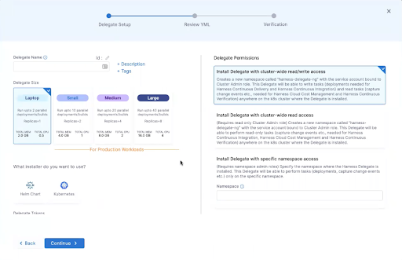
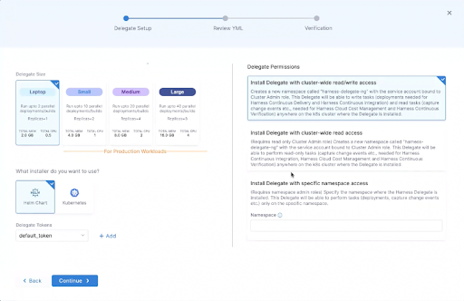

Harness Delegate is a service that runs in the target environment for a deployment – typically a local network, a VPC, or a cluster. Harness Delegate connects artifacts, infrastructure, and providers with Harness Manager, and is responsible for performing deployment operations.

This document explains how to install Harness Delegate using the [Helm](https://helm.sh/) package manager.

### Install Process

Harness Delegate for Helm is deployed by using an installer. This document describes the requirements for the process, explains the screens of the installer, and provides steps you can use to verify or troubleshoot the process.

By default, Harness Delegate installs and runs with cluster root access.

### Requirements

Harness Delegate for Helm has the following requirements.

#### Permissions

Harness Delegate for Helm requires the following access and permissions:

* A machine configured for access to the Harness SaaS URL: `https://app.harness.io`.
* Access to the target Kubernetes cluster with installation by application manifest (YAML) or Helm chart.
* A [**ClusterRole**](https://kubernetes.io/docs/reference/access-authn-authz/rbac/) that permits creation of the following:
	+ A namespace to host Harness Delegate
	+ [**Deployment**](https://kubernetes.io/docs/reference/kubernetes-api/workload-resources/deployment-v1/) resources, including the [**StatefulSet**](https://kubernetes.io/docs/reference/kubernetes-api/workload-resources/stateful-set-v1/) objects required to manage Harness Delegate

For more information about the permissions you need to install a Delegate, see [Review: Delegate Role Requirements](../delegate-guide/install-a-kubernetes-delegate.md#review-delegate-role-requirements).

#### Compute Resources

The compute resources that the Delegate workload requires depend on the scale of your deployment and the number of replica pods to be deployed.

* **Deploy to laptop:** 0.5 CPU with 2.0 GB memory
* **Small-scale deployment:** 1.0 CPU with 4.0 GB memory
* **Medium-scale deployment:** 2.0 CPU with 8.0 GB memory
* **Large-scale deployment:** 4.0 CPU with 16.0 GB memory

### Installation

Harness Delegate for Helm is installed by deploying a Helm chart. The installation process requires you to configure the deployment and, if you are using a proxy, to configure proxy settings. Harness deploys the Delegate and listens for a heartbeat to confirm the Delegate is running. If you receive a message that the Delegate could not be installed, see the final section of this document for troubleshooting information.

For basic information on Harness Delegate, see [Delegate Requirements and Limitations](../delegates-overview.md).

#### Configure the Deployment

1. Select the **Kubernetes** option.
   
   

2. Review **Kubernetes Prerequisites** to ensure that your cluster can support the deployment. Click **Continue**.
   
   

3. In **Delegate Name**, give your Delegate a name. The Delegate name is populated into the **ID** field. 
   A valid Delegate name is a lowercase character string that does not begin or end with a number. You can use the dash mark (“-”) to separate segments of the string; other special characters are not permitted. Delegate names must be unique in the cluster.
4. (Optional) Click the pencil icon to change the identifier of the Delegate resource.
5. (Optional) Click **+ Description** to create a description to be associated with the Delegate.
6. (Optional) Click **+ Tags** to label the Delegate resource with tags. This increases searchability.
7. Select the size of the deployment. 
   The size of the deployment determines the CPU and memory resources allocated to running the Delegate. The following table summarizes the options

|  |  |  |  |
| --- | --- | --- | --- |
| **Size** | **Replicas** | **CPU/Memory** | **Description** |
| **Laptop** | 1 | 0.5/2.0 GB | Run up to 2 parallel deployments or builds.For production workloads. |
| **Small** | 2 | 1.0/4.0 GB | Run up to 10 parallel deployments or builds.For small-scale production workloads. |
| **Medium** | 4 | 2.0/8.0 GB | Run up to 20 parallel deployments or builds.For medium-scale production workloads. |
| **Large** | 8 | 4.0/16.0 GB | Run up to 40 parallel deployments or builds.For large-scale production workloads. |

8. Select the **Helm Chart** installer option. Harness Delegate for Helm is installed using a Helm chart.
   
   

9.  In **Delegate Tokens**, specify the one or more token names to be associated with the Delegate. In the example above, `default_token` is specified.
10. In **Delegate Permissions**, select the permissions you want to grant the Delegate.

|  |  |  |  |
| --- | --- | --- | --- |
| **User role** | **Scope** | **read/write** | **Description** |
| Install Delegate with cluster-wide read/write access | cluster | read/write | The Delegate is installed with cluster-wide access in the namespace you are prompted to specify during the installation process.This Delegate binds to the default **cluster-admin** [ClusterRole](https://kubernetes.io/docs/reference/kubernetes-api/authorization-resources/cluster-role-v1/). The Delegate reads and writes tasks across all namespaces in the cluster. |
| Install Delegate with cluster-wide read access | cluster | read | The Delegate is installed with cluster-wide access in the namespace you are prompted to specify during the installation process.This Delegate binds to the default **view** [ClusterRole](https://kubernetes.io/docs/reference/kubernetes-api/authorization-resources/cluster-role-v1/) and is limited to the performance of read-only task in the cluster. |
| Install Delegate with specific namespace access | namespace | read/write | The Delegate is installed with namespace access in the namespace you specify during the installation process.This requires modification of the command-line instruction to specify installation and operation of the Delegate in the given namespace. |

For detailed information about Kubernetes default user roles, see [Using RBAC Authorization](https://kubernetes.io/docs/reference/access-authn-authz/rbac/) in [Kubernetes Documentation](https://kubernetes.io/docs/home/).

### Configure Proxy Settings

The configuration of proxy settings is an optional step in the installation process. You can download the Delegate YAML and configure settings to modify how the Delegate connects to Harness Manager. Skip this step if your environment is not configured to use the Kubernetes proxy service.

Proxy settings are configured using the following process:

* Download the Delegate YAML.
* Open the YAML file and configure the desired proxies.
* Save and install the modified YAML file.

For more information about how proxies work in Kubernetes, see [Service](https://kubernetes.io/docs/concepts/services-networking/service/) in [Kubernetes Documentation](https://kubernetes.io/docs/home/).

#### Delegate Proxy Settings

The following proxies determine how Harness Delegate connects to Harness Manager. If `PROXY_MANAGER` is set to `true`, any other proxy settings are ignored.

For in-cluster Delegates with configured proxies, the `noProxy` value must be the master IP address of the cluster. This allows the Delegate to bypass the proxy for in-cluster connections.

|  |  |
| --- | --- |
| **Value** | **Description** |
| `proxyHost` | The host name address of the proxy, for example, `proxy.example.com.` |
| `proxyPort` | The proxy port number to which Harness Delegate connects. |
| `proxyUser` | The name of the service account to be authenticated for proxy access. |
| `proxyPassword` | The password for the service account to be authenticated. |
| `proxyScheme` | The network addressing scheme that the proxy uses. This must be HTTP or HTTPS. |
| `noProxy` | A comma-separated list of domain suffixes that are not subject to proxy, for example, `.example.com`. |

**To configure Delegate proxy settings**

1. Click **Download YAML File**.
2. Navigate to the download location and open the `harness-helm-values.yaml` file.
3. Modify the proxy settings and save the file.
   
   

   For information on using proxy settings with Helm Delegate, see [Configure Delegate Proxy Settings](../delegate-guide/configure-delegate-proxy-settings.md).

#### Deploy and Verify

Deploy the configured Harness Delegate using the `helm` CLI from a machine configured for access to the target cluster. A successful deployment is confirmed by listening for a heartbeat. The installer monitors the process and displays status messages.

**To deploy Harness Delegate**

1. Copy and run the provided commands.
   
   

   Harness Manager waits for a heartbeat to confirm that Harness Delegate is installed and running.

   

   Installation could take several minutes.

2. If Harness Delegate was successfully installed, click **Done**.  
   
   If Harness Delegate cannot be installed, the following message appears:
   
   

  If the Delegate cannot be installed, see the following section for information on common problems.

### Troubleshooting

Installation failures can result from common problems including unhealthy pods and a lack of compute resources.

You can retrieve the information required to triage and resolve most failure conditions with the following `kubectl` instructions.

|  |  |  |
| --- | --- | --- |
| **To check** | **Use** `**kubectl**` **command** | **To resolve** |
| **Delegate pod status** | `kubectl describe pods -n <namespace>``kubectl describe pod <podname>``kubectl describe pod_name -n <namespace>` | Check to ensure the pod is ready and available.Check pod status to confirm that the Delegate pod was scheduled to a node and is running.Resolve issues that keep pods in Pending or Waiting status.If the state of the pod is `CrashLoopBackoff.Kubernetes Cluster Resources are not available`, increase the cluster resources for CPU units and memory.See [Debug Pods](https://kubernetes.io/docs/home/) in [Kubernetes Documentation](https://kubernetes.io/docs/home/). |
| **Delegate logs** | `kubectl logs -f <harnessDelegateName> -n <namespace>` | Examine the logs for the namespace.See [Troubleshooting Clusters](https://kubernetes.io/docs/tasks/debug/debug-cluster/) in [Kubernetes Documentation](https://kubernetes.io/docs/home/). |

When the issue is resolved, apply the Delegate YAML a second time.

From **Apply YAML and verify connection**, copy the instructions to the command line.

For further information on troubleshooting, see [Troubleshooting Harness](https://docs.harness.io/article/jzklic4y2j-troubleshooting).

### Delegate Field Reference

The following table lists and describes fields and values that are used by Harness Delegate for Helm.

|  |  |  |
| --- | --- | --- |
| **Field** | **Configurable** | **Description** |
| **accountId** | No | The ID of the service account associated with the target cluster. |
| **delegateToken** | No | The secret that identifies the account. |
| **delegateName** | Yes | A user-specified name for the Delegate consisting of lowercase alphanumeric characters. A hyphen ("-") is permitted as a character separator. The name must not begin or end with a number.Example: `my-sample-delegate` |
| **delegateDockerImage** | No | The location and name of the Docker image that contains the Delegate. |
| **managerEndpoint** | No | The HTTPS location of the manager endpoint. |
| **tags** | Yes | A comma-separated list of tags that identify the Delegate. |
| **description** | Yes | A description of the Delegate. |
| **k8sPermissionsType** | Yes | The **ClusterRole** granted the Delegate.Specify one of the following valid values: `CLUSTER_ADMIN`, `CLUSTER_VIEWER`, `NAMESPACE_ADMIN`.Specify `CLUSTER_ADMIN` for cluster-wide read/write privileges.Specify `CLUSTER_VIEWER` for cluster-wide view privileges.Specify `NAMESPACE_ADMIN` to restrict the Delegate to read/write access to a given namespace. |
| **replicas** | No | The desired number of pods that run the Delegate.The default value depends on the size of the deployment that is selected in the installer. |
| **cpu** | No | The CPU resource units allocated to the Delegate.The default value depends on the size of the deployment that is selected in the installer. |
| **memory** | No | The desired amount of memory resources allocated to the Delegate.The default value depends on the size of the deployment that is selected in the installer. |
| **initScript** | Yes | The path and filename to an optional initialization script that runs before the Delegate starts. |
| **javaOpts** | Yes | Specify the `JAVA_OPTS` environment variable to pass custom settings to the JVM. |

The following table lists and describes additional configurable fields in the values.yaml file.

|  |  |
| --- | --- |
| **Field** | **Description** |
| **serviceAccount.name** | Specify this field to set a user-specified name for the service account. Otherwise, the service name is the *chartname*, `harness-delegate-ng`. |
| **serviceAccount.annotations** | Use this field to annotate the service account with metadata.For information about annotations, see [Annotations](https://kubernetes.io/docs/concepts/overview/working-with-objects/annotations/) in [Kubernetes Documentation](https://kubernetes.io/docs/home/). |
| **autoscaling** | Use this object to enable and specify pod autoscaling. To enable autoscaling, **autoscaling.enabled** must be set to `true`. By default, this field is set to `false`.For information on autoscaling, see [Horizontal Pod Autoscaling](https://kubernetes.io/docs/tasks/run-application/horizontal-pod-autoscale/) in [Kubernetes Documentation](https://kubernetes.io/docs/home/). |
| **pollForTasks** | Set this value to `true` to enable polling for tasks using REST API methods. By default, this value is set to `false` and the use of a socket connection is assumed. |
| **upgrader** | Set **upgrader.enabled** to `true` to enable automatic upgrading of the Delegate image by Harness. |

