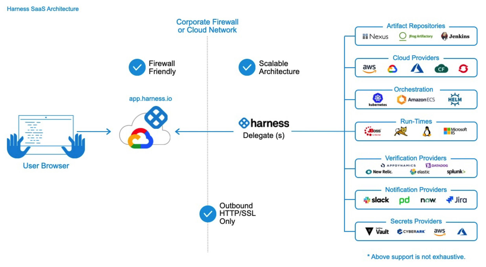
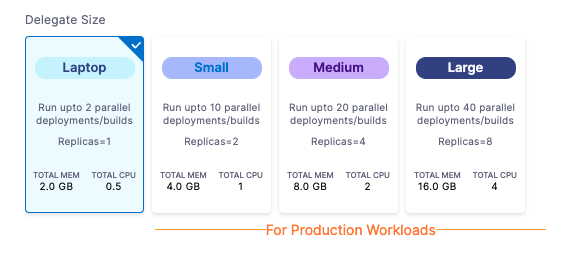
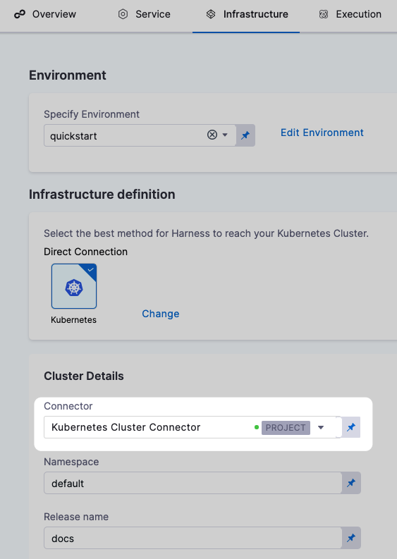
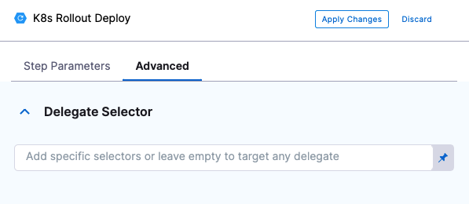

Harness Delegate is a service you run in your local network or VPC to connect your artifacts, infrastructure, collaboration, verification and other providers, with Harness Manager.

The first time you connect Harness to a third-party resource, Harness Delegate is installed in your target infrastructure, for example, a Kubernetes cluster. 

After the Delegate is installed, you connect to third-party resources. The Delegate performs all operations, including deployment and integration.

Harness Delegate is built for parallelism and performs tasks and deployments in parallel. The following table includes performance benchmarks for one NG Delegate executing perpetual tasks and parallel deployments in a Kubernetes environment.


|  |  |  |  |
| --- | --- | --- | --- |
| **Delegate** | **Compute resources** | **Task type** | **Running in parallel** |
| NextGen Delegate | 0.5 CPU, 2 GiB | Perpetual | 40 tasks |
| NextGen Delegate | 0.5 CPU, 2 GiB | Kubernetes deployment | 10 deployments |
| NextGen Delegate | 1.0 CPU, 4 GiB | Kubernetes deployment | 20 deployments |

### Limitations and requirements

See [Delegate Requirements and Limitations](delegate-reference/delegate-requirements-and-limitations.md).

### Data the delegate sends to Harness Manager

Harness Delegate connects to Harness Manager over an outbound HTTPS/WSS connection.


The Delegate connects to Harness Manager (via SaaS) over a Secure WebSockets channel (WebSockets over TLS). The channel is used to send notifications of Delegate task events and to exchange connection heartbeats. The channel is not used to send task data itself.

* **Heartbeat** - The Delegate sends a [heartbeat](https://en.wikipedia.org/wiki/Heartbeat_(computing)) to notify Harness Manager that it is running.
* **Deployment data** - The Delegate sends information retrieved from API calls to Harness Manager for display on the **Deployments** page.
* **Time series and log data for Continuous Verification** - The Delegate connects to the verification providers you configure and sends the data retrieved from those providers to Harness Manager for display in Harness Continuous Verification.

### Where do I install the delegate?

* **Evaluating Harness** - When evaluating Harness, you might want to install the Delegate locally. Ensure that it has access to the artifact sources, deployment environments, and verification providers you want to use with Harness.
* **Development, QA, and Production** - The Delegate should be installed behind your firewall and in the same VPC as the micro-services you are deploying. The Delegate must have access to the artifact servers, deployment environments, and cloud providers it needs.

### Root vs non-root

Harness Delegate does not have a root image. There are two non-root images that use the same tag. For example:

* `harness/delegate:22.03.74411`
* `harness/delegate:22.03.74411.minimal`

The first image includes client tools like `kubectl`, Helm, and ChartMuseum. The second image, for which the `minimal` tag is appended, does not include those client tools.

If you want to add tools to the image, Harness recommends the creation of a custom image.

### Install Harness Delegate

For basic information on installing Harness Delegate, see the following topics:

* [Install Harness Delegate on Kubernetes](delegate-install-kubernetes/install-harness-delegate-on-kubernetes.md)
* [Install Harness Delegate Using Helm](delegate-install-kubernetes/install-harness-delegate-using-helm.md)
* [Install a Docker Delegate](delegate-install-docker/install-a-docker-delegate.md)
* [Install a Legacy Kubernetes Delegate](delegate-guide/install-a-kubernetes-delegate.md)

For advanced installation topics, see the following:

* [Automate Delegate Installation](delegate-guide/automate-delegate-installation.md)
* [Non-Root Delegate Installation](delegate-guide/non-root-delegate-installation.md)
* [Install a Delegate with Third-Party Custom Tool Binaries](delegate-guide/install-a-delegate-with-3-rd-party-tool-custom-binaries.md)

### Delegate sizes

One Delegate size does not fit all use cases, so Harness let's you pick from several options:


Remember that the memory and CPU requirements are for the Delegate only. Your Delegate host/pod/container will need more computing resources for its operations systems and other services such as Docker or Kubernetes.

### How does Harness Manager identify delegates?

All Delegates are identified by your Harness account ID. Depending on the type of Delegate, there are additional factors.

For Delegates running on virtual machines, such as the Shell Script and Docker Delegates running on an AWS EC2 instance, the Delegate is identified by the combination of **Hostname** and **IP**.

Therefore, if the hostname or IP changes on the VM, the Delegate cannot be identified by the Harness Manager. The IP used is the private IP. The Delegate connects to the Harness Manager, but the Harness Manager does not initiate a connection to the Delegate, and so the public IP address of the Delegate is not needed, typically.

For Kubernetes Delegates, the IP can change if a pod is rescheduled, for example. Consequently, Kubernetes Delegates are identified by a suffix using a unique six letter code in their **Hostname** (the first six letters that occur in your account ID).

### How does Harness Manager pick delegates?

Delegates are used by Harness for all operations. For example:

* **Connectors:** Connectors are used for all third-party connections.
* **Pipeline Services and Infrastructure:** Connectors are used in Pipeline Service connections to repos and Pipeline Infrastructure connections to target environments (deployment targets, build farms, etc).
* **Pipeline Steps:** you can select a Delegate in each Pipeline step to ensure that the step only uses that Delegate to perform its operation.

In the case of all these Delegate uses, you can select that one or more specific Delegates to perform the operation (using Delegate Tags). If you do not specify specific Delegates, then Harness will assign the task to a Delegate.

#### Task assignment

In cases where you have selected specific Delegates to perform the task, Harness uses those Delegate only. If these Delegates cannot perform the task, Harness does not use another Delegate.

In cases where you do not select specific Delegates, Harness uses any available Delegate to perform the task. Harness uses the follow process and criteria to pick a Delegate.

When a task is ready to be assigned, the Harness Manager first validates its lists of Delegates to see which Delegate should be assigned the task.

The following information describes how the Harness Manager validates and assigns tasks to a Delegate:

* **Heartbeats** - Running Delegates send heartbeats to the Harness Manager in 1 minute intervals. If the Manager does not have a heartbeat for a Delegate when a task is ready to be assigned, it will not assign the task to that Delegate.
* **Tags** - For more information, see [Select Delegates with Tags](delegate-guide/select-delegates-with-selectors.md).
* **Allowlisting** - Once a Delegate has been validated for a task, it is allowlisted for that task and will likely be used again for that task. The allowlisting criteria is the URL associated with the task, such as a connection to a cloud platform, repo, or API. A Delegate is allowlisted for all tasks using that URL. The Time-To-Live (TTL) for the allowlisting is 6 hours, and the TTL is reset with each successful task validation.
* **Blocklisting** - If a Delegate fails to perform a task that Delegate is blocklisted for that task and will not be tried again. TTL is 5 minutes. This is true if there is only one Delegate and even if the Delegate is selected for that task with a Selector, such as with a Shell Script step in a Stage.

#### Delegate selection in pipelines

As stated above, Delegates are selected in Service and Infrastructure Connectors and in steps.

For example, in the **Infrastructure** section of a stage, there is a **Connector** setting. For Harness CD, this is the Connector to the target infrastructure. For Harness CI, this is Connector to the build farm.


When you add Connectors to Harness, you can select several or all Delegates for the Connector to use.

Each CD step in the stage Execution has a **Delegate Selector** setting.


Here you use Delegate Tags to select the Delegate(s) to use.

#### Which delegate is used during pipeline execution?

The Delegates assigned to Connectors and steps are used during Pipeline execution.

If no Delegates are selected, then the Delegates are selected as described in [Task Assignment](delegates-overview.md#task-assignment).

If no Delegates are selected for a CD step in its **Delegate Selector** setting, Harness prioritizes the Delegate used successfully for the Infrastructure Connector.

Harness will try this Delegate first for the step task because this Delegate has been successful in the target environment.

Most CI steps use Connectors to pull the image of the container where the step will run. The Delegates used for the step's Connector are not necessarily used for running the step. In general, the Delegate(s) used for the Connector in the **Infrastructure** build farm is used to run the step.

### Delegate high availability (HA)

You might need to install multiple Delegates depending on how many Continuous Delivery tasks you do concurrently, and on the compute resources you are providing to each Delegate. Typically, you will need one Delegate for every 300-500 service instances across your applications.

In addition to compute considerations, you can enable High Availability (HA) for Harness Delegates. HA simply involves installing multiple Delegates in your environment.

For example, your Kubernetes deployment could include two Kubernetes Delegates, each running in its own pod in the same target cluster. To add Delegates to your deployment, increase the desired count of Delegate replica pods in the **spec** section of the harness-kubernetes.yaml file that you download from Harness:


```
...  
apiVersion: apps/v1beta1  
kind: StatefulSet  
metadata:  
  labels:  
    harness.io/app: harness-delegate  
    harness.io/account: xxxx  
    harness.io/name: test  
  name: test-zeaakf  
  namespace: harness-delegate  
spec:  
  replicas: 2  
  selector:  
    matchLabels:  
      harness.io/app: harness-delegate  
...
```
For the Kubernetes Delegate, you only need one Delegate in the cluster. Simply increase the number of replicas, and nothing else. Do not add another Delegate to the cluster in an attempt to achieve HA.If you want to install Kubernetes Delegates in separate clusters, do not use the same **harness-kubernetes.yaml** and name for both Delegates. Download a new Kubernetes YAML spec from Harness for each Delegate you want to install. This will avoid name conflicts.In every case, Delegates must be identical in terms of permissions, keys, connectivity, etc.With two or more Delegates running in the same target environment, HA is provided by default. One Delegate can go down without impacting Harness' ability to perform deployments. If you want more availability, you can set up three Delegates to handle the loss of two Delegates, and so on.

Two Delegates in different locations with different connectivity do not support HA. For example, if you have a Delegate in a Dev environment and another in a Prod environment, the Dev Delegate will not communicate with the Prod Delegate or vice versa. If either Delegate went down, Harness would not operate in their environment.

### Delegate scope

Delegates are scoped in two ways:

#### Project/Org/Accounts

You can add Delegates at the Project, Org, and Account level. Delegate availability then becomes subject to Harness implicit Project, Org, and Account hierarchy.

For example, let's look at two users, Alex and Uri, and the Delegates (D*n*) available to them:

.

To ensure a specific Delegate is used by a Harness entity, you can add Tags to Delegates and then reference the Tags in commands and Connectors.

See [Select Delegates with Tags](delegate-guide/select-delegates-with-selectors.md).

### Delegate log file

The Delegate creates a new log file each day, named **delegate.log**, and its maximum size is 50MB.

Every day the log file is saved with the day's date and a new log file is created.

If a log file grows beyond 50MB in a day, the log file is renamed with today's date and a new log file is created.

Harness keeps log files for today and the previous 10 days (up to one 1GB).

### Delegate permissions

You can set permissions on Delegates using [Harness RBAC](../4_Role-Based-Access-Control/1-rbac-in-harness.md).

You create roles and then assign them to Harness Users.

There are role permissions for Delegates:

The permissions are:

* **Delegate permissions:** Create/Edit, Delete, View.
* The Delegate **View** permission cannot be disabled. Every user has the permission to view the Delegate.

Access to a Delegate can also be restricted by downstream resource types:

* **Pipelines:** Execute
* **Secrets:** Access
* **Connectors:** Access

This means that if a role does not have these permissions the User with that role cannot use the related Delegates in these Pipelines, Secrets, or Connectors.

### Third-party tools installed with the delegate

See [Supported Platforms and Technologies](https://docs.harness.io/article/1e536z41av-supported-platforms-and-technologies).

