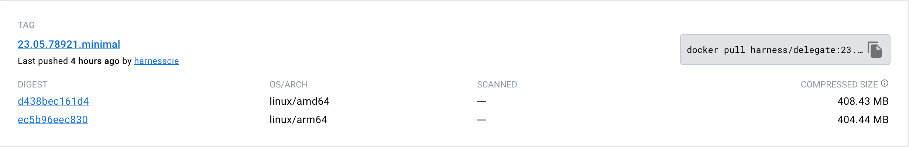
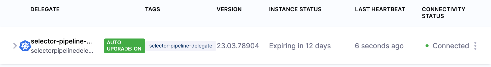

Harness Manager installs and configures delegates with the binaries that most CI/CD pipelines require. In some cases, however, a preconfigured image isn’t the right fit. For example, preconfigured images can:

* Introduce the vulnerabilities of the binaries they include.
* Restrict you to the use of the included third-party tools and versions.

This document explains how you can:

* Build and host a custom delegate image that includes the tools you select.
* Use your custom delegate in CI/CD pipelines.

:::info note
Delegates with an immutable image type (image tag `yy.mm.xxxxx`) include non-root user privileges and are compatible with OpenShift. For information on delegate types, go to [Delegate image types](/docs/platform/delegates/delegate-concepts/delegate-image-types).
:::

### Select the delegate image

You can build on either of the following Harness-provided images.

| **Image** | **Description** |
| --- | --- |
| Harness Delegate Docker image | A publicly available Docker image providing Harness Delegate. |
| Harness Minimal Delegate Docker image | A minimal delegate image is available in Docker Hub at <https://hub.docker.com/r/harness/delegate/tags>. |

Use the last published `yy.mm.xxxxx` version of the minimal image from the Docker repository.


### Build the delegate image

When you build a custom delegate image, you modify the image you select with user privileges and binaries. This section explains the build script used for the process. In this example, the script builds a custom image for deployment by Kubernetes and by Terraform.

The first lines of the script provide information about the base image and user privileges. This example uses the minimal image with delegate minor version 77029.


```
FROM harness/delegate:22.10.77029.minimal  
USER root
```
The delegate container is granted root user privileges.

The first `RUN` block installs or updates the `unzip` and `yum-utils` tools. The `--nodocs` option prevents the installation of documentation on the image.


```
RUN microdnf update \  
  && microdnf install --nodocs \  
    unzip \  
    yum-utils
```
The second `RUN` block uses the `yum` utility to create a configuration file for the HashiCorp repository, and then uses the `microdnf` package manager to install the required Terraform components:


```
RUN yum-config-manager --add-repo https://rpm.releases.hashicorp.com/RHEL/hashicorp.repo \  
  && microdnf install -y terraform   
```
The final `RUN` block retrieves the Kubernetes `kubectl` command-line tool that is required to manipulate clusters. The Linux `chmod +x` instruction makes the utility executable:


```
RUN mkdir /opt/harness-delegate/tools && cd /opt/harness-delegate/tools \  
  && curl -LO "https://dl.k8s.io/release/$(curl> -L -s https://dl.k8s.io/release/stable.txt)/bin/linux/amd64/kubectl" && chmod +x kubectl 
```
  

The `ENV` instruction defines the Linux `$PATH` environment variable that provides the location of the tools to be installed:


```
ENV PATH=/opt/harness-delegate/tools/:$PATH
```

The final instruction switches the user back to `harness` to ensure the custom image does not run as root:

```
USER harness
```
The complete script is as follows:

```
FROM harness/delegate:22.10.77029.minimal  
USER root  
  
RUN microdnf update \  
  && microdnf install --nodocs \  
    unzip \  
    yum-utils  
  
RUN yum-config-manager --add-repo https://rpm.releases.hashicorp.com/RHEL/hashicorp.repo \  
  && microdnf install -y terraform     
  
RUN mkdir /opt/harness-delegate/tools && cd /opt/harness-delegate/tools \  
  && curl -LO "https://dl.k8s.io/release/$(curl -L -s https://dl.k8s.io/release/stable.txt)/bin/linux/amd64/kubectl" && chmod +x kubectl   
  
ENV PATH=/opt/harness-delegate/tools/:$PATH  

USER harness
```

### Example Dockerfile with all tools

The following example Dockerfile adds all the tools necessary for the Harness platform that are not part of the base image to the minimal delegate. You can remove tools for features you don't use or update versions for your requirements.

```
FROM harness/delegate:yy.mm.xxxxx.minimal

USER 0

ENV TARGETARCH=amd64
RUN microdnf install --nodocs git \
  && microdnf clean all \
  && rm -rf /var/cache/yum

RUN mkdir -m 777 -p client-tools/kubectl/v1.24.3 \
  && curl -s -L -o client-tools/kubectl/v1.24.3/kubectl https://app.harness.io/public/shared/tools/kubectl/release/v1.24.3/bin/linux/$TARGETARCH/kubectl \
  && mkdir -m 777 -p client-tools/helm/v2.13.1 \
  && curl -s -L -o client-tools/helm/v2.13.1/helm https://app.harness.io/public/shared/tools/helm/release/v2.13.1/bin/linux/$TARGETARCH/helm \
  && mkdir -m 777 -p client-tools/helm/v3.1.2 \
  && curl -s -L -o client-tools/helm/v3.1.2/helm https://app.harness.io/public/shared/tools/helm/release/v3.1.2/bin/linux/$TARGETARCH/helm \
  && mkdir -m 777 -p client-tools/helm/v3.8.0 \
  && curl -s -L -o client-tools/helm/v3.8.0/helm https://app.harness.io/public/shared/tools/helm/release/v3.8.0/bin/linux/$TARGETARCH/helm \
  && mkdir -m 777 -p client-tools/go-template/v0.4.2 \
  && curl -s -L -o client-tools/go-template/v0.4.2/go-template https://app.harness.io/public/shared/tools/go-template/release/v0.4.2/bin/linux/$TARGETARCH/go-template \
  && mkdir -m 777 -p client-tools/harness-pywinrm/v0.4-dev \
  && curl -s -L -o client-tools/harness-pywinrm/v0.4-dev/harness-pywinrm https://app.harness.io/public/shared/tools/harness-pywinrm/release/v0.4-dev/bin/linux/$TARGETARCH/harness-pywinrm \
  && mkdir -m 777 -p client-tools/chartmuseum/v0.15.0 \
  && curl -s -L -o client-tools/chartmuseum/v0.15.0/chartmuseum https://app.harness.io/public/shared/tools/chartmuseum/release/v0.15.0/bin/linux/$TARGETARCH/chartmuseum \
  && mkdir -m 777 -p client-tools/tf-config-inspect/v1.2 \
  && curl -s -L -o client-tools/tf-config-inspect/v1.2/terraform-config-inspect https://app.harness.io/public/shared/tools/terraform-config-inspect/v1.2/linux/$TARGETARCH/terraform-config-inspect \
  && mkdir -m 777 -p client-tools/oc/v4.2.16 \
  && curl -s -L -o client-tools/oc/v4.2.16/oc https://app.harness.io/public/shared/tools/oc/release/v4.2.16/bin/linux/$TARGETARCH/oc \
  && mkdir -m 777 -p client-tools/kustomize/v4.5.4 \
  && curl -s -L -o client-tools/kustomize/v4.5.4/kustomize https://app.harness.io/public/shared/tools/kustomize/release/v4.5.4/bin/linux/$TARGETARCH/kustomize \
  && mkdir -m 777 -p client-tools/scm/f1024c6b \
  && curl -s -L -o client-tools/scm/f1024c6b/scm https://app.harness.io/public/shared/tools/scm/release/f1024c6b/bin/linux/$TARGETARCH/scm \
  && chmod -R 775 /opt/harness-delegate \
  && chgrp -R 0 /opt/harness-delegate  \
  && chown -R 1001 /opt/harness-delegate

ENV PATH=/opt/harness-delegate/client-tools/kubectl/v1.24.3/:$PATH
ENV PATH=/opt/harness-delegate/client-tools/go-template/v0.4.2/:$PATH
ENV PATH=/opt/harness-delegate/client-tools/chartmuseum/v0.15.0/:$PATH
ENV PATH=/opt/harness-delegate/client-tools/tf-config-inspect/v1.2/:$PATH
ENV PATH=/opt/harness-delegate/client-tools/kustomize/v4.5.4/:$PATH

USER 1001
```

### Upload the image to Docker Hub

The next step is to upload your custom image to Docker Hub. For information on working with Docker repositories, go to [Manage repositories](https://docs.docker.com/docker-hub/repos/) in the Docker documentation.

### Modify the delegate manifest

Before you can deploy a delegate, you must:

* Update the image path to the repository location of the custom image.
* Suspend delegate auto-upgrade functionality.

Delegate auto-upgrade is not compatible with custom images.

### Upgrade the image path

Open the delegate manifest file and locate the container `spec` (`spec.containers`). Change the image path to reflect the repository location of your uploaded image as shown in the following YAML.


```
 spec:  
     terminationGracePeriodSeconds: 600  
     restartPolicy: Always  
     containers:  
     - image: example/org:custom-delegate  
       imagePullPolicy: Always  
       name: delegate  
       securityContext:  
         allowPrivilegeEscalation: false  
         runAsUser: 0   
```
   

For purposes of this example, the image was uploaded to `example/org:custom-delegate`.

### Suspend delegate auto-upgrade

Before you deploy a custom delegate, you must suspend its auto-upgrade functionality. This step prevents your image from being automatically upgraded and the installed binaries removed. 

To suspend auto-upgrade, in the delegate manifest, locate the `CronJob` resource. In the resource `spec`, set the `suspend` field to `true` as shown in the following YAML:


```
apiVersion: batch/v1beta1  
kind: CronJob  
metadata:  
 labels:  
   harness.io/name: custom-del-upgrader-job  
 name: custom-del-upgrader-job  
 namespace: harness-delegate-ng  
spec:  
 suspend: true  
 schedule: "0 */1 * * *"  
 concurrencyPolicy: Forbid  
 startingDeadlineSeconds: 20  

```
### Example manifest file

For the complete file, expand the following example.

Example manifest
```
apiVersion: v1  
kind: Namespace  
metadata:  
 name: harness-delegate-ng  
   
---  
   
apiVersion: rbac.authorization.k8s.io/v1  
kind: ClusterRoleBinding  
metadata:  
 name: harness-delegate-ng-cluster-admin  
subjects:  
 - kind: ServiceAccount  
   name: default  
   namespace: harness-delegate-ng  
roleRef:  
 kind: ClusterRole  
 name: cluster-admin  
 apiGroup: rbac.authorization.k8s.io  
   
---  
   
apiVersion: v1  
kind: Secret  
metadata:  
 name: custom-del-account-token  
 namespace: harness-delegate-ng  
type: Opaque  
data:  
 DELEGATE_TOKEN: ""  
   
---  
   
# If delegate needs to use a proxy, please follow instructions available in the documentation  
# https://developer.harness.io/docs/first-gen/firstgen-platform/account/manage-delegates/configure-delegate-proxy-settings/  
   
apiVersion: apps/v1  
kind: Deployment  
metadata:  
 labels:  
   harness.io/name: custom-del  
 name: custom-del  
 namespace: harness-delegate-ng  
spec:  
 replicas: 1  
 selector:  
   matchLabels:  
     harness.io/name: custom-del  
 template:  
   metadata:  
     labels:  
       harness.io/name: custom-del  
     annotations:  
       prometheus.io/scrape: "true"  
       prometheus.io/port: "3460"  
       prometheus.io/path: "/api/metrics"  
   spec:  
     terminationGracePeriodSeconds: 600  
     restartPolicy: Always  
     containers:  
     - image: foobar/org:custom-delegate  
       imagePullPolicy: Always  
       name: delegate  
       securityContext:  
         allowPrivilegeEscalation: false  
         runAsUser: 0  
       ports:  
         - containerPort: 8080  
       resources:  
         limits:  
           cpu: "0.5"  
           memory: "2048Mi"  
         requests:  
           cpu: "0.5"  
           memory: "2048Mi"  
       livenessProbe:  
         httpGet:  
           path: /api/health  
           port: 3460  
           scheme: HTTP  
         initialDelaySeconds: 10  
         periodSeconds: 10  
         failureThreshold: 2  
       startupProbe:  
         httpGet:  
           path: /api/health  
           port: 3460  
           scheme: HTTP  
         initialDelaySeconds: 30  
         periodSeconds: 10  
         failureThreshold: 15  
       envFrom:  
       - secretRef:  
           name: custom-del-account-token  
       env:  
       - name: JAVA_OPTS  
         value: "-Xms64M"  
       - name: ACCOUNT_ID  
         value:   
       - name: MANAGER_HOST_AND_PORT  
         value: https://app.harness.io/gratis  
       - name: DEPLOY_MODE  
         value: KUBERNETES  
       - name: DELEGATE_NAME  
         value: custom-del  
       - name: DELEGATE_TYPE  
         value: "KUBERNETES"  
       - name: DELEGATE_NAMESPACE  
         valueFrom:  
           fieldRef:  
             fieldPath: metadata.namespace  
       - name: INIT_SCRIPT  
         value: ""  
       - name: DELEGATE_DESCRIPTION  
         value: ""  
       - name: DELEGATE_TAGS  
         value: ""  
       - name: NEXT_GEN  
         value: "true"  
       - name: CLIENT_TOOLS_DOWNLOAD_DISABLED  
         value: "true"  
       - name: LOG_STREAMING_SERVICE_URL  
         value: "https://app.harness.io/gratis/log-service/"  
   
---  
   
apiVersion: v1  
kind: Service  
metadata:  
 name: delegate-service  
 namespace: harness-delegate-ng  
spec:  
 type: ClusterIP  
 selector:  
   harness.io/name: custom-del  
 ports:  
   - port: 8080  
   
---  
   
kind: Role  
apiVersion: rbac.authorization.k8s.io/v1  
metadata:  
 name: upgrader-cronjob  
 namespace: harness-delegate-ng  
rules:  
 - apiGroups: ["batch", "apps", "extensions"]  
   resources: ["cronjobs"]  
   verbs: ["get", "list", "watch", "update", "patch"]  
 - apiGroups: ["extensions", "apps"]  
   resources: ["deployments"]  
   verbs: ["get", "list", "watch", "create", "update", "patch"]  
   
---  
   
kind: RoleBinding  
apiVersion: rbac.authorization.k8s.io/v1  
metadata:  
 name: custom-del-upgrader-cronjob  
 namespace: harness-delegate-ng  
subjects:  
 - kind: ServiceAccount  
   name: upgrader-cronjob-sa  
   namespace: harness-delegate-ng  
roleRef:  
 kind: Role  
 name: upgrader-cronjob  
 apiGroup: ""  
   
---  
   
apiVersion: v1  
kind: ServiceAccount  
metadata:  
 name: upgrader-cronjob-sa  
 namespace: harness-delegate-ng  
   
---  
   
apiVersion: v1  
kind: Secret  
metadata:  
 name: custom-del-upgrader-token  
 namespace: harness-delegate-ng  
type: Opaque  
data:  
 UPGRADER_TOKEN: "NjUxM2FlZWUxODVhMjUyZDdjMDYxNTRmMjU4YWRjYWM="  
   
---  
   
apiVersion: v1  
kind: ConfigMap  
metadata:  
 name: custom-del-upgrader-config  
 namespace: harness-delegate-ng  
data:  
 config.yaml: |  
   mode: Delegate  
   dryRun: false  
   workloadName: custom-del  
   namespace: harness-delegate-ng  
   containerName: delegate  
   delegateConfig:  
     accountId: gVcEoNyqQNKbigC_hA3JqA  
     managerHost: https://app.harness.io/gratis  
   
---  
   
apiVersion: batch/v1beta1  
kind: CronJob  
metadata:  
 labels:  
   harness.io/name: custom-del-upgrader-job  
 name: custom-del-upgrader-job  
 namespace: harness-delegate-ng  
spec:  
 suspend: true  
 schedule: "0 */1 * * *"  
 concurrencyPolicy: Forbid  
 startingDeadlineSeconds: 20  
 jobTemplate:  
   spec:  
     template:  
       spec:  
         serviceAccountName: upgrader-cronjob-sa  
         restartPolicy: Never  
         containers:  
         - image: harness/upgrader:latest  
           name: upgrader  
           imagePullPolicy: Always  
           envFrom:  
           - secretRef:  
               name: custom-del-upgrader-token  
           volumeMounts:  
             - name: config-volume  
               mountPath: /etc/config  
         volumes:  
           - name: config-volume  
             configMap:  
               name: custom-del-upgrader-config  

```
### Deploy the delegate

You can deploy the delegate from Harness Manager or by applying the modified delegate manifest file to your cluster.



You can confirm the successful deployment and registration of the delegate in Harness Manager. Check the delegate information to ensure that auto-upgrade is not enabled.

### Create pipelines

You can use your registered delegate to run Kubernetes and Terraform pipelines.

For information about creating a Kubernetes pipeline, go to [Kubernetes deployment tutorial](/docs/continuous-delivery/deploy-srv-diff-platforms/kubernetes/kubernetes-cd-quickstart).

For information about creating a Terraform Plan, go to [Provision with the Terraform Apply Step](/docs/continuous-delivery/cd-infrastructure/terraform-infra/run-a-terraform-plan-with-the-terraform-apply-step/).
