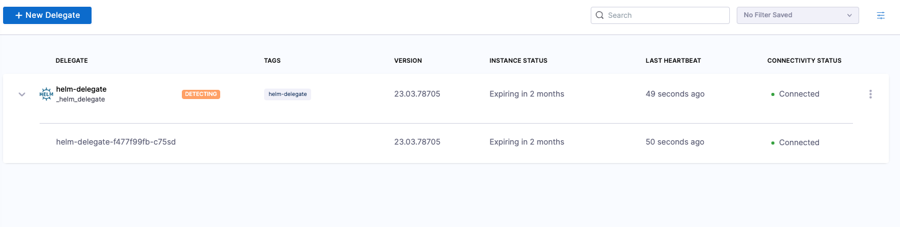
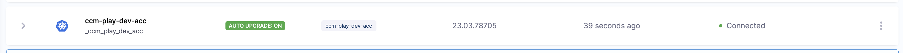

The Harness Delegate for Kubernetes supports automatic upgrades. With automatic upgrades, you don't need to worry about having the most up-to-date functionality. You always have the most recent version of the delegate. 

Harness recommends that you enable automatic upgrades. 

Delegate upgrades do not affect pipelines. Before an upgrade is performed, the delegate finishes the tasks that are underway. The delegate then shuts down. 

:::info note
The automatic upgrade feature is enabled by default for the Kubernetes manifest installation option. However, it is disabled by default for the Helm, Terraform, and Docker installation options. 
:::

## How automatic upgrade works in the Kubernetes manifest

The Kubernetes manifest has a component called `upgrader`. The `upgrader` is a cron job that runs every hour. Every time it runs, it makes a call to the Harness Manager to determine which delegate version is published for the account. The API returns a payload, such as `harness/delegate:23.03.78314`. If the delegate that was involved in this upgrade cron job does not have the same image as what the API returns, the `kubectl set image` command runs to perform a rolling deployment of the delegate replicas with the newer image. 

To prevent the installation of the automatic upgrade feature, remove the `cronJob` section before you apply the manifest.

You can also change the time when the upgrade cron job runs by updating the `schedule`. 

:::info note
The allowed value for `upgrader` schedule is between one and 90 minutes. Harness recommends a default value of 60 minutes.
:::

<details>
    <summary>Example Kubernetes manifest</summary>

```yaml
kind: Role
apiVersion: rbac.authorization.k8s.io/v1
metadata:
  name: upgrader-cronjob
  namespace: harness-delegate-ng
rules:
  - apiGroups: ["batch", "apps", "extensions"]
    resources: ["cronjobs"]
    verbs: ["get", "list", "watch", "update", "patch"]
  - apiGroups: ["extensions", "apps"]
    resources: ["deployments"]
    verbs: ["get", "list", "watch", "create", "update", "patch"]

---

kind: RoleBinding
apiVersion: rbac.authorization.k8s.io/v1
metadata:
  name: kubernetes-delegate-upgrader-cronjob
  namespace: harness-delegate-ng
subjects:
  - kind: ServiceAccount
    name: upgrader-cronjob-sa
    namespace: harness-delegate-ng
roleRef:
  kind: Role
  name: upgrader-cronjob
  apiGroup: ""

---

apiVersion: v1
kind: ServiceAccount
metadata:
  name: upgrader-cronjob-sa
  namespace: harness-delegate-ng

---

apiVersion: v1
kind: Secret
metadata:
  name: test-upgrader-token
  namespace: harness-delegate-ng
type: Opaque
data:
  UPGRADER_TOKEN: "DELEGATE_TOKEN"

---

apiVersion: v1
kind: ConfigMap
metadata:
  name: test-upgrader-config
  namespace: harness-delegate-ng
data:
  config.yaml: |
    mode: Delegate
    dryRun: false
    workloadName: DELEGATE_TO_AUTO_UPGRADE
    namespace: harness-delegate-ng
    containerName: delegate
    delegateConfig:
      accountId: ACCOUNT_ID
      managerHost: HARNESS_MANAGE_ENDPOINT_URL

---

apiVersion: batch/v1
kind: CronJob
metadata:
    labels:
        harness.io/name: test-upgrader-job
    name: test-upgrader-job
    namespace: harness-delegate-ng
spec:
    schedule: "0 */1 * * *"
    concurrencyPolicy: Forbid
    startingDeadlineSeconds: 20
    jobTemplate:
        spec:
        template:
            spec:
                serviceAccountName: upgrader-cronjob-sa
                restartPolicy: Never
                containers:
                - image: harness/upgrader:latest
                name: upgrader
                imagePullPolicy: Always
                envFrom:
                - secretRef:
                    name: test-upgrader-token
                volumeMounts:
                    - name: config-volume
                    - mountPath: /etc/config
                volumes:
                    - name: config-volume
                    - configMap:
                        name: test-upgrader-config

```

</details>

### Determine if automatic upgrade is enabled

When a delegate is installed, it may take up to an hour to determine if the `upgrader` was removed during installation. During that time, the delegate shows a status of **DETECTING**. 

To find the delegate status, select an account, a project, or an organization, and then select **Delegates**. 



After the first hour, the delegate shows a status of **AUTO UPGRADE: ON** or **AUTO UPGRADE: OFF**. 



### Disable automatic upgrade on an installed delegate image

If you disable automatic upgrades, then you have to manually upgrade the delegate regularly to prevent a loss of backward compatibility.

To disable auto-upgrade on an installed delegate image, do the following:

1. Run the following command to suspend auto-upgrade on the installed image:  
`kubectl patch cronjobs <job-name> -p '{"spec" : {"suspend" : true }}' -n <namespace>`
2. In the delegate manifest, locate the **CronJob** resource. In the resource `spec`, set the `suspend` field to `true`:   
`spec:`  
--`suspend: true`

## Use automatic upgrade with custom delegate images

You may choose to use a custom delegate image for the following reasons:

- You don't have access to Docker Hub, so you pull the Harness images and put them in your own container registry.
- You use the Harness Delegate as a base image and install tools, certificates, etc. 

If automatic upgrade is enabled and you have a custom image, the following may occur:

- If the Kubernetes cluster does not have access to Docker Hub, then the upgrade fails. 
- If the Kubernetes cluster has access to Docker Hub, then the new published image is deployed. This action causes the custom tooling to be lost. 

To avoid these issues, you can set up the `upgrader` to use your custom delegate tag.

1. Use the [latest-supported-version](https://apidocs.harness.io/tag/Delegate-Setup-Resource/#operation/publishedDelegateVersion) API to determine the delegate number for your account:

    `curl --location 'https://app.harness.io/ng/api/delegate-setup/latest-supported-version?accountIdentifier=<account_identifier>' \
    --header 'x-api-key: <your_api_key>'`

    The following example result is returned. It returns the tag of the delegate that is released to your account. 

    ```
    {
    "metaData": {},
    "resource": {
        "latestSupportedVersion": "23.04.78910",
        "latestSupportedMinimalVersion": "23.04.78910.minimal"
    },
    "responseMessages": []
    }
    ```

    When the `upgrader` makes a request, it tries to change the image to `harness/delegate:23.04.78910`. You can take either the `harness/delegate:23.04.78910` image or the `harness/delegate:23.04.78910.minimal` image and build your own image by adding more tools and binaries, and then push it to your own container repository. For example, you might publish the image to a private repository, such as `artifactory-abc/harness/delegate:23.04.78910`.

2. Once the image is pushed, you can call the [override-delegate-tag](https://apidocs.harness.io/tag/Delegate-Setup-Resource/#operation/overrideDelegateImageTag) API to enable the Harness back-end to supply the upgrader with the custom delegate tag:

    `curl --location --request PUT 'https://app.harness.io/ng/api/delegate-setup/override-delegate-tag?accountIdentifier=<account_identifier>&delegateTag=artifactory-abc%2Fharness%2Fdelegate%3A23.04.78910' \
    --header 'x-api-key: <your_api_key>'`

    It returns the following results:

    ```
    {
    "metaData": {},
    "resource": "Updated Delegate image tag to artifactory-abc/harness/delegate:23.04.78910",
    "responseMessages": []
    }
    ```

    The next time the `upgrader` runs, it will receive the `artifactory-abc/harness/delegate:23.04.78910` image. 

## Delegate expiration policy

Delegate expiration is calculated using the version difference between Harness Manager and the delegate. If the delegate and Harness Manager are on the same version, the delegate expiration is 24 weeks.

Delegate expiration does not mean the delegate stops working. It means that you may experience issues because the backend has moved too far ahead, making the delegate no longer backward compatible. If you do not have automatic upgrade enabled, Harness recommends upgrading the delegate at least once per quarter. 

### Determine when your delegate expires

To determine when your delegate expires, do the following:

1. Select an account, a project, or an organization, and then select **Delegates**.

2. Locate your delegate in the list, and then check the **INSTANCE STATUS** column.

### Update the delegate YAML

Harness does not recommend the use of delegate images that are not current. However, if you require an earlier image version, check the repository on [Docker Hub](https://hub.docker.com/r/harness/delegate/tags).

To update the delegate YAML, do the following:

- Select to **New Delegate** > **Kubernetes** > **Kubernetes Manfiest** > **Custom**, and then follow the instructions on the screen. 

For an example of a complete Delegate YAML file, go to [Example Kubernetes manifest for Harness Delegate](/docs/platform/2_Delegates/delegate-reference/YAML/example-kubernetes-manifest-harness-delegate.md).
