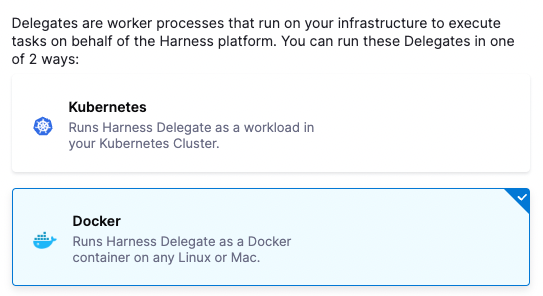
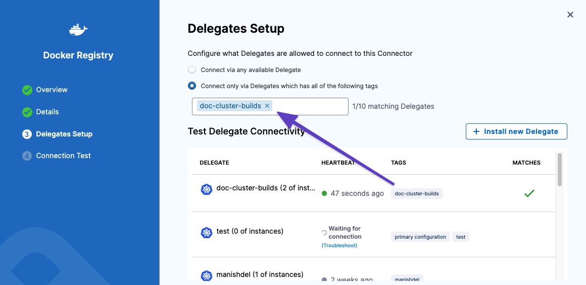
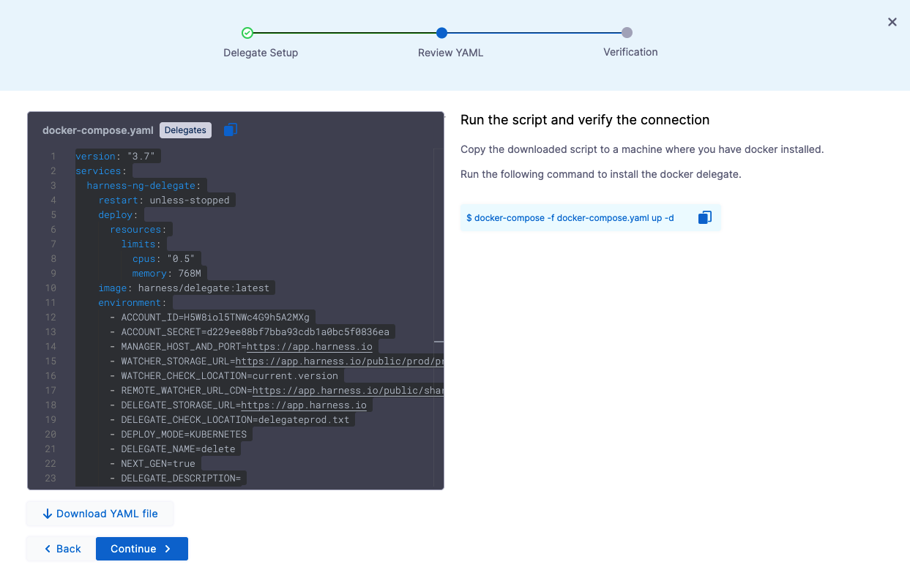

Harness Delegate is a worker process that you run in your deployment target environment, for example, your local network, VPC, or cluster. The delegate connects artifact, infrastructure, collaboration, verification, and other providers with Harness Manager. The delegate performs all deployment operations.

There are several types of delegates. This topic describes how to install the Docker delegate.

### Before you begin

* [Delegate installation overview](/docs/platform/2_Delegates/get-started-with-delegates/delegate-installation-overview.md)
* [Projects and organizations](/docs/platform/organizations-and-projects/projects-and-organizations.md)

### Review: System requirements

The Docker delegate has the following system requirements:

* Default 0.5 CPU.
* Default 768MB RAM. There is a cap of 768 MB per delegate, but when the delegate is updating there might be two delegates running. Hence, the minimum is 1.5 GB. 
 
You must allocate resources to meet the minimum requirements of the delegate *in addition* to the allocation you make to meet the requirements of the host/node system. 

### Step 1: Download the Docker delegate

The delegate can be installed at the Harness account, organization, or project level.

You can install the Docker delegate when you set up a connector or independent of another process.

After you select **New Delegate** on the Delegate page, or when you set up a connector, the **Delegates** selection page appears.



Click **Docker** and then click **Continue**.

### Step 2: Name and tag the delegate

Enter a name for the delegate. This name identifies the delegate in Harness Manager.

**Do not run delegates with the same name in different clusters.** See [Troubleshooting](/docs/troubleshooting/troubleshooting-nextgen.md).

Add tags to the delegate. By default, Harness adds a tag using the name you enter. To add more, type them in and press **Enter**.

You can use tags to select the delegate you want to run when you create a connector.



Click **Continue**.

### Step 3: Run the Docker delegate script

If your system already has a delegate image, Harness doesn't pull the latest image when you run `docker-compose`. To pull the latest, run `docker pull harness/delegate`. Then you can review the delegate YAML file:



Click **Download YAML file** and copy the Docker compose file to a machine where you have Docker installed.

Run the following command to install the Delegate in Docker:

```
docker-compose -f docker-compose.yaml up -d
```

The delegate installs. Type `docker ps` to see the container:


```
CONTAINER ID        IMAGE                     COMMAND                  CREATED             STATUS                          PORTS                    NAMES  
6b242707a57a        harness/delegate:latest   "/bin/sh -c './entry…"   3 days ago          Up 32 seconds                                            local-docker_harness-ng-del
```

#### Verification

For an overview of verification, see [Delegate Registration and Verification](/docs/platform/2_Delegates/get-started-with-delegates/delegate-registration.md).

In the delegate installer, click **Verify**. Harness will verify the receipt of heartbeats from the delegate.

Your delegate is installed.

You registered delegate appears in the delegate list.


Note the **Connected** status. If there is a connectivity error, the status is **Not Connected**. If there's an error, ensure the Docker host can connect to `https://app.harness.io`.

That's it. The delegate is installed and registered and connected.

### Harness Docker delegate environment variables

The Docker delegate uses the following environment variables.

#### ACCOUNT_ID

The Harness account ID for the account with which this delegate registers.

```
- ACCOUNT_ID = XXXXXXxxxxxxxxxx
```

#### DELEGATE_TOKEN

The Harness account token that is used to register the delegate.

```
- DELEGATE_TOKEN = d229ee88bf7bbxxxx6ea
```

#### MANAGER_HOST_AND_PORT

The Harness SaaS manager URL. `https` indicates port 443.

```
- MANAGER_HOST_AND_PORT = https://app.harness.io
```

#### WATCHER_STORAGE_URL

The URL location of the Watcher versions. See [Delegate installation overview](/docs/platform/2_Delegates/get-started-with-delegates/delegate-installation-overview.md).

```
- WATCHER_STORAGE_URL = https://app.harness.io/public/prod/premium/watchers
```

#### WATCHER_CHECK_LOCATION

The location of the delegate version that the Watcher references.

```
- name: WATCHER_CHECK_LOCATION  
  value: current.version
```

#### REMOTE_WATCHER_URL_CDN

The CDN URL for Watcher builds.

```
- name: REMOTE_WATCHER_URL_CDN  
  value: https://app.harness.io/public/shared/watchers/builds
```

#### DELEGATE_STORAGE_URL

The URL where published delegate JAR files are stored.

```
- name: DELEGATE_STORAGE_URL  
  value: https://app.harness.io
```

#### DELEGATE_CHECK_LOCATION

The storage location that hosts the published delegate versions.

```
- name: DELEGATE_CHECK_LOCATION  
  value: delegateprod.txt
```

#### DEPLOY_MODE

The mode of deployment, for example, Kubernetes or Docker. 

```
- name: DEPLOY_MODE  
  value: DOCKER
```

#### DELEGATE_NAME

The name of the delegate. This is the name that appears in Harness when the delegate is registered.

You can automate delegate creation by omitting the name and using a script to copy the delegate YAML file, giving a unique name to the `value` of the delegate name for each newly created delegate you want to register.

See [Automate delegate installation](/docs/platform/2_Delegates/advanced-installation/automate-delegate-installation.md).

```
- name: DELEGATE_NAME  
  value: qa
```

#### NEXT_GEN

Indicates whether the delegate registers in Harness NextGen (`true`) or FirstGen (`false`).

```
- name: NEXT_GEN  
  value: "true"
```

#### DELEGATE_DESCRIPTION

The description that is given to the delegate in Harness Manager or YAML before the delegate registers. The description appears on the delegate details page in Harness Manager.

```
- name: DELEGATE_DESCRIPTION  
  value: ""
```

#### DELEGATE_TYPE

The type of the delegate.

```
- name: DELEGATE_TYPE  
  value: "DOCKER"
```

#### DELEGATE_TAGS

The tags that were added to the delegate in Harness Manager or YAML before delegate registration.

Harness generates tags based on the delegate name. You can add others. The tags appear on the delegate details page in Harness Manager. 

See [Tags reference](/docs/platform/20_References/tags-reference.md) and [Select delegates with tags](/docs/platform/2_Delegates/manage-delegates/select-delegates-with-selectors.md).

```
- name: DELEGATE_TAGS  
  value: ""
```

#### DELEGATE_TASK_LIMIT

The maximum number of tasks the delegate can perform at one time. Delegate operations are categorized as different types of tasks.

```
- name: DELEGATE_TASK_LIMIT  
  value: "50"
```

#### DELEGATE_ORG_IDENTIFIER

The Harness organization [Identifier](/docs/platform/20_References/entity-identifier-reference.md) where the delegate registers. 

This value is not specified for delegates at the account level.

```
- name: DELEGATE_ORG_IDENTIFIER  
  value: "engg"
```

#### DELEGATE_PROJECT_IDENTIFIER

The Harness project [Identifier](/docs/platform/20_References/entity-identifier-reference.md) within which the delegate registers. 

This value is not specified for delegates at the account or organization level.

```
- name: DELEGATE_PROJECT_IDENTIFIER  
  value: "myproject"
```

#### PROXY_MANAGER

Indicates whether to use Harness Manager or a proxy. A value of `true` indicates an outbound proxy of traffic to Harness.

The default value is `true`. 

```
- PROXY_MANAGER = true
```

#### INIT_SCRIPT

You can use this environment variable to run scripts on the delegate. For example, you can add a script to `INIT_SCRIPT` to install software on the delegate pod. The software is installed after you apply the delegate YAML.

A multiline script must follow the YAML spec for [literal scalar style](https://yaml.org/spec/1.2-old/spec.html#id2795688).

See [Build custom delegate images with third-party tools](/docs/platform/2_Delegates/customize-delegates/build-custom-delegate-images-with-third-party-tools.md). 

```
- INIT_SCRIPT =  echo hello world!
```

#### USE_CDN

Specifies the delegate use of a CDN for new versions.

```
- name: USE_CDN  
  value: "true"
```

#### CDN_URL

The CDN URL for delegate versions.

```
- name: CDN_URL  
  value: https://app.harness.io
```

#### VERSION_CHECK_DISABLED

By default, the delegate always checks for new versions (using the Watcher).

```
- name: VERSION_CHECK_DISABLED  
  value: "false"
```

### See also

* [Automate delegate installation](/docs/platform/2_Delegates/advanced-installation/automate-delegate-installation.md)

