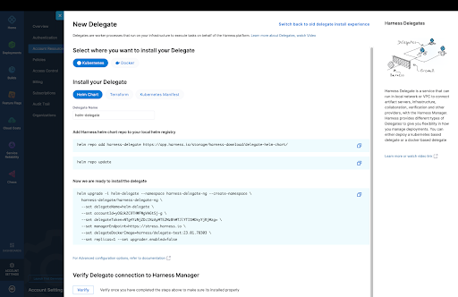
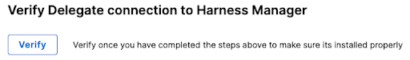

This document introduces the delegate installer and installation of Harness delegates in NextGen environments running Kubernetes or Docker. Like the installer, this document includes the workflow for delegate installation by Helm chart, Terraform Plan, and Kubernetes manifest or Docker.

The process of installing a delegate includes the following steps:

- Go to the **New Delegate** page
- Select an environment: Kubernetes or Docker
- Select the mode of installation: Helm chart, Terraform Plan, or Kubernetes manifest

# Go to the New Delegate page

You can install a delegate from the **New Delegate** installation page.

| 1 <p>Go to **Account Settings**</p> | 2 <p>Select **Account Resources**</p> | 3 <p>Choose **Delegates**</p> |
| :-: | :-: | :-: |
|  | ] |  |


In addition to providing basic information about installed delegates, the **Delegates** page gives you access to the delegate installer.


To install a delegate, click **+ New Delegate**.


The delegate installation process has changed. The installation process is entirely done from the **New Delegate** page.




If you prefer a more familiar installation process, click **Switch back to the old delegate install experience**.


Otherwise, continue with the following steps.

# Select an environment

Select your target environment: **Kubernetes** or **Docker**.


<Tabs
  defaultValue="kubernetes"
  values={[
    {label: 'Kubernetes', value: kubernetes},
    {label: 'Docker', value: docker},
  ]}>
  <TabItem value="kubernetes">Kubernetes</TabItem>
  <TabItem value="docker">Docker</TabItem>
  </Tabs>

## Kubernetes environment


In **Install your Delegate**, select **Helm Chart**, **Terraform**, or **Kubernetes Manifest**.

### Helm-based install on Kubernetes

Use the following steps to install a delegate on Kubernetes using a Helm chart.

On the **New Delegate** page, select **Kubernetes**, and then click **Helm Chart**.


#### Name the delegate

Before you install the delegate, accept or modify the default delegate name.


Delegates are identified by their names. Delegate names must be unique within a namespace and should be unique in your cluster. A valid name includes only lowercase letters and does not start or end with a number. The dash character (“-”) can be used as a separator between letters.

#### Add the repository

Add the Harness Helm chart repository to your local Helm registry. Use the following command:

```
helm repo add harness-delegate https://app.harness.io/storage/harness-download/delegate-helm-chart/
```

#### Update the repository

Use the following command to ensure you retrieve the latest version of the Harness Helm chart:

```
helm repo update
```

#### Install the delegate

Copy and paste the following instructions into your CLI. These instructions are modified based on your account settings and the configuration options selected above.

```
helm upgrade -i helm-delegate --namespace harness-delegate-ng --create-namespace \
  harness-delegate/harness-delegate-ng \
  --set delegateName=helm-delegate \
  --set accountId=yOGUkZC9THWFWgVA6tSj-g \
  --set delegateToken=NTg4YzNjZDc1NzAyMTE2MzBhMTJlYTI1MDkyYjRjMzg= \
  --set managerEndpoint=https://stress.harness.io \
  --set delegateDockerImage=harness/delegate-test:23.02.78306 \
  --set replicas=1 --set upgrader.enabled=false
```

[INSERT TABLE OF VALUES]

#### Verify the delegate connection

The delegate installation process ends in delegate registration with Harness Manager. The verification process confirms that the delegate is registered and that the delegate is sending “heartbeats” to Harness Manager. 

[INSERT HEARTBEAT]

To verify the delegate, click **Verify**.

### Terraform-based install on Kubernetes

Use the following steps to install a delegate on Kubernetes using a Terraform Plan.

On the **New Delegate** page, select **Kubernetes**, and then click **Terraform**.


#### Name the delegate

Before you install the delegate, accept or modify the default delegate name.


Delegates are identified by their names. Delegate names must be unique within a namespace and should be unique in your cluster. A valid name includes only lowercase letters and does not start or end with a number. The dash character (“-”) can be used as a separator between letters.

#### Create and apply the Terraform Plan

1. Copy the Terraform module definition code from the Create the main.tf file section.

2. Save the code in the main.tf file in some location.

3. Use the following instruction to initialize Terraform:

   ```
   terraform init
   ```

4. Apply the delegate module definition file:

   ```
   terraform apply
   ```
   
#### Verify the delegate connection

The delegate installation process ends in delegate registration with Harness Manager. The verification process confirms that the delegate is registered and that the delegate is sending “heartbeats” to Harness Manager. 


### Kubernetes-install on Kubernetes 


On the **New Delegate** page, select **Kubernetes**, and then click **Kubernetes Manifest**.


#### Name the delegate

Before you install the delegate, you must give it a name.


Delegates are identified by their names. Delegate names must be unique within a namespace and should be unique in your cluster. A valid name includes only lowercase letters and does not start or end with a number. The dash character (“-”) can be used as a separator between letters.

#### Download the delegate YAML

Use the following cURL instruction to download the Kubernetes YAML file to the target directory for installation:

```
curl -LO https://raw.githubusercontent.com/harness/delegate-kubernetes-manifest/main/harness-delegate.yaml
```

#### Modify the delegate YAML

Open the harness-delegate.yaml file. Find and specify the following placeholder values as described.

[insert value table]

#### Install the delegate

Use the `kubectl apply` command to apply the harness-delegate.yaml file.

```
$ kubectl apply -f harness-delegate.yml
```

#### Verify the delegate connection

The delegate installation process ends in delegate registration with Harness Manager. The verification process confirms that the delegate is registered and that the delegate is sending “heartbeats” to Harness Manager. 



To verify the delegate, click **Verify**.

### Docker environment

Use the following process to install a delegate on Docker.

On the **New Delegate** page, select **Docker**.

#### Name the delegate

Accept or change the default delegate name of `docker-delegate`.


Delegates are identified by their names. Delegate names must be unique within a namespace and should be unique in your cluster. A valid name includes only lowercase letters and does not start or end with a number. The dash character (“-”) can be used as a separator between letters.


#### Install the delegate

Use the `docker run` command to install the delegate with the specified parameters:

```
docker run --cpus=1 --memory=2g \
  -e DELEGATE_NAME=docker-delegate \
  -e NEXT_GEN="true" \
  -e DELEGATE_TYPE="DOCKER" \
  -e ACCOUNT_ID=XXXXXXXxxxxxxxxx \
  -e DELEGATE_TOKEN=XXXXXXXxxxxxxxxx \
  -e MANAGER_HOST_AND_PORT=https://myserver.io harness/new-delegate:23.02.78306
```

#### Verify the delegate connection

The delegate installation process ends in delegate registration with Harness Manager. The verification process confirms that the delegate is registered and that the delegate is sending “heartbeats” to Harness Manager. 


To verify the delegate, click **Verify**.


