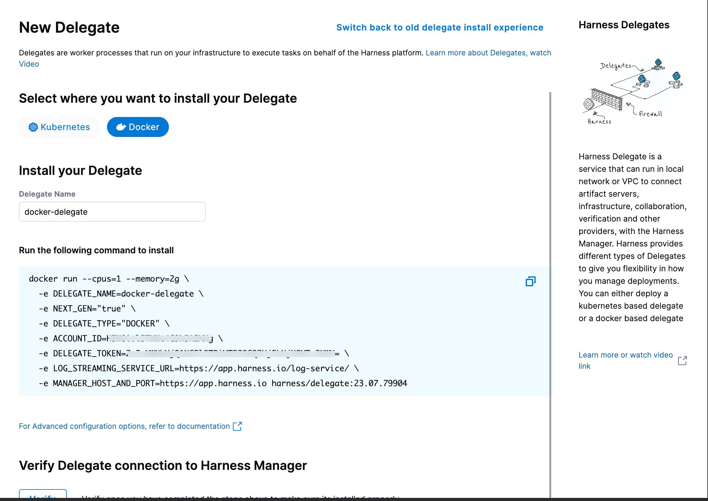

```mdx-code-block
import DelegateInstall from '/tutorials/platform/install-delegate.md';
import InitScript from './install-a-delegate-with-3-rd-party-tool-custom-binaries.md';
import CustomImage from './build-custom-delegate-images-with-third-party-tools.md';
```

## Install the default delegate

The inline tutorial below shows you how to install the default delegate for your Harness account. It can be either a Kubernetes delegate installed using a Helm chart, Terraform Helm Provider, and Kubernetes manifest or a Docker delegate using the `docker run` command. You can also review the tutorial directly [here](/tutorials/platform/install-delegate).

<details>
<summary>Install the default delegate on Kubernetes or Docker</summary>
<DelegateInstall />
</details>


The default delegate image, denoted by the `yy.mm.xxxxx` image tag, includes a set of pre-installed 3rd-party custom binaries for convenience. You can find the list of these binaries [here](/docs/platform/Delegates/delegate-concepts/delegate-image-types#third-party-tools-included-in-the-delegate-image-type). If you are concerned about the security vulnerabilities that potentially come with these pre-installed binaries, our recommendation is to use the minimal delegate noted below.

## Install minimal delegate with 3rd party custom binaries

The minimal delegate image, denoted by the `yy.mm.xxxxx.minimal` image tag, does not include any pre-installed 3rd-party custom binaries for ensuring the lowest footprint and hence lowest number of security vulnerabilities.

### Use INIT_SCRIPT

This option installs the 3rd party custom binaries on a delegate container instance without changing the delegate image itself. Below is an inline tutorial that shows you how to use this option. You can also review the tutorial directly [here](/docs/platform/2_Delegates/install-delegates/install-a-delegate-with-3-rd-party-tool-custom-binaries.md).

<details>
<summary>Use INIT_SCRIPT</summary>
<InitScript />
</details>

### Build a custom image

This option installs the 3rd party custom binaries on a new custom delegate image that uses the Harness minimal delegate image as its base image. Below is an inline tutorial that shows you how to use this option. You can also review the tutorial directly [here](/docs/platform/2_Delegates/install-delegates/build-custom-delegate-images-with-third-party-tools.md).

<details>
<summary>Build a custom image</summary>
<CustomImage />
</details>

## Configure options

### Network proxy

For network proxy details, go to [Configure delegate proxy settings](/docs/platform/2_Delegates/manage-delegates/configure-delegate-proxy-settings.md).

### CI-specific variables

For CI-specific variables, go to [Install the delegate](/docs/continuous-integration/use-ci/set-up-build-infrastructure/define-a-docker-build-infrastructure#install-the-delegate).

### Custom certificates

For custom certificates, go to [Install delegates with custom certificates](/docs/platform/2_Delegates/secure-delegates/install-delegates-with-custom-certs.md).

### Group names

The legacy delegate used `DELEGATE_GROUP_NAME` for group names. This environment is not valid in NextGen. Use `DELEGATE_NAME` for group names. 

## Additional installation approaches

### Install Docker delegate to Amazon ECS Fargate

You can install the Docker delegate into Amazon ECS Fargate. For more information, go to [Deploy a Docker delegate to Amazon ECS or AWS Fargate](/docs/platform/2_Delegates/install-delegates/docker-delegate-to-ecs-fargate.md).

### Install a legacy Kubernetes delegate

The legacy Kubernetes delegate, denoted `latest` container image tag, is used primarily in Harness FirstGen had the auto-upgrade setting ON by default and did not have the flexibility to turn OFF this setting if needed. This type of delegate is now deprecated for new Harness accounts. For more information, go to [Install a legacy Kubernetes delegate](/docs/platform/2_Delegates/install-delegates/install-a-kubernetes-delegate.md).

### Install Docker delegate using Podman

You can install the Docker delegate using Podman by adding Podman commands to your Dockerfile. 

To install the Docker delegate using Podman, do the following:

1. In Harness, select **Deployments**, then select your project.
2. Select **Delegates** under **Project Setup**.
3. Select **Install a Delegate** to open the **New Delegate** dialog.

   

4. Select **Docker** under **Select where you want to install your Delegate**.

5. Copy the Docker installation command.

6. Paste the Docker installation command from the UI in your CLI, and replace the `docker run` command with the `podman run` command below.

   ```bash
   podman run --restart=always --hostname="$(hostname -f)"
   -e DELEGATE_NAME=docker-delegate \
   -e NEXT_GEN="true" \
   -e DELEGATE_TYPE="DOCKER" \
   -e ACCOUNT_ID=<ACCOUNT_ID_COPIED_FROM_THE_UI_COMMAND> \
   -e DELEGATE_TOKEN=<DELEGATE_TOKEN_COPIED_FROM_THE_UI_COMMAND>= \
   -e LOG_STREAMING_SERVICE_URL=https://app.harness.io/log-service/ \
   -e MANAGER_HOST_AND_PORT=https://app.harness.io harness/delegate:23.07.79904 
   ```

7. Run the command.
