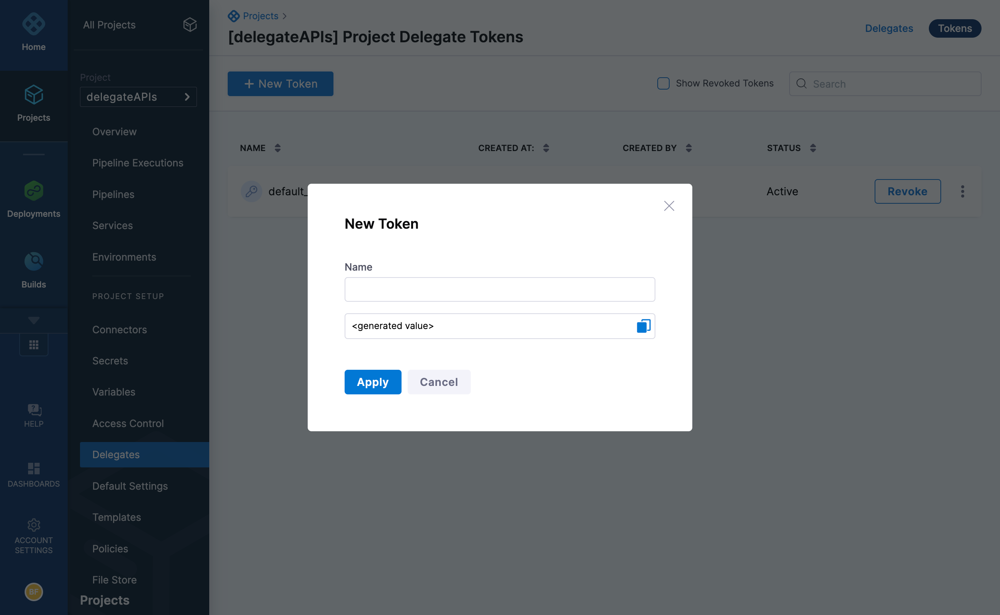
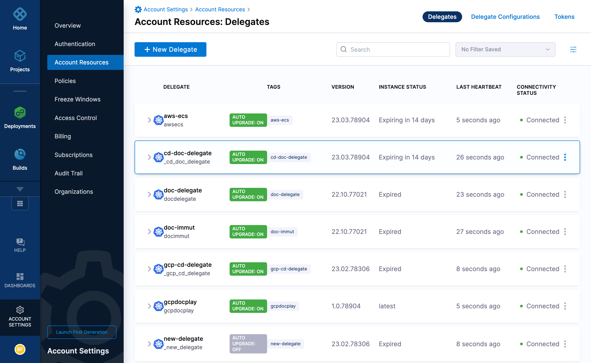
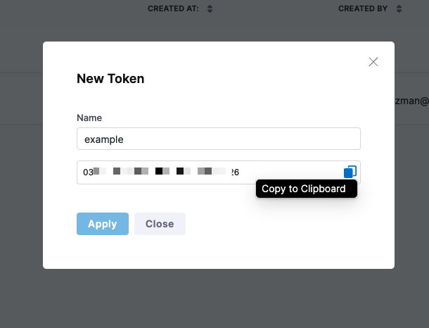
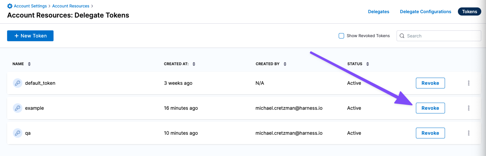

Harness uses delegate tokens to encrypt communication between Harness Delegates and the Harness Manager. By default, when a new Harness account is created, all Harness Delegates in that account include the same token.

You can further secure delegate-to-Harness communication by replacing the default delegate token with new tokens. You can add and revoke delegate tokens per your governance policies and replace revoked tokens with custom tokens when needed. You can also rotate your tokens and store them in a secret manager.

## Generate a new token

You can generate a new token when you create a delegate or as a separate process.

### Generate a token when creating a delegate

When you create a new delegate, you can generate a new token.

To generate a new token, do the following:

1. In Harness, select **Delegates**, then select **Tokens**.
2. Select **New Token**.

   

3. Enter a name for the new token, and then select **Apply**.

   The new token is created and its value is copied to your system clipboard. The new token also appears in the list using the name you gave it.

2. Save the new token value. You cannot retrieve the token value after this.

   Now you can update the delegate(s) with the new token.

3. In **Delegate Tokens**, select the new token.

### Generate a token without creating a delegate

You can also generate a new token without creating a new delegate.

To generate a new token, do the following:

1. In Harness, select **Project Setup > Delegates** in a project or **Account Settings > Account Resources > Delegates** for the entire account.

   Here's an Account Settings example:

   

2. Select **Tokens**. Here you can view, create, and revoke all delegate tokens.

3. Select **New Token**.

4. Enter a name for the new token, and then select **Apply**.

   You can copy the token and save it somewhere safe, if needed.

   

   The new token is created and its value is copied to your system clipboard. The new token also appears in the list using the name you gave it.

5. Save the new token value. You cannot retrieve the token value after this.

   When you install a new delegate, you can select the token to use.

## Option: Update and restart existing delegate

You can update an existing delegate with a new token value and then restart the delegate.

### Kubernetes delegate

The Kubernetes delegate is set up using the `harness-delegate.yaml` file you downloaded originally.

To update and restart an existing Kubernetes delegate, do the following:

1. Edit the `harness-delegate.yaml` file you downloaded originally with the new token and then run `kubectl apply -f harness-delegate.yaml` to restart the delegate pods.

2. Paste the token into the delegate `spec` of the `Secret`, in the `UPGRADER_TOKEN` field. 

   ```yaml
   ...  
   ---  
     
   apiVersion: v1
   kind: Secret
   ...
   type: Opaque
   data:
     UPGRADER_TOKEN: "[enter new token here]"
   ...
   ```

3. Run `kubectl apply -f harness-delegate.yaml`.

   The delegate pods restart automatically with the updated settings.

### Docker delegate

You destroy and recreate the Docker container using the `docker-compose.yaml` file you downloaded originally.

To update and restart an existing Docker delegate, do the following:

1. Paste the token in the delegate settings:

   ```yaml
   version: "3.7"  
   services:  
     harness-ng-delegate:  
       restart: unless-stopped  
       deploy:  
         resources:  
           limits:  
             cpus: "0.5"  
             memory: 2048M  
       image: harness/delegate:23.01.78102  
       environment:  
         - ACCOUNT_ID=12345678910  
         - ACCOUNT_SECRET=[enter new token here]  
         - MANAGER_HOST_AND_PORT=https://app.harness.io  
         - WATCHER_STORAGE_URL=https://app.harness.io/public/pro  
   ...
   ```

2. Create a new container: `docker-compose -f docker-compose.yaml up -d`.

   You can verify that the environment variable has the new token using `docker exec [container ID] env`.

## Option: Revoke tokens

Harness loads tokens during the delegate startup process as part of the connection heartbeat. When you change the delegate token, you must restart the delegate cycle process.

Delegates are immediately disconnected when you revoke a token. Harness sends `SELF_DESTRUCT` to all delegates using the revoked token.

To revoke tokens, do the following:

1. On the **Tokens** page, select **Revoke** to revoke any token.

   

2. Select **Revoke**. The token is revoked. The Harness Manager will not accept connections from any delegates using this revoked token.

## Option: Rotate tokens

You can rotate and store your delegate tokens in a third-party secret manager and reference them as needed.

:::info note
If you rotate your delegate tokens, you must redeploy the delegate.
:::

To rotate your tokens, do the following:

1. Create your delegate token through the [API](https://apidocs.harness.io/tag/Delegate-Token-Resource#operation/createDelegateToken). The delegate token API returns the token value.
2. Add the delegate token to a secret manager, such as HashiCorp Vault.
3. When you deploy the delegate pod, reference the delegate token from the secret manager.

   For example, to reference the delegate token stored in the HashiCorp Vault, do the following:

   * Add the below annotations in the [delegate Helm chart](https://github.com/harness/delegate-helm-chart):

      ```yaml
      vault.hashicorp.com/agent-inject: true
                    vault.hashicorp.com/agent-inject-secret-secret1: <delegate_token> //delegate token referenced in hashicorp vault
                    vault.hashicorp.com/agent-inject-status: injected
                    vault.hashicorp.com/agent-inject-template-secret1:
                      {{ with secret "<delegate_token>" }}                           //delegate token referenced in hashicorp vault
                      export DELEGATE_TOKEN="{{ .Data.data.DELEGATE_TOKEN }}"
                      {{ end }}
                    vault.hashicorp.com/auth-config-type: iam
                    vault.hashicorp.com/role: qa-cloudtrust-infrastructure
      ```

   :::info note
   This example shows how to use HashiCorp Vault. Other secret managers require different setup steps and Helm chart annotations.
   :::
