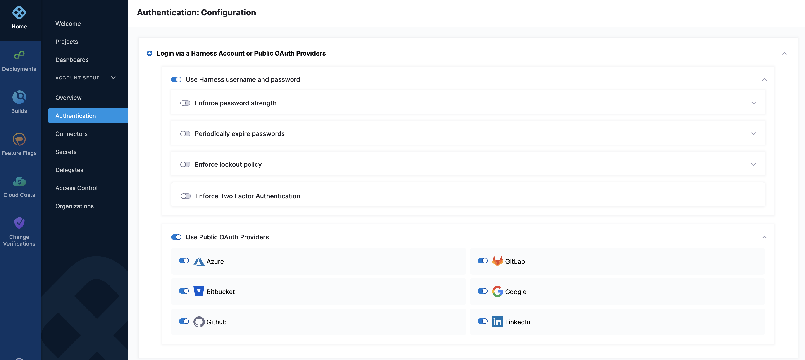
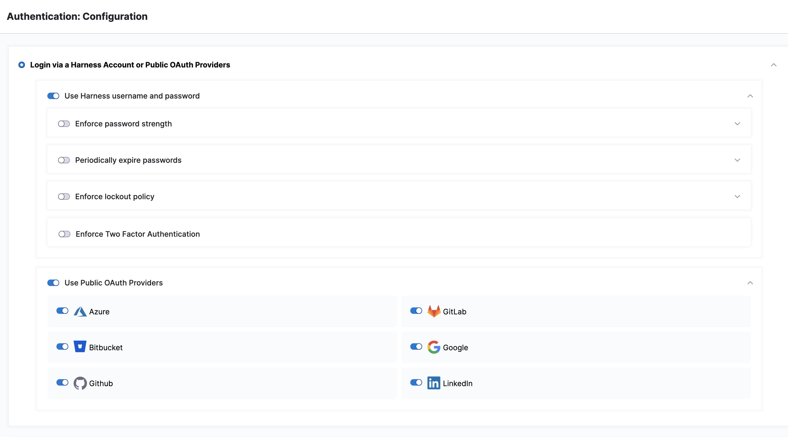
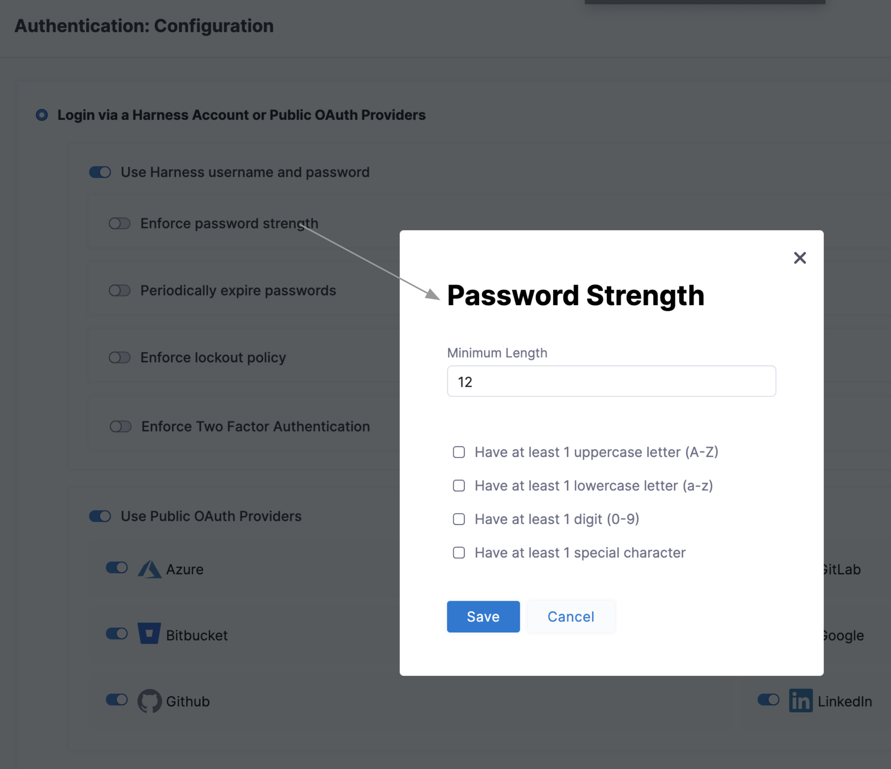
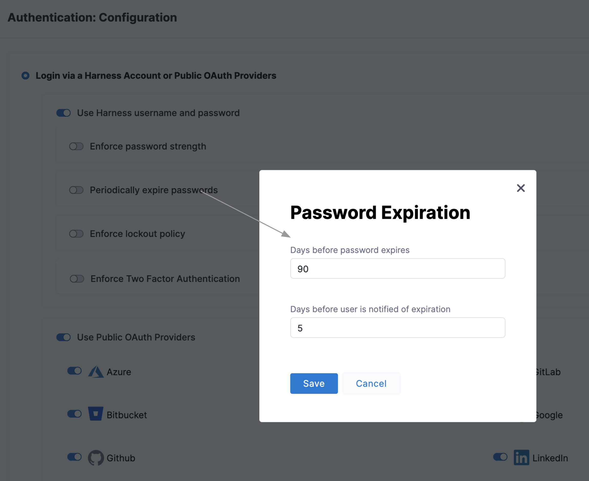
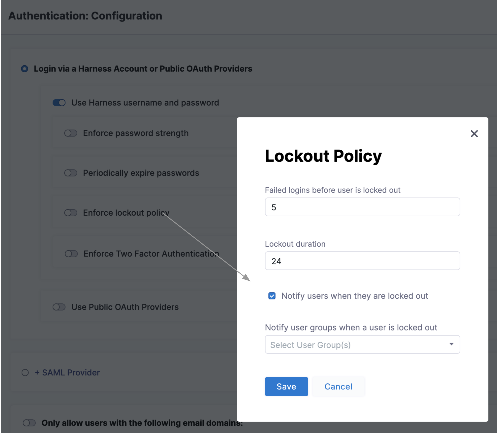
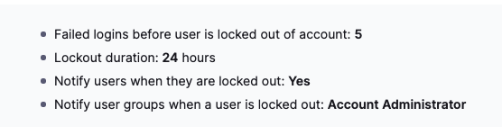
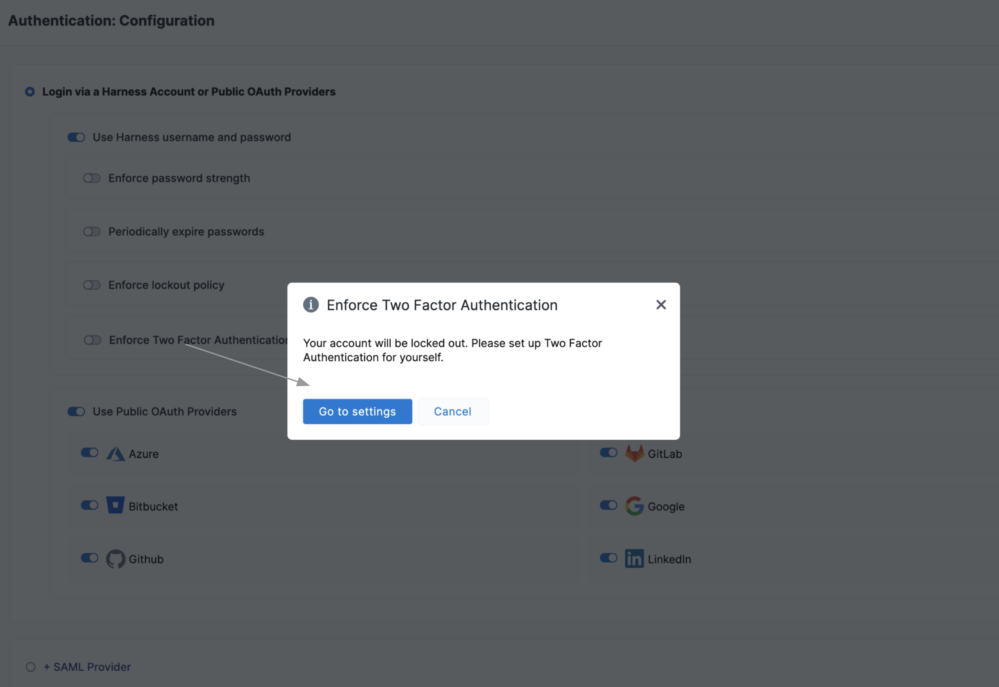
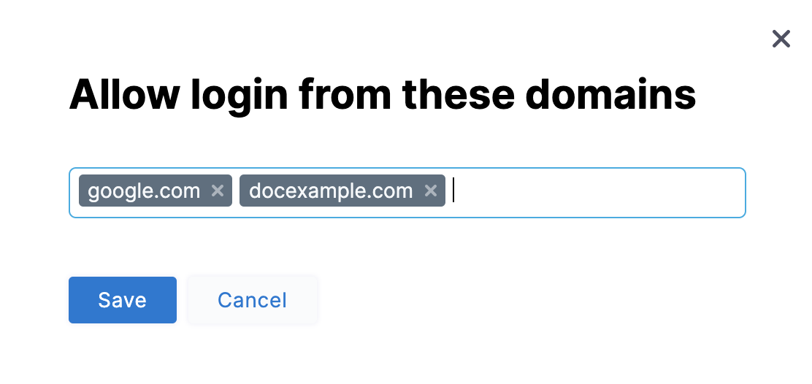
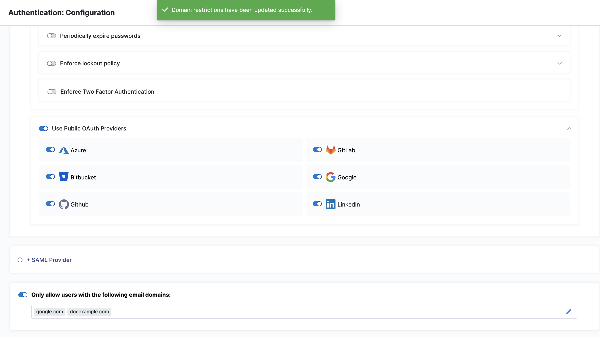
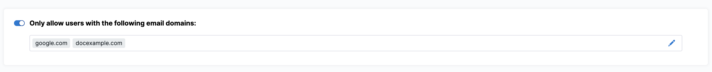

This topic provides an overview of Authentication in Harness. It describes various ways to authenticate users.

### Before you begin

* Make sure you have permissions to **Create/Edit, Delete** Authentication Settings.

### Review: Authentication Settings

Harness Access control includes:

* Authentication — This checks who the user is.
* Authorization — This checks what the user can do.
* Auditing — This logs what the user does.

This topic focuses on Authentication. For more on Authorization, see [Access Management (RBAC) Overview](../4_Role-Based-Access-Control/1-rbac-in-harness.md).

Users in Administrator groups can use Authentication Settings to restrict access to an organization's Harness account. The options you choose will apply to all your account's users. These options include:

* [Enable Public OAuth Providers](#enable-public-oauth-providers)
* [Enable SAML Providers](#enable-security-assertion-markup-language-saml-providers)
* [Enforce Password Policies](#enforce-password-policies)
  * [Enforce Password Strength](#enforce-password-strength)
  * [Enforce Password Expiration](#enforce-password-expiration)
  * [Enforce Lockout After Failed Logins](#enforce-lockout-after-failed-logins)
* [Enforce Two Factor Authentication](#enforce-two-factor-authentication)
* [Restrict Email Domains](#restrict-email-domains)

### Configure Authentication

* In **Home**, Click **Authentication** under **ACCOUNT SETUP.**
* The **Authentication: Configuration** page appears.
* You can choose one of the below as the default Authentication method:
	+ Login via a Harness Account or Public OAuth Providers
	+ SAML Provider
	
#### Enable Public OAuth Providers

In the **Use Public OAuth Providers** section, you can enable Harness logins via a range of single sign-on mechanisms. Enable this slider to expose sliders for enabling individual OAuth partners.  
For more on OAuth Providers, see [Single Sign-On with OAuth](../3_Authentication/4-single-sign-on-sso-with-oauth.md).
#### Enable Security Assertion Markup Language (SAML) Providers

Select **SAML Provider** to enable a SAML Provider. To do this, you should first disable any configured public OAuth providers.  
For more on adding a SAML Provider, see [Single Sign-On with SAML](../3_Authentication/3-single-sign-on-saml.md).

### Enforce Password Policies

You'll see specific controls to govern the following password requirements:
	+ Enforce password strength
	+ Periodically expire passwords
	+ Enforce Two Factor Authentication
	
#### Enforce Password Strength

Select **Enforce password strength** to open the dialog shown below.
* Here you can specify and enforce any or all of the below options:
	+ Minimum password length.
	+ Include at least one uppercase letter.
	+ Include at least one lowercase letter.
	+ Include at least one digit.
	+ Include at least one special character.

If you enforce **Have at least one special character**, each password must include one (or more) of the following characters: `~!@#$%^&*_-+=`|\(){}[]:;"'&lt;this-tag&gt;,.?/`

#### Enforce Password Expiration

Select **Periodically expire passwords** to set an interval at which users must refresh their Harness passwords. In the same dialog, you can also set an advance notification interval.

#### Enforce Lockout After Failed Logins

Select **Enforce lockout policy** to open the dialog shown below. It offers independent controls over the lockout trigger (how many failed logins), lockout time (in days), and notifications to locked-out users and to Harness user groups.

You can see a summary on the main Authentication page:

### Enforce Two Factor Authentication

Select **Enforce Two Factor Authentication** to enforce 2FA for all users in Harness. This option will govern all logins — whether through SSO providers or Harness username/password combinations. For more information on Two-Factor Authentication see [Two-Factor Authentication](../3_Authentication/2-two-factor-authentication.md).

### Set Up Vanity URL

You can access `app.harness.io` using your own unique subdomain URL.

The subdomain URL will be in the following format, with `{company}` being the name of your account:

 `https://{company}.harness.io`

Contact [Harness Support](mailto:support@harness.io) to set up your Account's subdomain URL. The subdomain URL cannot be changed later.Harness automatically detects your Account ID from the subdomain URL and redirects you to the Account's login mechanism.

### Restrict Email Domains

Select **Only allow users with the following email domains:** to allow (whitelist) only certain domains as usable in login credentials. In the dialog shown below, build your allowlist by simply typing your chosen domains into the **Domains** multi-select field.

Click **Save**. You can see the success message - **Domain restrictions have been updated successfully** displayed on top of the page and the domains you have whitelisted in the panel.

Your resulting allowlist will impose a further filter on logins to Harness via both SSO providers and Harness username/passwords.You can modify your domain selections by clicking the Edit icon.

