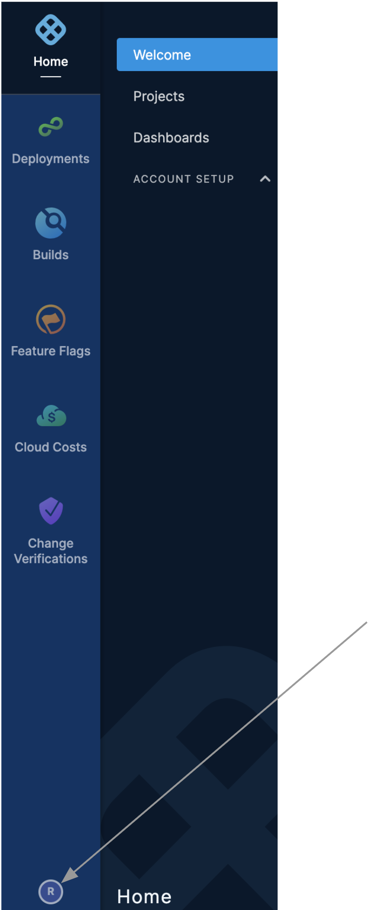
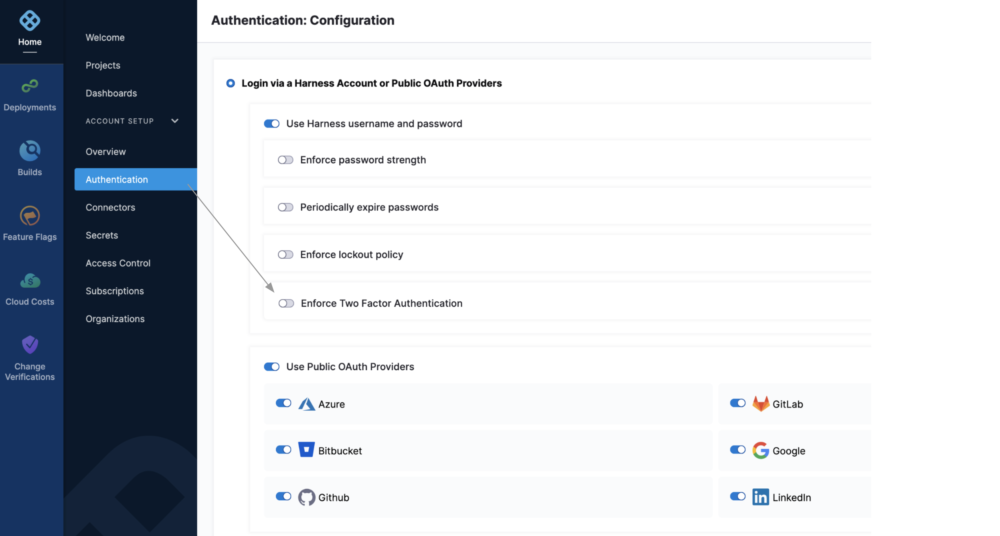
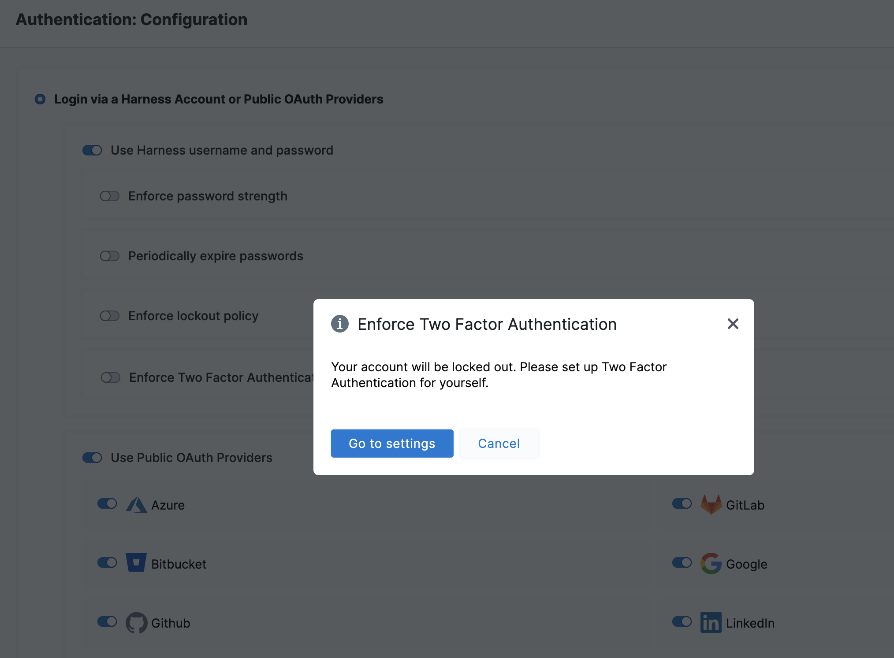
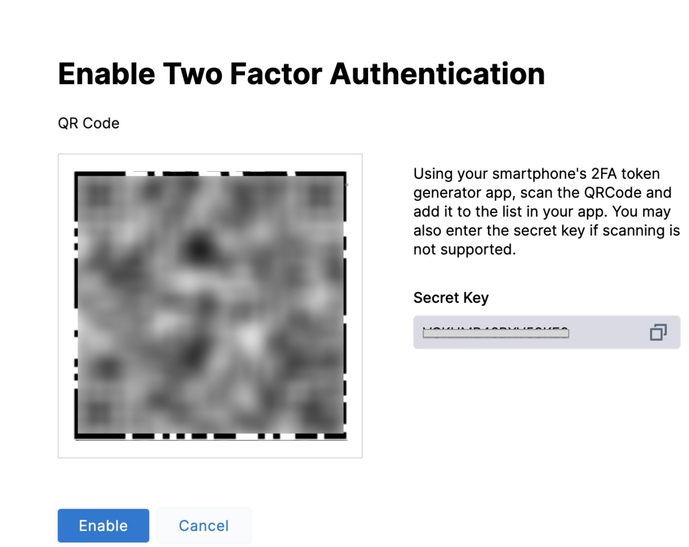
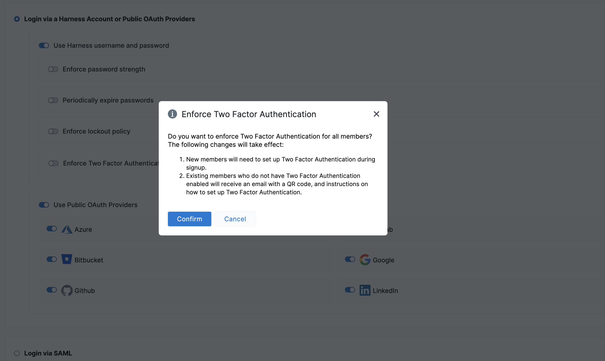

You can add an extra layer of security by using a 2-step-verification, also known as Two-Factor Authentication (2FA). 

This document explains the basic steps to set up Two-Factor Authentication in Harness.

### Before you begin

* Make sure you have permissions to **Create/Edit, Delete** Authentication Settings.

### Set Up Two-Factor Authentication

You can manage Two-Factor Authentication (2FA) in two ways:

* **Individual user:** you can set up 2FA for your own **User Profile** without impacting other user accounts.
* **All account users:** if you have **Create/Edit** permissions for Authentication Settings, you can enforce 2FA for all users in Harness. First, you set up 2FA for your own account, and then you can enforce 2FA account-wide in the Harness account's **Login Settings**.

:::note
If 2FA is disabled at the account level, you can still enable 2FA for your user account. If 2FA is enabled account-wide, you cannot turn it off for your user account.When you enforce 2FA, users receive an email where they can scan a QR Code using their smartphones and a token generator app. The next time they log in with their username and password, they are prompted to use 2FA to complete the log in.

:::

### Set Up Two-Factor Authentication For Your Profile

1. Click on your **User Profile** icon at the bottom-left corner to go to the Profile page.

2. The Profile page appears.
3. Toggle the **Two-Factor Authentication** indicator. The **Enable Two-Factor Authentication** page appears.
4. Using your smartphone's 2FA token generator app, such as Google Authenticator, scan the QR Code and add it to the list in your app.  
You can now see **Harness-Inc** in your 2FA token generator app, which provides authentication codes.  
2FA token generator apps also include a method for adding a site using a Secret Key in cases where you cannot scan the QR Code. The 2FA dialog includes a Secret Key for those cases.
5. Click **Enable**. The next time you log in by entering your username and password, you are prompted to provide the 2FA authentication code.
6. Obtain the code from your 2FA token generator app, and enter it. You can then log into your Harness account.

### Set Up Account-Wide Two-Factor Authentication

Once you have set up 2FA for your account, you can enforce it for all users and groups in the account. When 2FA is enforced, account users will experience the following changes:

* **New members** will need to set up 2FA during signup.
* **Existing members** who do not have 2FA enabled will receive an email with a QR Code, and instructions on how to set up 2FA.

To require that all account users and groups use 2FA, do the following:

1. Enable 2FA for your account as described in [Set Up Two-Factor Authentication for Your Profile](#set-up-two-factor-authentication-for-your-profile).
   
2. Select **ACCOUNT SETUP** > **Authentication**. The **Authentication: Configuration** page appears.  
   
   

3. Slide the **Enforce Two Factor Authentication** setting on.
  
   If you have not yet [set up 2FA for your own profile](#set-up-two-factor-authentication-for-your-profile), this prompt reminds you to protect your own login before proceeding:

   

4. Click **Go to settings** to display a QR Code and secret key that you can store to make sure your own ability to log in:  

5. Return to **ACCOUNT SETUP** > **Authentication** to enable account-wide, two-factor authentication.
6. Slide the **Enforce Two Factor Authentication** setting on. This prompt asks for a confirmation to enable 2FA for all the users:  
   
   

7. Click **Confirm**.

