Harness supports Single Sign-On (SSO) with SAML, integrating with your SAML SSO provider to enable you to log your users into Harness as part of your SSO infrastructure. This document explains how to set up SAML authentication.

:::note
If the [Harness Self-Managed Enterprise Edition](https://docs.harness.io/article/tb4e039h8x-harness-on-premise-overview) version is not accessed using the HTTPS load balancer, SAML authentication will fail. Make sure you access the Harness Self-Managed Enterprise Edition version using an HTTPS load balancer, and not an HTTP load balancer.
:::

### Support Formats

The XML SAML file used with Harness must use UTF-8.

UTF-8 BOM is not supported. Some text editors like Notepad++ save in UTF-8 BOM by default.

### SAML SSO With Harness Overview

To set up SAML SSO with Harness, you add a SAML SSO provider to your Harness account and enable it as the default authentication method.

Harness SAML SSO involves the following:

* **Harness User email addresses** - Users are invited to Harness using their email addresses. Once they log into Harness, their email addresses are registered with Harness as Harness Users. To use SAML SSO, Harness Users must use the same email addresses to register in Harness and the SAML provider.

:::note
Ensure that you have at least two corresponding user accounts when setting up and testing SAML SSO in Harness. This allows you to set up the account with a Harness Administrator account and test it with a Harness user account.
:::

* **SAML provider user email addresses** - To use the SAML provider to verify Harness Users, the email addresses used in the SAML provider must match the email addresses for the registered Harness Users you want to verify.
* **Harness SAML Endpoint URL** - This URL is where the SAML provider will post the SAML authentication response to your Harness account. This URL is provided by Harness in the **Single Sign-On (SSO) Provider** dialog. You enter this URL in your SAML SSO provider app to integrate it with Harness.
* **SAML metadata file** - This file is provided by your SAML provider app. You upload this file into the Harness **Single Sign-On (SSO) Provider** dialog to integrate the app with Harness.

### SAML SSO With Okta

To set up Harness with Okta as a SAML SSO provider, you exchange the necessary information between your Okta app and Harness.

:::note
Users are not created as part of the SAML SSO integration. Users are invited to Harness using their email addresses. Once they log into Harness, their email addresses are registered as Harness Users. For more information, see [SAML SSO with Harness Overview](#saml-sso-with-harness-overview).
:::

This section describes the steps you must perform to use an Okta app for Harness SAML SSO:

#### Okta User Accounts

To set up a SAML support in your Okta Harness app, ensure that the app has corresponding Users in Harness:

1. In Harness, add the users you want to set up for SAML SSO by inviting them to Harness using the same email addresses that they use in your SAML provider.
2. In Okta, assign them to your SAML provider app.

:::tip
The only user property that must match between a Harness User and its corresponding SAML provider user account is its **email address**. 
Sometimes users might have mixed case email addresses in Okta. In these situations, Harness converts the email address to lowercase when adding them to Harness.
:::

#### Create App Integration in Okta

1. Log in to your Okta administrator account and click **Applications**.
2. Click **Create App Integration**.
   
   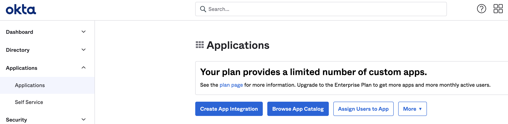

3. The **Create a new app integration** dialogue appears. Select **SAML 2.0** and click **Next**.
   
   

4. In **General Settings**, enter a name in the **Application label** field, and click **Next**.
   
   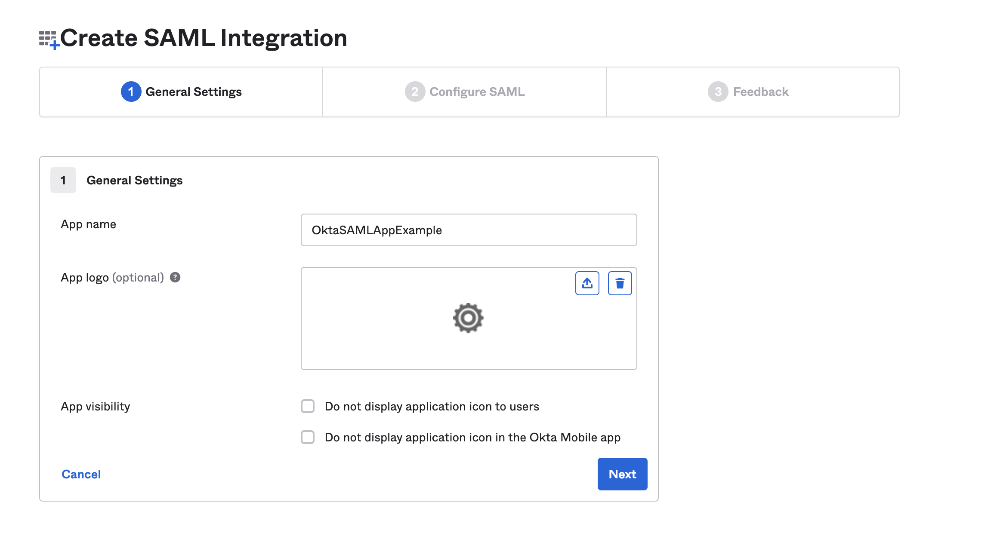

5. You are redirected to the **Configure SAML** tab. Copy the SAML Endpoint URL from Harness and paste it into **Single sign on URL**. To get this URL from Harness, perform the following steps:
	1. Login to Harness.
	2. In **Home**, click **Authentication** under **ACCOUNT SETUP**. The **Authentication: Configuration** page appears.
	3. Select **+SAML Provider**. The **Add SAML Provider** dialog appears.
	4. Enter a name for your SAML Provider in the **Name** field.
	5. Under **Select a SAML Provider**, select the SAML Provider you want to set up (in this case **Okta**).
       
	   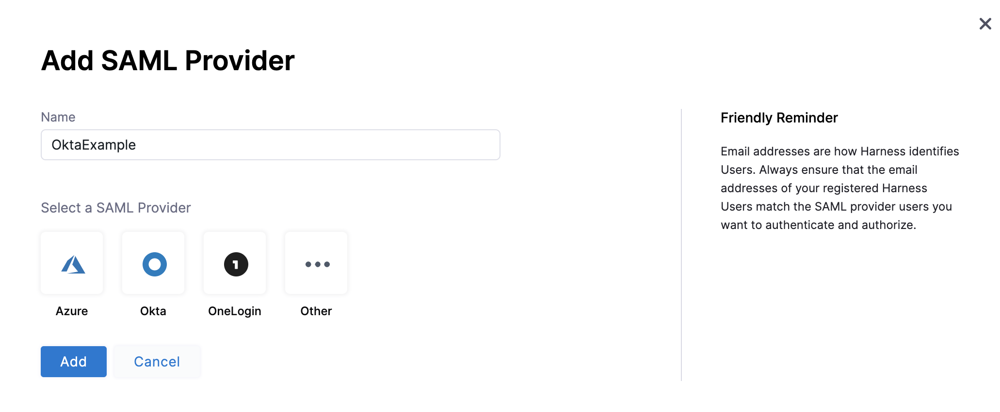

	6. Once you do this, you can see additional controls to set up the SAML Provider.
   
       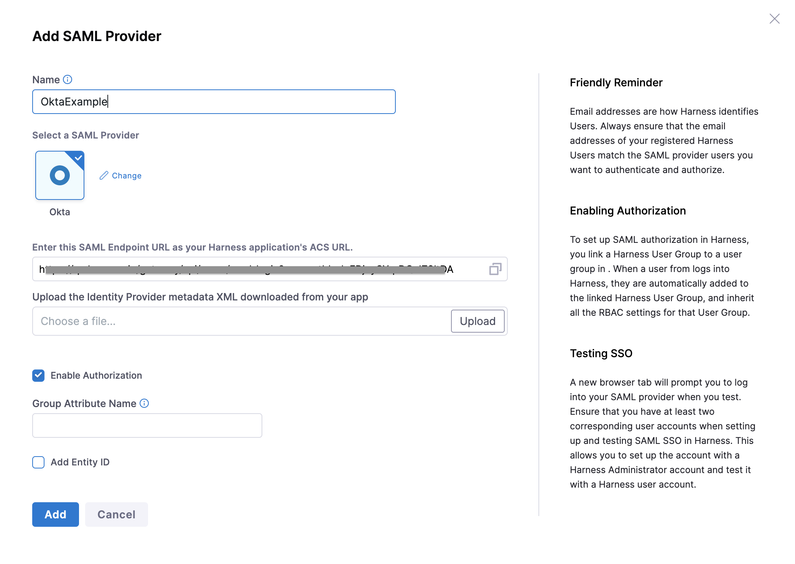

	7. Copy the Endpoint URL under **Enter the SAML Endpoint URL as your Harness application's ACS URL** and paste it in **Single sign on URL** in your Okta SAML provider app's **Configure SAML** tab.
       
	   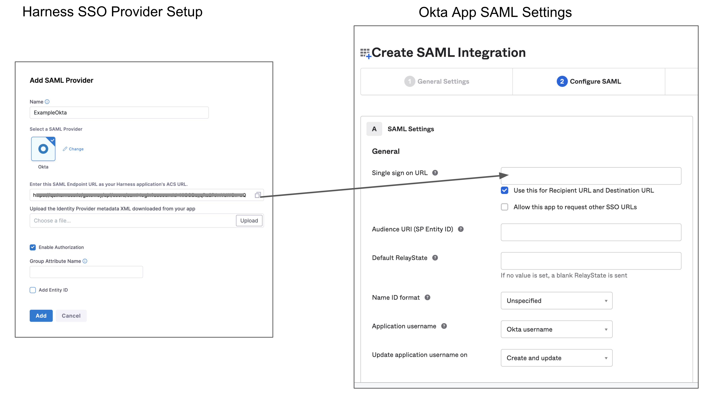

6. In **Audience URI (SP Entity ID)**, enter **app.harness.io**. The SAML application identifier should be always `app.harness.io`.
7. In **Default RelayState**, enter a valid URL. This is the page where users land after a successful sign-in using SAML into the SP.
8. In **Name ID format**, enter the username format you are sending in the SAML Response. The default format is **Unspecified**.
9.  In **Application username**, enter the default value to use for the username with the application.
10.  In **Attribute Statements (optional)**, enter name in the **Name** field, select **Name Format** as **Basic,** and select the **Value** as **user.email**.  
When you create a new SAML integration or modify an existing one, you can define custom attribute statements. These statements are inserted into the SAML assertions shared with your app. For more information, see [Define Attribute Statements](https://help.okta.com/oie/en-us/Content/Topics/Apps/Apps_App_Integration_Wizard_SAML.htm#).
11. In **Group Attribute Statements (optional)**, enter a name in the **Name** field, select **Name format (optional)** as **Basic**, select an appropriate **Filter** and enter its value.  
If your Okta org uses groups to categorize users, you can add group attribute statements to the SAML assertion shared with your app. For more information, see [Define Group Attribute Statements](https://help.okta.com/oie/en-us/Content/Topics/Apps/Apps_App_Integration_Wizard_SAML.htm#).

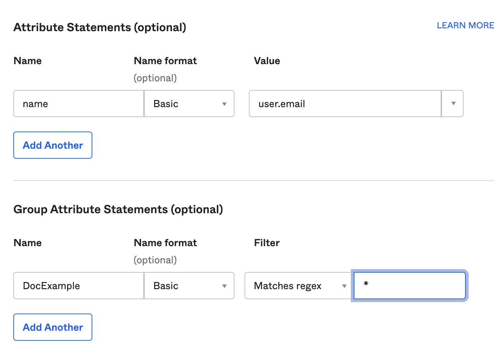

12. Click **Next** and then click **Finish.**

#### Okta SAML Metadata File

You must download the **Identity Provider metadata** XML from your Okta app and upload the file into Harness. To do this perform the following steps:

1. In the Harness Okta app that you just created, click the **Sign On** tab, and then click **Edit**.
2. Click on **Actions** to download the SAML metadata file from your Okta provider app.
   
   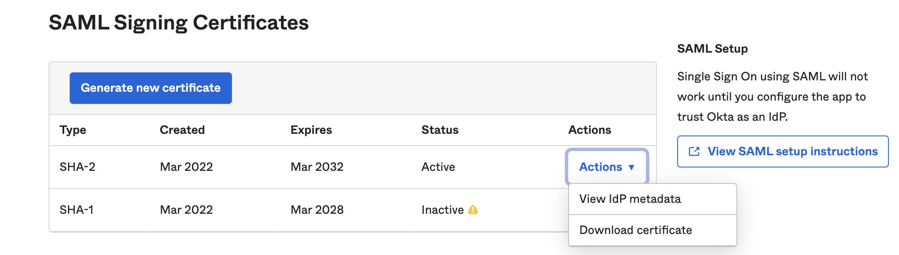

3. In Harness' **Add SAML Provider** dialog, under **Upload the Identity Provider metadata XML, downloaded from your Okta app**, click **Choose File**, and add the SAML metadata file you downloaded from your Okta application.
4. Uncheck **Enable Authorization**.
5. Select **Add Entity ID** and enter your custom Entity ID. The default Entity ID is **app.harness.io**. The value you enter here will override the default Entity ID.
6. Click **Add**. The new SSO provider is displayed under **Login via SAML**.
   
   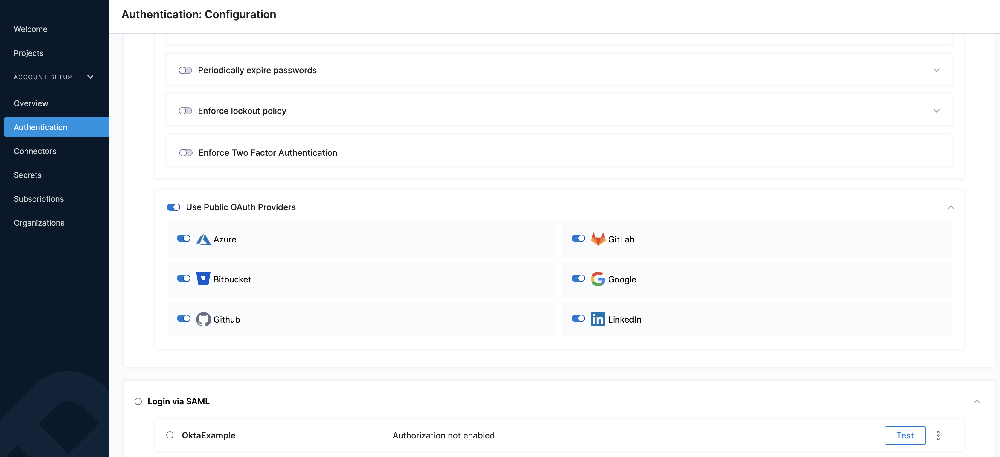

#### Enable and Test SSO with Okta

Now that Okta is set up in Harness as a SAML SSO provider, you can enable and test it.

1. To enable the SSO provider, select **Login via SAML**.
2. In the resulting **Enable SAML Provider** dialog, click **TEST** to verify the SAML connection you've configured.
   
   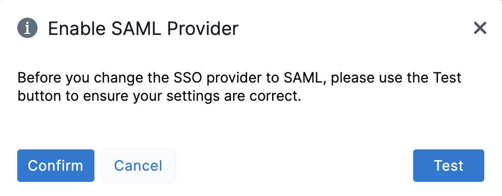

   A new browser tab will prompt you to log into your SAML provider (in this case **Okta**).

3. Upon a successful test, Harness will display the **SAML test successful** banner on top.
   
   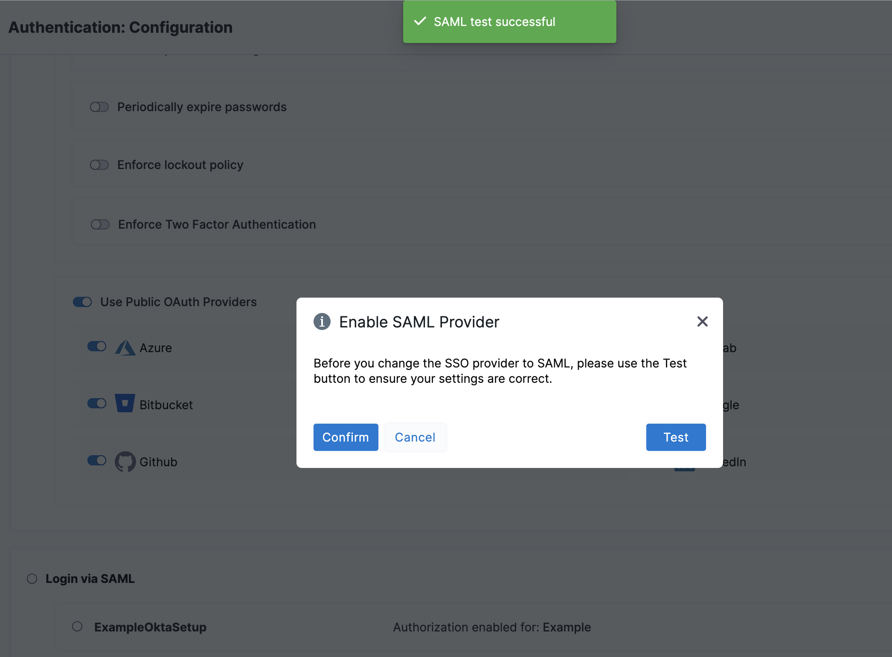

4. Click **CONFIRM** to enable SAML SSO in Harness.

:::warning
If you are locked out of Harness because of an SSO issue, you can log into Harness using the [Harness Local Login](#harness-local-login).
:::

5. To fully test SSO, log into Harness using another User account. Login using a Chrome Incognito window to test SSO so that you can disable SSO in your Harness Administrator account if there are any errors.
6. Open an Incognito window in Chrome.
7. Log into Harness using a Harness User account that has a corresponding user account email address in the SAML SSO provider. You will be redirected to your SAML SSO provider's login page.
8. Log into your SSO Provider using an email address for a Harness User. The password does not have to be the same.  
You are automatically returned to the Harness Manager, and logged into the dashboard using your SSO credentials.

#### SAML Authorization with Okta

Once you have enabled Harness SSO with your Okta app, you can set up and enable SAML authorization in Harness using Okta.

To set up SAML authorization in Harness, link a Harness User Group to a user group in Okta. When a user from Okta logs into Harness, they are automatically added to the linked Harness User Group and inherit all the RBAC settings for that User Group.

There are two Okta components you need to set up SAML authorization in Harness:

* **Group Name** - The name of the Okta group containing the users you want to authorize in Harness. The email addresses registered in this group must be the same as the email addresses these users have registered in Harness.
* **Group Attribute Name** - The Group Attribute Name associated with the Okta app you use for authentication. The Group Attribute Name is different from the Okta group name. Your company might have many groups set up in Okta. The Group Attribute Name is used to filter groups.

In Harness, you will enter the Group Attribute Name in the SAML SSO provider settings, and then you will enter the group name in the Harness User Group to link it to the Okta group.

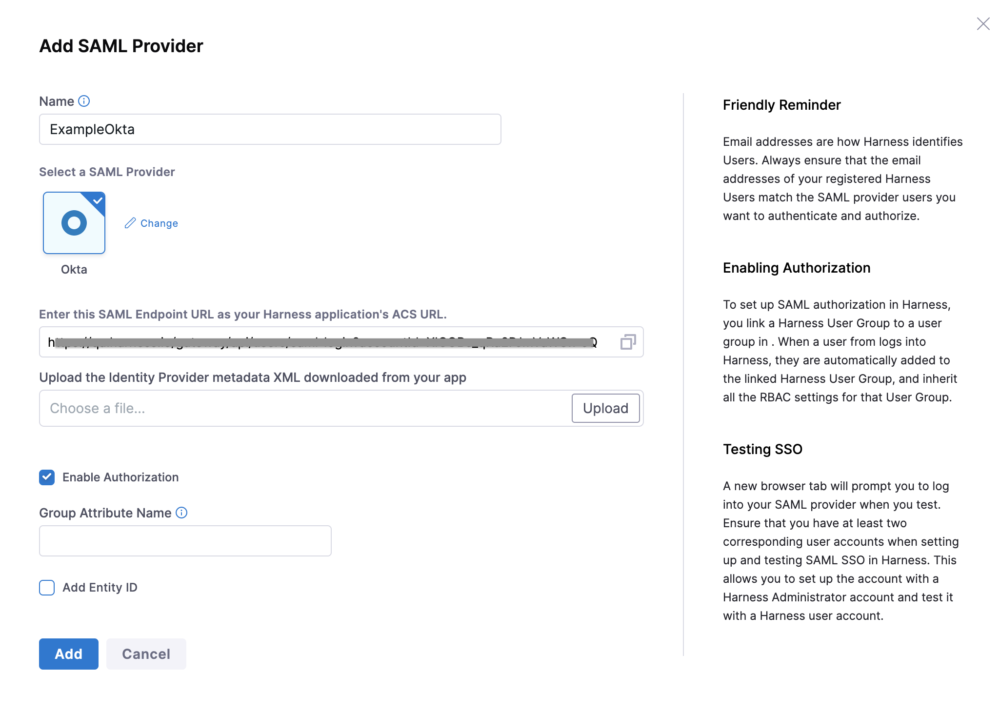

:::note
Remember that email addresses are how Harness identifies Users. Always ensure that the email addresses of your registered Harness Users match the Okta users you want to authenticate and authorize.
:::

To set up SAML Authorization with Okta, do the following:

1. Set up SAML SSO in Harness as described in [SAML SSO with Okta](#saml-sso-with-okta).  
You will be authorizing the same Harness Users that are authenticated using your SAML provider, so ensure that the email addresses registered in Harness are the same email addresses registered in your SAML provider.
2. Add a user group to your SAML provider, and then add users to the group. The group name will be used to link the Harness User Group later. To do this perform the following steps:
	1. Log in to Okta using Admin Account.
	2. Click **Groups**, under **Directory**. Click **Add Group**. The **Add Group** dialog appears.
       
	   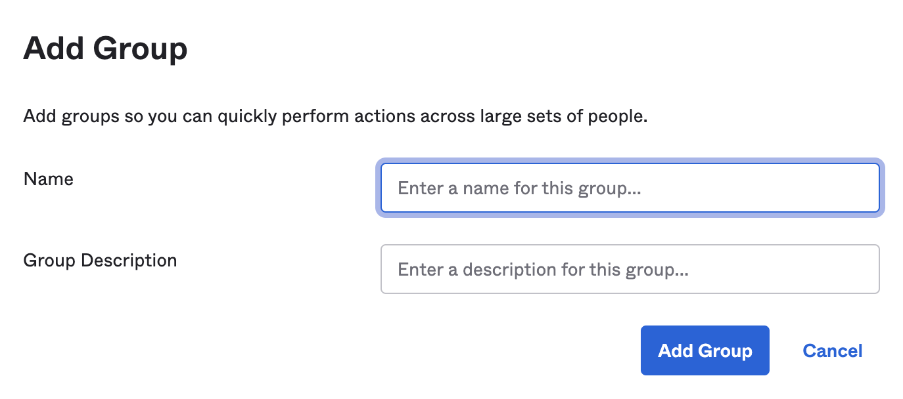

	3. Enter a **Name** and **Group Description** for your group. Click **Add Group**.
	4. You are redirected to the **Groups** page. Search for the group you created and click on it.
	5. Click **Manage People**. Find and add members to your group.
       
	   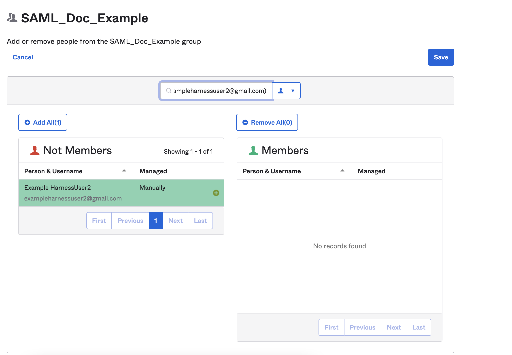

	After adding the members to the group we just created, the screen would look like this:
	
	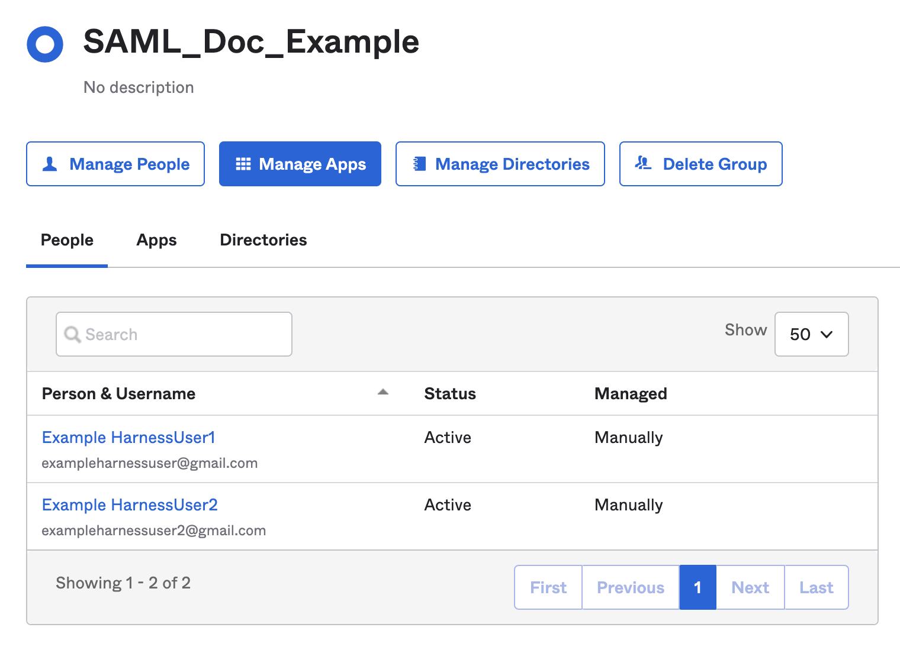

	Both members are already registered in Harness using the same email addresses in both Harness and the SAML provider.
3. Ensure that the SAML provider group is assigned to the same SAML provider app you use for Harness SAML SSO. To do this:
	1. In the Okta app, Click on **Groups**, under **Directory**.
	2. Find and select the group that you just created.
	3. Click **Manage Apps**.
       
	   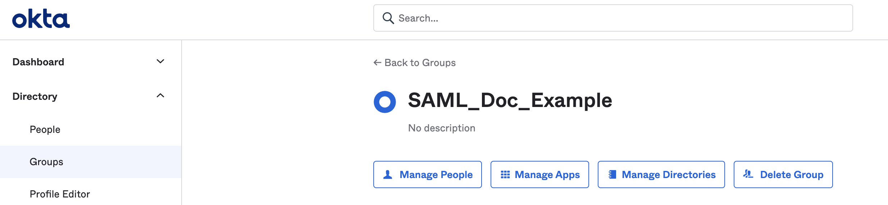

	4. In the subsequent screen, find the okta app that you had created earlier and click **Assign**.
	5. Click **Done**.
	6. Click on **Applications** under **Applications**.
	7. Find and select the okta application that you have created.
	8. Under **Assignments**, click **Groups**. You can see your group listed here.
       
	   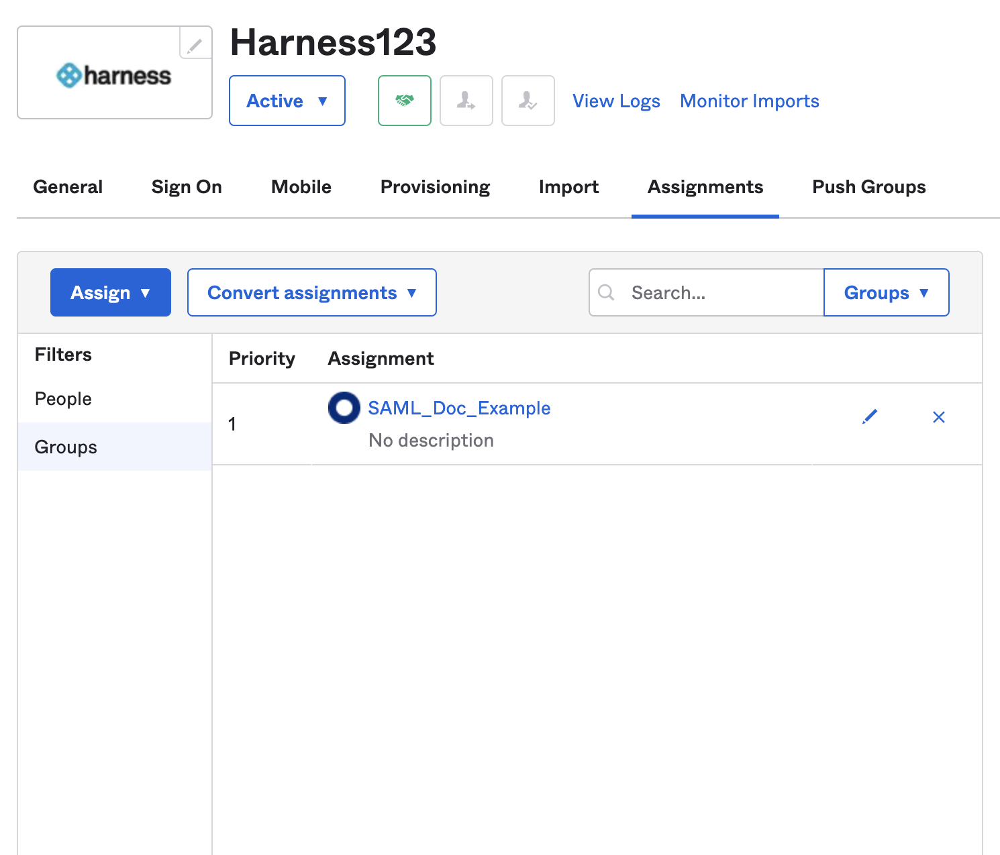

4. Configure the **Group Attribute Name** in your SAML app. You will use the Group Attribute Name later in Harness when you enable SAML authorization.  
  
   Here are the steps for adding a **Group Attribute Name** in Okta:
	1. In **Okta**, click **Applications**, and then click the name of the app you use for Harness SAML SSO to open its settings.
	2. In the app, click the **General** tab.
	3. For **SAML Settings**, click **Edit**.
       
	   

	4. In **General Settings**, click **Next**.
       
	   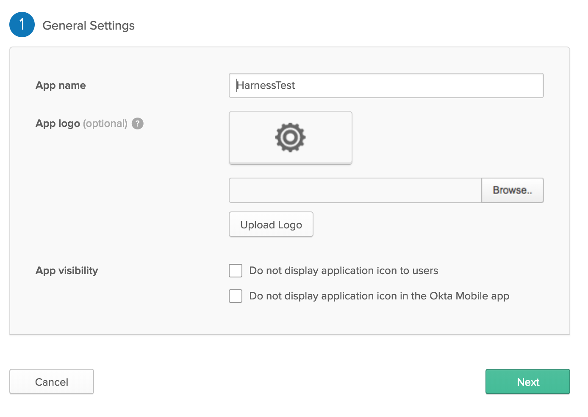

	5. In **GROUP ATTRIBUTE STATEMENTS (OPTIONAL)**, in **Name**, enter the Group Attribute Name you want to use, such as **dept**.
	6. In **Filter**, select **Matches regex** and enter period asterisk (**.\***) in the field. When you are done, it will look something like this:
       
	   

	7. Click **Next** and then click **Finish**.
5. Enable Authorization in Harness. Now that you have assigned a group to your SAML app and added a Group Attribute Name, you can enable authorization in Harness.
	1.  In **Home**, click **Authentication** under **ACCOUNT SETUP**. **The Authentication: Configuration** page appears.
	2.  Click to expand the **Login via SAML** section.
        
		

	3. You can see the SSO Provider you have set up listed in this section. Click the vertical ellipsis (**︙**) next to the SSO Provider you have set up for SSO authentication, and click **Edit**.
        
		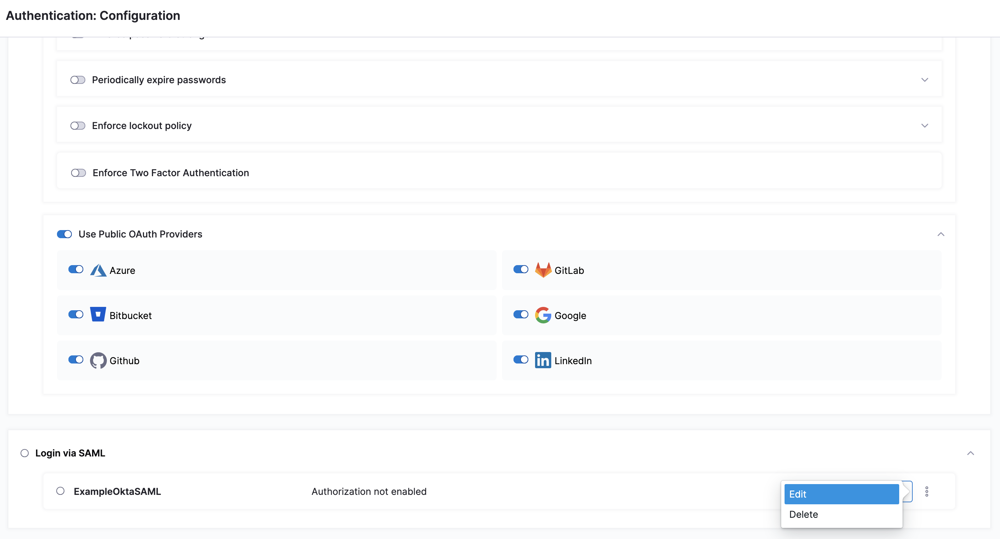

	4. In the **Edit SAML Provider** dialog, click **Enable Authorization**.
	5. In **Group Attribute Name,** enter the Group Attribute Name you earlier added to your SAML app in your SAML provider.
        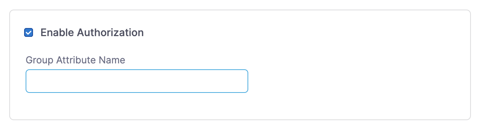

	6. Click **Add**. The SAML SSO Provider is now set up to use the Group Attribute Name for authorization.
6. Link the SAML SSO Provider to the Harness User Group. You can create a new User Group or use an existing Group so long as your Harness User account is a member and that User account is registered using the same email address you used to register with your SAML provider. For detailed instructions on creating a User Group in Harness, see [Add and Manage User Groups](../4_Role-Based-Access-Control/4-add-user-groups.md). To link your group, perform the following steps:
	1. In **Home**, click **Access Control** under **ACCOUNT SETUP**.
	2. Click **User Groups** and then click on the User Group you want to link the SAML SSO Provider to**.**
	3. Click **Link to SSO Provider Group**.
    
	    

	4. In the **Link to SSO Provider Group** Dialog, in **Search SSO Settings**, select the SAML SSO Provider you have set up.
	5. In the **Group Name**, enter the name of the group you assigned to your app in your SAML provider.
	    
		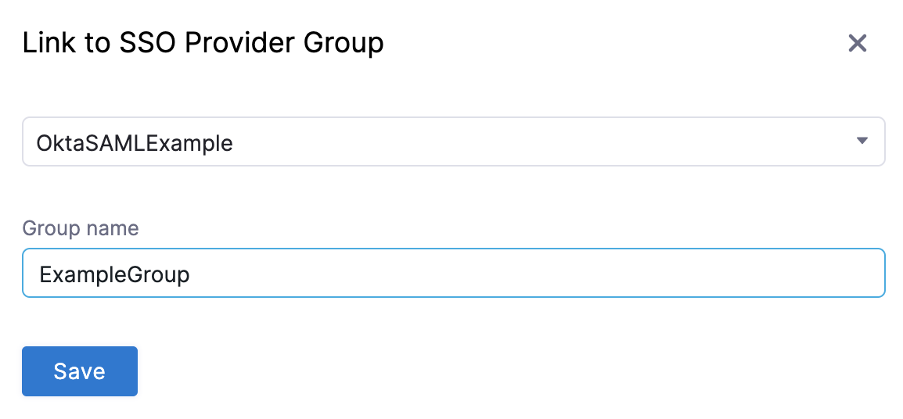

	6.  Click **Save**.
7. Test the SAML Authorization by repeating steps 5-8 from [Enable and Test SSO with Okta](#enable-and-test-sso-with-okta).
8. In your Harness account in the other browser window, check the User Group you linked with your SAML provider. The user that logged in is now added to the User Group, receiving the authorization associated with that User Group.  
You can link multiple Harness User Groups with the SAML SSO Provider you set up in Harness.  
You can also remove a link between a Harness User Group and a Harness SAML SSO Provider without losing the User Group members. In the Harness User Group, simply click **Delink Group**:

The **Delink Group** dialog appears.

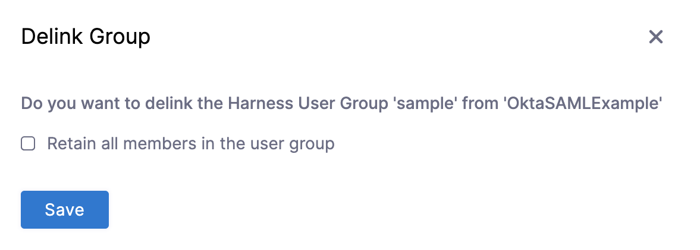

Click **Retain all members in the user group** and click **Save**. The link to the SAML SSO Provider is removed and the Users are still members of the User Group.

:::note
You cannot delete a SAML SSO Provider from Harness that is linked to a Harness Group. You must first remove the link to the SSO Provider from the Group.
:::

### SAML SSO with Azure

The section describes the Azure-specific steps you must perform to use an Azure app for Harness SAML SSO:

:::note
Make sure the email address used in Harness matches the email address in the Azure app for every user.

:::

The following image shows the basic exchange of information between Harness and your Azure app's Single sign-on settings:

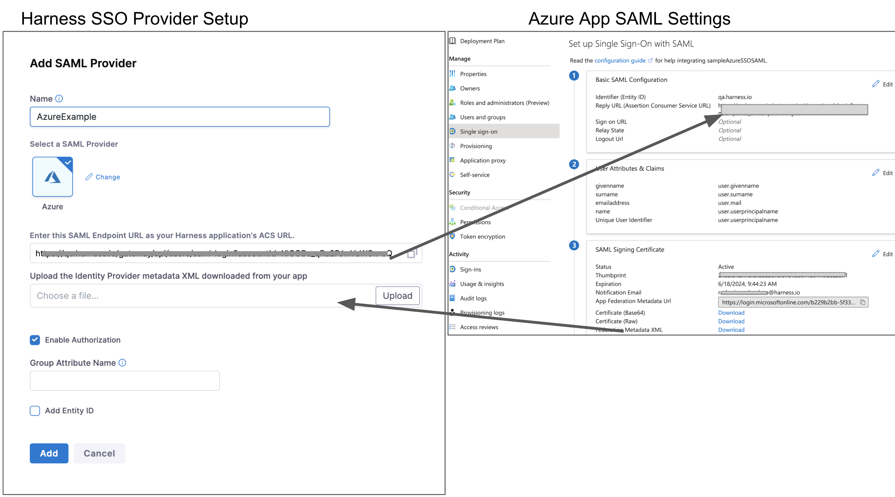

#### Azure User Accounts

The Harness User accounts and their corresponding Azure user accounts must have the same email addresses.

1. Ensure that you have at least two corresponding user accounts in both Harness and your Azure app when setting up and testing SAML SSO. This allows you to set up the account with a Harness Administrator account and test it with a Harness user account.

The following image shows a Harness User Group containing two users and their corresponding accounts in the Azure app that will be used for SAML SSO.

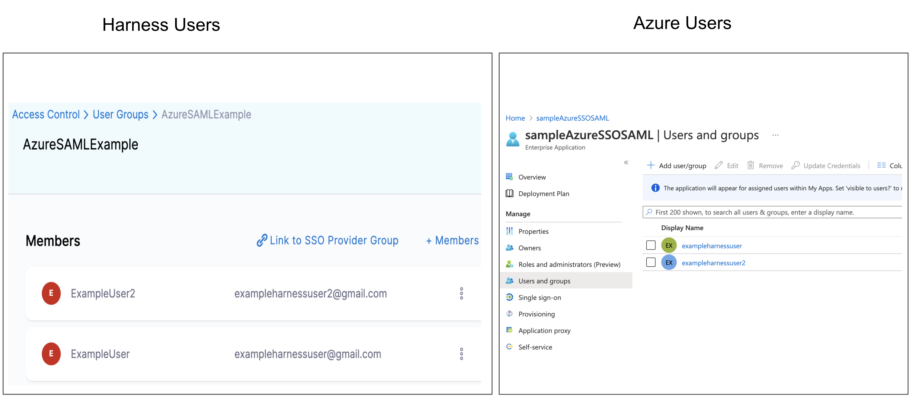

#### Endpoint URL for Azure

You must enter the **Harness SAML Endpoint URL** from Harness in your Azure app **Reply URL**:

1. In your Azure app, click **Single sign-on**. The SSO settings for the Azure app are displayed.
   
   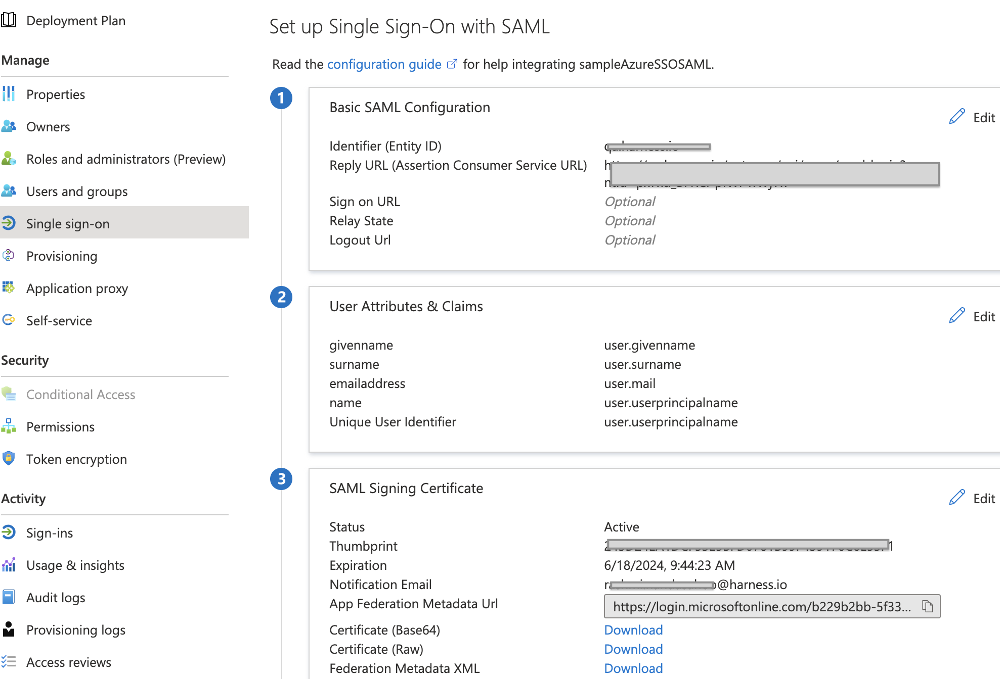

2. In **Basic SAML Configuration**, click the edit icon (pencil).
3. Enter **app.harness.io** in the **Identifier (Entity ID)** field.

   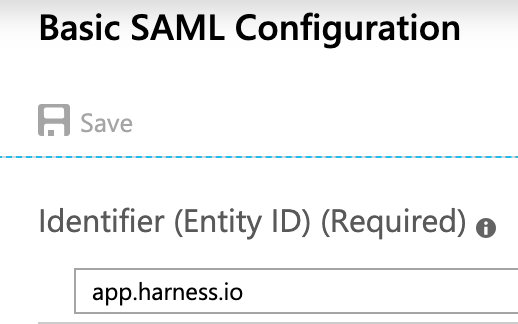

Next, you will use the **SAML SSO Provider** settings in Harness to set up your Azure app **Single sign-on**.

:::note
For [Harness Self-Managed Enterprise Edition](https://docs.harness.io/article/tb4e039h8x-harness-on-premise-overview), replace **app.harness.io** with your custom URL.  
If you use a custom Harness subdomain in any Harness version, like **example.harness.io**, use that URL.
:::

4. In **Home**, click **Authentication** under **ACCOUNT SETUP**. **The Authentication: Configuration** page appears.
5. Click **+SAML Provider**. The **Add SAML Provider** page appears.
   
   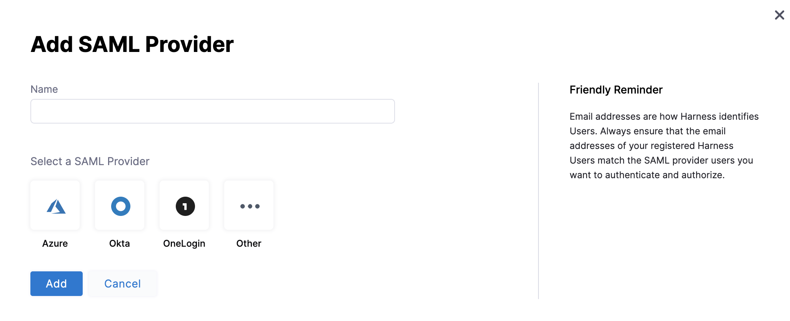

6. In **Name**, enter a name for the SAML SSO Provider.
7. Select **Azure** under **Select a SAML Provider**. The settings for Azure setup are displayed:
   
   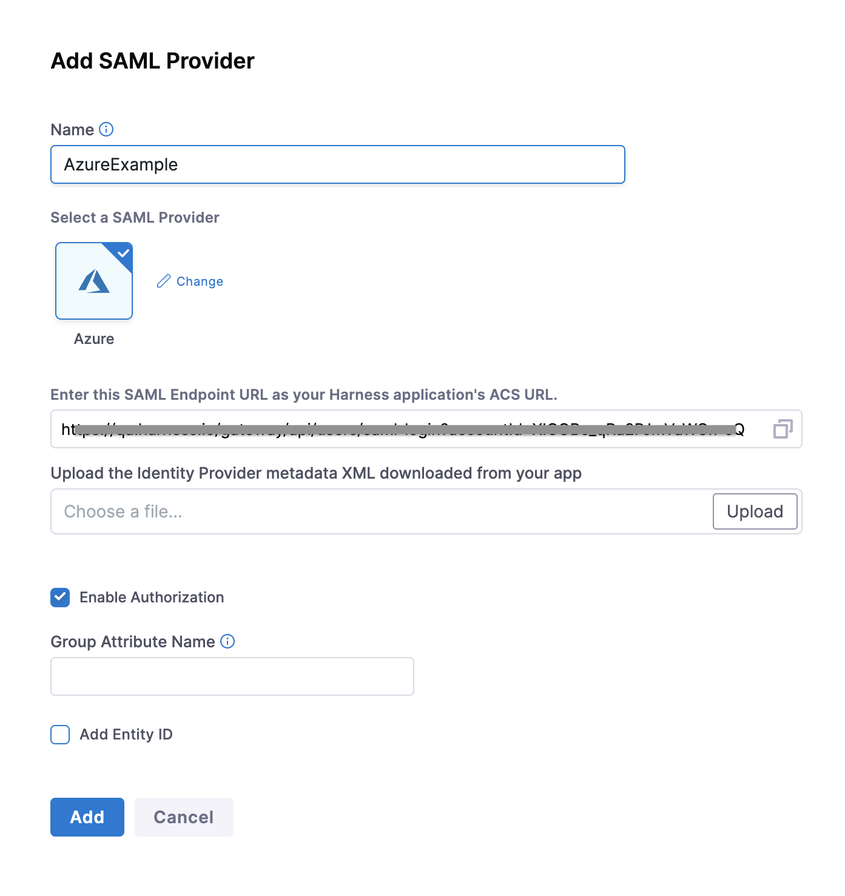

8. Copy the **Harness SAML Endpoint URL** from the **Add SAML Provider** dialog, and paste it in the **Reply URL** in your Azure app.
   
   

9. Click **Save** on the Azure App SAML Settings page.

#### User Attributes and Claims

Next, you need to ensure that Harness Users' email addresses will identify them when they log in via Azure. To do this, you set up the **Single sign-on** section of your Azure app to use the **User name** email address as the method to identify users.

The Azure users that are added to your Azure app must have their email addresses listed as their **User name.**

To set this **User name** email address as the method for identifying users, in the Azure app **Single sign-on** section, the Azure app must use the **user.userprincipalname** as the **Unique User Identifier**, and **user.userprincipalname** must use **Email address** as the **name identifier format**.

To set this up in your Azure app, do the following:

1. In your Azure app, in the **Single sign-on** blade, in **User Attributes & Claims**, click the edit icon (pencil). The **User Attributes & Claims** settings appear.
   
   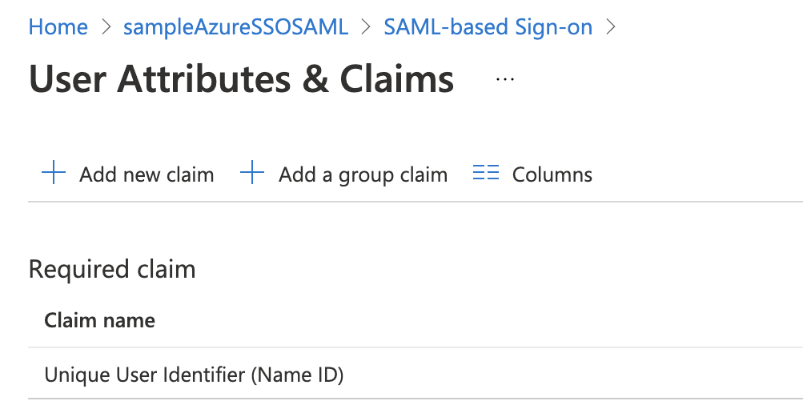

2. For **Unique User identifier value**, click the edit icon. The **Manage claims** settings appear.
   
   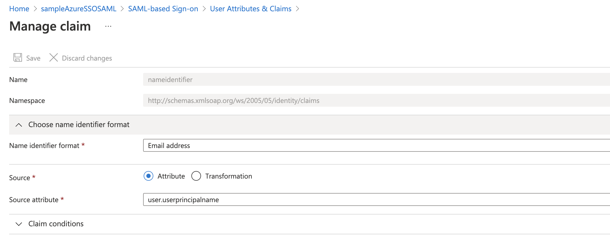

3. Click **Choose name identifier format**, and select **Email address**.
4. In **Source attribute**, select **user.userprincipalname**.
5. Click **Save**, and then close **User Attributes & Claims**.

:::note
If your Azure users are set up with their email addresses in some field other than **User name**, just ensure that the field is mapped to the **Unique User Identifier** in the Azure app and the **name identifier format** is **Email address**.
:::

#### Azure SAML Metadata File

You must download the **Federation Metadata XML** from your Azure app and upload the file into Harness.

1. Download the **Federation Metadata XML** from your Azure app and upload it using **Upload the identity Provider metadata xml downloaded from your Azure App** in the **Add SAML Provider** settings in Harness.
   
   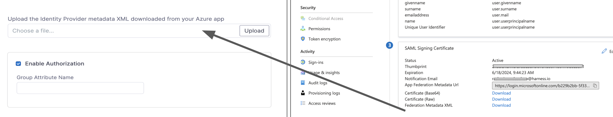

2. Select **Add Entity ID** and enter your custom Entity ID. The default Entity ID is **app.harness.io**. The value you enter here will override the default Entity ID.
3. Click **Add**. The new Azure SAML Provider is added.
   
   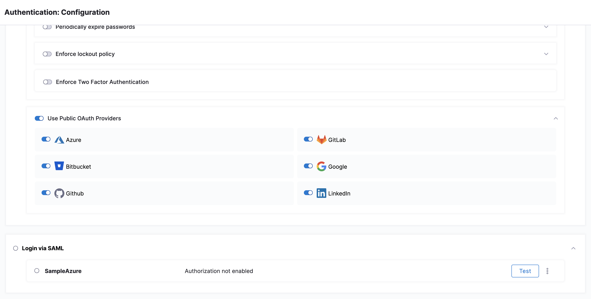

#### Enable and Test SSO with Azure

Now that Azure is set up in Harness as a SAML SSO provider, you can enable and test it.

You can test the Azure app SSO from within Azure if you are logged into Azure using an Azure user account that has the following:

* A corresponding Harness User account with the same email address.
* The Azure user account is in the Azure app **Users and groups** settings.
* The Azure user account has the Global Administrator Directory role in Azure.

To test Azure SSO using Azure, do the following:

1. In the Azure app, click **Single sign-on**, and then at the bottom of the **Single sign-on** settings, click **Test**.
   
   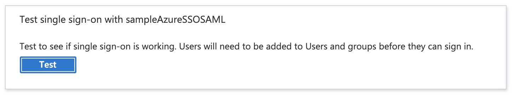

2. In the **Test** panel, click **Sign in as current user**. If the settings are correct, you are logged into Harness. If you cannot log into Harness, the **Test** panel will provide debugging information. See also [Debug SAML-based single sign-on to applications in Azure Active Directory](https://docs.microsoft.com/en-us/azure/active-directory/develop/howto-v1-debug-saml-sso-issues?WT.mc_id=UI_AAD_Enterprise_Apps_Testing_Experience) from Azure.

To test Azure SSO using Harness, do the following:

1. In **Harness**, in **ACCOUNT SETUP**->**Authentication**, select **Login via SAML**, to enable SAML SSO using the Azure provider.
2. Open a new Chrome Incognito window to test the SSO login using a Harness User account other than the one you are currently logged in with.
3. Using one of the user account email addresses that are shared by Harness and Azure, log into Harness. When you log into Harness, you are prompted with the Microsoft Sign in dialog.
4. Enter the Azure user name for the user (most often, the email address), enter the Azure password, and click **Sign in**.

#### SAML Authorization with Azure

Once you have enabled Harness SSO with your Azure app, you can set up and enable SAML authorization in Harness using Azure.

To set up SAML authorization in Harness, you link a Harness User Group to a user group assigned to your Azure app. When a user from your Azure app logs into Harness, they are automatically added to the linked Harness User Group and inherit all the RBAC settings for that Harness User Group.

Below is the Harness SAML settings you need from Azure to set up SAML authorization in Harness:

* **Group Attribute Name** - In Azure, this value is obtained from the **Group Claims** in the Azure app **User Attributes & Claims** settings.

For Harness **Group Attribute Name**, here is the Harness **SAML Provider** setting on the left and their corresponding Azure **Group Claims** settings on the right:

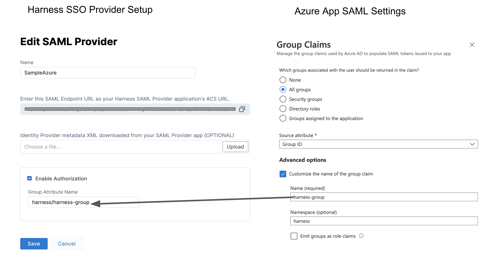

To set up Azure Authorization in Harness, do the following:

1. In Azure, add the **Group Claim** (Name and Namespace) to the Azure app.
	1. In your Azure app, click **Single sign-on**, and then in **User Attributes & Claims**, click edit (pencil icon).
	   
	   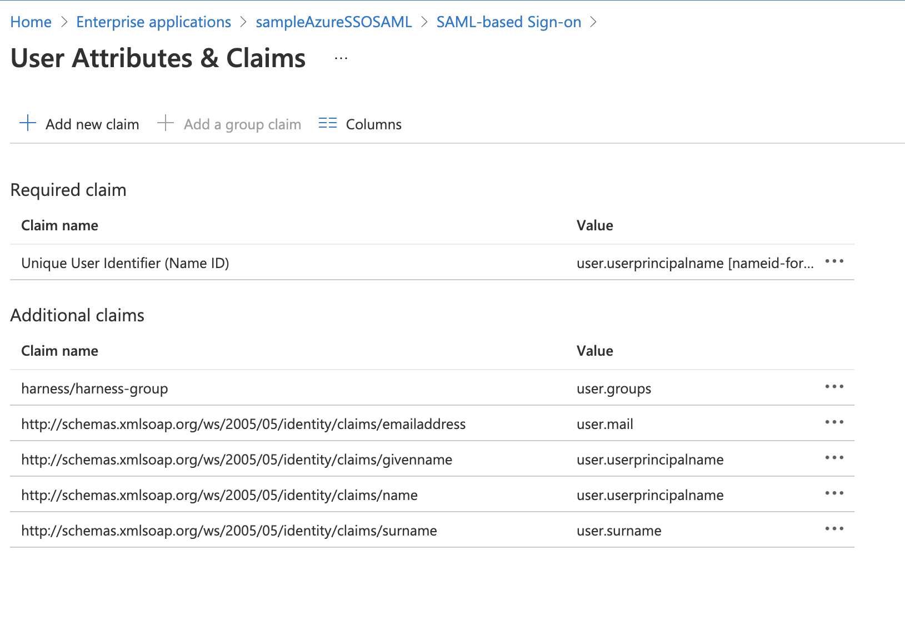

	2. In **User Attributes & Claims**, edit the groups claim. The **Group Claims** settings appear.
       
	   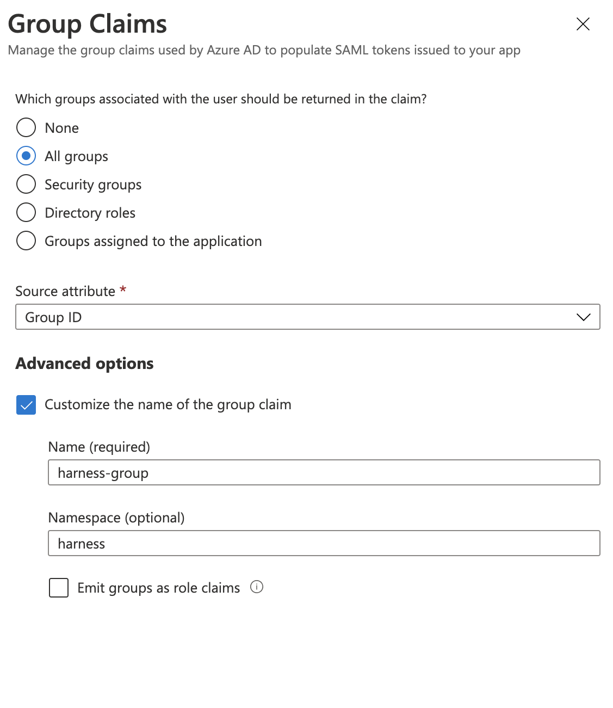

	3. Click the **All groups** option and then enable **Customize the name of the group claim**.
	4. In **Name**, enter a name to use to identify the Harness Group Attribute Name.
	5. In **Namespace**, enter a namespace name.
	6. Click **Save**. **User Attributes & Groups** now display the group claim you created.
	7. Close **User Attributes & Groups**.
2. In Harness, enter the Group Claim name and namespace in the SAML SSO Provider **Group Attribute Name** field.
	1. Open the SAML SSO Provider dialog, and enable the **Enable Authorization** setting. You need to enable **Enable Authorization** in order to select this SSO Provider when you link a Harness User Group for authorization.
	2.  Enter the Group Claim name and namespace in the **Group Attribute Name** field in the same format as a Claim Name (`namespace/name`). The SAML SSO Provider dialog will look something like this:
        
		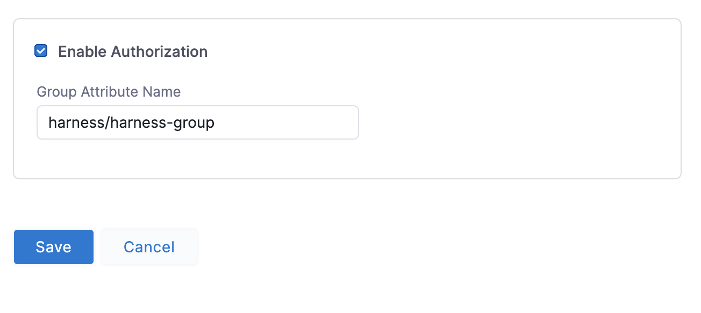

	3. Click **Save**. Authorization and the Group Attribute Name are set up. Next, you need to set up your Azure and Harness groups.
3. In Azure, ensure the Azure users with corresponding Harness accounts belong to an Azure group. Here is an Azure group named **ExampleAzureGroup** with two members:
   
   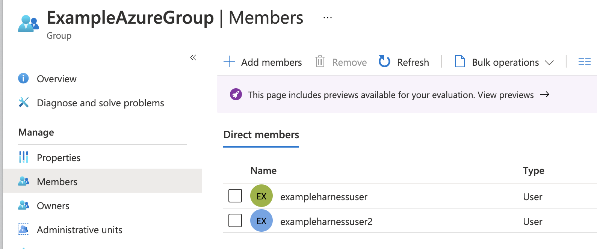

4. Ensure that the Azure group is assigned to the Azure app. Here you can see the **ExampleAzureGroup** group in the Azure app's **Users and groups**:
   
   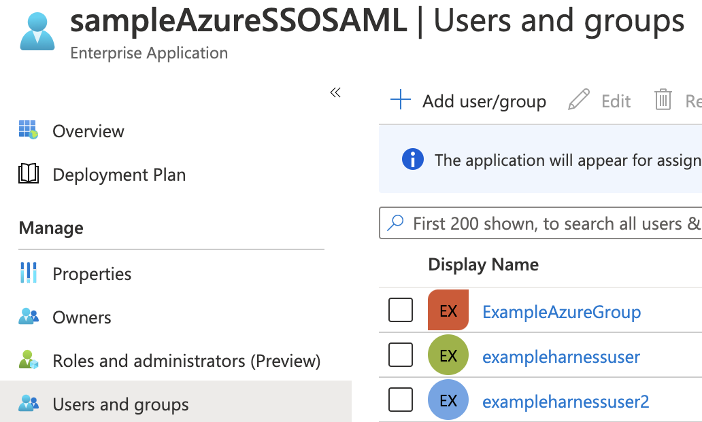

5. Link the Harness User Group to the Azure group using the Azure group Object ID.
	1. In Azure, copy the Azure group **Object ID**.
        
		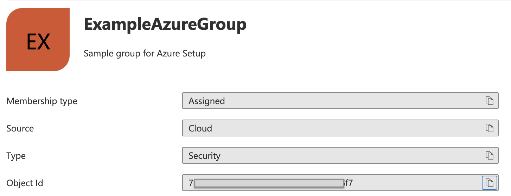

	2. In Harness, create a new User Group or open an existing User Group.
	3. In **Home**, click **Access Control** under **ACCOUNT SETUP**.
	4. Click **User Groups** and then click on the User Group you want to link the SAML SSO Provider to**.**
	5. Click **Link to SSO Provider Group**.
	
	    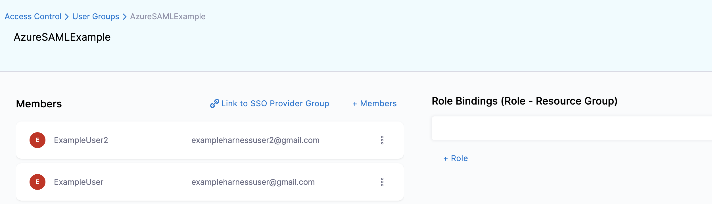

	6. In the **Link to SSO Provider Group** dialog, in **SSO Provider**, select the Azure SSO Provider you set up, and in **Group Name**, paste the Object ID you copied from Azure. When you are done, the dialog will look something like this:
   
       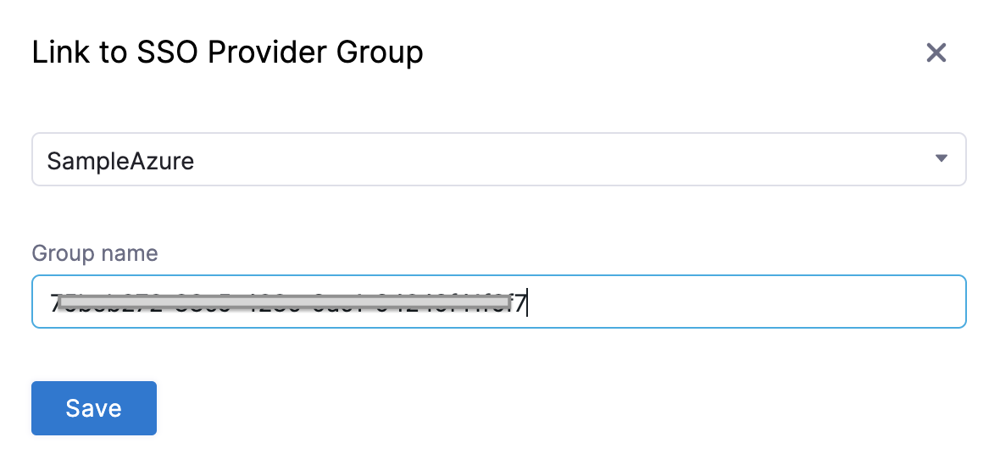

	7. Click **Save**. The User Group is now linked to the SAML SSO Provider and Azure group Object ID.
6. Test Authorization.
	18. Open a new Chrome Incognito window to test the authorization using a Harness User account other than the one you are currently logged in with.
	19. Log into Harness using the user email address, and sign in using the Azure username and password. If you are already logged into Azure in Chrome, you might be logged into Harness automatically.
	20. In the linked Harness User Group, ensure that the Harness User account you logged in with was added.

The Harness User is now added and the RBAC settings for the Harness User Group are applied to its account. For more information, see [Add and manage User Groups](../4_Role-Based-Access-Control/4-add-user-groups.md).

### SAML SSO with Azure Active Directory

You can use Azure Active Directory (AD) for SAML SSO with Harness, enabling AD users to log into Harness using their AD credentials.

For detailed steps on adding SAML SSO with Active Directory, follow the steps in the tutorial [Azure Active Directory single sign-on (SSO) integration with Harness](https://docs.microsoft.com/en-us/azure/active-directory/saas-apps/harness-tutorial) from Microsoft.

:::note
Users are not created as part of the SAML SSO integration. Users are invited to Harness using their email addresses. Once they log into Harness, their email addresses are registered as Harness Users. For more information, see [SAML SSO with Harness Overview](#saml-sso-with-harness-overview).
:::

#### Users in over 150 Groups

When users have large numbers of group memberships, the number of groups listed in the token can grow the token size. Azure Active Directory limits the number of groups it will emit in a token to 150 for SAML assertions.

If a user is a member of a larger number of groups, the groups are omitted and a link to the Graph endpoint to obtain group information is included instead.

To invoke the API Harness will need **Client ID** and **Client Secret** for your registered app.

To get this information, perform the following steps:

1. In your Azure account, go to **App registrations**.
2. Click on your app. Copy the Application (client) ID and paste it in **Client ID** in your Harness account.
3. In your Azure account, go to **App registrations**. Click **Certificates and Secrets**.
4. Click New Client Secret.
5. Add a description and click Add.
6. Make sure to copy this secret and save it as an encrypted text secret. For detailed steps to create an encrypted text in Harness, see [Use Encrypted text Secrets](../6_Security/2-add-use-text-secrets.md).
7. Select the above secret reference in the Client Secret field in your Harness account.
   
   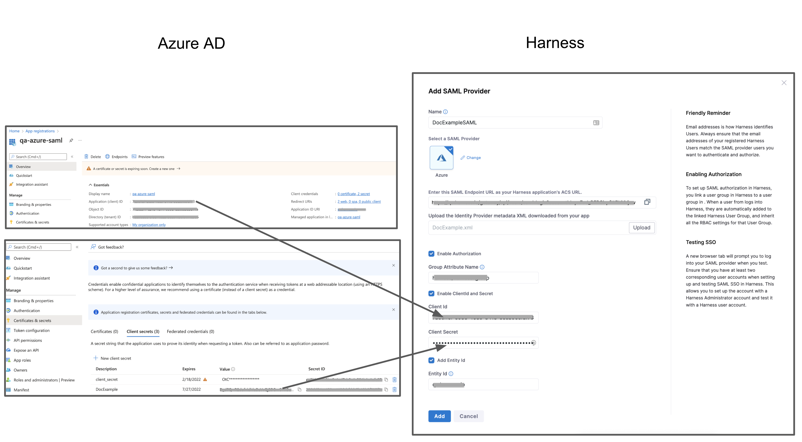

### SAML SSO with OneLogin

To set up OneLogin as a SAML SSO provider on Harness, you exchange the necessary information between the OneLogin Harness application and Harness. The following sections cover Authentication steps, followed by Authorization steps.

#### OneLogin Authentication on Harness

Enabling OneLogin authentication on Harness requires configuration on both platforms, as described in these sections:

##### Exchange Harness Consumer URL and OneLogin Metadata

1. In **Home**, click **Authentication** under **ACCOUNT SETUP**. **The Authentication: Configuration** page appears.
2. Click **+SAML Provider**. The **Add SAML Provider** page appears.
3. In**Name**, enter a name for the SAML SSO Provider.
4. Select **OneLogin** under **Select a SAML Provider**. The settings for OneLogin setup are displayed.
5. Copy the provided URL under **Ener the SAML Endpoint URL, as your Harness OneLogin application's ACS URL**, to clipboard.
6. In OneLogin, add the **Harness** app (for SaaS setup) or **Harness (On Prem)** app for Harness Self-Managed Enterprise Edition setup. To do so, perform the following steps:
	1. Log in to OneLogin.
	2. Click **Administration**.
	3. Under the **Applications** tab, click **Applications**.
	4. Click **Add App**.
	5. Find **Harness** or **Harness (On Prem)** based on your setup, and then click the app.
       
	   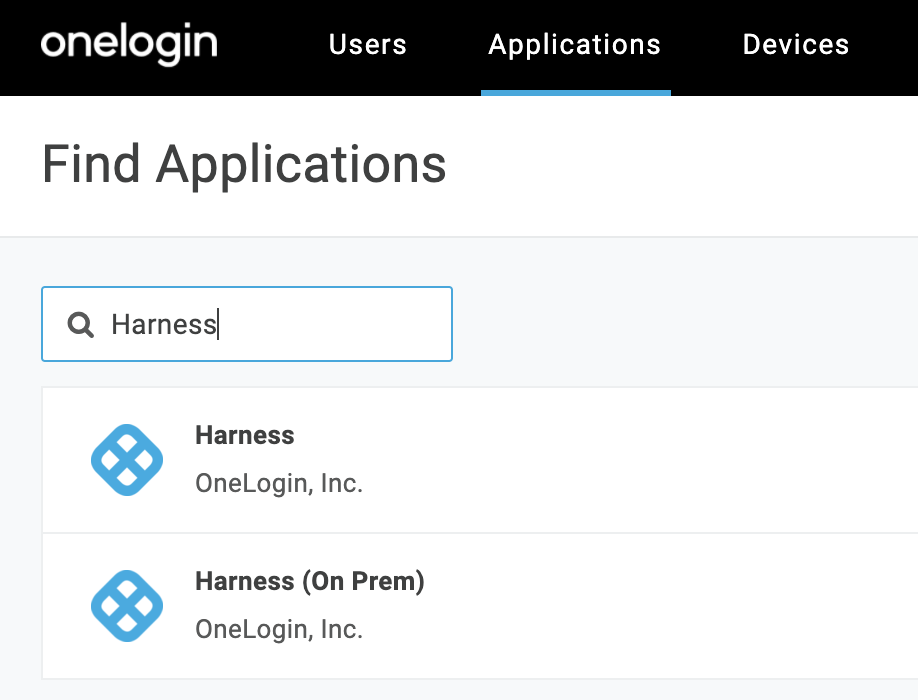

7. In **Configuration**, paste this URL into the **SCIM Base URL** field.
   
   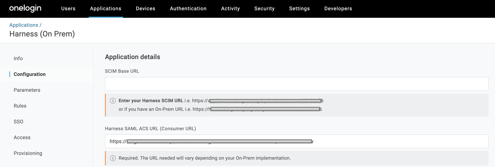

8. Skip all other **Application Details** fields, and click **Save**.
9.  Navigate to OneLogin's **Applications** > **SSO** tab. At the upper right, select **More Actions** > **SAML Metadata**.
    
	

10. From the resulting dialog, download the .xml authentication file that you'll need to upload to Harness.

##### Assign Users to Roles

1. In OneLogin, select **Users** > **Users**. 
    

:::tip
   If you prefer to assign *groups* to roles, instead start at **Users** > **Groups**, and modify the following instructions accordingly.

:::

2. Search for a user that you want to add to Harness.
   
   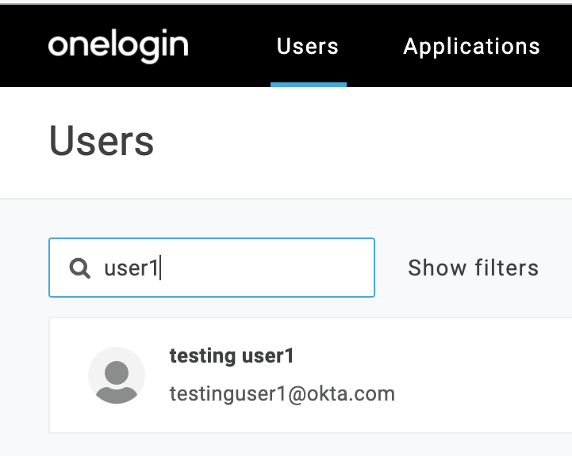

3. Click to select the user.
4. The **Users** page appears. Click the **Applications** tab.
5. Click the **+** button at the upper right to assign an Application.
6. Select the Application, then click **Continue**.
7. Repeat this section for other users (or groups) that you want to add to Harness.

##### Enable OneLogin as a Harness SSO Provider

1. In **Home**, click **Authentication** under **ACCOUNT SETUP**. **The Authentication: Configuration** page appears.
2. Click to expand the **Login via SAML** section.

   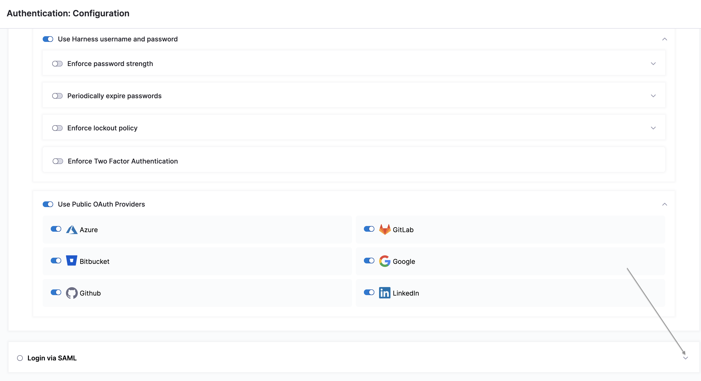

3. You can see the SSO Provider you have setup listed in this section. Click the vertical ellipsis (**︙**) next to the SSO Provider you have set up for SSO authentication, and click **Edit**.
4. Use **Choose File** to upload the .xml file that you obtained from OneLogin.
5. Deselect **Enable Authorization**.
6. Select **Add Entity ID** and enter your custom Entity ID. The default Entity ID is **app.harness.io**. The value you enter here will override the default Entity ID.
7. Click **Add**.
8. Click **Login via SAML** toggle, to enable your new provider.
9.  In the resulting **Enable SAML Provider** dialog, click **TEST** to verify the SAML connection you've configured.
    
	

10. Once the test is successful, click **Confirm** to finish setting up OneLogin authentication.

#### OneLogin Authorization on Harness

Once you've enabled OneLogin authentication on Harness, refer to the below sections to enable authorization between the two platforms:

##### Assign Roles to Users

Harness’ SAML authorization replicates OneLogin Roles as Harness User Groups. Here is how to begin mapping between these entities.

1. From OneLogin's, menu, select **Users** > **Users**.
2. Find and select a user, assigned to Harness, to assign appropriate OneLogin Roles.
3. Click the **Applications** tab.
4. Select the specific Roles you want to assign to this user.
5. Click **Save User** at the upper right.
6. Repeat this section for other users to whom you want to assign Roles.

#### Define Parameters

1. Select **Applications** > **Parameters**, then select the `+` button to add a new Parameter.
2. In the resulting **New Field** dialog, assign a **Field name** (for example **Groups**).
   
   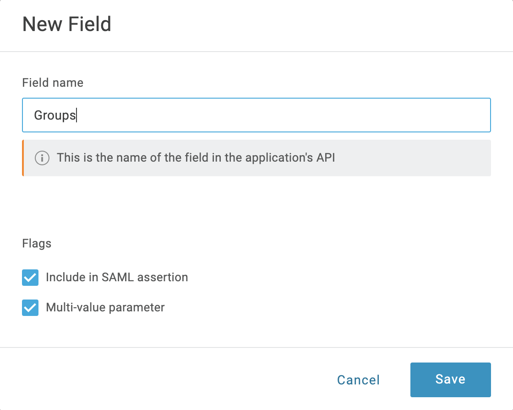

3. Select **Include in SAML assertion** and **Multi-value parameter**. Then click **Save**.
4. Back on the **Parameters** tab, select your new **Groups** field.
5. In the resulting **Edit Field Groups** dialog, set **Default if no value selected** to **User Roles**. Below that, select **Semicolon Delimited input (Multi-value output)**. Then select **Save**.
   
   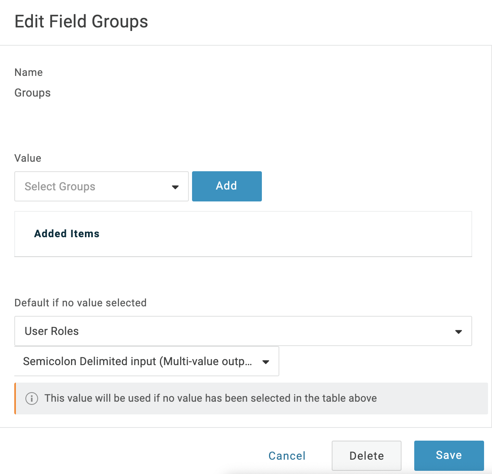

6. Select **Save** again at the **Parameters** page's upper right.

##### Sync Users in Harness

1. In **Home**, click **Authentication** under **ACCOUNT SETUP**. **The Authentication: Configuration** page appears.
2. Click to expand the **Login via SAML** section.
   
   

3. You can see the SSO Provider you have set up listed in this section. Click the vertical ellipsis (**︙**) next to the SSO Provider you have set up for SSO authentication, and click **Edit**.
   
   

4. In the **Edit SAML Provider** dialog, click **Enable Authorization**.
5. In **Group Attribute Name**, enter the name of the **Field Group** you configured in OneLogin.
6. Click **Save**.
7. Under **ACCOUNT SETUP c**lick **User Groups.**
8. Click on the User Group you want to link the SAML SSO Provider to**.**
9. Click **Link to SSO Provider Group**.
10. In the **Link to SSO Provider Group** Dialog, in **Search SSO Settings**, select the SAML SSO Provider you have set up.
11. In the **Group Name**, enter the name of the Field Group you configured in OneLogin.
12. Click **Save**.

##### Test the Integration

After you've synced Users between OneLogin and Harness, users will be assigned to the designated Harness User Group upon your next login to Harness. To test whether OneLogin authentication and authorization on Harness are fully functional do the following:

1. In Chrome, open an Incognito window, and navigate to Harness.
2. Log into Harness using the email address of a Harness User that is also used in the SAML provider group linked to the Harness User Group.  
When the user submits their email address in Harness Manager, the user is redirected to the SAML provider to log in.
3. Log into the SAML provider using the same email that the user is registered with, within Harness.  
Once the user logs in, the user is redirected to Harness and logged into Harness using the SAML credentials.
4. In your Harness account in the other browser window, check the User Group you linked with your SAML provider. The user that logged in is now added to the User Group, receiving the authorization associated with that User Group.

:::note
You cannot delete a SAML SSO Provider from Harness that is linked to a Harness Group. You must first remove the link to the SSO Provider from the Group.
:::

### SAML SSO with Keycloak

To set up SAML support in your Keycloack Harness app, make sure that the app has corresponding Users in Harness:​

:::note
Users are not created as part of the SAML SSO integration. Users are invited to Harness using their email addresses. Once they log into Harness, their email addresses are registered as Harness Users. For more information, see SAML SSO with Harness Overview.​
:::

This section describes the steps you must perform to use a Keycloak app for Harness SAML SSO:​

#### Keycloak User Accounts

1. In Harness, add the users you want to set up for SAML SSO by inviting them to Harness using the same email addresses that they use in your SAML provider.​
2. In Keycloak, assign them to your SAML provider app.​

#### Set Up a Client in Keycloak

1. Log in to your Keycloak account.
2. In your [Master Realm](https://wjw465150.gitbooks.io/keycloak-documentation/content/server_admin/topics/realms/master.html), click **Clients**. For steps to create a new Realm, see [Create a New Realm](https://wjw465150.gitbooks.io/keycloak-documentation/content/server_admin/topics/realms/create.html).
   
   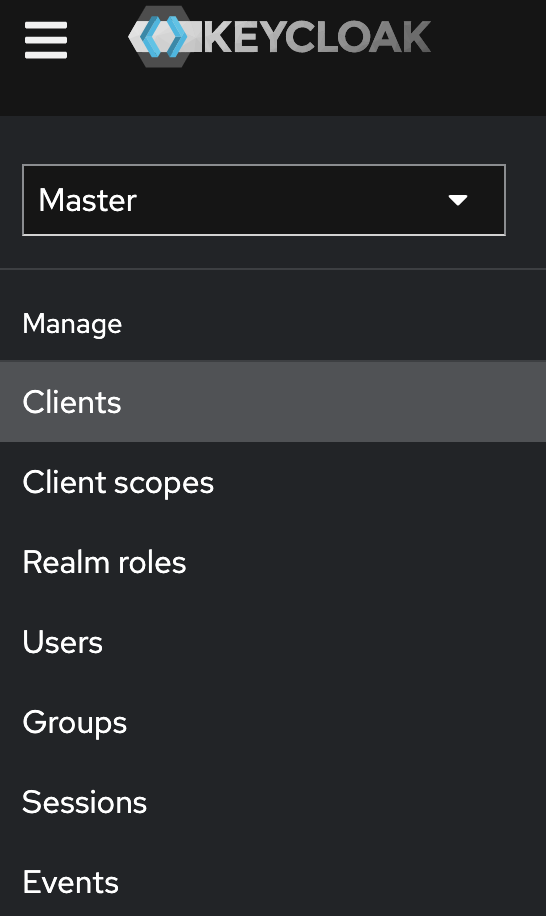

3. Click **Create Client**. The **Create Client** settings appear.
4. In **Client type**, select **SAML**.
5. In **Client ID**, enter `app.harness.io`.
6. In **Name**, enter a name for your client.
7. Turn off **Always display in console**. Turning this option off will make sure that this client is not displayed in the Account Console, when you do not have an active session.
   
   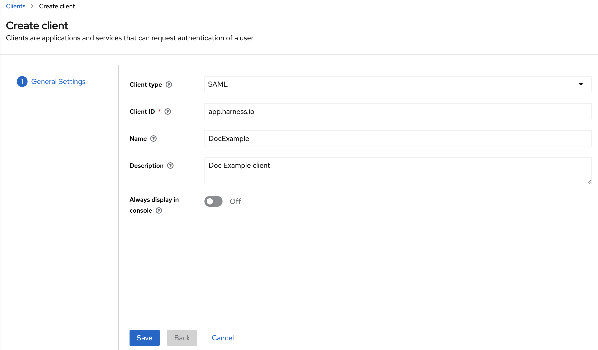

8. In **Root URL**, **Home URL**, and **Valid post logout redirect URIs** enter `https://devtest.harnesscse.com`.
9.  In **Master SAML Processing URL**, enter your app's redirect YAML login URL.  
For example, `https://app.harness.io/gateway/api/users/saml-login?accountId=<your account Id>`.
10. Click **Save**. Your client is now listed in Clients.
11. Click on the client you just created. The client details appear.
12. Make sure the **Name ID format** is set to **email**.
13. Make sure the following settings are turned on:
	1. Force POST binding
	2. Include AuthnStatement
	3. Sign assertions
 
       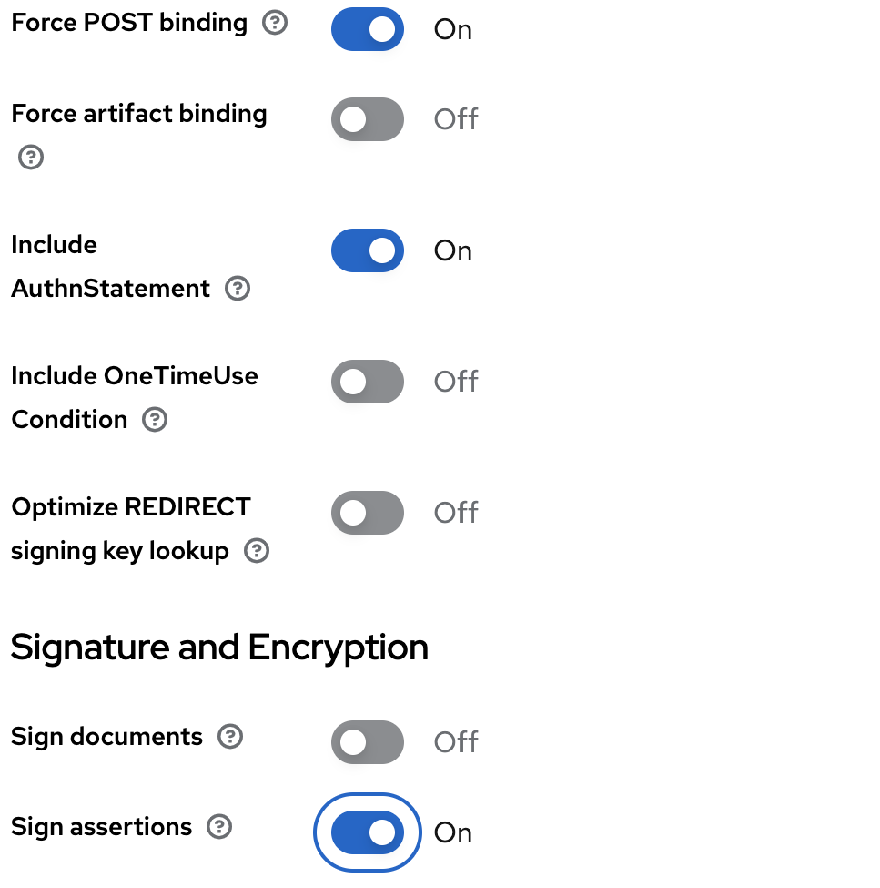

14. In **Signature Algorithm**, select `RSA_SHA256`.
15. In **SAML signature key name**, select **NONE**.
16. In **Canonicalization method**, select **Exclusive**.
17. Click **Save**

#### Create a Role

1. In your Client, click **Roles**.
2. Click **Create Role**.
3. In **Role Name**, enter a name for the role. Click **Save**.

#### Create a User

1. In your Keycloak account, click **Users**.
2. Click **Add user**. The **Create User** settings appear.
3. In **Email**, enter the email address of the user.
4. Turn on **Email verified**.
5. In **First name**, enter the first name of the user.
6. In **Last name**, enter the last name of the user.
7. Turn on **Enabled**. This is to make sure that a disabled user cannot log in.
8. Click **Join Groups**. Search for your user groups and join.
9. Click **Create**.
10. Click on the user you just created and click **Credentials**.
11. Add password for this user.
12. Click **Role mapping**. Assign **admin** role to this user.

#### Set up Keycloak SAML SSO in Harness

1. In your Harness Account, got to **Account SETUP** and click **Authentication**.
2. Click **SAML Provider**. The **Add SAML Provider** settings appear.
3. In **Name**, enter a name for your SAML provider.
4. In **Select a SAML Provider**, click **Other**.  
Once you do this, you can see additional controls to set up the SAML Provider.​
5. Copy the Endpoint URL under **Enter the SAML Endpoint URL as your Harness application's ACS URL** and paste it in **Assertion Consumer Service POSTBinding URL** in your Keycloak client's **Advanced** tab.
   
   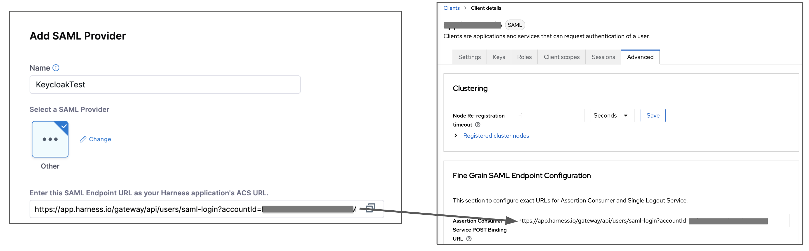

6. You must download the Identity Provider metadata XML from your Keycloak realm and upload the file into Harness.​  
To do this, in your Keycloak account, click **Realm Settings**.
7. Click **SAML 2.0 Identity Provider Metadata**. Save the metadata file.
   
   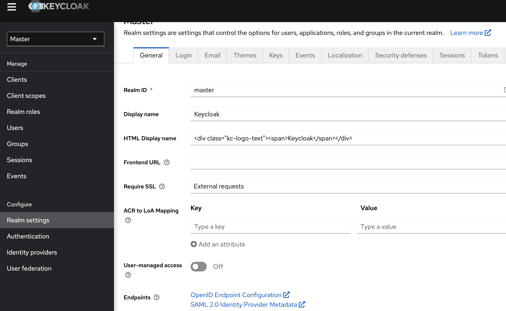

8. In Harness' Add SAML Provider dialog, under **Upload the Identity Provider metadata XML**, click **Upload.**
9.  Add the SAML metadata file you downloaded from your Keycloak realm settings.
10. Select **Add Entity ID** and enter your custom Entity ID.​ The default Entity ID is `app.harness.io`. The value you enter here will override the default Entity ID.
11. Click **Add**.  
The new SSO provider is displayed under **Login via SAML**.​

:::note
Harness does not support authorization with Keycloak.
:::

#### Enable and Test SSO with Keycloak

Now that Keycloak is set up in Harness as a SAML SSO provider, you can enable and test it.​

1. To enable the SSO provider, select **Login via SAML**.
2. In the resulting **Enable SAML Provider** dialog, click **TEST** to verify the SAML connection you've configured.​
3. Upon a successful test, Harness will display the **SAML test successful** banner on top.​
4. Click **CONFIRM** to enable SAML SSO in Harness.​

### Harness Local Login

To prevent lockouts or in the event of OAuth downtime, a User in the Harness Administrators Group can use the [**Local Login**](http://app.harness.io/auth/#/local-login) URL (http://app.harness.io/auth/#/local-login) to log in and update the OAuth settings.

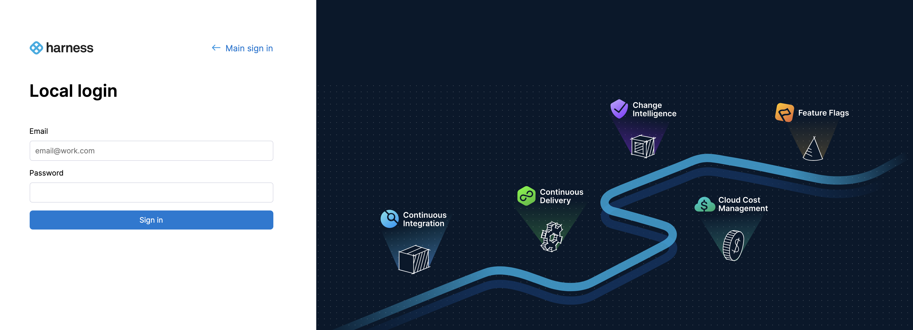

1. Log in using **Harness Local Login**.
2. Change the settings to enable users to log in.

:::note
You can disable Local Login using the feature flag `DISABLE_LOCAL_LOGIN`. Contact [Harness Support](mailto:support@harness.io) to enable the feature flag.
:::
