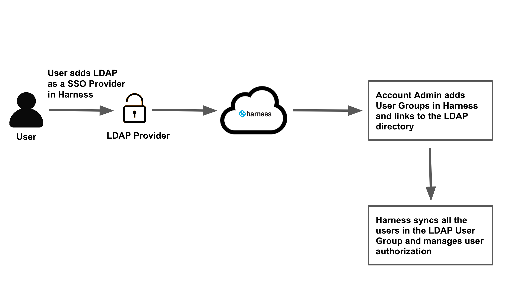
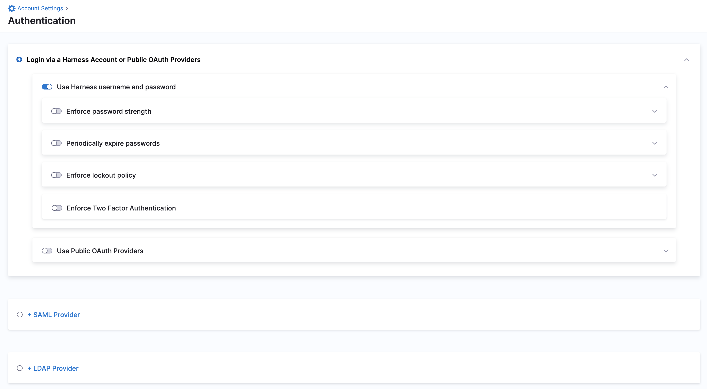
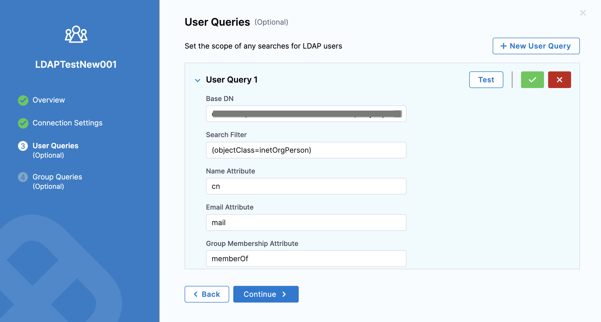
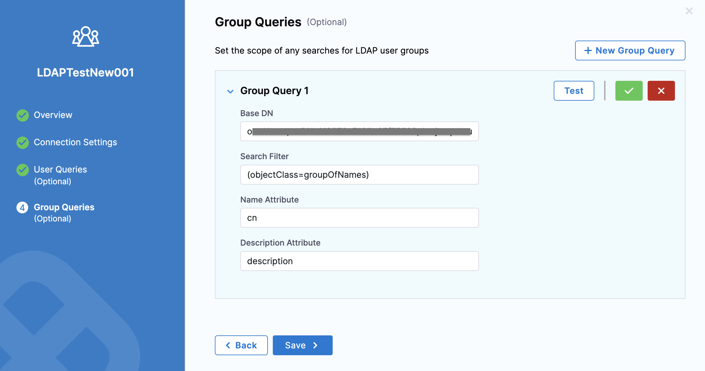
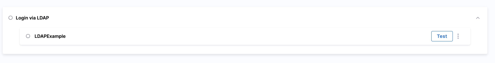
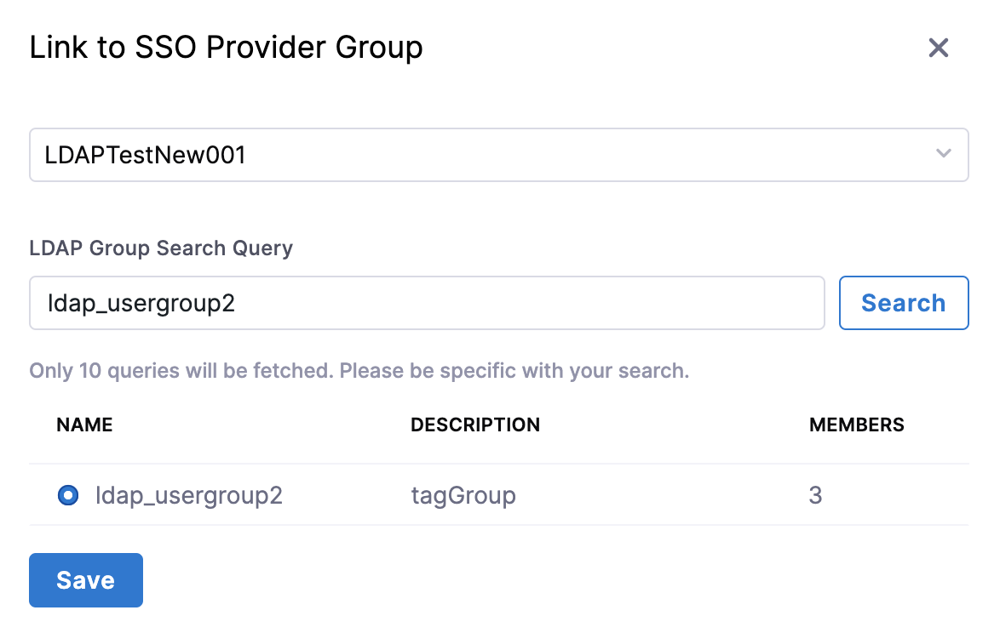

:::note
Currently, this feature is behind the feature flag `NG_ENABLE_LDAP_CHECK`. Contact Harness Support to enable the feature.

:::

Harness supports Single Sign-On (SSO) with LDAP implementations, including Active Directory and OpenLDAP. Integrating Harness with your LDAP directory enables you to log your LDAP users into Harness as part of Harness' SSO infrastructure.

Once you integrate your Harness account with LDAP, you can create a Harness User Group and sync it with your LDAP directory users and groups. Then the users in your LDAP directory can log into Harness using their LDAP emails and passwords.


### Important

* Make sure that the FirstGen Delegate is active to configure LDAP settings.

### Lightweight Directory Access Protocol (LDAP) overview

Lightweight Directory Access Protocol (LDAP) is an application protocol for working with various directory services.

Directory services, such as Active Directory, store user and account information, and security information like passwords.

The service then allows the information to be shared with other devices on the network.

This lets you use LDAP to authenticate, access, and find information.

Harness supports Single Sign-On through Active Directory and OpenLDAP.

### Harness LDAP setup overview

Here is an overview of the steps to set up SSO with LDAP in Harness.



Here are the steps for setting up Harness SSO with LDAP:

1. Add LDAP as a SSO Provider in Harness. This step involves authenticating with your LDAP server and defining how Harness will query it for users and groups.
2. Add a Harness User Group and link it to your LDAP directory. Harness syncs all the users in that LDAP user group automatically and manages user authorization.
3. ​Enable the LDAP Provider you set up in Harness as the Harness SSO provider.
4. To verify the LDAP SSO, log into Harness using one of the synchronized LDAP users.

### Ports and permissions

The following ports and permissions are required to add LDAP as a Harness SSO provider.

#### Ports

The Harness LDAP connection is between the Harness delegate and your LDAP server. The delegate uses the following ports:


|  |  |
| --- | --- |
| **HTTPS** | 443 |
| **LDAP without SSL** | 389 |
| **Secure LDAP (LDAPS)** | 636 |


:::note
By default, LDAP traffic is transmitted unsecured. For Windows Active Directory, you can make LDAP traffic confidential and secure by using SSL/TLS. You can enable LDAP over SSL by installing a certificate from a Microsoft certification authority (CA) or a non-Microsoft CA.

:::

#### Permissions

Authentication with an LDAP server is called the Bind operation. The Bind operation exchanges authentication information between the LDAP client (Harness delegate) and your LDAP server. The security-related semantics of this operation are in RFC4513.

When you configure Harness with LDAP, you will enter a Bind DN (distinguished name) for the LDAP directory user account used to authenticate.

The specific permissions needed by Harness depend on the LDAP directory service you are using.

* **Windows Active Directory:** By default, all Active Directory users in the **Authenticated Users** group have Read permissions to the entire Active Directory infrastructure. If you have limited this, ensure that the account used to connect Harness may enumerate the Active Directory LDAP users and groups by assigning it **Read MemberOf** rights to **User** objects. Changing the default is not a trivial task and requires you to change the basic authorization settings of your Active Directory. For more information, see [Configure User Access Control and Permissions](https://docs.microsoft.com/en-us/windows-server/manage/windows-admin-center/configure/user-access-control) from Microsoft.
* **OpenLDAP:** The default access control policy is allow read by all clients. If you change this default, ensure that the account used to connect Harness to OpenLDAP is granted the **Authenticated users** entity. For more information, see [Access Control](https://www.openldap.org/doc/admin24/access-control.html) from OpenLDAP.

### Add LDAP SSO provider

Adding your LDAP Provider to Harness initially involves establishing a connection from Harness (specifically, the Harness delegate) and querying your LDAP directory for the users and groups you want to sync with Harness for SSO.

#### Query your LDAP directory

If you need to query your LDAP server before or during the Harness LDAP SSO setup, use the **ldapsearch** CLI tool (Linux/Mac), [LDAP Admin](http://www.ldapadmin.org/) (Windows), the **dsquery** CLI tool (Windows), **Active Directory Users and Computers** (Windows), or [Windows PowerShell](https://docs.microsoft.com/en-us/previous-versions/windows/it-pro/windows-server-2008-R2-and-2008/ee617195(v=technet.10)).

For example, the following ldap search will query an Active Directory LDAP directory running on a AWS EC2 instance and return LDAP Data Interchange Format (LDIF) output, which you can pipe to a file if needed:


```
ldapsearch -h example.com -p 389 -x -b "DC=example,DC=com"
```
The output will include the distinguished names, objectClass, and canonical names for the objects in the LDAP directory.

The same query using dsquery to query Active Directory is:


```
dsquery * -limit 0 >>all-objects.txt
```
To query for all users using dsquery:


```
dsquery * -limit 0 -filter "&(objectClass=User)(objectCategory=Person)" -attr * >>all-users.txt
```
#### Add LDAP for Harness SSO

To add your LDAP directory as a Harness SSO provider, perform the following steps:

1. In your Harness Account, click **Account Settings**.
2. Click **Authentication**.
3. Select **LDAP Provider**.
   
   

The LDAP Provider settings appear.
4. Enter a **Name** for your LDAP Provider.
5. To use the LDAP SSO configuration for authorization, select **Enable Authorization**.  
Use this setting if you want to synchronize LDAP users into Harness through linked Harness user groups. If you link the LDAP SSO configuration with a Harness user group without enabling authorization, Harness does not synchronize LDAP users into the user group periodically. The manual synchronization option also remains unavailable. You can choose to leave authorization disabled when creating the LDAP configuration and enable it at a later time.
6. Click **Continue**.

#### Add Connection Settings

1. In **Host**, enter the hostname for the LDAP server. Harness uses DNS to resolve the hostname. You can also use the public IP address of the host.
2. In **Port**, enter `389` for standard LDAP. If you want to connect over Secure LDAP (LDAPS), use port 636, and enable the **Use SSL** setting.
3. Select **Use SSL** if you entered port 636 in **Port** and are connecting over Secure LDAP (LDAPS).
4. Select **Enable Referrals** if you have referrals configured for your LDAP authentication.
5. In **Max Referral Hops e**nter the number of referrals.
6. In **Connection Timeout**, enter the number of milliseconds to wait for an LDAP connection before timing out. For example, `5000` is equal to 5 seconds.
7. Enable/disable nested LDAP queries to optimize LDAP Group Sync performance. If you uncheck the **Recursive Membership Search** setting Harness will not run nested LDAP query and only do a flat group search.
8. In **Response Time**, enter the number of milliseconds to wait for an LDAP response before timing out. For example, `5000` is equal to 5 seconds.
9. In **Bind DN**, enter the distinguished name of the directory object used for the Bind operation.  
   The Bind operation is the authentication exchange between Harness and the LDAP server. Typically, this is the user object for the administrator.  
   For example:  
   `cn=Administrator,CN=Users,DC=example,DC=com`  
   This user will be used for all LDAP queries performed by Harness.
10. In **Password**, enter the password to log into the LDAP host.  
    This is the password associated with the user identified in **Bind DN**.!

    [](./static/single-sign-on-sso-with-ldap-23.png)

11. Click **Test Connection**. Once the connection is successful, click **Continue**.

#### Add a User Query

The details you enter in this section will be used to search for users in the LDAP directory. These users are added to Harness.

With User Queries, Harness lets you set the scope within which it can perform the LDAP user search.

1. Click **New User Query**.
2. In **Base DN**, enter the relative distinguished name (RDN) for the Users object in the directory.  
If you are logged into the Active Directory server, you can enter **dsquery user** at the command line and you will see a distinguished name for a user object, such as:

   ```
   CN=John Doe,CN=Users,DC=mycompany,DC=com
   ```
   The **Base DN** is the relative distinguished name (RDN) following the user common name (CN). Typically, this is the Base DN you should enter:

   ```
   CN=Users,DC=mycompany,DC=com
   ```
   Once you have the Base DN, you can ensure that it provides all of the attributes for your LDAP users with the **dsquery** command piped to **dsget user**:
   
   ```
   dsquery user dc=mycompany,dc=com | dsget user -samid -fn -ln -dn
   ```
   The result will include all of the users and help you with setting up your query.

3. In **Search Filter**, enter the search filter for the attribute to use when looking for users belonging to the **Base DN**.  
The search filter defines the conditions that must be fulfilled for the LDAP search using the entry in **Base DN**.  
Typically, **Search Filter** is either:  
**(objectClass=user)** or **(objectClass=person)**  
In dsquery, if the command **dsquery \* -filter "(objectClass=user)"** returns the LDAP users then **(objectClass=user)** is the correct filter.
4. In **Name Attribute**, enter the common name attribute for the users in your LDAP directory. Typically, this is **cn**. To list all attributes for a user, enter the following dsquery:
   
   ```
   dsquery*"CN=users,DC=mycompany,DC=com"-filter"(samaccountname=*user\_name*)"-attr*
   ```
5. In **Email Attribute**, enter the LDAP user attribute that contains the users' email address. Harness uses email addresses to identify users.  
Typically, the attribute name is **userPrincipalName** (most common), **email** or **mail**.
6. In **Group Membership Attribute**, enter **memberOf** to return a list of all of the groups of which each user is a member. The dsquery for all groups the user John Doe (john.doe) is a member of would be:
 
   ```
   dsquery user -samid john.doe | dsget user -memberof | dsget group -samid
   ```
7. Click **Test**.

   
   
8. Once your test is successful, click **Continue**.

#### Add a Group Query

The details you enter in this section will be used to search for user groups in the LDAP directory. These user groups are added to Harness.

With Group Queries, Harness lets you set the scope within which it can perform the LDAP user group search.

1. In **Base DN**, enter the distinguished name of the LDAP group you want to add. This should be the LDAP group containing the users you searched for in **User Queries**.  
   To see a list of all the groups in your LDAP directory, use this dsquery command:
   ```
   dsquery group -o dn DC=mycompany,DC=com
   ```
   To ensure that the group contains the members you want, use the dsget command:
   ```
   dsgetgroup"CN=*Group\_Name*,CN=Users,DC=mycompnay,DC=com" -members| dsget user -samid -upn -desc
   ```
   Typically, you will want to pick the Users group that gives future searches for groups a wide scope. For example:
   ```
   CN=Users,DC=mycompany,DC=com
   ```
   Later, when you search for LDAP groups as part of adding group members to Harness, your search will be performed within the scope of the group you set in **Base DN**.

2. In **Search Filter**, enter **(objectClass=group)** because you are searching for an LDAP group.
3. In **Name Attribute**, enter cn for the name attribute.
4. In **Description Attribute**, enter **description** to sync the LDAP group description.  
   To see the description in your LDAP directory, use dsquery:
   ```
   dsquery * -Filter "(objectCategory=group)" -attr sAMAccountName description
   ```
5. Click **Test**.
   
6. 
   
7. Once your test is successful, click **Save**.

Your new LDAP Provideris listed in the SSO Providers.




:::note
Once LDAP is set up and enabled in Harness, you cannot add a second LDAP SSO entry in Harness. The UI for adding LDAP will be disabled.

:::

### Add a Harness User Group with LDAP users

Once you have configured an LDAP SSO Provider for Harness, you can create a Harness User Group and sync it to your LDAP directory.

To do this perform the following steps:

1. In your Harness Account, click **Account Settings**.
2. Click **Access Control** and click **User Groups**.
3. Click **New User Group**.
4. Enter a **Name** for your User Group and click **Save**.  
Your User Group is listed in User Groups.
5. Click on your User Group and then click **Link to SSO Provider Group**.
6. Search and select your LDAP Provider.
7. In **LDAP Group Search Query**, search LDAP group.
   
8. 
    
9.  Select your LDAP group from the list and click **Save**.


:::note
Once you link your SSO Provider Group in Harness, it will take a few minutes to sync the LDAP group users with the Harness group. Harness syncs with the LDAP server every 15 minutes. If you add users to your LDAP directory you will not see it immediately in Harness. Once Harness syncs with your LDAP directory, the users are added to the Harness group.

:::


:::note
If you want to use the LDAP SSO configuration for authorization, enable authorization on the LDAP SSO configuration and link the SSO configuration to the user group. Harness synchronizes LDAP users into the user group only if you enable authorization.

:::

Later, when you enable LDAP SSO in Harness, and users in this group log into Harness, Harness will verify their email addresses and passwords using its connection to the LDAP provider.


:::note
Harness treats LDAP group names as case-sensitive. QA, Qa, qA, will all create new groups.

:::

Users added to the LDAP-linked Harness User Group are also added as Harness Users.


:::note
If the Harness User Group is removed, the User account remains, and when the User logs into Harness, its email address and password are verified by the LDAP provider. The User can also be added to any other Harness User Group.

:::

### Enable LDAP for SSO in Harness

You can enable the LDAP SSO Provider you configured in Harness and begin using LDAP as the login method for Harness users.


:::warning
Before you enable LDAP for SSO and log out of Harness to test it, ensure that your LDAP users have the passwords associated with their email addresses. If they do not have the passwords, they will be locked out of Harness. Active Directory passwords are stored using non-reversible encryption. You can also add a new user to your LDAP group, record its password, wait 15 minutes for the corresponding Harness group to refresh, and then log into Harness using the new user.  
Contact Harness Support at [support@harness.io](mailto:support@harness.io) if there is a lockout issue.
:::


To enable the LDAP provider you just added, perform the following steps:

1. In your Harness Account, click **Account Settings**.
2. Click **Authentication**.
3. Select **Login via** **LDAP**.
4. Verify your **Email** and **Password** in **Verify and Enable LDAP Configuration**. Click **Test**.
5. Click **Enable** once your test is successful.


:::note
Users provisioned with LDAP are added to the Account scope and are sent an email invitation to log into Harness. If SAML is also set up with Harness, then can log in via SAML. See [Single Sign-On (SSO) with SAML](../3_Authentication/3-single-sign-on-saml.md).

:::

With a Harness user group synced with an LDAP group and LDAP SSO enabled, you can now log into Harness using LDAP users from the LDAP group.

### Delink a User Group from LDAP

To delink a Harness user group from its linked LDAP provider, perform the following steps:

1. In your Harness Account, click **Account Settings**.
2. Click **Access Control** and click **User Groups**.
3. Click the User Group you wish to delink.
4. Click **Delink Group**. The **Delink Group** confirmation appears.
   
5. 
   
6. To retain the members in the Harness User Group, select **Retain all members in the User Group**.  
If LDAP SSO is enabled in Harness, the users can still log into Harness. If LDAP SSO is disabled, then the user cannot log into Harness.
6. Click **Save.**


:::note
Delinking a User does not remove the User from Harness. It removes them from the LDAP-linked User Group. To removes the User, go to the **Users** page, find the individual User account, and delete the User.
:::


#### Synchronize LDAP users into a user group manually

Harness provides you with an option to synchronize LDAP users with a Harness user group manually. 

Before you begin synchronization, make sure that you have linked the Harness user group to the LDAP SSO configuration.

To synchronize LDAP users with a Harness user group manually, perform the following tasks:

1. In your Harness account, click **Account Settings**, and then click **Authentication**.
2. In the **Login via LDAP** section, click the three dots shown on the  LDAP SSO configuration, and then click **Synchronize User Groups**.
3. Verify that Harness is synchronizing LDAP users into the user group.  
In **Account Settings**, click **Access Control**, and then click the **User Groups** tab. Then, click the user group that is linked to the LDAP SSO configuration, and verify that LDAP users are listed in the group.

### Harness Local Login

To prevent lockouts, a User in the Harness Administrators Group can use the [**Local Login**](http://app.harness.io/auth/#/local-login) URL to log in and update the settings.

1. Log in using **Harness Local Login**.
2. Change the settings to enable users to log in.


:::note
You can disable Local Login using the feature flag `DISABLE_LOCAL_LOGIN`. Contact [Harness Support](mailto:support@harness.io) to enable the feature flag.
:::
