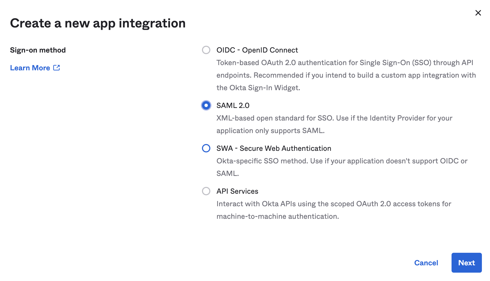

System for Cross-Domain Identity Management (SCIM) is an open standard protocol for the automation of user provisioning.

Automatic provisioning refers to creating users and user groups in Harness. In addition to creating these, automatic provisioning includes the maintenance and removal of users and user groups as and when required.

This topic describes how to build a SCIM endpoint using OKTA and integrate it with Harness.

### Before you begin

* This topic assumes you understand System for Cross-domain Identity Management (SCIM). For an overview, see the article [Introduction to System for Cross-domain Identity Management (SCIM)](https://medium.com/@pamodaaw/system-for-cross-domain-identity-management-scim-def45ea83ae7).
* [Learn Harness' Key Concepts](https://docs.harness.io/article/hv2758ro4e-learn-harness-key-concepts)
* [Access Management (RBAC) Overview](../4_Role-Based-Access-Control/1-rbac-in-harness.md)
* Make sure you are an Administrator in your Okta account and have the **Account Admin** permissions in Harness.
* Make sure you have a Harness [API Key](../4_Role-Based-Access-Control/7-add-and-manage-api-keys.md) and a valid Token under it. The API Key must have all permissions on the Users and User Groups.

### Review: Harness Okta SCIM Integration

By using Okta as your identity provider, you can efficiently provision and manage users in your Harness Account, Org and Project. Harness' [SCIM](https://www.okta.com/blog/2017/01/what-is-scim/) integration enables Okta to serve as a single identity manager, for adding and removing users, and for provisioning User Groups. This is especially efficient for managing many users.

In exchange for the convenience of Okta-provisioned users and groups, you must configure several aspects of Okta, as described in the following sections. You will also have restrictions on modifying Okta-provisioned users and groups natively within Harness, as described in [Limitations](#limitations).

#### Features Supported

Once you have set up the SCIM integration between Okta and Harness (as described below), Administrators will be able to perform the following Harness actions within Okta:

* [Create users](#option-create-users), individually, in your Harness app.
* [Assign Okta-defined groups](#option-assign-groups) to your Harness app.
* [Group push](#group-push-to-harness) already-assigned groups to Harness.
* [Update User Attributes](#option-update-user-attributes) from Okta to Harness.
* [Deactivate Users](#deactivate-users) in Okta and Harness.

### Limitations

When you provision Harness User Groups and users from Okta, you will not be able to modify some of their attributes in Harness Manager. You must do so in Okta.

Operations that you *cannot* perform on Okta-provisioned User Groups within Harness Manager are:

* Managing users within the User Group.
* Adding users to the User Group.
* Removing users from the User Group.
* Renaming the User Group.
* Deleting the User Group.

If a User Group provisioned from Okta duplicates the name of an existing Harness User Group, Harness will maintain both groups. To prevent confusion, you are free to rename the native User Group (but not the Okta-provisioned group).

Where a User Group has been provisioned from Okta, you cannot use Harness Manager to edit the member users' details (**Email Address**, **Full Name**, or **User Groups** assignments).

You must use Okta to assign these users to other User Groups (to grant corresponding permissions). You must also use Okta to delete these users from Harness, by removing them from the corresponding Okta app.

When you use Okta to directly assign users to Harness, those users initially have no User Group assignments in Harness. With this method, you are free to use Harness Manager to add and modify User Group assignments.

### Step 1: Create App Integration in Okta

To automate the provisioning of users and groups, you must add a Harness app to your Okta administrator account. To do that perform the following steps

Log in to your Okta administrator account and click **Applications**.

Click **Create App Integration**.

The **Create a new app integration** dialogue appears. Select **SAML 2.0** and click **Next**.

In **General Settings**, enter a name in the **Application label** field, and click **Next**.

The SAML settings appear.

Enter your **Single sign on URL**. To get the Single sign on URL, add your account ID to the end of the following

URL: `https://app.harness.io/gateway/api/users/saml-login?accountId=`

In **Audience URI (SP Entity ID)**, enter `app.harness.io`.

In **Attribute Statements (optional)**, enter name in the **Name** field, select **Name Format** as **Basic,** and select the **Value** as **user.email**.

In **Group Attribute Statements (optional)**, enter a name in the **Name** field, select **Name format (optional)** as **Basic**, select an appropriate **Filter**, and enter its value.

Click **Next**.

The **Feedback** options appear. Select option and click **Finish**.

Click **General** and then click **Edit** in **App Settings.**

Select **Enable SCIM provisioning** in **Provisioning**. Click **Save**.

### Step 2: Authorize Okta Integration

In your Okta administrator account and click **Applications > Applications**.

Search your Application.

Click **Provisioning** and then click **Integration**.

Click **Edit**.

In **SCIM connector base URL** enter the Base URL for your API endpoint.

To get the **SCIM connector base URL**, add your account ID to the end of the following

URL: `https://app.harness.io/gateway/ng/api/scim/account/`

Enter `userName` in **Unique identifier field for users** and select **Supported provisioning actions**.

Select **Authentication Mode** as HTTP Header and enter your API Token in **Bearer**.

For information on how to create an API Token in Harness, see [Add and Manage API Keys](../4_Role-Based-Access-Control/7-add-and-manage-api-keys.md).

Click **Test Connection** and then **Save** after the test is successful.

Your Okta app is now authorized with Harness.

Next, click **To App** settings in **Provisioning** and enable **Create Users**, **Update User Attributes** and **Deactivate Users**.

Click **Save**.

### Option: Create Users

To directly assign your Harness app to individual (existing) Okta users, thereby provisioning the users in your Harness Account perform the following steps:

In your Okta application, click **Assignments**.

Click **People**.

Click **Assign** > **Assign to People**. The Assignments settings appear.

Select users and click **Assign**.

Click **Save and Go Back**.

Click **Done** after you have assigned all the intended users.

Users with the Harness app assignment now appear in **People**.

You can edit or delete users from here.

The user is now listed in your Harness account.

### Option: Assign Groups

To assign the Harness app to Okta-defined groups of users, perform the following steps:

In your Okta application, click **Assignments**.

Click **Groups**.

Click **Assign** > **Assign to Groups**. The Assignments settings appear.

Select groups and click **Assign**.

Click **Save and Go Back**.

Click **Done** after you have assigned all the intended groups.

Groups with the Harness app assignment now appear in **Groups**.

You can edit or delete users from here.

#### Group Push to Harness

To provision your application's assigned groups in Harness:

Click **Push Groups** in your application, then select **Push Groups** > **Find Groups by Name.**

Search for the group(s) you want to provision.

Click **Save**. You can see the status of this Push Group in your application.

If an error prevents adding, deleting, or updating an individual user to Harness, you must retry provisioning the user in Okta later, after resolving the issues. For more information, see [Troubleshooting Group Push](https://help.okta.com/en-us/Content/Topics/users-groups-profiles/usgp-group-push-troubleshoot.htm).This group is now listed in your Harness account.

 When provisioning user groups through SCIM, Harness replaces any `.`,`-`, or a space in your user group name and uses it as the group identifier. For example, if your group name is `example-group` in your SCIM provider, its identifier in Harness would be `example_group`.
 
 ### Option: Update User Attributes

You can edit a user's profile in Okta to update the following attribute values for the corresponding user in Harness:

* Given name
* Family name
* Primary email
* Primary email type
* Display name

To update user attributes:

1. From your Okta administrator account, select **Directory** > **People**.
2. Locate the user you want to edit, and click their name to display their profile.
3. Click the **Profile** tab, then click the **Edit** button.
4. Update the desired attributes, then click **Save**.

Only the five fields listed at the top of this section will be synced to Harness users. You can update values in other fields, but those values will be saved for this user only in Okta. They won't be reflected in Harness.  
The Display name in Okta is displayed as the user name in Harness.

#### Deactivate Users

You can deactivate users in Okta to delete their Harness accounts, as follows:

1. From Okta's top menu, select **Directory** > **People**, then navigate to the user you want to deactivate.
2. From that user's profile, select **More Actions** > **Deactivate**.
3. Click **Deactivate** in the resulting confirmation dialog.

Deactivating a user removes them from all their provisioned apps, including Harness. While a user account is deactivated, you cannot make changes to it. However, as shown below, you can reactivate users by clicking **Activate** on their profile page.

### What If I Already Have App Integration for Harness FirstGen?

If you currently have a Harness FirstGen App Integration setup in your IDP and are now trying to set up one for Harness NextGen, make sure the user information is also included in the FirstGen App Integration before attempting to log into Harness NextGen through SSO.

Harness authenticates users using either the FirstGen App Integration or the NextGen App Integration. If you have set up both, Harness continues to use your existing App Integration in FirstGen to authenticate users that attempt to log in using SSO.Let us look at the following example:

1. An App Integration is already set up for FirstGen with 2 users as members:  
`user1@example.com` and `user2@example.com`.
2. Now you set up a separate App Integration for Harness NextGen and add `user1@example.com` and `user_2@example.com` as the members.
3. You provision these users to Harness NextGen through SCIM.
4. `user1@example.com` and `user_2@example.com` try to log in to Harness NextGen through SSO.
5. The FirstGen App Integration is used for user authentication.  
`user1@example.com` is a member of the FirstGen App Integration and hence is authenticated and successfully logged in to Harness NextGen.  
`user_2@example.com` is not a member of the FirstGen App Integration, hence the authentication fails and the user cannot log in to Harness NextGen.

### Assigning Permissions Post-Provisioning

Permissions can be assigned manually or via the Harness API:

* [Add and Manage Roles](../4_Role-Based-Access-Control/9-add-manage-roles.md)
* [Add and Manage Resource Groups](../4_Role-Based-Access-Control/8-add-resource-groups.md)
* [Permissions Reference](../4_Role-Based-Access-Control/ref-access-management/permissions-reference.md)

