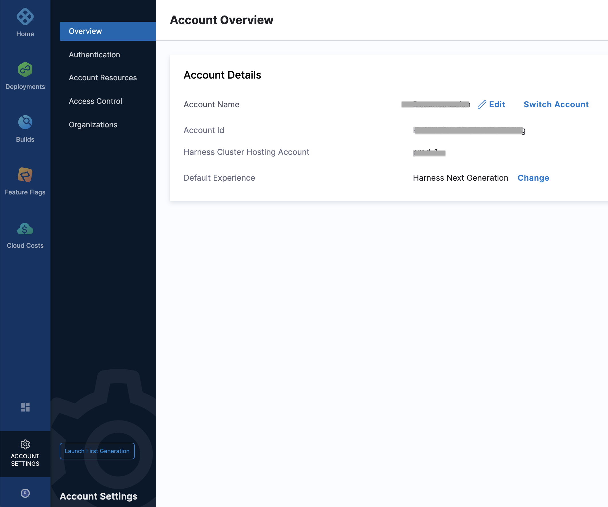
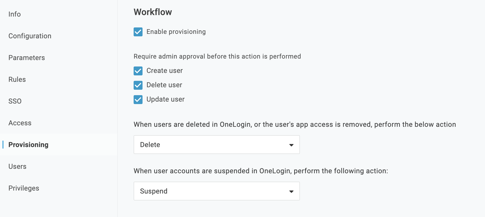
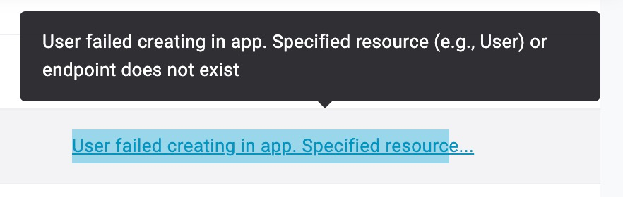
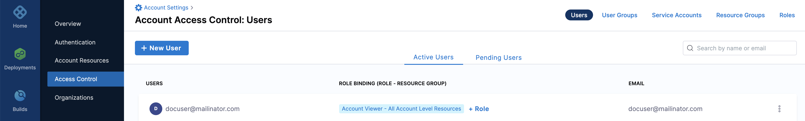

You can use OneLogin to provision users and groups in Harness.

Harness' SCIM integration enables OneLogin to serve as a single identity manager for adding and removing users. This is especially efficient for managing large numbers of users.

This topic describes how to set up OneLogin provisioning for Harness Users and User Groups.

### Before you begin

* This topic assumes you understand the System for Cross-domain Identity Management (SCIM). For an overview, see the article [Introduction to System for Cross-domain Identity Management (SCIM)](https://medium.com/@pamodaaw/system-for-cross-domain-identity-management-scim-def45ea83ae7).
* [Learn Harness' Key Concepts](https://ngdocs.harness.io/article/hv2758ro4e-learn-harness-key-concepts)
* [Access Management (RBAC) Overview](../4_Role-Based-Access-Control/1-rbac-in-harness.md)
* Make sure you are an Administrator in your OneLogin account and have the **Account Admin** permissions in Harness.
* Make sure you have a Harness [API Key](../4_Role-Based-Access-Control/7-add-and-manage-api-keys.md) and a valid Token under it. The API Key must have all permissions on the Users and User Groups.

### Limitations

This integration does not support updating a provisioned user's **Email** in OneLogin. Once the user is provisioned in Harness, the user's email address must remain the same. If you change the email address in OneLogin and then try to remove the user from Harness, the removal will fail.

Once a user is provisioned in Harness, you cannot delete the user in the Harness Manager. You must delete the user in OneLogin.

The provisioned user cannot use the Harness OneLogin app to log into Harness unless OneLogin is also set up for [OneLogin SAML authentication in Harness](https://docs.harness.io/article/zy8yjcrqzg-single-sign-on-sso-with-saml#saml_sso_with_one_login). They must use their email address and password.

### Step 1: Add Harness App to OneLogin​

The first step is adding the Harness app to your OneLogin **Applications**.

1. In **Applications**, click **Add App**.
2. Search for **Harness**. The Harness Application appears.
3. Click the Harness app to open its Configuration page and click **Save**.

When you are done, the Harness OneLogin app appears.

For more information on adding apps, see OneLogin's documentation: [Introduction to App Management](https://onelogin.service-now.com/support/?id=kb_article&sys_id=6ac91143db109700d5505eea4b9619a2#add).

### Step 2: SCIM Base URL

Next, add a special Harness account URL to the OneLogin app's SCIM Base URL.

1. Log into your Harness account.
2. Copy the Harness account ID from the **Account Overview** of your Harness account.
   
   

3. Add your account ID to the end of the following URL: `https://app.harness.io/gateway/ng/api/scim/account/<account_ID>`

:::note
For Harness On-Prem, the URL will use your custom domain name and `gateway` is omitted. For example, if your On-Prem domain name is **harness.mycompany.com**: `https://harness.mycompany.com/ng/api/scim/account/<account_ID>`
:::

4. Copy the full URL.
5. In OneLogin, open the Harness OneLogin app.
6. Click **Configuration**.
7. In **SCIM Base URL**, paste the Harness URL you copied.

Next, we will use a Harness API access key for the **SCIM Bearer Token** setting in your Harness OneLogin app.

### Step 3: SCIM Bearer Token

The SCIM Bearer Token value is used to authenticate requests and responses sent between the OneLogin SCIM provisioning service and Harness.

1. In Harness Manager, create an API token by following the instructions in [Add and Manage API Keys](../4_Role-Based-Access-Control/7-add-and-manage-api-keys.md).
2. Copy the new API token.
3. In OneLogin, paste the API token in the **SCIM Bearer Token** setting in your Harness OneLogin app.
4. Ensure that the API Status is enabled and click **Save**.

### Step 4: Set Up Harness OneLogin App Provisioning

Next, you will set the required provisioning settings for the Harness OneLogin app.

Ensure these settings are set up exactly as shown below.

1. In the Harness OneLogin app, click **Provisioning**.
2. In **Workflow**, ensure the following are selected:
* Enable provisioning
* Create user
* Delete user
* Update user
* When users are deleted in OneLogin, or the user's app access is removed, perform the below action: **Delete**.
* When user accounts are suspended in OneLogin, perform the following action: **Suspend**.

When you are done, it will look like this:

3. Click **Save**.

### Option: Provision OneLogin Users to Harness

Next, we will add users to the Harness OneLogin app. Once OneLogin SSO is enabled in Harness, these users will be provisioned in Harness automatically.

1. In OneLogin, click **Users**.
2. Click a user.
3. In **User Info**, ensure that the user has **First name**, **Last name**, and **Email** completed.

:::note
Only **First name**, **Last name**, and **Email** are permitted for Harness OneLogin SCIM provisioning. Do not use any additional User Info settings.
:::

4. Click **Applications**.
5. In the **Applications** table, click the add button **(+)**.
6. In the **Assign new login** settings, select the Harness OneLogin App and click **Continue**.
7. In **NameID**, enter the email address for the user. This is the same email address in the **NameID** setting.
8. Click **Save**. The status in the **Applications** table is now **Pending**.
9.  Click **Pending**. The **Create User in Application** settings appear.
10. Click **Approve**. The Provisioning status will turn to Provisioned.

If provisioning fails, you might see something like the following error:

The most common reason is incorrect **SCIM Base URL** or **SCIM Bearer Token** settings in the OneLogin app.

If an error prevents adding, deleting, or updating an individual user to Harness, you must retry provisioning the user in OneLogin later, after resolving the issues. For more information, see **Review and Approve Provisioning Tasks for Your SCIM Test App** in [Test Your SCIM Implementation](https://developers.onelogin.com/scim/test-your-scim).

### Verify Provisioning in Harness

Now that you have provisioning confirmation from OneLogin, let's verify that the provisioned user is in Harness.

1. In Harness, click **Account Settings**, and then select **Access Control**.
2. Click **Users**.
3. Locate the provisioned user.

The provisioned users will receive an email invite from Harness to sign up and log in.

### Option: Provision OneLogin Roles to Harness Groups

You can create, populate, and delete Harness User Groups using OneLogin.

Due to OneLogin currently not supporting group deletion via SCIM, you must remove User Groups using OneLogin. If you try to delete OneLogin-provisioned User Groups within Harness, you will get the error message, `Cannot Delete Group Imported From SCIM`. Once the group is removed from OneLogin, contact Harness Support to have it removed from Harness.To perform Harness User Group provisioning using OneLogin, you assign the Harness OneLogin app and OneLogin users to a OneLogin role.

Next, you create a rule in the Harness OneLogin app that creates groups in Harness using the role.

The OneLogin roles become User Groups in Harness.

You cannot provision OneLogin users to Harness User Groups if they are already provisioned in Harness. Simply remove them from Harness and then provision them using the step below.

#### Add User Provisioning to the Harness OneLogin App

1. Ensure the Harness OneLogin app is added and configured as described in steps 1 through 5 in this topic.
2. In OneLogin, open the Harness OneLogin app.
3. In **Parameters**, in **Optional Parameters**, click on **Groups**.
4. In **Edit Field Groups**, select **Include in User Provisioning** and click **Save**.
5. Click **Save** to save the Harness OneLogin app.

Next, we'll create the OneLogin role that will be used as your Harness User Group.

#### Create OneLogin Role

1. In OneLogin, click **Users** and select **Roles**.
2. Click **New Role**.
3. Enter a name for the new role and click **Save**.
4. In **Roles**, open the new role.
5. Click **Users**.
6. In **Check existing or add new users to this role**, enter the name(s) of the users to add.
7. When you have located each user name, click **Check**.
8. For each user, click **Add to Role**. When you are done, the user(s) are listed in **Users Add Manually**.
9. Click **Save**. You are returned to the Roles page.
10. Open the role.
11. In the role, click **Applications**.
12. Click the **Add Apps** button.
13. In **Select Apps to Add**, click the Harness OneLogin app.
14. Click **Save**.

Now that the role has users and the Harness OneLogin app, we can add the Harness OneLogin app to each OneLogin user.

#### Add Harness OneLogin app to Users

For each of the OneLogin users you have added to the role, you will now add the Harness OneLogin app.

1. In OneLogin, click **Users**, and then select each user you want to add.
2. On the user's page, click **Applications**.
3. Click the **Add App** button.
4. In **Assign new login**, select the Harness OneLogin app, and click **Continue**.
5. In the **Edit** settings, in **Groups**, select the role you created and click **Add**.
6. Click **Save**.

Now that each user is associated with the Harness OneLogin app and role, you will learn /add a rule to the Harness OneLogin app. The rule will set groups in the Harness OneLogin app using the role you created.

#### Add Rule to Harness OneLogin App

Next, you create a rule in the Harness OneLogin app to create groups using the role you created.

1. Click **Application**, and then select the Harness OneLogin app.
2. In the app, click **Rules**.
3. Click **Add Rule**.
4. Name the rule.
5. In **Actions**, select **Set Groups in [Application name]**.
6. Select **Map from OneLogin**.
7. In **For each**, select **role**.
8. In **with value that matches**, enter the name of the role you create or enter the regex `.*`.
9. Click **Save**.
10. Click **Save** to save the app.

If you have created users prior to adding the mapping rule, click Reapply Mappings in your Harness application User settings:Now that the app has a rule to set groups in Harness using the role you created, you can begin provisioning users using the app.

#### Provision Users in Application

Each of the OneLogin users that you added the Harness OneLogin app to can now be provisioned.

1. In the Harness OneLogin app, click **Users**. The users are listed as **Pending**.
2. Click each user and then click **Approve**.

The Provisioning State for each user is changed to **Provisioned**.

#### See the Provisioned User Group in Harness

Now that you have provisioned users using the Harness OneLogin app, you can see the new group and users in Harness.

1. In Harness, click **Access Management**.
2. Click **User Groups**.
3. Locate the name of the User Group. It is named after the role you created. Click the **User Group**.

You can see the User Group and Users that are provisioned.

Repeat the steps in this process for additional users.

When provisioning user groups through SCIM, Harness replaces any `.`,`-`, or a space in your role name and uses it as the group identifier. For example, if your role name is `example-group`in your SCIM provider, its identifier in Harness would be `example_group`.

### What If I Already Have App Integration for Harness FirstGen?

If you currently have a Harness FirstGen App Integration setup in your IDP and are now trying to set up one for Harness NextGen, make sure the user information is also included in the FirstGen App Integration before attempting to log into Harness NG through SSO.

Harness authenticates users using either the FirstGen App Integration or the NextGen App Integration. If you have set up both, Harness continues to use your existing App Integration in FirstGen to authenticate users that attempt to log in using SSO.Let us look at the following example:

1. An App Integration is already set up for FirstGen with 2 users as members:  
`user1@example.com` and `user2@example.com`.
2. Now you set up a separate App Integration for Harness NextGen and add `user1@example.com` and `user_2@example.com` as the members.
3. You provision these users to Harness NextGen through SCIM.
4. `user1@example.com` and `user_2@example.com` try to log in to Harness NextGen through SSO.
5. The FirstGen App Integration is used for user authentication.  
`user1@example.com` is a member of the FirstGen App Integration and hence is authenticated and successfully logged in to Harness NextGen.  
`user_2@example.com` is not a member of the FirstGen App Integration, hence the authentication fails and the user cannot log in to Harness NextGen.

### Assign Permissions Post-Provisioning

Permissions can be assigned manually or via the Harness API:

* [Add and Manage Roles](../4_Role-Based-Access-Control/9-add-manage-roles.md)
* [Add and Manage Resource Groups](../4_Role-Based-Access-Control/8-add-resource-groups.md)
* [Permissions Reference](../4_Role-Based-Access-Control/ref-access-management/permissions-reference.md)

