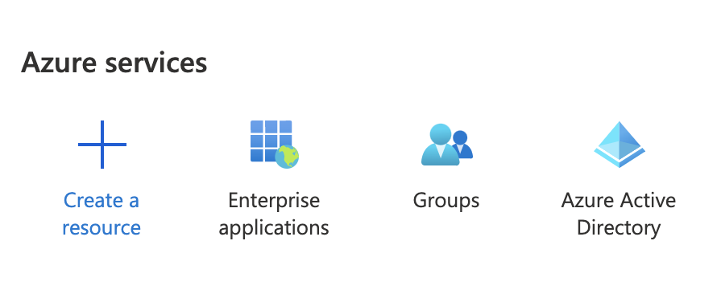
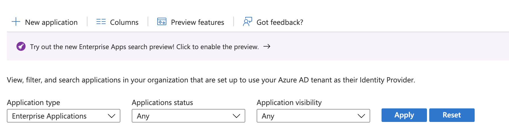
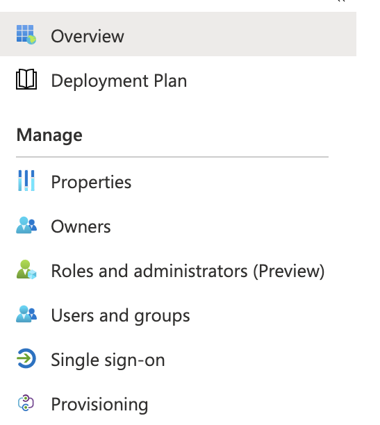
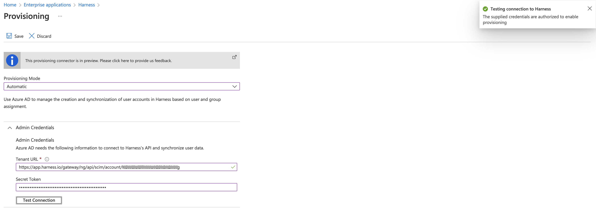
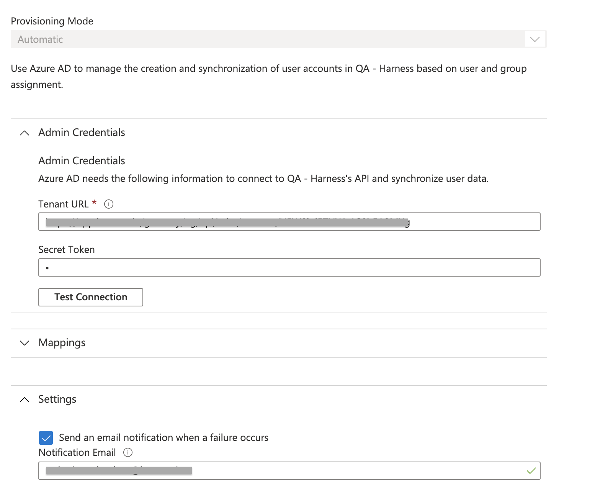
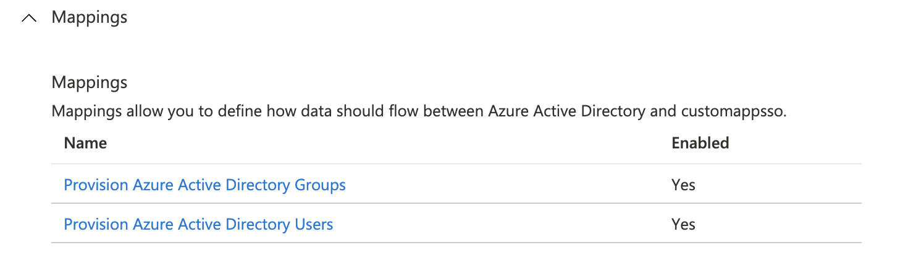
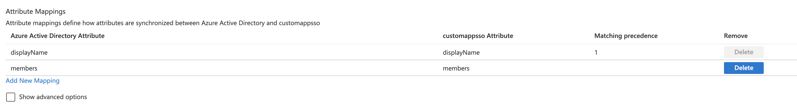
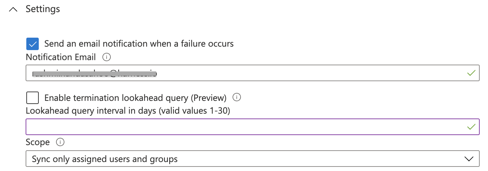

System for Cross-Domain Identity Management (SCIM) is an open standard protocol for the automation of user provisioning.

Automatic provisioning refers to creating users and user groups in Harness. In addition to creating these, automatic provisioning includes the maintenance and removal of users and user groups as and when required.

This topic explains how to configure Azure Active Directory (Azure AD) to automatically provision users or groups to Harness.

### Before you begin

* This topic assumes you understand the System for Cross-domain Identity Management (SCIM). For an overview, see the article [Introduction to System for Cross-domain Identity Management (SCIM)](https://medium.com/@pamodaaw/system-for-cross-domain-identity-management-scim-def45ea83ae7).
* Make sure you are an Administrator in your Azure AD account and have the **Account Admin** permissions in Harness.
* Make sure you have a Harness [API Key](../4_Role-Based-Access-Control/7-add-and-manage-api-keys.md) and a valid Token under it. The API Key must have all permissions on the Users and User Groups.

### Review: Harness Azure AD SCIM Integration

By using Azure AD as your identity provider, you can efficiently provision and manage users in your Harness Account, Org and Project. Harness' [SCIM](https://www.okta.com/blog/2017/01/what-is-scim/) integration enables Azure AD to serve as a single identity manager, for adding and removing users, and for provisioning User Groups. This is especially efficient for managing many users.

In exchange for the convenience of Azure AD-provisioned users and groups, you must configure several aspects of Azure AD, as described in the following sections. You will also have restrictions on modifying Azure AD-provisioned users and groups natively within Harness, as described in [Limitations](#limitations).

#### Features Supported

Once you have set up the SCIM integration between Azure AD and Harness (as described below), Administrators will be able to perform the following Harness actions within Azure AD:

* Create users, individually, in your Harness app.
* Assign Azure AD-defined groups to your Harness app.
* Group push already-assigned groups to Harness.
* Update User Attributes from Azure AD to Harness.
* Deactivate Users in Azure AD and Harness.

### Limitations

When you provision Harness User Groups and users from Azure AD, you will not be able to modify some of their attributes in Harness Manager. You must do so in Azure AD.

Operations that you *cannot* perform on Azure AD-provisioned User Groups within Harness Manager are:

* Managing users within the User Group.
* Adding users to the User Group.
* Removing users from the User Group.
* Renaming the User Group.
* Deleting the User Group.

If a User Group provisioned from Azure AD duplicates the name of an existing Harness User Group, Harness will maintain both groups. To prevent confusion, you are free to rename the native User Group (but not the Azure AD-provisioned group).

Where a User Group has been provisioned from Azure AD, you cannot use Harness Manager to edit the member users' details (**Email Address**, **Full Name**, or **User Groups** assignments).

You must use Azure AD to assign these users to other User Groups (to grant corresponding permissions). You must also use Azure AD to delete these users from Harness, by removing them from the corresponding Azure AD app.

When you use Azure AD to directly assign users to Harness, those users initially have no User Group assignments in Harness. With this method, you are free to use Harness Manager to add and modify User Group assignments.

### Step 1: Add Harness from the Gallery

Before you configure Harness for automatic user provisioning with Azure AD, you need to add Harness from the Azure AD application gallery to your list of managed SaaS applications.

1. In the [Azure portal](https://portal.azure.com/), in the left pane, select **Azure Active Directory**.
2. Select **Enterprise applications** > **All applications**.
3. Click **New application** to add a new application.
4. In the search box, enter **Harness**, select **Harness** in the results list, and then select the **Add** button to add the application. You can now provision users to Harness.

### Step 2: Provision Users to Harness

1. In your Azure portal, go to Enterprise Applications > All applications.
2. In the applications list, select **Harness**.
3. Select **Provisioning**.
4. In the **Provisioning Mode** drop-down list, select **Automatic**.
5. Under **Admin Credentials**, do the following:
	1. In the **Tenant URL** box, enter `https://app.harness.io/gateway/ng/api/scim/account/<your_harness_account_ID>`.  
	You can obtain your Harness account ID from the **Account Overview** of your Harness account.
	2. In the **Secret Token** box, enter the SCIM Authentication Token value. This is your Harness API token within your API Key. Make sure this key's permissions are inherited from the **Account Administrator** User Group.  
	For more information on how to create API token, see [Add and Manage API Keys](../4_Role-Based-Access-Control/7-add-and-manage-api-keys.md).
	3. Select **Test Connection** to ensure that Azure AD can connect to Harness.
	If the connection fails, ensure that your Harness account has Admin permissions, and then try again.
6. In **Settings**, in the **Notification Email** box, enter the email address of a person or group that should receive the provisioning error notifications.
7. Select **Save**.
8. Under **Mappings**, enable **Provision Azure Active Directory Groups,** and **Provision Azure Active Directory Users**.
9. Click **Provision Azure Active Directory Users**.
10. Under **Attribute Mappings**, review the user attributes that are synchronized from Azure AD to Harness. The attributes selected as *Matching* are used to match the user accounts in Harness for update operations. Select **Save** to commit any changes.
11. In **Provisioning**, click **Provision Azure Active Directory Groups**.When provisioning user groups through SCIM, Harness replaces any `.`,`-`, or a space in your group name and uses it as the group identifier. For example, if your group name is `example-group`in your SCIM provider, its identifier in Harness would be `example_group`.
12. Under **Attribute Mappings**, review the group attributes that are synchronized from Azure AD to Harness. The attributes selected as *Matching* properties are used to match the groups in Harness for update operations. Select **Save** to commit any changes.
13. To configure scoping filters, see [Attribute-based application provisioning with scoping filters](https://docs.microsoft.com/en-us/azure/active-directory/app-provisioning/define-conditional-rules-for-provisioning-user-accounts).
14. In **Provisioning**, under **Settings**, to enable the Azure AD provisioning service for Harness, toggle the **Provisioning Status** switch to **On**.
15. Under **Settings**, in the **Scope** drop-down list, select how you want to sync the users or groups that you're provisioning to Harness.
16. Click **Save**.

This operation starts the initial sync of the users or groups you're provisioning. The initial sync takes longer to perform than later ones. Syncs occur approximately every 40 minutes, as long as the Azure AD provisioning service is running. To monitor progress, go to the **Synchronization Details** section. You can also follow links to a provisioning activity report, which describes all actions performed by the Azure AD provisioning service on Harness.

For more information about how to read the Azure AD provisioning logs, see [Report on automatic user account provisioning](https://docs.microsoft.com/en-us/azure/active-directory/app-provisioning/check-status-user-account-provisioning).

If an error prevents adding, updating, or deleting an individual user to Harness, Azure retries the operation in the next sync cycle. To resolve the failure, administrators must check the [provisioning logs](https://learn.microsoft.com/en-us/azure/active-directory/reports-monitoring/concept-provisioning-logs?context=azure/active-directory/manage-apps/context/manage-apps-context) to determine the root cause and take the appropriate action. For more information, see [Errors and retries](https://learn.microsoft.com/en-us/azure/active-directory/app-provisioning/how-provisioning-works#errors-and-retries).

### What If I Already Have App Integration for Harness FirstGen?

If you currently have a Harness FirstGen App Integration setup in your IDP and are now trying to set up one for Harness NextGen, make sure the user information is also included in the FirstGen App Integration before attempting to log into Harness NextGen through SSO.

Harness authenticates users using either the FirstGen App Integration or the NextGen App Integration. If you have set up both, Harness continues to use your existing App Integration in FirstGen to authenticate users that attempt to log in using SSO.Let us look at the following example:

1. An App Integration is already set up for FirstGen with 2 users as members:  
`user1@example.com` and `user2@example.com`.
2. Now you set up a separate App Integration for Harness NextGen and add `user1@example.com` and `user_2@example.com` as the members.
3. You provision these users to Harness NextGen through SCIM.
4. `user1@example.com` and `user_2@example.com` try to log in to Harness NextGen through SSO.
5. The FirstGen App Integration is used for user authentication.  
`user1@example.com` is a member of the FirstGen App Integration and hence is authenticated and successfully logged in to Harness NextGen.  
`user_2@example.com` is not a member of the FirstGen App Integration, hence the authentication fails and the user cannot log in to Harness NextGen.

