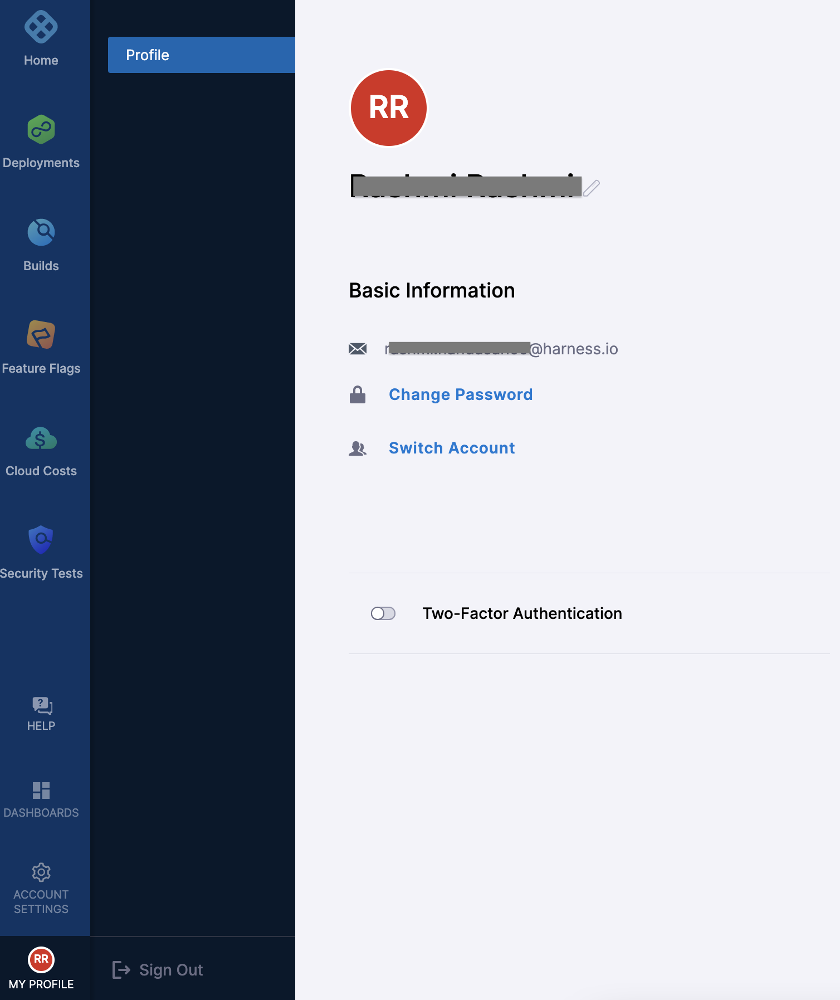
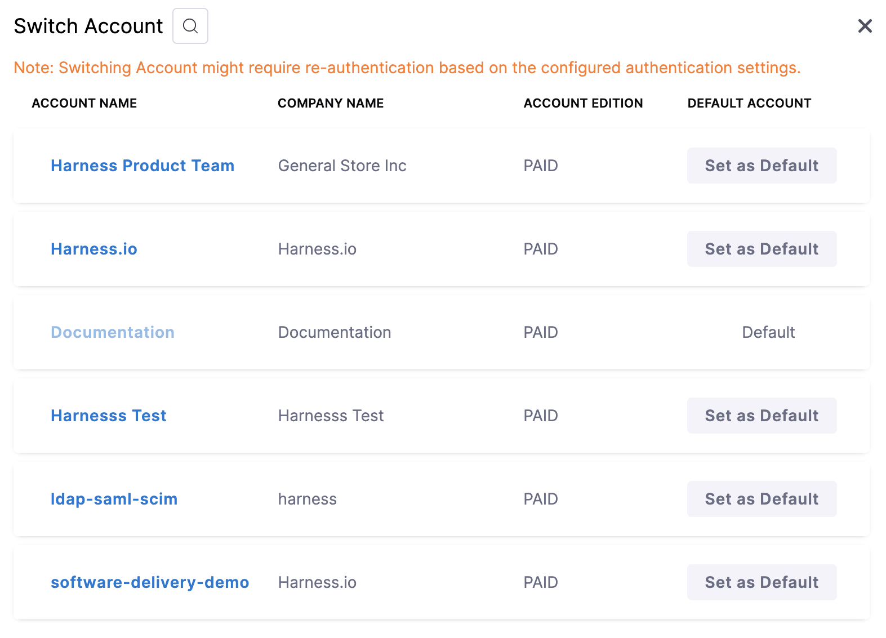

You can be a part of more than one Harness Accounts.

This topic explains how to switch between multiple Accounts in Harness.

### View and switch Accounts

You can check to see if you are a part of multiple Accounts by clicking on your User Profile. 

Click **Switch Account**. The **Switch Account** settings appear.

All the Accounts that you are a member of, are listed here. 

You can set a specific Account as default by clicking **Set as Default**.

Switching Accounts might require re-authentication based on the configured authentication settings.The following table shows which settings will need a re-authentication when you switch accounts:

|  |  |  |
| --- | --- | --- |
| **Authentication Setting of Current Account** | **Authentication Setting of the switch Account** | **Need to Re-authenticate** |
| Username and Password | <li> Username and Password </li><li>Username and Password + OAuth</li><li>OAuth (All Providers</li><li>OAuth (Google + GitHub)</li><li>OAuth (Google)</li><li> SAML (SSO Settings 1)</li><li>SAML (SSO Settings 2)</li><li>LDAP (Settings 1)</li><li>LDAP (Settings 2)</li><li>Whitelisted domains</li><li>2FA at Account scope + OAuth</li> | Yes |
| Username and Password + OAuth | <li> Username and Password</li><li>Username and Password + OAuth</li><li> OAuth (All Providers)</li><li>OAuth (Google + GitHub)</li><li>OAuth (Google)</li><li>SAML (SSO Settings 1)</li><li>SAML (SSO Settings 2)</li><li>LDAP (Settings 1)</li><li>LDAP (Settings 2)</li><li>Whitelisted domains</li><li>2FA at Account scope + OAuth</li>| Yes |
| OAuth (All providers) | <li> Username and Password </li><li>Username and Password + OAuth</li><li> OAuth (Google + GitHub)</li><li>OAuth (Google)</li><li>SAML (SSO Settings 1)</li><li>SAML (SSO Settings 2)</li><li>LDAP (Settings 1)</li><li>LDAP (Settings 2)</li><li>Whitelisted domains</li><li>2FA at Account scope + OAuth</li>| Yes |
| OAuth (All providers) | <li> OAuth (All Providers)</li>| No |
| OAuth (Google + GitHub) | <li> Username and Password</li><li>Username and Password + OAuth</li><li>OAuth (All Providers)</li><li> OAuth (Google)</li><li>SAML (SSO Settings 1)</li><li>SAML (SSO Settings 2)</li><li>LDAP (Settings 1)</li><li>LDAP (Settings 2)</li><li>Whitelisted domains</li><li>2FA at Account scope + OAuth</li>| Yes |
| OAuth (Google + GitHub) | * OAuth (Google + GitHub)| No |
| OAuth (Google) | <li> Username and Password</li><li>Username and Password + OAuth</li><li>OAuth (All Providers)</li><li>OAuth (Google + GitHub)</li><li>SAML (SSO Settings 1)</li><li>SAML (SSO Settings 2)</li><li>LDAP (Settings 1)</li><li>LDAP (Settings 2)</li><li>Whitelisted domains</li><li>2FA at Account scope + OAuth</li>| Yes |
| OAuth (Google) | <li> OAuth (Google)</li>| No |
| SAML (SSO Settings 1) | <li> Username and Password</li><li>Username and Password + OAuth</li><li>OAuth (All Providers)</li><li>OAuth (Google + GitHub)</li><li>OAuth (Google)</li><li>SAML (SSO Settings 2)</li><li> LDAP (Settings 1)</li><li>LDAP (Settings 2)</li><li>Whitelisted domains</li><li>2FA at Account scope + OAuth</li>| Yes |
| SAML (SSO Settings 1) | <li> SAML (SSO Settings 1)</li>| No |
| SAML (SSO Settings 2) | <li> Username and Password</li><li>Username and Password + OAuth</li><li>OAuth (All Providers)</li><li>OAuth (Google + GitHub)</li><li>OAuth (Google)</li><li> SAML (SSO Settings 1)</li><li>LDAP (Settings 1)</li><li>LDAP (Settings 2)</li><li> Whitelisted domains</li><li>2FA at Account scope + OAuth</li>| Yes |
| SAML (SSO Settings 2) | <li> SAML (SSO Settings 2)</li>| No |
| LDAP (Settings 1) | <li> Username and Password</li><li> Username and Password + OAuth</li><li> OAuth (All Providers)</li><li>OAuth (Google + GitHub)</li><li>OAuth (Google)</li><li>SAML (SSO Settings 1)</li><li>SAML (SSO Settings 2)</li><li>LDAP (Settings 2)</li><li>Whitelisted domains</li><li>2FA at Account scope + OAuth</li>| Yes |
| LDAP (Settings 1) | <li> LDAP (Settings 1)</li>| No |
| LDAP (Settings 2) | <li> Username and Password </li><li>Username and Password + OAuth</li><li>OAuth (All Providers)</li><li>OAuth (Google + GitHub)</li><li> OAuth (Google)</li><li>SAML (SSO Settings 1)</li><li>SAML (SSO Settings 2)</li><li>LDAP (Settings 1)</li><li>Whitelisted domains</li><li>2FA at Account scope + OAuth</li>| Yes |
| LDAP (Settings 2) | <li> LDAP (Settings 2)</li>| No |
| Whitelisted domains  | <li>OAuth</li><li>OAuth (All Providers)</li><li>OAuth (Google + GitHub)</li><li>OAuth (Google)</li><li>SAML (SSO Settings 1)</li><li>SAML (SSO Settings 2)</li><li>LDAP (Settings 1)</li><li>LDAP (Settings 2)</li><li>2FA at Account scope + OAuth</li>| Yes |
| Whitelisted domains  | <li> Whitelisted domains</li>| No |
| 2FA at Account scope + OAuth | <li> Username and Password</li><li>Username and Password + OAuth</li><li> OAuth (All Providers)</li><li>OAuth (Google + GitHub)</li><li>OAuth (Google)</li><li>SAML (SSO Settings 1)</li><li>SAML (SSO Settings 2)</li><li>LDAP (Settings 1)</li><li>LDAP (Settings 2)</li><li>Whitelisted domains</li>| Yes |
| 2FA at Account scope + OAuth | <li> 2FA at Account scope + OAuth </li>| No |

