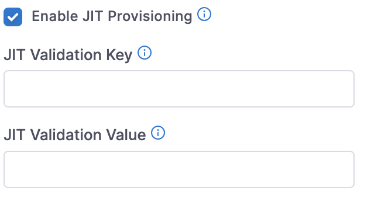

:::important
Currently, this feature is behind the feature flag `PL_ENABLE_JIT_USER_PROVISION`. Contact [Harness Support](mailto:support@harness.io) to enable the feature.
:::

Just-in-time (JIT) provisioning in Harness lets you provision users automatically upon first sign-in to Harness through SAML SSO.
Harness automatically provisions and allows access to users added to your SAML applications.
Provisioning users automatically eliminates repetitive tasks related to manual provisioning, simplifying user management.

:::important
Harness supports JIT provisioning only if a new user attempts to log in via IDP.
:::

## Enable JIT provisioning in Harness

To enable JIT provisioning in Harness: 
1. Select **ACCOUNT SETTINGS**, and then **Authentication**.
2. Select **SAML Provider**.
   The **Add SAML Provider** settings appear.
3. In **Name**, enter a name for the SAML provider.
4. In **Select a SAML Provider**, select one of the following: 
   - Azure: For steps to configure, go to [SAML SSO with Azure](/docs/platform/Authentication/single-sign-on-saml#saml-sso-with-azure).
   - Okta: For steps to configure, go to [SAML SSO with Okta](/docs/platform/Authentication/single-sign-on-saml#saml-sso-with-okta).
   - OneLogin: For steps to configure, go to [SAML SSO with OneLogin](/docs/platform/Authentication/single-sign-on-saml#saml-sso-with-onelogin).
   - Other: For steps to configure, go to [SAML SSO with Keycloak](/docs/platform/Authentication/single-sign-on-saml#saml-sso-with-keycloak).
5. Select **Enable JIT Provisioning**. 
   This enables Just-In-Time (JIT) provisioning to add users to Harness on their first login via the configured SAML provider.

   

6. To control who can get added to Harness on their first login, define the key-value that must be present in the SAML assertions by entering the following: 
   - **JIT Validation Key**: The SAML assertion must contain this key on first login.
   - **JIT Validation Value**: The value for the validation key that must be present in the SAML assertion on first login.

Harness automatically provisions any new SAML users with the matching **JIT Validation Key** and **JIT Validation Value** after they log in for the first time.
If you do not provide **JIT Validation Key** and **JIT Validation Value**, Harness allows all SAML users to be provisioned just in time.
