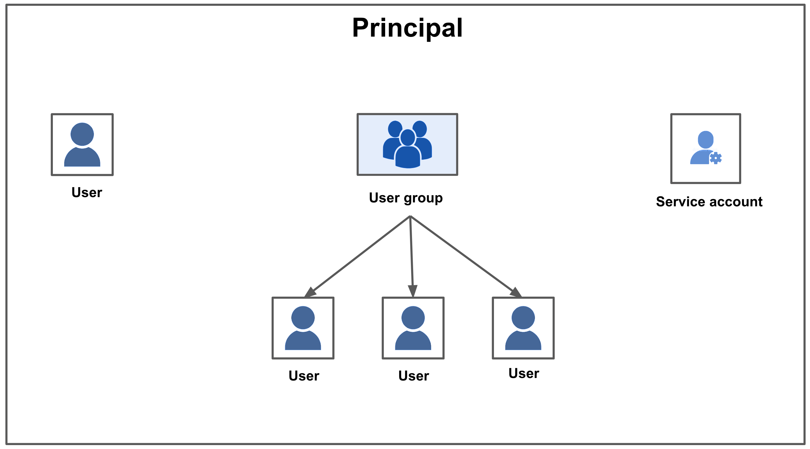
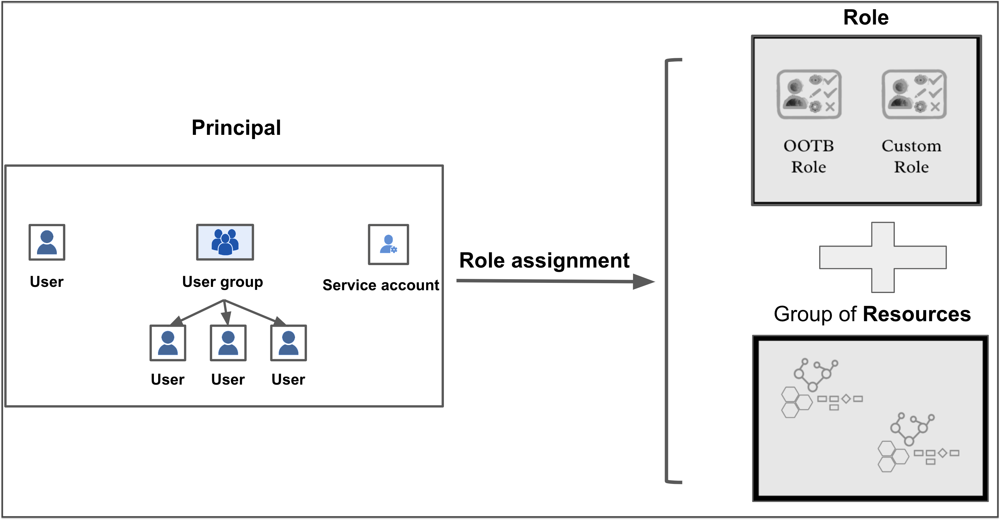

Role-based access control (RBAC) lets you control who can access your resources and what actions they can perform on the resources. To do this, the administrator of your Harness account assigns required permissions for a set of resources to the members within your account.

This topic explains the concepts and components that apply to RBAC in Harness.

## Benefits of using RBAC

Using RBAC helps you:

- Ensure that users have access to only the information and resources necessary to perform their tasks. This reduces the risk of security breaches and unauthorized access to sensitive data.

- Create a systematic, repeatable assignment of permissions. RBAC saves time and increases efficiency for administrators who would otherwise need to manage access to individual user accounts. You can quickly add and change roles, as well as implement them across APIs.

- Increase accountability by clearly defining who has access to specific resources and information. This makes it easier to track and audit user activities, helping to identify and prevent misuse or abuse of access privileges. 

- More effectively comply with regulatory and statutory requirements for confidentiality and privacy. It lets you enforce policies related to privacy and data protection.

## Overview of the hierarchical setup in Harness

The Harness platform has a hierarchical structure consisting of the following three levels, which are called scopes in Harness RBAC: 

- Account
- Organization (Org)
- Project

This structure helps you organize and manage your resources efficiently by giving you a fine-grained control over your resources.
The administrators can apply permissions at different levels, making it easy to delegate responsibilities to different teams. Using this structure, Harness provides a granular approach to access control that is flexible, scalable, and easy to manage.

Here is a visual summary of the hierarchy: 

Account

The scope of an account is at the highest level, encompassing all the resources within the Harness subscription. It provides a way to manage billing, user authentication, and global settings for all the organizations and projects within the account. Users with the appropriate permissions can manage the account-level settings, including billing, subscription, and SSO configuration.

Resources created in the account scope are available for use in all the organizations and projects within that account.

Organization

The scope of an organization is used to group related projects, resources, and users within a specific domain or business unit. It provides a way to manage resources and permissions specific to a particular organization. Users with the appropriate permissions can manage organization-level settings, including the creation of projects and user groups, and assigning access policies to those user groups.

Resources created in the organization scope are available for use in all the projects within that organization.

Project

The scope of a project is used to group related resources, such as applications, pipelines, and environments. It provides a way to manage resources and permissions specific to a particular project. Users with the appropriate permissions can manage project-level settings, including the creation of pipelines, environments, and infrastructure definitions.

Resources created in the project scope are only available in that project.

The scope at which you create resources depends on the level of control and visibility you require.

For example, if you create a connector in the account scope, it is visible and can be used by all organizations and projects within that account. 

However, if you create a connector in the organization or project scope, it is only visible and can be used within that organization or project. 

This lets you control access to your resources more effectively and prevent unauthorized access.

To know more about organizations and projects, see [Create Organizations and Projects](../organizations-and-projects/create-an-organization.md).

## RBAC components

Harness provides access control by combining Principals, Resource Groups, and Roles.

### Principal

  A principal is an entity that can be assigned to a role and subsequently granted permissions to access certain resources or perform specific actions within a system. A principal can be one of the following: 
  * **Users:** These are individual users within the Harness system. A user can belong to many user groups.  
    For more information on creating a new user, see [Add and Manage Users](../3_User-Management/3-add-users.md).
  * **User Groups:** User groups contain multiple Harness users. Each user group has assigned roles. You can create user Groups at account/org/project scope.  
    For more information on creating a new user group, see [Add and Manage User Groups](../3_User-Management/4-add-user-groups.md).
  * **Service Account:** A service account is a set of [API Keys](../3_User-Management/7-add-and-manage-api-keys.md) with a set of permissions assigned to them via role assignment. API keys are used for authenticating and authorizing remote services attempting to perform operations in Harness via our APIs. API keys that are part of a service account are assigned permissions (equivalent to users) that service accounts inherit.  
   For more information on creating a new service account, see [Add and Manage Service Accounts.](../3_User-Management/6-add-and-manage-service-account.md)
    
    

### Resource Groups

A resource group is a set of Harness resources that a principal can access. You can create resource groups at account, org, or project scope.  
For more information on creating a new resource group, see [Add and Manage Resource Groups](../4_Role-Based-Access-Control/8-add-resource-groups.md).

  Resource Groups can be of two types:

  * **All Resources**– Collection of all the resources of a given type.
  * **Named Resources**– Collection of a specific set of individual resources.

    

  Harness includes the following default Resource Groups at each scope:

    |  |  |  |
    | --- | --- | --- | --- |
    | **Scope** | **Resource Group** | **Description** | **Visual summary** |
    | **Account** | **All Resources Including Child Scopes** | Includes all resources within the account's scope, as well as those within the scope of the orgs and projects within the account. | <docimage path={require('./static/entire-account.png')} />|
    | **Account** | **All Account Level Resources** | Includes all resources within the account's scope. Excludes resources that are within the scope of an org or project. | <docimage path={require('./static/account-only.png')}/> |
    | **Org** | **All Resources Including Child Scopes** | Includes all the resources within the org's scope, as well as those within the scope of all projects within the org. | <docimage path={require('./static/entire-org.png')}/> |
    | **Org** | **All Organization Level Resources** | Include all resources within the org's scope. Excludes resources that are within the scope of a project. | <docimage path={require('./static/org-only.png')}/> |
    | **Project** | **All Project Level Resources** | Includes all resources within the scope of a project. | <docimage path={require('./static/project-only.png')}/> |

  You can also create custom resource groups within any scope.

  For more information, see [Add and Manage Resource Groups](../4_Role-Based-Access-Control/8-add-resource-groups.md).

### Roles

A role is a set of permissions that allow or deny specific operations on a specific set of resources. A Role defines access to resources within a single scope — project/org/account. 

Harness has the following types of roles: 
- Out of the box roles (OOTB): These are built-in roles that you can use for access control. 
  Harness provides the following default roles at the account, org, and project scope:

   |  |  |
   | --- | --- |
   | **Scope** | **Role** |
   | **Account** | <ul><li>Account Admin</li> <li>Account Viewer</li> <li>Feature Flag Manage Role</li></ul> |
   | **Org** | <ul><li>Organization Admin</li> <li>Organization Viewer</li> <li>Feature Flag Manage Role</li></ul> |
   | **Project** | <ul><li>Project Admin</li> <li>Project Viewer</li> <li>Pipeline Executor</li> <li>Feature Flag Manage Role</li></ul> |
 

- Custom roles: These are the custom roles that you can create for a fine-grained access control.
  You can create roles at account, org, or project scope.
  For more information on creating a new role, see [Add and Manage Roles](../4_Role-Based-Access-Control/9-add-manage-roles.md).

## Role assignment

A role assignment consists of the following elements:

* Principal
* Role
* Resource Group
* Scope
  

Following are a few key points for role assignment in Harness:

* Role assignment is assigning a role and a resource group to a principal.
* The principal gets access to resources through a role assignment.
* Each principal can have multiple role assignments.
* Depending on where you need to set up access control, you may assign roles at the account, org, or project scope.

* An account administrator assigns a role and resource group to a principal - user or user group or service account. This assignment is called [Role Assignment](#role-assignment).
* Role assignment grants the principal the permissions from the role on the set of resources in the resource group.

The following list explains the different role assignments with the default roles and resource groups:

|  |  |
| --- | --- |
| **Role Assignment (Default Role + Default Resource Group)** | **Description** |
| **Account Admin +** **All Resources Including Child Scopes** | A principal with this role assignment has all permissions on all the resources in the account scope as well as organizations and projects scopes within the entire account.
 |
| **Account Admin +** **All Account Level Resources** | A principal with this role assignment has all permissions on all the resources in the account scope only.
 |
| **Account Viewer +** **All Resources Including Child Scopes** | A principal with this role assignment has view permissions on all the resources in the account as well as organizations and projects scopes within the entire account.
 |
| **Account Viewer +** **All Account Level Resources** | A principal with this role assignment has view permissions on all the resources in the account scope only.
 |
| **Feature Flag Manage Role +** **All Resources Including Child Scopes** | A principal with this role assignment has create and edit permissions on Feature Flags and Target Management in the account as well as organizations and projects scopes within the entire account.
 |
| **Feature Flag Manage Role +** **All Account Level Resources** | A principal with this role assignment has create and edit permissions on Feature Flags and Target Management in the account scope only.
 |
| **Organization Admin +** **All Resources Including Child Scopes** | A principal with this role assignment has all permissions on all the resources in the organization as well as projects within the organization.
 |
| **Organization Admin + All Organization Level Resources** | A principal with this role assignment has all permissions on all the resources in the organization scope only.
 |
| **Organization Viewer +** **All Resources Including Child Scopes** | A principal with this role assignment has view permissions on all the resources in the organization as well as projects within the organization.
 |
| **Organization Viewer + All Organization Level Resources** | A principal with this role assignment has view permissions on all the resources in the organization scope only.
 |
| **Feature Flag Manage Role +** **All Resources Including Child Scopes** | A principal with this role assignment has create and edit permissions on Feature Flags and Target Management in the organizations, and projects within the entire organization.
 |
| **Feature Flag Manage Role + All Organization Level Resources** | A principal with this role assignment has create and edit permissions for Feature Flags and Target Management in the organization scope only.
 |
| **Project Admin + All Project Level Resources** | A principal with this role assignment has all permissions on all the resources within the project scope.
 |
| **Project Viewer + All Project Level Resources** | A principal with this role assignment has view permissions on all the resources in the project.
 |
| **Feature Flag Manage + All Project Level Resources** | A principal with this role assignment has create and edit permissions for Feature Flags and Target Management within the project scope.
 |
| **Pipeline Executor + All Project Level Resources** | A principal with this role assignment has the following permissions:<li> View permission on resource group, project, users, user groups, and roles</li><li> View and Access permissions on secrets, connectors, environments, services</li><li> View and Execute permissions on pipelines</li>|

### Overlapping role assignments

RBAC is an additive model. When a Harness user is a member of multiple user groups, the union of all the role assignments determines the effective permissions for the user.

For example, let us consider a user with the following role assignments:

* **Account Admin** role for **All Resources Including Child Scopes**.
* **Organization Viewer** role for **All Resources Including Child Scopes**.

The sum of these role assignments is effectively the **Account Admin** role for **All Resources Including Child Scopes.** Therefore, in this case, the **Organization Viewer** role for **All Resources Including Child Scopes** has no impact.

By default, users will have **View** permissions for all resources at all scopes (account/org/project).

## Extending RBAC

You can provide more control by using rules to restrict access based on a combination of attributes, such as type of environments or connectors.

For more information, see [Attribute-Based Access Control](../4_Role-Based-Access-Control/2-attribute-based-access-control.md).

## Example access control setup for pipeline execution

The following example shows you how to set up access control for pipeline execution.

Pipelines are composite entities that can contain multiple stages like CI, CD, and STO. There can be many steps in each stage, such as build, test, push, and deploy. 

A pipeline can reference other resources in it like:

- GitHub connector: Check out the code for the build.

- Artifact repository connector: Fetch the image for deployment.

- Cloud Provider connector: Get access to the infrastructure where deployment will happen.

- Secrets: Connect to various services.

To execute a pipeline, the principals need the following permissions:

- Execute permissions on the pipeline.

- Access permissions for the resources used in the pipeline.

### Example workflow to create a principal, roles, and resource groups

The following example shows you how to create a user group as the principal.
1. Create a [user group](../3_User-Management/4-add-user-groups.md) named `SampleUG` in the account scope.
2. Create a [custom role](../4_Role-Based-Access-Control/9-add-manage-roles.md) named `SampleRole` in the project scope.
   Add the `Execute` permission for pipeline and `Access` permission for connectors in this role.
3. Create a [custom resource group](../4_Role-Based-Access-Control/8-add-resource-groups.md) named `SampleResourceGroup` in the project scope.
   Include pipelines and all the connectors your pipeline needs in this resource group.

   The following table explains the ways in which you can grant execute permission for a pipeline:

   |  Resource scope     |  Description     |
   |  ---  |  ---  |
   |  Grant execute permission on specific pipelines.    | Select specific pipelines in the resource group at the project level. **Note:** You cannot select specific pipelines when resource groups are created at the org or account scope. |
   |  Grant execute permissions on all the pipelines in a specific project.    |   Select all the pipelines in the resource group created at the project level.    |
   |  Grant execute permissions on all the pipelines in all the projects within an org.    |   Select scope of the resource group created at org level as `All` and select all the pipelines.    |
   |  Grant execute permissions on all the pipelines in the entire account.    |  Select scope of the resource group created at account level as `All` and selecting all the pipelines.     |

   The following table explains the ways in which you can grant access permission for the required resources: 

   |  Resource scope     |   Description    |
   |  ---  |  ---  |
   |   Grant access permissions on specific resources.    |  Select specific resources in the resource group at the project, org or account scope.      |
   |   Grant access permissions on all the resources in pipelines for a specific project.    |  Select all the resources used in the pipeline in the corresponding resource group created at the project scope.    |
   |   Grant access permissions on all the resources used in the pipeline in the entire org.   |   Select scope of the resource group created at org scope as `All` and select all the resources used in the pipeline.   |
   |   Grant access permissions on all the resources used in all the pipelines in the entire account.  |   Select scope of the resource group created at account level as `All` and select all the resources used in all the pipeline.    |

4. Assign `SampleRole` and `SampleResourceGroup` to `SampleUG`.

The members of `SampleUG` can now execute pipelines and access the connectors referenced in the pipeline.
## Blog post

The following blog post walks you through user and role management in Harness:

[User and Role Management in the Harness Software Delivery Platform](https://harness.io/blog/continuous-delivery/user-role-management/)

## Next steps

* [Add and Manage Users](../3_User-Management/3-add-users.md)
* [Add and Manage User Groups](../3_User-Management/4-add-user-groups.md)
* [Add and Manage Service Accounts](../3_User-Management/6-add-and-manage-service-account.md)
* [Add and Manage Resource Groups](../4_Role-Based-Access-Control/8-add-resource-groups.md)
* [Add and Manage Roles](../4_Role-Based-Access-Control/9-add-manage-roles.md)
* [Attribute-Based Access Control](../4_Role-Based-Access-Control/2-attribute-based-access-control.md)
* [Permissions Reference](../4_Role-Based-Access-Control/ref-access-management/permissions-reference.md)