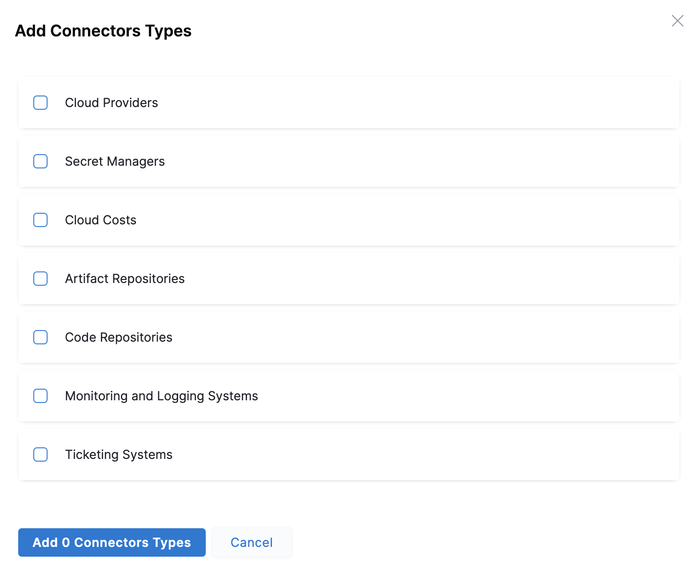
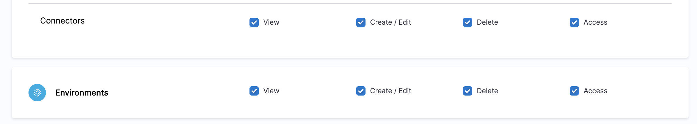
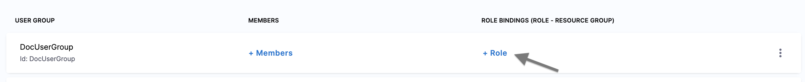

Harness Attribute-Based Access Control (ABAC) lets you grant access to your Resources based on attributes associated with the your Harness Resources.

This topic shows you how to configure ABAC in Harness.

### Before you begin

* [Learn Harness' Key Concepts](https://docs.harness.io/article/hv2758ro4e-learn-harness-key-concepts)
* [Create Organizations and Projects​](../1_Organizations-and-Projects/2-create-an-organization.md)
* Make sure you have Admin rights for the Account/Org/Project where you want to configure Access Management.​

### Attribute-Based Access Control Overview

Harness [Role-Based Access Control](../4_Role-Based-Access-Control/1-rbac-in-harness.md) (RBAC) helps you manage who has access to your Harness resources, what they can do with those resources, and in what scope they have access.

RBAC is role-based. This means permissions to resources are determined by the roles assigned to Users, User Groups, and Service Accounts.

Harness ABAC builds on top of Harness RBAC by adding [role assignment](../4_Role-Based-Access-Control/1-rbac-in-harness.md#role-assignment) conditions based on attributes in the context of specific actions. It lets you provide more fine-grained access management or simplify the management of hundreds of role assignments.​ 

With Harness ABAC, you can have an additional check based on the type of your Harness Resources and then do the Role Assignments. The Resource type filters down the Resource Groups for access control.

For example, you can create a Resource Group with all the Production Environments and grant access to this Resource Group through Role Assignment.

### Why and when should I use Harness ABAC?

Harness ABAC helps you achieve the following:

* Provide more fine-grained access control.
* Help reduce the number of Role Assignments.
* Use attributes that have specific business meaning.

Following are a few examples of scenarios to configure ABAC:

* Create/Edit, Delete and Access permissions only for Non-Production Environments.
* Create/Edit, Delete and Access permissions only for Secret Managers.
* View permission for Code Repositories.

### Where can I configure ABAC?

You can add attributes to configure ABAC for the following Harness resources:

* Connectors: Type of Connectors
* Environments: Type of Environments

The following table shows the attributes you can select for Harness ABAC:

|  |  |
| --- | --- |
| **Resource** | **Attributes** |
| **Connectors** | <li> Cloud Providers</li><li>Secret Managers</li><li>Cloud Costs</li><li>Artifact Repositories</li><li>Code Repositories</li><li>Monitoring and Logging Systems</li><li>Ticketing Systems</li>|
| **Environments** | <li> Production</li><li>Non-Production</li>|

### Step 1: Add a new Resource Group

You can configure ABAC in the Account, Org, or Project scope.​

This topic shows you how to configure ABAC in the Project scope.

To configure ABAC for Resources, perform the following steps:

1. In your Harness Account, go to **PROJECT SETUP** in your Project.
2. Click **Access Control** and click **Resource Groups**.
3. Click **New Resource Group**.
4. Enter a **Name** for your Resource Group.
5. Click **Save**.

### Step 2: Select Resources and add Attributes

1. In **Resources**, select **ENVIRONMENTS**.
2. In **SHARED RESOURCES**, select **Connectors**.
3. You can filter and include resources in your Resource Group in the following ways:
	1. All: you can select all the resources of the selected type for the chosen scope.
	2. By Type: you can select a specific type of resource for the chosen scope.
	3. Specified: you can select specific resources for the chosen scope.Select **By Type** against Environments and click **Add**. The Add Environment Types settings appear.

1. Select **Non-Production** and click **Add.**
2. Select **By Type** against Connectors and click **Add**. The Add Connector Type settings appear.
Select **Secret Managers** and click **Add**.​
3. Click **Save**.

### Step 3: Add a new Role

1. In your Harness Account, go to **PROJECT SETUP** in your Project.
2. Click **Access Control** and click​ **Roles**.
3. Click **New Role**. The New Role settings appear.​
4. Enter a **Name** for your Role and click **Save**.
5. Select all permissions for Environments and Connectors.
6. Click **Apply Changes**.

### Step 4: Assign Role and Resource Group

Let us now complete the [Role Assignment](../4_Role-Based-Access-Control/1-rbac-in-harness.md#role-assignment) for the User Group to complete the ABAC setup.

1. In your Harness Account, go to **PROJECT SETUP** in your Project.
2. Click **Access Controls** and click **User Groups**.
3. Locate your User Group to assign the Role and Resource Group you just created.
4. Click **Role**.
5. In **Role,** select the Role that you created.
6. In **Resource Group,** select the Resource Group you just created.​
7. Click **Apply**.
The members of the User group now have all permissions for Non-Production Environments and connectors that are of type Secret Managers.

