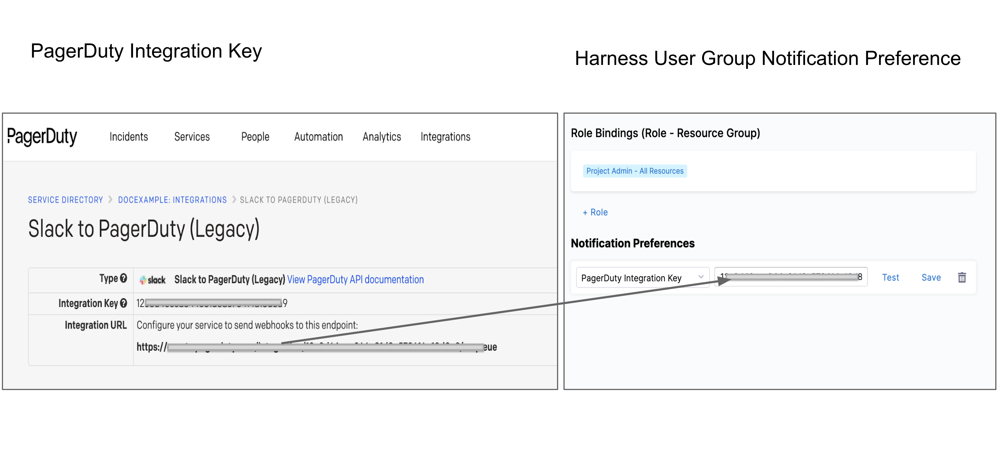

Harness User Groups help you manage user access. Each member of a User Group inherits the [role bindings](./1-rbac-in-harness.md#role-assignment) assigned to that group.

This topic explains the steps to create and manage User Groups within Harness.

### Before you begin

* Make sure you have **Manage** Permissions for User Groups.

### Step: Add New User Group

This topic assumes you have a Harness Project set up. If not, see [Create Organizations and Projects](../1_Organizations-and-Projects/2-create-an-organization.md).

You can add a User Group in Project/Organization/Account scope. To do this, go to Project SETUP, Organization, or Account Resources.

In your **Project/Org/Account**, and click **Project/Org/Account SETUP**.

Click **Access Control**.

In **User Groups** click **New User Group**. The New User Group settings appear.

Enter a **Name** for your **User Group**.

Enter **Description** and [**Tags**](../20_References/tags-reference.md) for your **User Group**.

Select Users under **Add Users**.

Click **Save**.

Your User Group is now listed under User Groups. You can assign Roles to your User Group by clicking on **Role**.

### Step: Delete User Group

Click **User Groups** under **Access** **Control**.

Click **Delete** on the top right corner for the User Group you want to delete.

### Step: Manage User Group

Click the **User Groups** in **Access Control**.

Click the User Group you want to edit. The User Group details appear.

Click **Members** to invite Users to this Group.

Click **Remove** to delete User from this Group.

Click **Role** to change Role Bindings for this User Group.

### Step: Assign Roles

Harness lets you inherit User Groups created at a higher scope by using **Assign Roles**. For example, you can inherit and use User Group(s) created at the Account scope in the Org or Project scope.

To inherit the User Group at the child scope, you must have view User Group permissions at the parent scope and manage User Group permissions at the child scope.​​You can modify the inherited User Group's role bindings in the child scope, but not the member or notification settings. Changes to the User Group in the parent scope will be reflected in the child scope as well.​

You can inherit a User Group from any parent scope to a child scope.

This topic shows you how to inherit a User Group from the Account scope to the Project scope.

In Harness, go to your Project and click **Access Control** in **Project Setup**.

Click **User Groups**.

Click **Assign Roles**. The Assign Roles settings appear.

In User Group(s), click **Select User Group(s)**. All the User Group(s) that you have permission to view across the scopes are listed.

Select the User Group(s) that you want to inherit from any of the parent scopes to your Project. Click **Apply Selected**.

Click **Add** to assign Roles and Resource Groups to this User Group in your Project scope.

Select **Roles** and **Resource Groups** and click **Apply**.

The User Group is now listed in User Groups.

You can get the list of child scopes where the User Group is inherited by clicking on the User Group at the parent scope.

### Option: Notification Preferences

You can set notification channels for your User Group members using **Notification Preferences**.

When the User Group is assigned an Alert Notification Rule, the channels you set here will be used to notify them.

To add notification preferences to Harness User Groups, perform the following steps:

1. In your **Account**/**Organization**/**Project** click Access Control.
2. Click **User Groups**.
3. Select the User Group to which you want to add notification preferences.
4. In **Notification Preferences**, click **Channel**.
5. Configure one or more notification settings from the following options and click **Save:**
	* **Email/Alias** – Enter any group email addresses where Harness can send notifications. For more details, see [Send Notifications Using Email](../5_Notifications/add-smtp-configuration.md#option-send-notifications-for-a-user-group-using-email).
	* **Slack Webhook URL** – Enter the Slack channel Incoming Webhook URL. For more details, see [Send Notifications Using Slack](../5_Notifications/send-notifications-using-slack.md).
	* **PagerDuty Integration Key** – Enter the key for a PagerDuty Account/Service to which Harness can send notifications. You can copy/paste this key from **Integrations** of your service in **Services** > **Service Directory.**
	* **Microsoft Teams Webhook URL** - Enter the Microsoft Teams Incoming Webhook URL.

### See also

* [Add and Manage Users](./3-add-users.md)
* [Harness Default User Groups](./5-harness-default-user-groups.md)
* [Add and Manage Roles](./9-add-manage-roles.md)
* [Add and Manage Resource Groups](./8-add-resource-groups.md)
* [Permissions Reference](./ref-access-management/permissions-reference.md)

