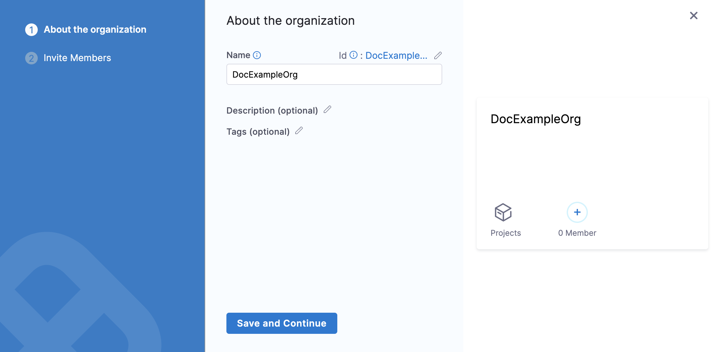

Harness has default User Group in each scope. These groups have all the users at the respective scope as their members.

Whenever you create a new Organization or Project, Harness creates a default User Group in its scope.

For example, if you add a new Organization to your Account, Harness creates a default User Group in the Organization. This group will have all the users within the scope of the Organization.

This topic explains the default User Groups at each scope and how you can do the Role Assignment for each of them.

### Harness default User Groups overview

Harness adds the scope-specific default User group to all your existing Accounts, Organizations, and Projects as well as to any Organization and Project that you create later.

The users that you add in the Account scope will **not** be assigned the **Account Viewer** role by default. The user's default role assignment is the same as the role assignment of the default User Group in the Account.The following table explains the default User Group at the individual scopes:

|  |  |  |
| --- | --- | --- |
| **Scope** | **Default User Group Name** | **Description** |
| Account | **All Account Users** | All the users in the Account scope are members of this User Group. |
| Organization | **All Organization Users** | All the users in the Organization scope are members of this User Group. |
| Project | **All Project Users** | All the users in the Project scope are members of this User Group. |

* When you add a new Organization or Project, the default role assignment for the default User Group is that of **Organization Viewer** and **Project Viewer** respectively.
* When you add a user to an existing Account, Organization, or Project, Harness adds the user to the default User Group in the scope where you added the user.  
For example, if you add a user to your existing Organization `OrgExample`, Harness will add the user to the All Organization Users group within `OrgExample`.
* Admin can do the required [role assignment](./1-rbac-in-harness.md#role-assignment) for the default User Groups.
* When you add a user to your Harness Account, the user's default role assignment is the same as the role assignment of the default User Group in the Account.  
For example, the **All Account Users** group in your Account has the role assignment of **Account Viewer**. All the members of this group can view resources within the scope of this Account. Now, you add a new user to this Account.  
Harness adds this user to the **All Account Users** group and the role assignment of this user is **Account Viewer** which is inherited from the default User Group of this Account.

You cannot create, edit, or delete the default User Groups. Harness manages them.

### Assign Role-Bindings for default User Group in a new Organization

1. In your Harness Account, click **Account Settings.**
2. Click **Organizations**.
3. Click **New Organization**. The new Organization settings appear.
4. In **Name**, enter a name for your Organization.
5. Enter **Description**, and [Tags](https://harness.helpdocs.io/article/i8t053o0sq-tags-reference) for your new Org.
6. Click **Save and Continue**.
7. Click **Finish**.  
Your Organization now appears in the list of Organizations.
8. Click on your Organization and then click **Access Control**.
9. Click **User Groups**.  
**All Organization Users** is the default User Group with a default role assignment of **Organization Viewer**.
10. To assign another role to this User Group, click **Role**.  
The **Add Role** settings appear.
11. Click **Add**.
12. In **Roles**, select a Harness built-in Role or a custom Role that you have created for the desired permissions.  
For more information on built-in roles and custom roles, see [Add and Manage Roles](./9-add-manage-roles.md).
13. In **Resource Groups**, select a Harness built-in Resource Group or a custom Resource Group that you have created for the desired resources.  
For more information on built-in roles and custom roles, see [Add and Manage Resource Groups](./8-add-resource-groups.md).
14. Click **Apply**.

All the existing members and any new members that you add to this Organization will have the role bindings that you just added.

