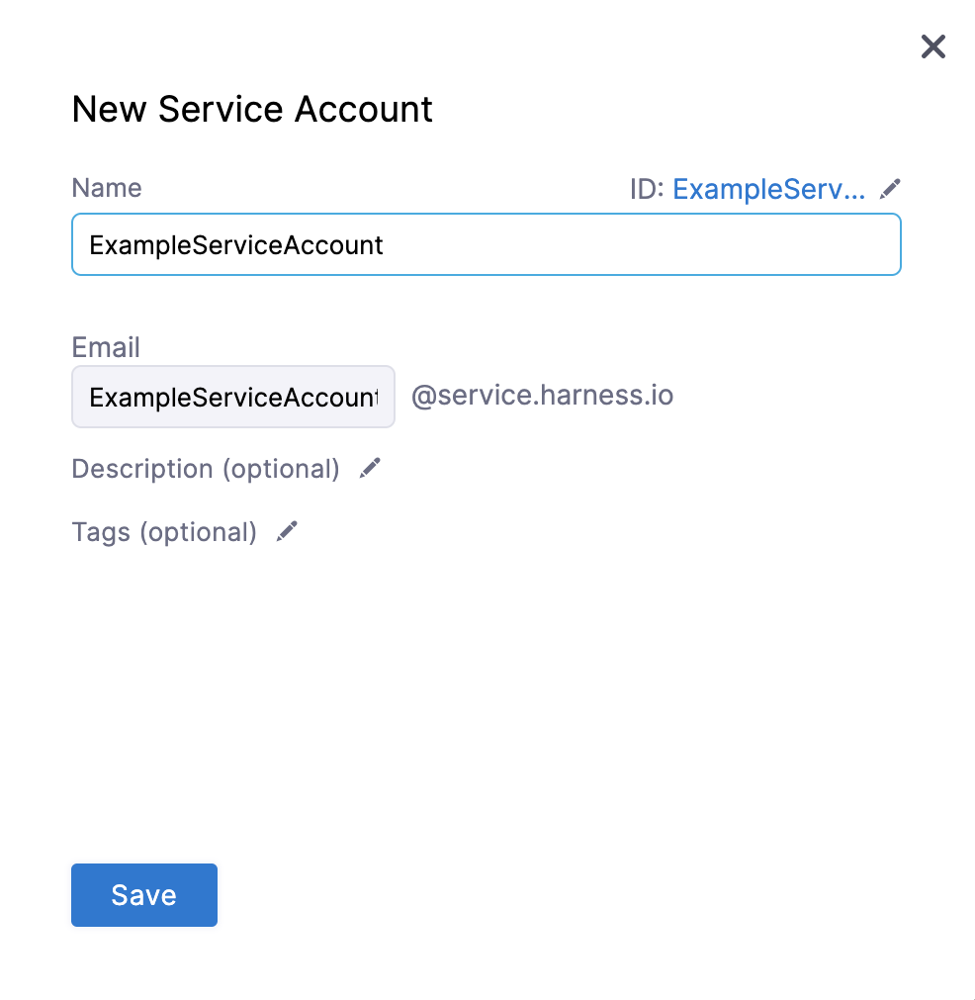
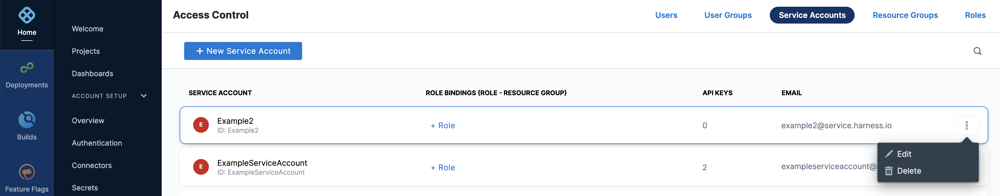

Admin Users of an account can create a Service Account with specific Role Bindings.

### Before you begin
* Make sure you are an Account Admin to Create, Edit, Delete, and Manage Service Accounts.  
For more details, see [API Permissions Reference](./ref-access-management/api-permissions-reference.md).

### Create a Service Account

In Harness, click **Home**.

In **ACCOUNT SETUP**, click **Access Control**.

Click **Service Accounts**, click **+ New Service Account**.

In the **New Service Account** settings page, enter a **Name**.

Enter **Email**, **Description**, and **Tags** for this Account.

Click **Save**. Your Service Account is created.

Click **+Role** to assign Role Bindings to the Service Account you just created.

For step-by-step instructions to add Roles and Resource Groups, see [Add and Manage Roles](./9-add-manage-roles.md) and [Add and Manage Resource Groups](./8-add-resource-groups.md).

For step-by-step instructions to add an API key to your Service Account that you just created, see [Add and Manage API Keys](./7-add-and-manage-api-keys.md).

### Edit a Service Account

In Harness, click **Home**.

In **ACCOUNT SETUP**, click **Access Control**.

Click **Service Accounts**. All the Service Accounts are listed.

Click the more options button (**︙**) next to the Service Account you want to edit.

Click **Edit**.

Follow the steps in [Create a Service Account](./6-add-and-manage-service-account.md#create-a-service-account) to modify any of the configured settings.

### Delete a Service Account

In Harness, click **Home**.

In **ACCOUNT SETUP**, click **Access Control**.

Click **Service Accounts**. All the Service Accounts are listed.

Click the more options button (**︙**) next to the Service Account you want to delete.

Click **Delete**.

