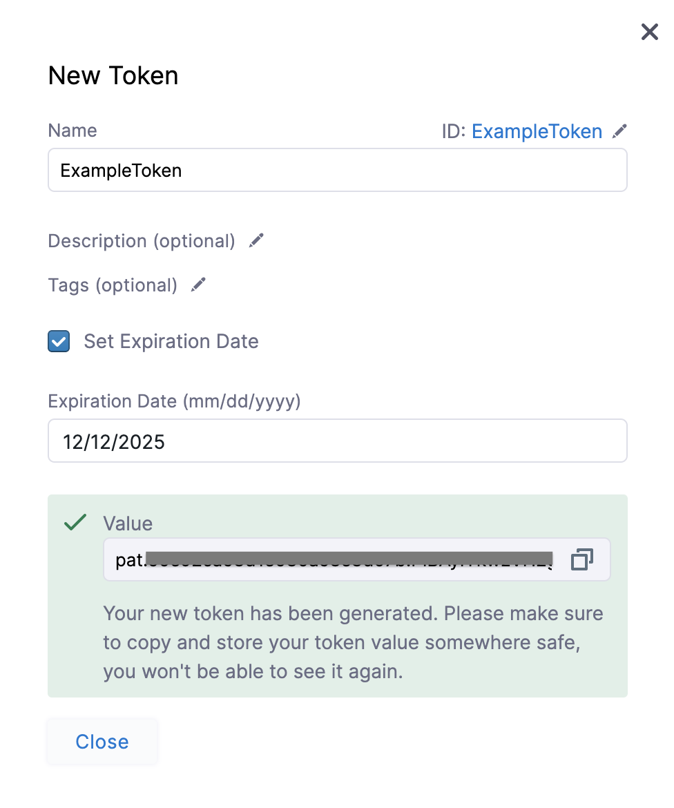
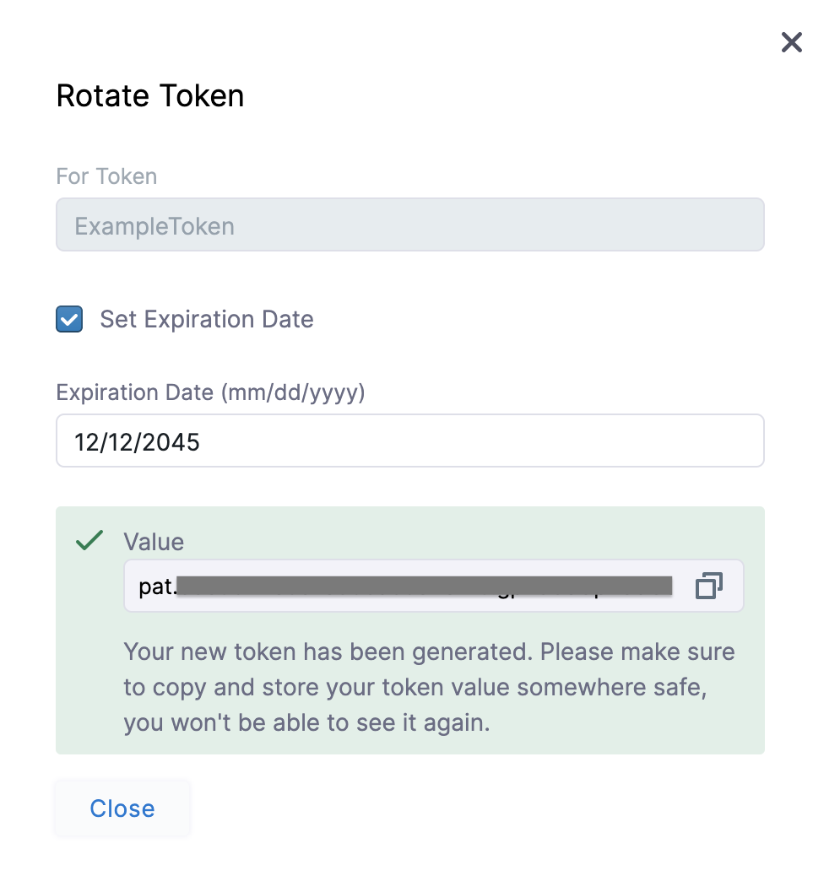
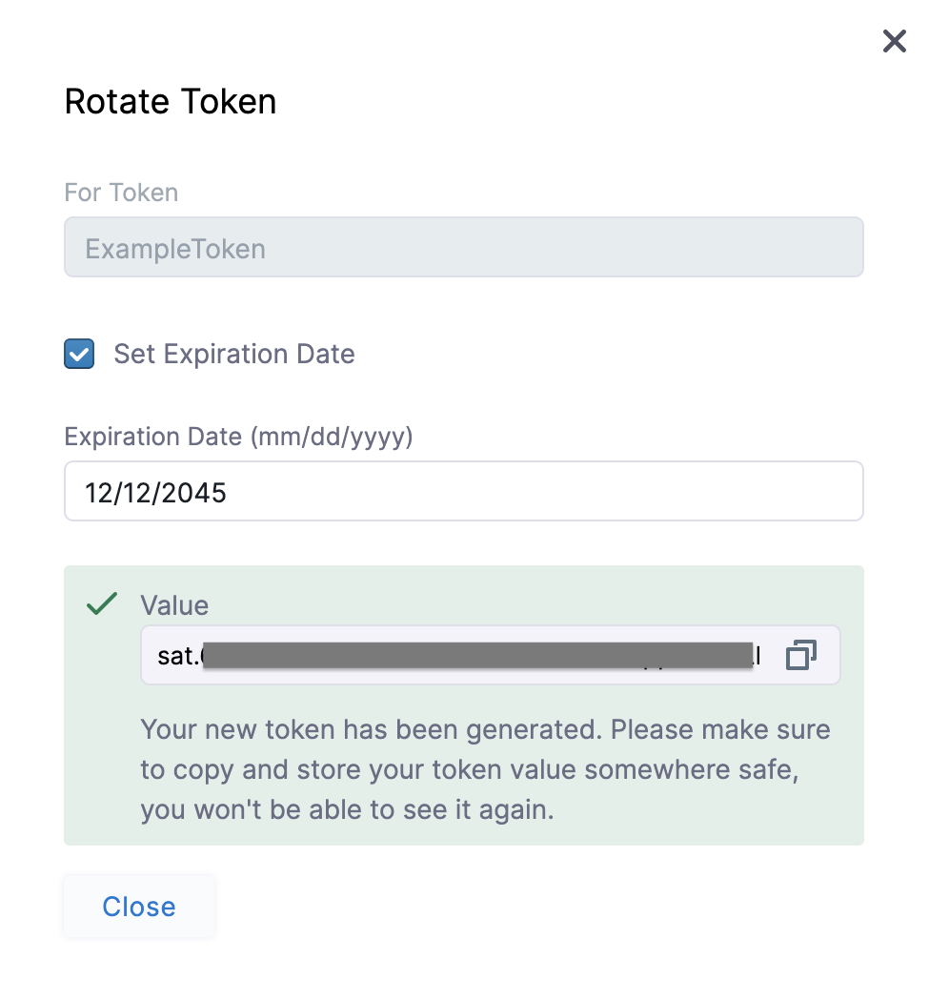

Before you can access Harness API, you must obtain an access token that grants access to that API. The access token allows you to make authorized API calls to Harness. These can be created at the Account/Org/Project level.

### Before you begin
* Make sure you are an Account Admin to Create, Edit, Delete, and Manage Service Accounts.  
For more details on permissions for API Keys, see [API Permissions Reference](ref-access-management/api-permissions-reference.md).

### Harness API Key

You can create API Keys at Account/Org/Project scope and can get multiple access tokens under them. Harness lets you create two kinds of access tokens:

* **Personal Access Token** - You can create API Key and generate tokens under it, from your user profile.
* **Service Account Token** - As an Account Admin, you can create a Service Account with Specified Role Bindings and can then create API Keys and generate tokens under it.

Based on its type, the token would inherit permissions from the User/Service Account role binding.

### Create Personal Access Token

To generate a Personal Access Token, you need to first create API Key in your user profile.

1. In Harness, navigate to your **Profile**.
2. Click **API Key**. The API Key settings appear.
3. Enter **Name, Description,** and **Tags** for your API.
4. Click **Save**. The new API Key is created.

#### Generate Personal Access Token

1. To generate a Token for this API Key, click **Token** below the API Key you just created.
2. In the **New Token** settings, enter **Name**, **Description**, and **Tags**.
3. To set an expiration date for this token, select **Set Expiration Date**.
4. Enter date in **Expiration Date (mm/dd/yyyy)**.
5. Click **Generate Token**.
6. Your new Token is generated.

You cannot see this token value after you close this dialog. Make sure to copy and store the generated token value securely.

### Create Service Account Token

To generate a Service Access Token, you need to first create a [Service Account](./6-add-and-manage-service-account.md) and create an API Key under it.

1. In Harness, click **Home**.
2. In **ACCOUNT SETUP**, click **Access Control**.
3. Click **Service Accounts** and then click the service account to which you want to add a new API Key. For step-by-step instructions to add a new Service Account, see [Add and Manage Service Accounts](./6-add-and-manage-service-account.md).
4. In the Service Account's settings page, click **API Key**.
5. In the **New API Key** settings, enter **Name, Description,** and **Tags**.
6. Click **Save**. The new API Key is created.

#### Generate Service Account Token

1. To generate a Token for this API Key, click **Token** below the API Key you just created.
2. In the **New Token** settings, enter Name, Description, and Tags.
3. To set an expiration date for this token, select **Set Expiration Date**.
4. Enter date in **Expiration Date (mm/dd/yyyy)**.
5. Click **Generate Token**.
6. Your new Token is generated.

You cannot see this token value after you close this dialog. Make sure to copy and store the generated token value securely.

### Edit Token

#### Edit a Personal Access Token

1. In Harness, navigate to your profile.
2. In **My API Keys**, expand the token that you want to edit.
3. Click the more options button (**︙**) next to the token you want to edit.
4. Click **Edit**.
5. Follow the steps in [Create Personal Access Token](#create-personal-access-token) to modify any of the configured settings.

#### Edit a Service Account Token

1. In your Harness Account, click **Account Settings**.
2. Click **Access Control**.
3. Click **Service Accounts** and then click the service account which has the token you want to edit. All the API keys are listed.
4. Click the API key whose token you want to edit. You can see the list of all the tokens.
5. Click the more options button (**︙**) next to the token you want to edit.
6. Click **Edit**.
7. Follow the steps in [Create Service Account Token](#create-service-account-token) to modify any of the configured settings.

### Rotate Token

It is a recommended security practice to periodically rotate your tokens. You can rotate your tokens in Harness for symmetric encryption.

#### Rotate a Personal Access Token

1. In Harness, navigate to your profile.
2. In **My API Keys**, expand the token that you want to rotate.
3. Click the more options button (**︙**) next to the token you want to rotate.
4. Click **Rotate Token**.
5. In the Rotate Token Settings screen enter **Expiration Date** and click **Rotate Token**.
6. Your new token gets generated. **Copy and store the token securely before you close this dialog.**

#### Rotate a Service Account Token

1. In Harness, click **Home**.
2. In **ACCOUNT SETUP**, click **Access Control**.
3. Click **Service Accounts** and then click the service account which has the token you want to rotate. All the API keys are listed.
4. Click the API key whose token you want to rotate. You can see the list of all the tokens.
5. Click the more options button (**︙**) next to the token you want to rotate.
6. Click **Rotate Token**.
7. In the Rotate Token Settings screen enter **Expiration Date** and click **Rotate Token**.
8. Your new token gets generated. **Copy and store the token securely before you close this dialog.**

### Delete Token

#### Delete a Personal Access Token

1. In Harness, navigate to your profile.
2. In **My API Keys**, expand the token that you want to delete.
3. Click the more options button (**︙**) next to the token you want to delete.
4. Click **Delete**.

#### Delete a Service Account Token

1. In Harness, click **Home**.
2. In **ACCOUNT SETUP**, click **Access Control**.
3. Click **Service Accounts** and then click the service account which has the token you want to delete. All the API keys are listed.
4. Click the API key whose token you want to delete. You can see the list of all the tokens.
5. Click the more options button (**︙**) next to the token you want to delete.
6. Click **Delete**.

### Edit API Key

To edit API Key in your user profile, perform the following steps:

1. In Harness, navigate to your **Profile**.
2. Your API Keys are listed under **My API Keys**.
3. Click the more options button (**︙**) next to the API Key that you want to edit.
4. Click **Edit**. The API key settings appear.
5. Follow the steps in [Create Personal Access Token](#create-personal-access-token) to modify any of the configured settings.

To edit an API Key in a Service Account, perform the below steps:

1. In Harness, click **Home**.
2. In **ACCOUNT SETUP**, click **Access Control**.
3. Click **Service Accounts.**
4. Click the service account whose API key you want to edit. All the API Keys are listed.
5. Click the more options button (**︙**) next to the API Key that you want to edit.
6. Click **Edit**.
7. Follow the steps in [Create Service Account Token](#create-service-account-token) to modify any of the configured settings.

### Delete API Key

To delete an API key from your profile, perform the following steps:

1. In Harness, navigate to your **Profile**.
2. Your API Keys are listed under **My API Keys**.
3. Click the more options button (**︙**) next to the API Key that you want to delete.
4. Click **Delete**.

To delete an API key in a Service Account, perform the below steps:

1. In Harness, click **Home**.
2. In **ACCOUNT SETUP**, click **Access Control**.
3. Click **Service Accounts.**
4. Click the service account whose API key you want to delete. All the API Keys are listed.
5. Click the more options button (**︙**) next to the API Key that you want to delete.
6. Click **Delete**.

