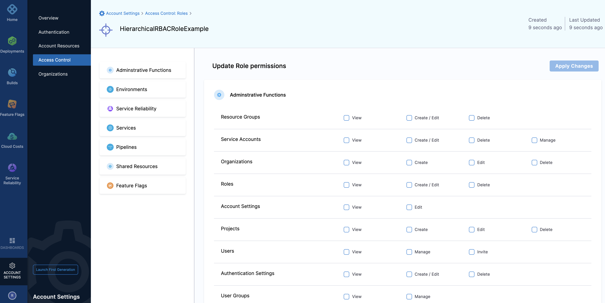

Roles are a group of permissions you can assign to a Harness User Group. These permissions determine what operations a User Group can perform on a specific Harness Resource.

This topic will explain the steps to create and manage Roles within Harness.

### Before you begin

* [Learn Harness' Key Concepts](https://ngdocs.harness.io/article/hv2758ro4e-learn-harness-key-concepts)
* Make sure you have Create/Edit/Delete Permissions for Roles.

The **Account Admin** Role has permissions for all the resources within the Account scope as well as its child scope (Organizations and Projects within this Account).

### Step: Add a New Role

This topic assumes you have a Harness Project set up. If not, see [Create Organizations and Projects](../1_Organizations-and-Projects/2-create-an-organization.md).

You can add a Role in Project/Organization/Account scope. To do this, go to Project SETUP, Organization, or Account Settings. This topic explains how to create a role in the Account scope.

Select your **Project/Org/Account**, and click **Access Control**.

Click **Roles**.

Click **New Role**. The **New Role** settings appear.

Enter a **Name** for your **Role**.

Enter optional **Description** and **Tags** for your **Role**.

Click **Save**.

### Step: Delete Role

Click the **Roles** tab under **Access** **Control**.

Click **Delete** in the top right corner to delete a specific role.

### Step: Manage Role

Click the **Roles** tab under **Access Control**.

Click on the role you want to edit. The **Update Role Permissions** page appears.

Add/Remove Resource-specific permissions from this page. Click **Apply Changes**.

### Harness Built-in Roles

Harness provides the following default roles at the Account, Org, and Project scope:

|  |  |
| --- | --- |
| **Scope** | **Role** |
| **Account** | Account Admin |
| **Account** | Account Viewer |
| **Account** | Feature Flag Manage Role |
| **Org** | Organization Admin |
| **Org** | Organization Viewer |
| **Org** | Feature Flag Manage Role |
| **Project** | Project Admin |
| **Project** | Project Viewer |
| **Project** | Pipeline Executor |
| **Project** | Feature Flag Manage Role |

### See also

* [Add and Manage Users](./3-add-users.md)
* [Add and Manage User Groups](./4-add-user-groups.md)
* [Add and Manage Resource Groups](./8-add-resource-groups.md)
* [Permissions Reference](./ref-access-management/permissions-reference.md)

