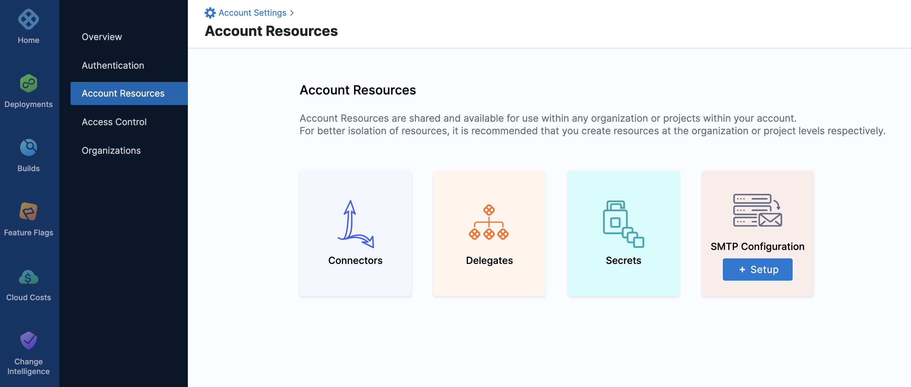
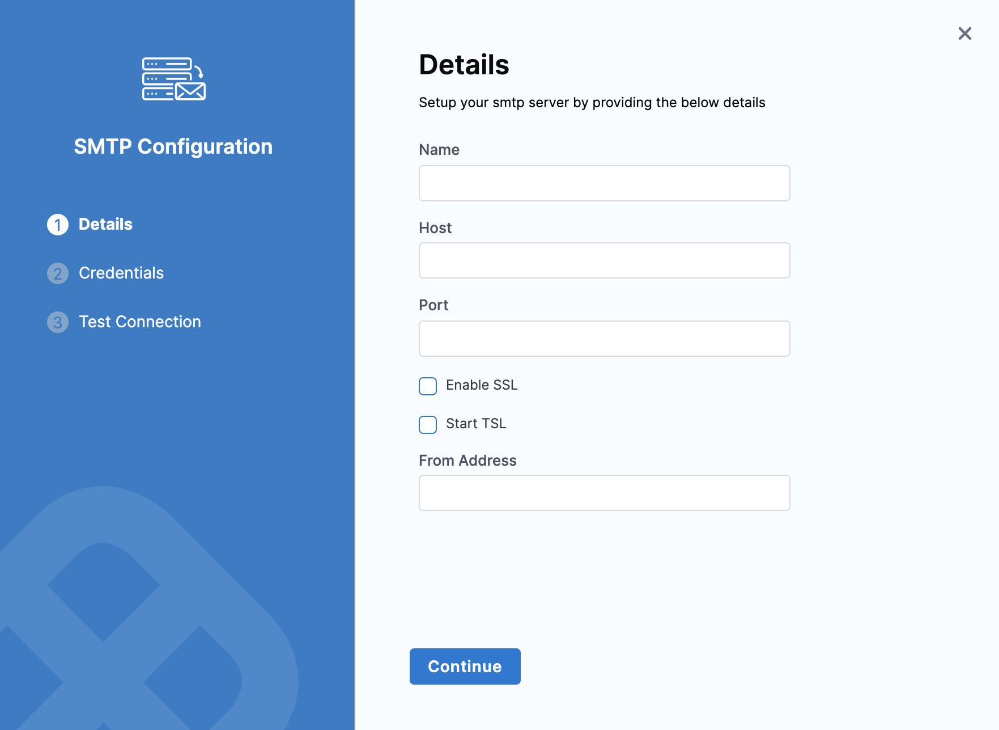
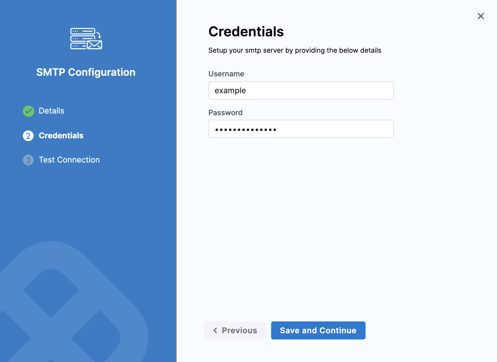
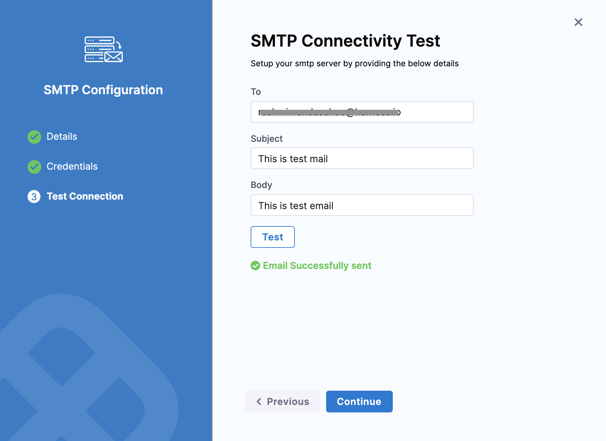
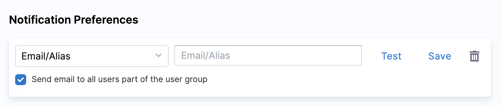
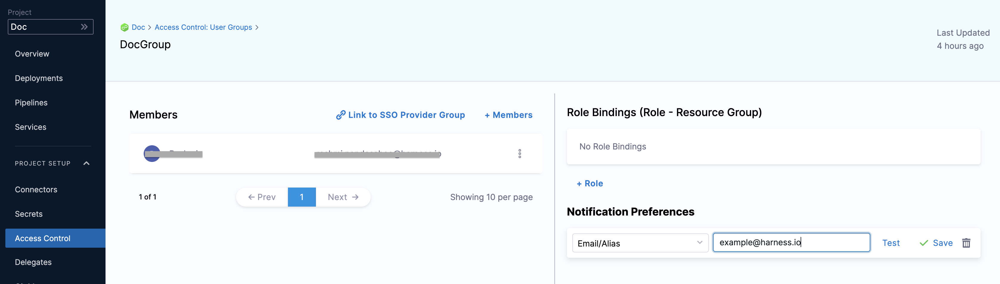
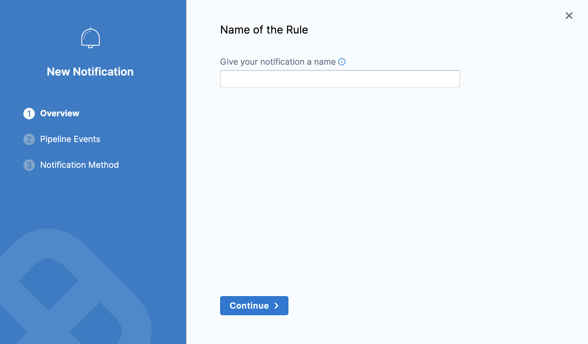
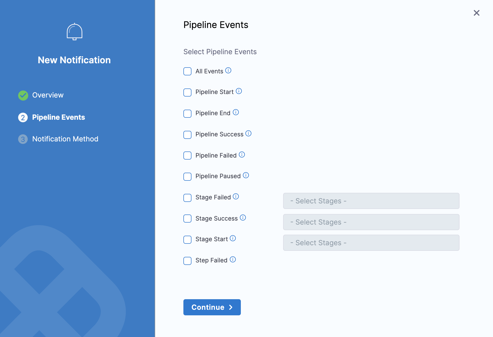
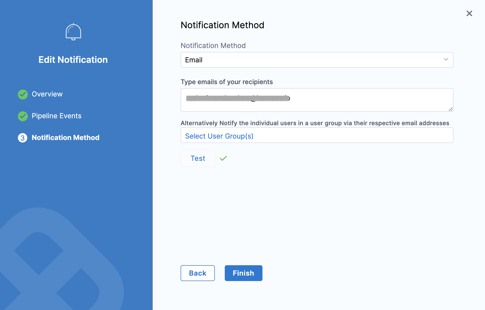

You can send email notifications to Harness User Groups using your SMTP accounts.

Emails can be sent automatically in response to Pipeline and stage events like Pipeline Failed and Stage Succeeded.

Your Harness SaaS account includes an SMTP server, so you don't need to add one of your own.

If you are using the Harness On-Prem offering, then you will need to add an SMTP server to your Harness account.This topic explains how to configure an SMTP server with your Harness account and send email notifications according to different Pipeline events.

### Before you begin

* [User Group Notification Preferences](../4_Role-Based-Access-Control/4-add-user-groups.md#option-notification-preferences)

### Limitations

Configuring your SMTP server is required only if you are using [Harness On-Prem](https://docs.harness.io/article/tb4e039h8x-harness-on-premise-overview), or if you wish to use your own SMTP server instead of the Harness SaaS default SMTP option.

### Step 1: Add SMTP Configuration

In your Harness account, go to **Account Settings**.

Click **Account Resources.**

Click **SMTP Configuration** and then click **Setup**.

The SMTP Configuration settings appear.

### Step 2: Details

Enter **Name** for your SMTP Configuration.

In **Host,** enter your SMTP server's URL.

Enter the port number on which the SMTP server is listening (typically, `25`).

Select **Enable SSL** for secure connections (SSL/TLS).

Select **Start TSL** to enable SMTP over TLS, or when the connection is upgraded to SSL/TLS using `STARTTLS`.

In **From Address**, enter the email address from which Harness will send notification emails.

Click **Continue**.

### Step 3: Credentials

Enter the username and password for the email account.

Click **Save and Continue**.

### Step 4: Test Connection

In **To,** enter the email address to which you want to send notifications.

Enter **Subject** and **Body** for the email.

Click **Test**.

Click **Continue** after the test is successful.

SMTP is configured for your account.

### Option: Send Notifications for a User Group using Email

In your **Account**/**Organization**/**Project** click Access Control.

Click **User Groups**.

Select the User Group to which you want to add notification preferences.

In **Notification Preferences**, select **Email/Alias**.

Enter the email address from which you want to send email notifications.

You can also send email notifications to all the members of this user group by selecting **Send email to all users part of this group**.

Click **Save**.

### Option: Send Notification for a Pipeline

You can send Pipeline event notifications using email. Event notifications are set up using **Notify** option in your Pipeline.

In Harness, go to your Pipeline and click **Notify**.

Click **Notifications**. The **New Notification** settings appear.

Enter a name for your notification rule and click **Continue**.

Select the Pipeline Events for which you want to send notifications. Click **Continue**.

In **Notification Method**, select **Email**.

Enter the email addresses to which you want to send the notifications.

Select the User groups which you want to notify.

Click **Test**.

Once the test is successful, click **Finish**.

Your Notification Rule is now listed in Notifications. Post this users will get email notifications when the events listed in the Notification Rule occur.

### See also

* [Send Notifications using Slack](send-notifications-using-slack.md)
* [Send Notifications to Microsoft Teams](send-notifications-to-microsoft-teams.md)

