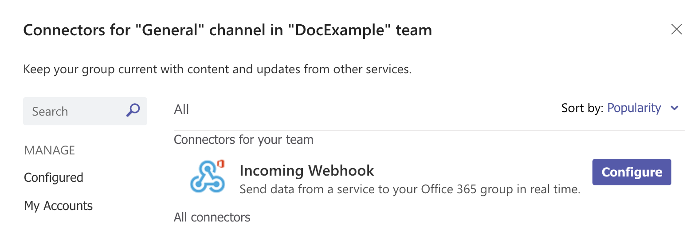
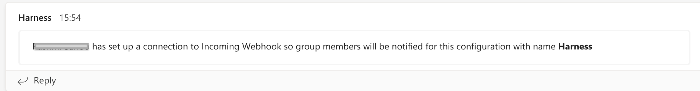
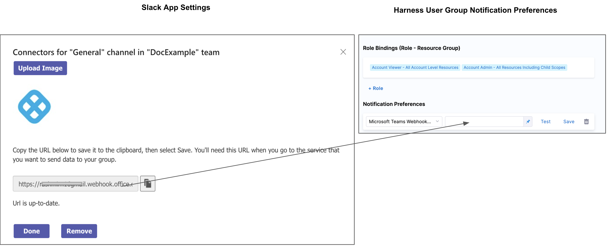

Harness notifies your User Groups of events in Pipelines, and general alerts.

You can integrate your Harness User Group with Microsoft Teams and receive notifications in Teams channels.

Setup is a simple process of generating a Webhook in Microsoft Teams and adding it to a Harness User Group's Notification Preferences. Let's get started.

### Before you begin

* See [User Group Notification Preferences](../4_Role-Based-Access-Control/4-add-user-groups.md#option-notification-preferences)

### Review: Requirements

We assume you have a Microsoft Teams administrator account.

### Step 1: Create a Connector for Microsoft Teams Channel

You create a channel connector in Microsoft Teams to generate the Webhook Harness needs for notification.

In Microsoft Teams, right-click the channel where you want to send notifications, and select **Connectors**.


In **Connectors**, locate **Incoming Webhook**, and click **Configure.**


In **Incoming Webhook**, enter a name, such as **Harness**.

Right-click and save the Harness icon from here:


Click **Upload Image** and add the Harness icon you downloaded.

Next, you'll create the Webhook URL needed by Harness.

### Step 2: Generate Channel Webhook

In your Microsoft Teams Connector, click **Create**. The Webhook URL is generated.


Click the copy button to copy the Webhook URL, and then click **Done**.

The channel indicates that the Connector was set up.


### Step 3: Add Webhook to Harness User Group Notification Preferences

In your **Account**/**Organization**/**Project** click Access Control.

Click **User Groups**.

Select the User Group to which you want to add notification preferences.

In **Notification Preferences**, select **Microsoft Teams Webhook URL**.

Paste the Webhook into **Microsoft Teams Webhook URL** or add it as an [Encrypted Text](../6_Security/2-add-use-text-secrets.md) in Harness and reference it here.

For example, if you have a text secret with the identifier `teamswebhookURL`, you can reference it like this: ​


```
<+secrets.getValue("teamswebhookURL")>​​
```
You can reference a secret within the Org scope using an expression with `org`:​


```
<+secrets.getvalue("org.your-secret-Id")>​
```
You can reference a secret within the Account scope using an expression with `account`:​


```
<+secrets.getvalue("account.your-secret-Id")>​
```
Click **Save**.


Now your Microsoft Teams channel will be used to notify this User Group of alerts.

