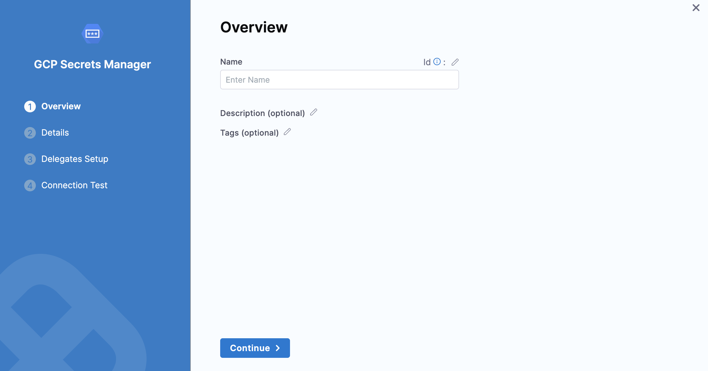
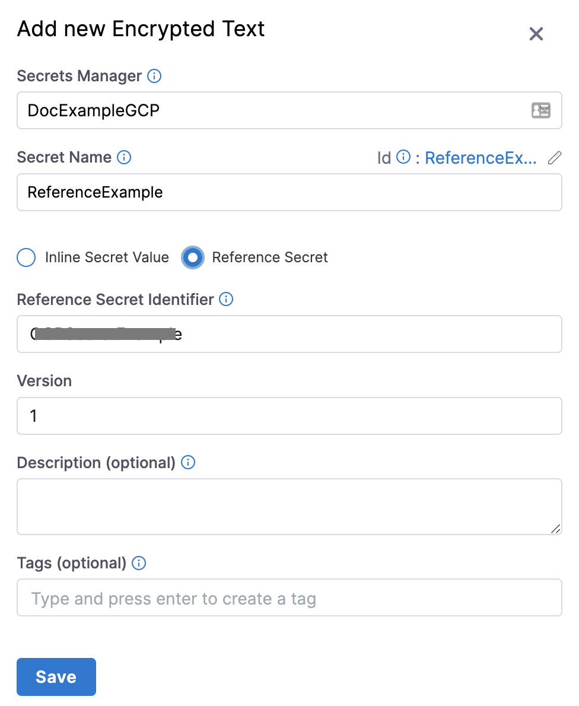

Currently, this feature is behind the feature flag `PL_ENABLE_GOOGLE_SECRET_MANAGER_IN_NG`. Contact Harness Support to enable the feature.You can use your [Google Cloud Secret Manager](https://cloud.google.com/secret-manager/docs) as a secret manager in Harness.

You can link your Google Cloud Secret Manager to Harness and use it to store any sensitive data you use in Harness, including secrets.

Harness also supports [Google KMS as a secrets manager](../6_Security/10-add-google-kms-secrets-manager.md).This topic explains how to add a GCP Secrets Manager in Harness.

### Before you begin

* See [Harness Key Concepts](https://docs.harness.io/article/hv2758ro4e)
* See [Secrets Management Overview](../6_Security/1-harness-secret-manager-overview.md)

### Limitations

* Inline secrets saved to GCP Secrets Manager must follow the naming limitations of Google Cloud Secret Manager. Secret names can only contain alphabets, numbers, dashes (-), and underscores (\_).
* The maximum size for encrypted files saved to Google Cloud Secret Manager is 64KiB.
* Inline secrets saved to Google Cloud Secret Manager have a region assignment by default. An automatic assignment is the same as not selecting the **Regions** setting when creating a secret in Google Cloud Secret Manager.
* Harness does not support Google Cloud Secret Manager labels at this time.
* **Versions for reference secrets:**
	+ Any modification to the content of a secret stored by Harness in Google Cloud Secret Manager creates a new version of that secret.
	+ When you delete a secret present in Google Cloud Secret Manager from Harness, the entire secret is deleted and not just a version.
* You cannot update the name of an inline or referenced secret stored in the Google Cloud Secret Manager using the Harness Secret Manager.
* Harness does not support changing an inline secret to a reference secret or vice versa in Harness.

### Supported Platforms and Technologies

See [Supported Platforms and Technologies](https://docs.harness.io/article/1e536z41av5y-supported-platforms).

### Permissions

* Make sure you have Create/Edit permissions for Secrets.
* Make sure you have Create/Edit permissions for Connectors.
* The GCP Service Account you use in the **Google Secrets Manager Credentials File** should have the following IAM roles:
	+ `roles/secretmanager.admin` or `roles/secretmanager.secretAccessor` and `roles/secretmanager.secretVersionManager`.

See [Managing secrets](https://cloud.google.com/secret-manager/docs/access-control) from Google.

### Step 1: Add a secret manager

This topic assumes you have a Harness Project set up. If not, see [Create Organizations and Projects](../1_Organizations-and-Projects/2-create-an-organization.md).

You can add a connector from any module in your project, in the Project setup, or in your organization or account resources.

This topic explains the steps to add a Google Cloud Secrets Manager to the account [scope](../4_Role-Based-Access-Control/1-rbac-in-harness.md#rbac-scope).

1. In your Harness Account, click **Account Settings**.
2. Click **Account Resources**.
3. Click **Connectors** and then click **New Connector**.
4. In Secret Managers, click **GCP Secrets Manager**.  
The GCP Secrets Manager settings appear.

### Step 2: Add overview

1. In **Name**, enter a name for your secret manager.
2. You can choose to update the **Id** or let it be the same as your secret manager's name. For more information, see [Entity Identifier Reference](../20_References/entity-identifier-reference.md).
3. Enter the **Description** for your secret manager.
4. Enter **Tags** for your secret manager.
5. Click **Continue.**

### Step 3: Attach a Google Secret Manager credentials file

You must export your Google Cloud service account key and add it as an [Encrypted File Secret](./3-add-file-secrets.md) in Harness.

1. In the Google Cloud console, select **IAM & admin** > **Service account**.
2. Scroll to the service account you want to use. If no service account is present, create one.
3. Grant this service account the Google Cloud Secret Manager permissions needed.  
To do this, edit the service account and click **Permissions**. Click **Roles**, and then add the roles needed.  
See [Managing secrets](https://cloud.google.com/secret-manager/docs/access-control) from Google.
4. Open your service account's Actions ⋮ menu, then select **Create key.**
5. In the resulting **Create private key** dialog, select the **JSON** option, create the key, and download it to your computer.
6. Go back to Harness.
7. In **Google Secrets Manager Credentials File**, select the encrypted file you just added in Harness.
   
You can also create a new [File Secret](./3-add-file-secrets.md) here and add the Google Cloud service account key that you downloaded.
1. Click **Continue**.

### Step 4: Setup delegates

1. In **Delegates** **Setup**, enter [**Selectors**](../2_Delegates/delegate-guide/select-delegates-with-selectors.md#option-select-a-delegate-for-a-connector-using-tags) for specific delegates that you want to allow to connect to this connector.
2. Click **Save and** **Continue**.

### Step 5: Test connection

Once the Test Connection succeeds, click **Finish**. You can now see the connector in **Connectors**.

### Add an inline secret to the GCP Secrets Manager

Let us add an inline text secret to the GCP Secrets Manager we just created.

1. In your Harness account, click **Account Settings**.
2. Click **Account Resources** and then click **Secrets**.
3. Click **New Secret** and then click **Text**.  
The **Add new Encrypted Text** settings appear.
4. Select the GCP Secrets Manager you just created.
5. Enter a **Name** for your secret.
6. The default selection is **Inline Secret Value**.
7. Enter the **Secret Value**.
8. Select **Configure Region** to add the region(s) for your secret.
9. Click **Save**.

### Add a secret reference to the GCP Secrets Manager

Let us add a secret reference to the GCP Secrets Manager we just created.

1. In your Harness account, click **Account Settings**.
2. Click **Account Resources** and then click **Secrets**.
3. Click **New Secret** and then click **Text**.  
The **Add new Encrypted Text** settings appear.
4. Select the GCP Secrets Manager you just created.
5. Enter a **Name** for your secret.
6. Select **Reference Secret**.
7. Enter your secret identifier in **Reference Secret Identifier**.
8. In **Version**, enter the version of your secret that you want to reference.  
You can either enter a version number like `1`, `2`, or enter `latest` to reference the latest version.
9. Click **Save**.

### Add an encrypted file secret to the GCP Secrets Manager

Let us add an encrypted file secret to the GCP Secrets Manager we just created.

1. In your Harness account, click **Account Settings**.
2. Click **Account Resources** and then click **Secrets**.
3. Click **New Secret** and then click **File**.  
The **Add new Encrypted File** settings appear.
4. Select the GCP Secrets Manager you just created.
5. Enter a **Name** for your secret.
6. In **Select File**, browse, and select your file.
7. Select **Configure Region** to add the region(s) for your secret.
8. Click **Save**.

### See also

* [Add Google KMS as a Harness Secret Manager](../6_Security/10-add-google-kms-secrets-manager.md)
* [Add an AWS KMS Secret Manager](../6_Security/7-add-an-aws-kms-secrets-manager.md)
* [Add an AWS Secret Manager](../6_Security/6-add-an-aws-secret-manager.md)
* [Add an Azure Key Vault Secret Manager](../6_Security/8-azure-key-vault.md)
* [Add a HashiCorp Vault Secret Manager](../6_Security/12-add-hashicorp-vault.md)

