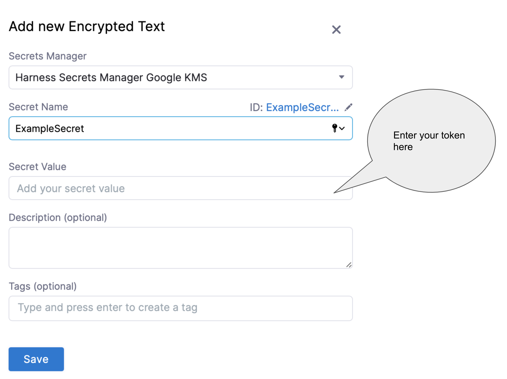
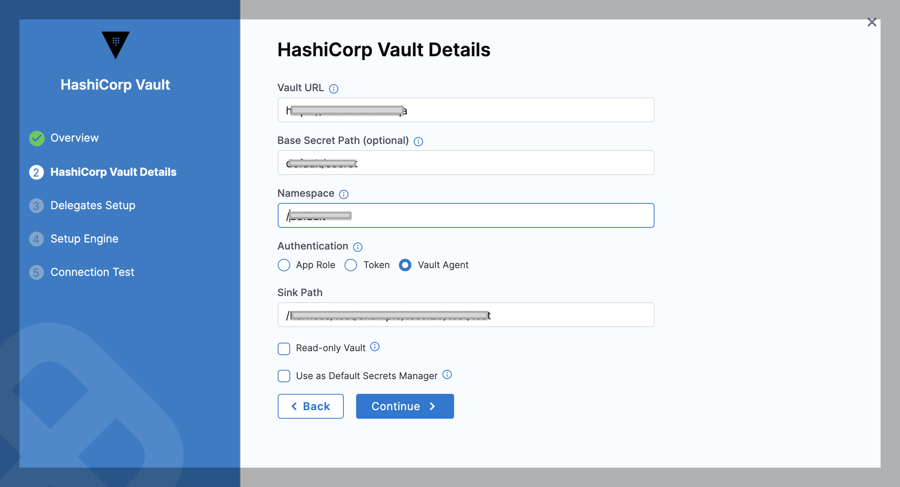
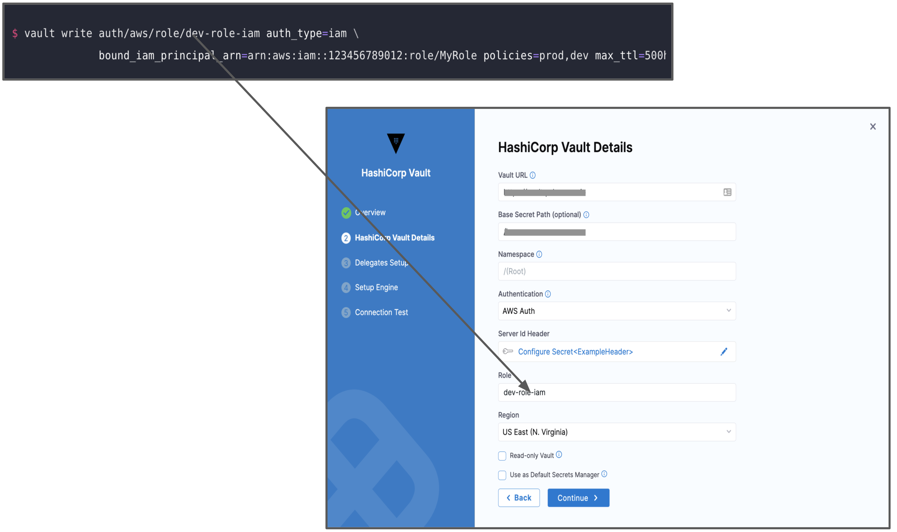
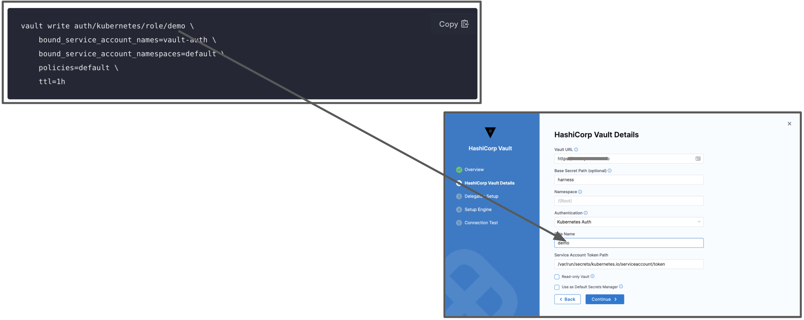

To store and use encrypted secrets (such as access keys), you can add a HashiCorp Vault Secret Manager.

### Before you begin

* [Learn Harness' Key Concepts](https://ngdocs.harness.io/article/hv2758ro4e-learn-harness-key-concepts)
* [Harness Secret Manager Overview](../6_Security/1-harness-secret-manager-overview.md)
* Make sure that the Harness Delegate can connect to the Vault URL.
* Make sure you have View and Create/Edit permissions for secrets.​

### Step 1: Add a Secret Manager

This topic assumes you have a Harness Project set up. If not, see [Create Organizations and Projects](../1_Organizations-and-Projects/2-create-an-organization.md).

You can add a Connector at Project/Organization/Account scope. To do this, go to Project setup, Organization, or Account Resources.

In **Connectors**, click **Connector**.

In **Secret Managers**, click **HashiCorp Vault**. The HashiCorp Vault Secret Manager settings appear.


### Step 2: Overview

Enter a **Name** for your secret manager.

You can choose to update the **ID** or let it be the same as your secret manager's name. For more information, see [Entity Identifier Reference](../20_References/entity-identifier-reference.md).

Enter **Description** for your secret manager.

Enter **Tags** for your secret manager.

Click **Save and Continue.**

Enter **Vault URL**.

Enter **Base Secret Path**. The Base Secret Path is used for writing secrets. When Harness reads secrets, it uses the full path.

For more information, see [Vault documentation](https://www.vaultproject.io/docs/index.html).

Select the **Authentication** Type.


### Option: App Role

The App Role option enables the Harness Vault Secret Manager to authenticate with Vault-defined roles.

The Vault AppRole method allows you to define multiple roles corresponding to different applications, each with different levels of access. The application's **App Role ID** and **Secret ID** are used for authentication with Vault. You need these to log in and fetch a Vault token.

To assign a **Secret ID**, you can create a new [**Secret**](./2-add-use-text-secrets.md) or choose an existing one.

The Secret should not expire and it should be valid until you manually revoke it. You would need this Secret to generate new tokens when the older tokens expire.Harness will use the App Role ID and Secret ID that you supply, to fetch a Vault Auth Token dynamically at configured intervals. This interval is set in Renewal Interval.

For more information, see [RoleID](https://www.vaultproject.io/docs/auth/approle.html#roleid) and [Authenticating Applications with HashiCorp Vault AppRole](https://www.hashicorp.com/blog/authenticating-applications-with-vault-approle) from HashiCorp.

If you encounter errors, setting [token\_num\_uses](https://www.vaultproject.io/api-docs/auth/approle#token_num_uses) to `0` can often resolve problems.

#### Permissions

The Vault AppRole ID or the Periodic Token used in either of the authentication options must have an ACL policy attached so that Harness can use it. Typically, you create the policy first, then create the AppRole or Periodic Token and attach the policy.

In the policy examples below: if you've created a Read-only Vault Secret Manager, this secret manager needs only read, and list permissions on Vault. It does not need — and cannot assume — create, update, or delete permissions.If the secrets are in the Secret Engine named “secret”, the policy must have the following permissions.


```
path "secret/*" {  
  capabilities = ["create", "update", "list", "read", "delete"]  
}
```
If the secrets are in a subfolder, such as secrets/harness, the policy will look like this:


```
path "secret/harness/*" {  
  capabilities = ["create", "list", "read", "update", "delete"]  
}  
path "secret/harness" {  
  capabilities = ["list", "read"]  
}
```
These examples apply only to a **v1** secret engine. If you are planning to use a secret engine with version 2 (versioned secret engine), then the policies are different as explained [here](https://www.vaultproject.io/docs/secrets/kv/kv-v2). Go through this link to understand the correct permissions required for your use case.If the Vault Secret Manager needs to renew tokens, the following permissions are needed:


```
path "auth/token/renew-self" {  
 capabilities = ["read", "update"]  
}
```
### Option: Token

For Harness, the **Token** option requires [periodic tokens](https://www.vaultproject.io/docs/concepts/tokens#periodic-tokens) (tokens that have renewal options).

To create a periodic token, make sure to specify a period in the token creation command:


```
vault token create -policy=harness -period=768h
```
Next, use the new token with Harness. To do this, perform the below steps:

* Click **Create or Select a Secret**.
* The secret settings page appears. Here you can either **Create a new** [**Secret**](./2-add-use-text-secrets.md) or **Select an existing secret**. If creating a new Secret, enter the token which you created in the **Secret Value** field.

For detailed steps on creating a secret, see [Add Text Secrets](./2-add-use-text-secrets.md).

If you have already added a Secret with your token, you can choose the same as shown below:


* Click **Apply**.

If you want to verify the renewal manually, use the command:


```
vault token lookup <token_id>
```
### Option: Vault Agent

This option enables the Harness Vault Secret Manager to authenticate with the Auto-Auth functionality of the [Vault Agent](https://www.vaultproject.io/docs/agent/autoauth).

To authenticate with Vault Agent, make sure you have configured it on the required environment, with entries for **method** and **sinks**. For more information, see [Vault Agent](https://www.vaultproject.io/docs/agent).

In the **Sink Path** field, enter any sink path you have in your Vault Agent Configuration. This is the path of the encrypted file with tokens. The specified Delegate reads this file through file protocol (file://).


### Option: AWS Auth

This option provides an automated mechanism to retrieve a Vault token for IAM principals and AWS EC2 instances. With this method, you do not need to manually install or supply security-sensitive credentials such as tokens, usernames, or passwords.

In the AWS Auth method, there are two authentication types:

* IAM
* EC2.

Harness recommends using the IAM technique for authentication since it is more versatile and complies with standard practises.

To authenticate with AWS Auth, make sure you have configured the vault with entries for **Header**, **Role**, and **Region**. For more information, see [AWS Auth Method](https://www.vaultproject.io/docs/auth/aws#iam-auth-method).

You must add the **Server ID Header** from Vault as a [Harness Encrypted Text Secret](./2-add-use-text-secrets.md) and select it for **Server Id Header** in Harness.


In **Role**, enter the role you have configured in the Vault.


In **Region**, enter the AWS Region for the Secret Manager.

### Option: Kubernetes Auth

This option uses a Kubernetes Service Account Token to authenticate with Vault. With this method of authentication, you can easily add a Vault token into a Kubernetes Pod.

To authenticate with Kubernetes Auth, make sure you have created a role in the vault inside `auth/kubernetes/role`. This role authorizes the "vault-auth" service account in the default namespace and it gives it the default policy. This is also where you'll find the **service account name** and **namespace** that will be used to access the vault endpoint.


For more information, see [Kubernetes Auth Method](https://www.vaultproject.io/docs/auth/kubernetes#configuration).

In **Role Name**, enter the role you have configured in the Vault.


In **Service Account Token Path** enter the JSON Web Token (JWT) path. This is the path where the JWT token is mounted. The default path of this token is `/var/run/secrets/kubernetes.io/serviceaccount/token`.

For more information, see [Service Account Tokens](https://kubernetes.io/docs/reference/access-authn-authz/authentication/#service-account-tokens).

### Step 2: Select Secret Engine and Version

Once you have entered the required fields, you can choose to **Fetch Engines** or **Manually Configure Engine**.

#### Fetch Engines

If you want Harness to automatically fetch secret engines, include this read permission for **sys/mounts** In the ACL policy.


```
path "sys/mounts"{  
 capabilities = ["read"]  
}
```
Click **Fetch Engines**.

Harness will populate the Secret Engine drop-down with the list of engines and their versions.

Select the engine you want to use.

#### Manually Configure Engine

If you don’t want to or cannot add the ACL policy (with read permission for sys/mounts) in the Secret Manager, perform the following steps:

1. Identify the engine version of the Secret Manager in Vault.
2. In **Secret Engine Name**, enter the name of the Secret Engine.
3. In **Secret Engine** **Version**, enter the engine version.

You cannot change the Secret Engine later. Harness blocks editing this setting later since there might be secrets that are created/referenced under this secret engine. Changing the secret engine might break references to those secrets.

### Step 3: Renewal Interval (minutes)

In **Renew Interval**, you can (optionally) enter how often the Harness Delegate reloads the Vault access token.


You can expect a delay during the Vault renewal. A periodic job runs to check if there has to be a renewal, resulting in a delay of no more than two minutes.

### Review: Validating Non-Read Only Vault Secret Managers

To validate a non-read-only Vault Secret Manager, Harness creates a dummy secret in the secret engine.

The path of the secret is as follows:

v2 Secret Engine:

`<SECRET_ENGINE_NAME>/data/<BASE_PATH>/harness_vault_validation#value`

v1 Secret Engine:

`<SECRET_ENGINE_NAME>/<BASE_PATH>/harness_vault_validation#value`

The secret can fail because of various reasons.

1. Using the Token/App Role, the V**ault** authentication is not successful.
2. The following **permission** is not available in any of the policies attached to the Token/App Role. If this permission is not available, the user will not be able to fetch the list of secret engines from the customer vault and Harness will show a single option of Secret Engine named **“secret”** with version 2, which might be incorrect for the customer. Make sure to add the permission to a policy attached to the Token/App Role as follows:


```
         path “sys/mounts”{  
            capabilities = ["read"]  
            }    
```
3. The policy attached to the Token/AppRole does not provide the **write**permission in the specified path. Make sure you update the policies and permissions.

### Step 4: Read-only Vault

If required by your organization's security practices, select the **Read-only Vault** check box. This selection authorizes Harness to read secrets from Vault, but not to create or manage secrets within Vault.


Once you have filled out the required fields, click **Finish**.

##### Read-only Limitations

If you select **Read-only Vault**, there are several limitations on the resulting Harness Vault Secret Manager.

Also a read-only Harness Vault Secret Manager:

* Cannot be used in the **Add Encrypted File** dialog.
* Cannot create inline secrets in the **Add Encrypted Text** modal.
* Cannot migrate (deprecate) its secrets to another secret manager.
* Cannot have secrets migrated to it from another secret manager.

### Step 5: Test Connection

Once the Test Connection succeeds, click Finish. You can now see the Connector in Connectors.

Important: Test Connection fails​Harness tests connections by creating a dummy secret in the Secret Manager or Vault. For the Test Connection to function successfully, make sure you have Create permission for secrets.  
The Test Connection fails if you do not have Create permission. However, Harness still creates the Connector for you. You may use this Connector to read secrets, if you have View permissions.