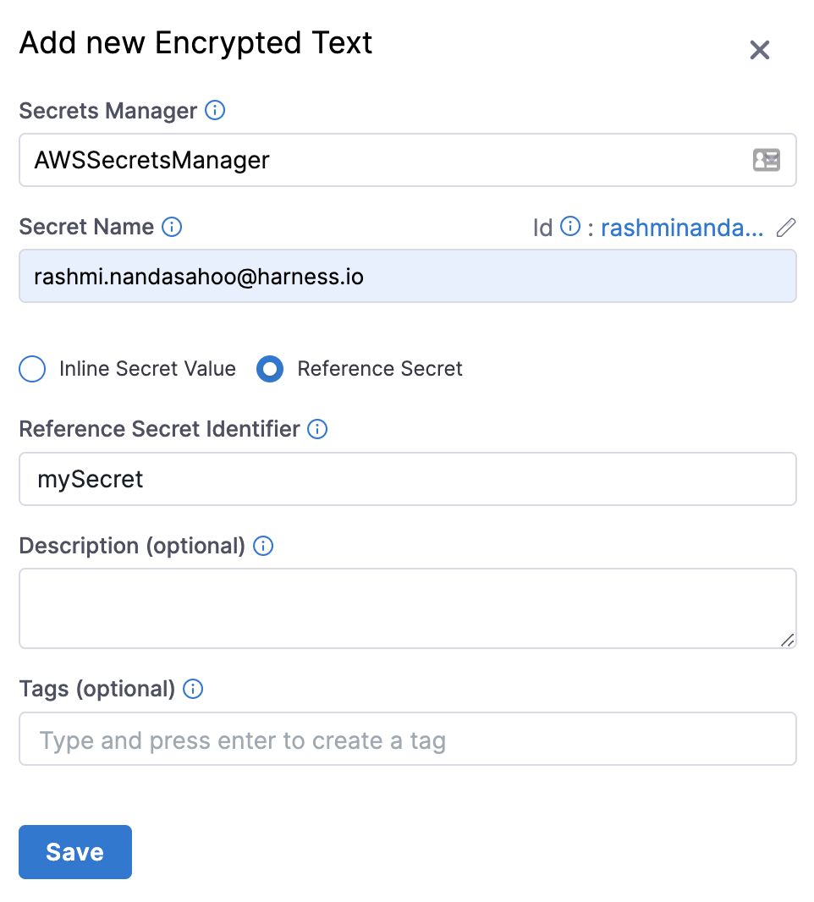

If you already have secrets created in a secrets manager such as HashiCorp Vault or AWS Secrets Manager, you do not need to re-create the existing secrets in Harness.

Harness does not query the secrets manager for existing secrets, but you can create a secret in Harness that references an existing secret in HashiCorp Vault or AWS Secrets Manager. No new secret is created in those providers. If you delete the secret in Harness, it does not delete the secret in the provider.

### Before you begin

* See [AWS KMS Secret Manager](../6_Security/7-add-an-aws-kms-secrets-manager.md)
* See [AWS Secrets Manager](../6_Security/6-add-an-aws-secret-manager.md)
* See [Azure Key Vault Secret Manager](../6_Security/8-azure-key-vault.md)
* See [HashiCorp Vault Secret Manager](../6_Security/12-add-hashicorp-vault.md)

### Option: Vault secrets

You can create a Harness secret that refers to the existing Vault secret using a path and key, such as `/path/secret_key#my_key`.


In the above example, `/path` is the pre-existing path, `secret_key` is the secret name, and `my_key` is the key used to lookup the secret value.

Do not prepend the Vault secrets engine to the path. In the above example, if the secret (`/path/secret_key#my_key`) had been generated by a Vault secrets engine named `harness-engine`, it would reside in this full path `/harness-engine/path/secret_key#my_key`. However, in the **Value** field, you would enter only `/path/secret_key#my_key`.This Harness secret is simply a reference pointing to an existing Vault secret. Deleting this Harness secret will not delete the Vault secret referred to by this secret.

You can reference pre-existing Vault secrets in the Harness YAML editor.

### Option: HashiCorp Vault Secrets

Currently, this feature is behind the feature flag `PL_ACCESS_SECRET_DYNAMICALLY_BY_PATH`. Contact Harness Support to enable the feature.​​For HashiCorp Vault, you can also use expressions to reference pre-existing secrets in Vault using a fully-qualified path, such as `hashicorpvault://LocalVault/foo/bar/mysecret#mykey`. 

With this kind of referencing, you don't need to pre-create secrets.

The scheme `hashicorpvault://` is needed to distinguish a Vault secret from other secret references. It is followed by the identifier of the Vault secret manager.

For example, if you have a HashiCorp Vault connector with the identifier `myVault` in the Account scope and a secret with the name `example` present in the vault path `/harness/testpath` with the following values:


```
​{  
    "key1": "value one",  
    "key2": "value two"  
}
```
You can reference the value of `key1` for the secret `example` using the following expression:


```
<+secrets.getValue("account.hashicorpvault://myVault/harness/testpath/example#key1")>
```
For a HashiCorp Vault connector at the Org scope, use the following expression:


```
<+secrets.getValue("org.hashicorpvault://myVault/harness/testpath/example#key1")>​
```
For a HashiCorp Vault connector at the Project scope, use the following expression:


```
<+secrets.getValue("hashicorpvault://myVault/harness/testpath/example#key1")>
```
To dynamically reference secrets in HashiCorp Vault, make sure you use the expression in the following format:  
`<+secrets.getValue()>`

### Option: AWS Secrets Manager secrets

You can create a Harness secret that refers to an existing secret in AWS Secrets Manager using the name of the secret, and a prefix if needed. For example, `mySecret`.


#### Referencing secret keys

In AWS Secrets Manager, your secrets are specified as key-value pairs, using a JSON collection:


To reference a specific key in your Harness secret, add the key name following the secret name, like `secret_name#key_name`. In the above example, the secret is named **example4docs**. To reference the **example1** key, you would enter `example4docs#example1`.

### Option: Azure Key Vault secrets

You can create a Harness secret that refers to an existing secret in Azure Key Vault, using that secret's name (for example: `azureSecret`). You can also specify the secret's version (for example: `azureSecret/05`).

