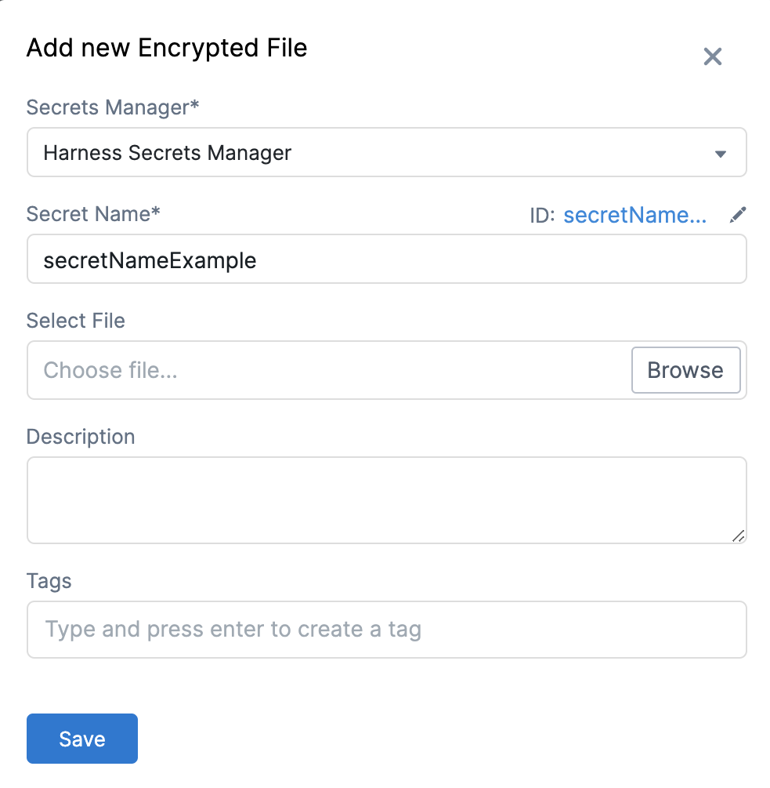
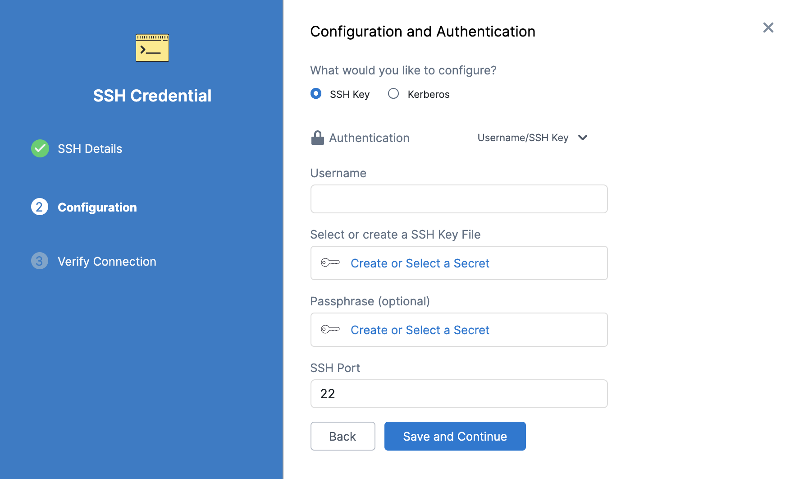
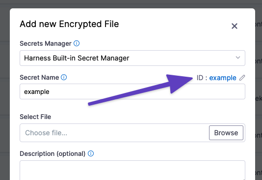

You can upload encrypted files and use them in your resources like Pipelines and Connectors, in the same way as encrypted text.

This topic describes how to add an encrypted file in Harness.


### Step 1: Add Encrypted File

This topic assumes you have a Harness Project set up. If not, see [Create Organizations and Projects](../1_Organizations-and-Projects/2-create-an-organization.md).

You can add an encrypted file at Project/Organization/Account scope. To do this, go to Project setup, Organization, or Account Resources.

Click **Secrets**.

Click **Secret** and select **File.**


The **Add new Encrypted File** settings appear.


Select the **Secrets Manager** you will use to encrypt this secret.

Enter a name for the encrypted file. You will use this name to reference the file in your resources.

Click **Browse** to locate and add a file. The default Secrets Manager for your account is used to encrypt the file.

Enter **Description** for your secret.

Enter **Tags** for your secret.

Click **Save.**

### Step 2: Reference the Encrypted File by Name

You can reference the encrypted file in any resource that uses files.

For example, in the following **Configuration and Authentication** dialog, click **Create or Select a Secret** under Select or Create a SSH Key File:


Click **Select an existing Secret** in the dialog and the dropdown lets you choose the file you added in **Secret Management:**


### Step 3: Reference the Encrypted File by Identifier

For an Encrypted File secret at the Project scope, you reference the secret in a Resource using its identifier and the expression: 


```
<+secrets.getValue("file-secret-Id")>
```
The identifier is immutable and is located in the secret settings:


Always reference a secret in an expression using its identifier. Names will not work.You can reference a secret at the Org scope using an expression with `org`:


```
<+secrets.getValue("org.file-secret-Id")>
```
If your secret is scoped at the Account level, you can refer it using `account`:


```
<+secrets.getValue("account.platformSecret-Id")>
```
