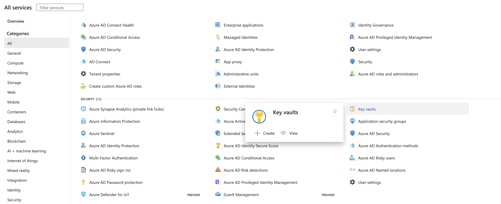
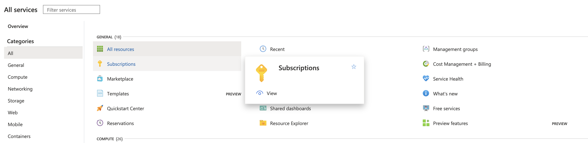

To store and use encrypted secrets (such as access keys) and files, you can add an Azure Key Vault Secret Manager.

### Before you begin

* See Harness [Secret Manager Overview](../6_Security/1-harness-secret-manager-overview.md).
* See [About Azure Key Vault](https://docs.microsoft.com/en-us/azure/key-vault/general/overview) by Microsoft.
* See [Azure Key Vault Basic Concepts](https://docs.microsoft.com/en-us/azure/key-vault/general/basic-concepts).
* Make sure you have set up an Azure account.
* Make sure you have **View** and **Create/Edit** permissions for secrets.

### Review: Secret Manager Overview

For a full overview of how your secrets are used with the Secrets Managers you configure in Harness, please see [Harness Secrets Management Overview](../6_Security/1-harness-secret-manager-overview.md) and [Harness Security FAQs](https://docs.harness.io/article/320domdle1-harness-security-faqs).

Here's a visual summary:


### Limitations

* Key Vault stores and manages secrets as sequences of octets (8-bit bytes), with a maximum size of 25k bytes each. For more information, see [Azure Key Vault secrets](https://docs.microsoft.com/en-us/azure/key-vault/secrets/about-secrets).

### Visual Overview

Azure Key Vault safeguards cryptographic keys and secrets, encrypting authentication keys, storage account keys, data encryption keys, .pfx files, and passwords.


### Step 1: Create Azure Reader Role

To enable Harness to later fetch your Azure vaults (in Step 7 below), you must first set up a **Reader** role in Azure. You can do this two ways:

* Azure Portal
* PowerShell Command

### Step 2: Create a Reader Role in Azure

To create a **Reader** role in the Azure portal UI:

Navigate to Azure's **Subscriptions** page.


Under **Subscription name**, select the subscription where your vaults reside.


:::tip
Copy and save the **Subscription ID**. You can paste this value into Harness Manager below at Option: Enter Subscription.Select your **Subscription’s Access control (IAM)** property.
:::


On the resulting **Access control (IAM)** page, select **Add a role assignment**.

In the resulting right pane, set the **Role** to **Reader**.


Accept the default value: **Assign access to**: **Azure AD user**, **group, or service principal**.

In the **Select** drop-down, select the name of your Azure App registration.


Click **Save**.

On the **Access control (IAM)** page, select the **Role assignments** tab. Make sure your new role now appears under the **Reader** group.


:::note
Microsoft Azure's [Manage subscriptions](https://docs.microsoft.com/en-us/azure/cost-management-billing/manage/add-change-subscription-administrator#to-assign-a-user-as-an-administrator) documentation adds details about the above procedure but focuses on the **Administrator** rather than the **Reader** role.
:::


#### PowerShell Command

You can also create a **Reader** role programmatically via this PowerShell command, after gathering the required parameters:


```
New-AzRoleAssignment -ObjectId <object_id> -RoleDefinitionName "Reader" -Scope /subscriptions/<subscription_id>
```
For details and examples, see Microsoft Azure's [Add or remove role assignments](https://docs.microsoft.com/en-us/azure/role-based-access-control/role-assignments-powershell#application-at-a-subscription-scope) documentation.

### Step 3: Configure Secret Manager in Harness

Select your **Account** or **Organization** or **Project.**

Select **Connectors** under **ACCOUNT SETUP/ORG SETUP/PROJECT SETUP.**


Click **New Connector.** The **Connectors** page appears**.**

Scroll down to **Secret Managers** and click **Azure Key Vault**.


Enter a **Name** for the secret manager.

You can choose to update the **ID** or let it be the same as your secret manager's name. For more information, see [Entity Identifier Reference](../20_References/entity-identifier-reference.md).

Enter **Description** and **Tags** for your secret manager.

Click **Continue**.

In the **Details** page, enter **Client ID**, **Tenant ID** corresponding to the fields highlighted below in the Azure UI:


To provide these values:

* In Azure, navigate to the **Azure Active Directory** > **App registrations** page, then select your App registration. (For details, see Azure's [Quickstart: Register an application with the Microsoft identity platform](https://docs.microsoft.com/en-us/azure/active-directory/develop/quickstart-v1-add-azure-ad-app).)
* Copy the **Application (client) ID** for the Azure App registration you are using, and paste it into the Harness dialog's **Client ID** field.
* Copy the **Directory (tenant) ID** of the Azure Active Directory (AAD) where you created your application, and paste it into the Harness dialog's **Tenant ID** field. (For details, see Microsoft Azure's [Get values for signing in](https://docs.microsoft.com/en-us/azure/active-directory/develop/howto-create-service-principal-portal#get-values-for-signing-in) topic.)
* In the **Subscription** field, you can optionally enter your Azure Subscription ID (GUID).

To find this ID, navigate to Azure's **Subscriptions** page, as outlined above in [Step 1: Create Azure Reader Role](../6_Security/8-azure-key-vault.md#step-1-create-azure-reader-role). From the resulting list of subscriptions, copy the **Subscription ID** beside the subscription that contains your vaults.


:::note
If you do not enter a GUID, Harness uses the default subscription for the [Client ID](#step-4-setup-delegates) you've provided above.
:::


Click **Create or Select a Secret** in the **Key** field. For detailed steps on creating a new secret, see [Add Text Secrets](./2-add-use-text-secrets.md).


The secret that you reference here should have the Azure authentication key as the **Secret Value**. The below image shows the creation of a secret with Azure authentication key as its value:


To create and exchange the azure authentication key, perform the following steps:

* Navigate to Azure's **Certificates & secrets** page. (For details, see Microsoft Azure's [Create a new application secret](https://docs.microsoft.com/en-us/azure/azure-resource-manager/resource-group-create-service-principal-portal#get-application-id-and-authentication-key) documentation.)
* In the resulting page’s **Client secrets** section, select **New client secret**.


* Enter a **Description** and expiration option, then click **Add**.


* Find your new key in the **Client secrets** section, and copy its value to your clipboard.


    
:::note
This is your only chance to view this key's value in Azure. Store the value somewhere secure, and keep it on your clipboard.Click **Continue**.
:::


### Step 4: Setup Delegates

In **Delegates** **Setup**, enter [**Selectors**](../2_Delegates/delegate-guide/select-delegates-with-selectors.md#option-select-a-delegate-for-a-connector-using-tags) for specific **Delegates** that you want to allow to connect to this Connector. Click **Continue**.

### Step 5: Setup Vault

Click **Fetch Vault**.

After a slight delay, the **Vault** drop-down list populates with vaults corresponding to your client secret. Select the Vault you want to use.

Click **Save and Continue**.

### Step 6: Test Connection

Once the Test Connection succeeds, click Finish. You can now see the Connector in Connectors.


:::note
Important: Test Connection failsHarness tests connections by generating a fake secret in the Secret Manager or Vault. For the Test Connection to function successfully, make sure you have the Create permission for secrets.  
The Test Connection fails if you do not have the Create permission. However, Harness still creates the Connector for you. You may use this Connector to read secrets if you have View permissions.
:::
