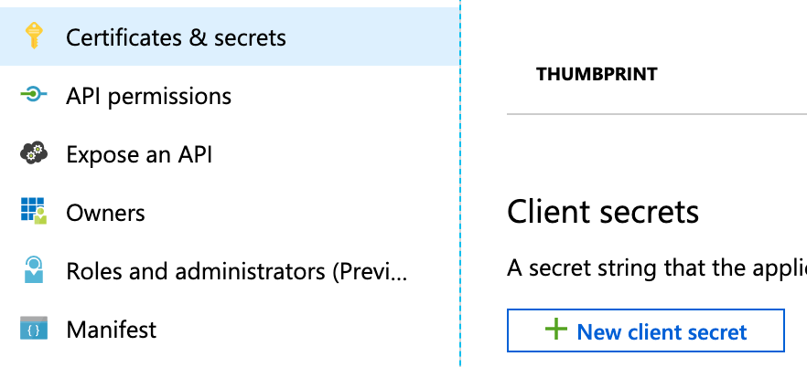
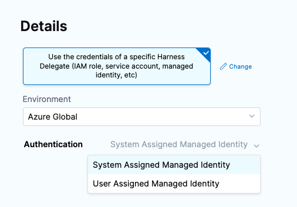

With the Microsoft Azure connector, your Harness pipelines can pull Azure artifacts, provision Azure infrastructure, and deploy your applications to Azure.

The Microsoft Azure connector is for ACR, AKS, ARM, Blueprint, Web Apps, and virtual machines for traditional (SSH/WinRM) deployments.

Use the Azure Repos connector to [connect to Azure SCM repos](../Code-Repositories/connect-to-a-azure-repo.md)

:::tip

If you're using Harness **Cloud Cost Management (CCM)**, you can [Set Up Cloud Cost Management for Azure](../../../cloud-cost-management/2-getting-started-ccm/4-set-up-cloud-cost-management/set-up-cost-visibility-for-azure.md).

:::

## Auth Provider API and TokenRequest API options

Harness provides the option of using the Auth Provider API or TokenRequest API for authentication.

<details>
<summary>Summary of Auth Provider and TokenRequest API changes</summary>

In Kubernetes 1.22, the Auth Provider API was deprecated and replaced with a new TokenRequest API. The TokenRequest API is used by client libraries and tools to request an authentication token from the Kubernetes API server.

The TokenRequest API provides a more flexible and extensible authentication mechanism than the Auth Provider API. Instead of relying on pre-configured authentication plugins, client libraries and tools can now dynamically request authentication tokens from the Kubernetes API server based on their specific needs and requirements.

To use the TokenRequest API for authentication, client libraries and tools can send a TokenRequest object to the Kubernetes API server. The TokenRequest object specifies the audience, scopes, and other parameters for the requested token. The Kubernetes API server then validates the request, generates a token with the requested parameters, and returns the token to the client.

One advantage of the TokenRequest API is that it allows for more fine-grained control over authentication and authorization. For example, a client library or tool can request a token with only the necessary scopes to perform a specific operation, rather than requesting a token with full cluster access.

Another advantage of the TokenRequest API is that it allows for easier integration with external identity providers and authentication systems. Client libraries and tools can use the TokenRequest API to request authentication tokens from external providers, such as OAuth2 providers or custom authentication systems, and use those tokens to authenticate to the Kubernetes API server.

Overall, the TokenRequest API provides a more flexible and extensible authentication mechanism than the deprecated Auth Provider API, and allows for more fine-grained control over authentication and authorization in Kubernetes.

</details>


To select which API to use:

- **Auth Provider API**: this is the current default. You do not have to change the default settings of Harness connectors or the Harness delegates you use.
- **TokenRequest API**: you must install the provider-specific plugin on the Harness delegate(s) to use the TokenRequest API introduced in Kubernetes 1.22.

### Install the kubelogin client-go credential (exec) plugin on the delegate

When using the Harness Azure connector with Kubernetes version >= 1.22, you can use the **kubelogin client-go credential (exec) plugin** to authenticate to AKS cluster.

The Harness Azure connector has 4 authentication types. For each type, you must install the following dependencies in the Harness delegates you use or Harness will follow the old Auth Provider API format.

- **Secret** (`SERVICE_PRINCIPAL_SECRET`): Kubelogin binary.
- **Certificate** (`SERVICE_PRINCIPAL_CERT`): Kubelogin binary and azurecli (azurecli is required as kubelogin does not support certificate in PEM format).
- **System Assigned Managed Identity** (`MANAGED_IDENTITY_SYSTEM_ASSIGNED`): Kubelogin binary.
- **User Assigned Managed Identity** (`MANAGED_IDENTITY_USER_ASSIGNED`): Kubelogin binary.

The **Secret** and **Certificate** options are available when you select the **Specify credentials here** option in the Azure connector.

The **System Assigned Managed Identity** and **User Assigned Managed Identity** options are available when you select the **Use the credentials of a specific Harness Delegate** option in the Azure connector.

You can install the kubelogin plugin on the delegate by creating a delegate with an immutable image and updating the following commands in `INIT_SCRIPT`:

<details>
<summary>RHEL 7 OS</summary>

```
// Install dependencies
microdnf install --nodocs openssl util-linux unzip python2 && microdnf clean all

// Download kubelogin
curl https://github.com/Azure/kubelogin/releases/download/v0.0.27/kubelogin-linux-amd64.zip -L -o kubelogin.zip
unzip kubelogin.zip
chmod 755 /opt/harness-delegate/bin/linux_amd64/kubelogin

// Add the binary to PATH
mv ./bin/linux_amd64/kubelogin /usr/local/bin

// If the AKS cloud provider auth type is Certificate then we need to install azure-cli as its PEM format is not supported by kubelogin. It can be installed on the delegate by creating a delegate with an immutable image and updating the following commands in INIT_SCRIPT
rpm --import https://packages.microsoft.com/keys/microsoft.asc
echo -e "[azure-cli]
name=Azure CLI
baseurl=https://packages.microsoft.com/yumrepos/azure-cli
enabled=1
gpgcheck=1
gpgkey=https://packages.microsoft.com/keys/microsoft.asc" | tee /etc/yum.repos.d/azure-cli.repo
microdnf install azure-cli
```
</details>

<details>
<summary>Ubuntu</summary>

```
// Download kubelogin
curl https://github.com/Azure/kubelogin/releases/download/v0.0.27/kubelogin-linux-amd64.zip -L -o kubelogin.zip
unzip kubelogin.zip
chmod 755 /opt/harness-delegate/bin/linux_amd64/kubelogin

// Add the binary to PATH
mv ./bin/linux_amd64/kubelogin /usr/local/bin

// If the AKS cloud provider auth type is Certificate then we need to install az-cli as its PEM format is not supported by kubelogin. It can be installed on the delegate by creating a delegate with an immutable image and updating the following commands in INIT_SCRIPT
curl -sL https://aka.ms/InstallAzureCLIDeb | bash
```
</details>


For more information, go to [kubelogin](https://github.com/Azure/kubelogin/releases) from Azure and [Delegate installation overview](/docs/platform/2_Delegates/install-delegates/overview.md).

## Roles, permission, and cluster requirements

This section assumes you're familiar with Azure RBAC. For details, go to the Azure documentation: [Assign Azure roles using the Azure portal](https://docs.microsoft.com/en-us/azure/role-based-access-control/role-assignments-portal).

This graphic from Azure is a useful reminder of how Azure manages RBAC:


For security reasons, Harness uses an application object and service principal rather than a user identity. The process is described in that Azure documentation: [How to use the portal to create an Azure AD application and service principal that can access resources](https://docs.microsoft.com/en-us/azure/active-directory/develop/howto-create-service-principal-portal).

### Azure Container Repository (ACR) role requirements

The Harness Azure connectors that you'll use to connect Harness to ACR must have the **Reader** role, at minimum. You can also use a custom role that includes the permissions of the **Reader** role.

```mdx-code-block
import Tabs from '@theme/Tabs';
import TabItem from '@theme/TabItem';
```

```mdx-code-block
<Tabs>
  <TabItem value="reader" label="Reader" default>
```
The **Reader** role must be assigned at the **Subscription** or **Resource Group** level that is used by the Application (Client) Id that you'll use in the Azure connector's settings. The application must have permission to list **all** container registries.


:::tip

Make sure you:

* Don't put the **Reader** role in a different IAM section of Azure.
* Don't provide only the **AcrPull** role, instead of **Reader**. It might appear that the **AcrPull** role gives access to a specific registry, but Harness needs to list **all** registries.

:::

```mdx-code-block
  </TabItem>
  <TabItem value="custom" label="Custom role">
```

The following permissions (actions) are necessary for any Service Principal and/or Managed Identity user, regardless of whether you are using Kubernetes RBAC or Azure RBAC:
* `Microsoft.ContainerRegistry/registries/read`
* `Microsoft.ContainerRegistry/registries/builds/read`
* `Microsoft.ContainerRegistry/registries/metadata/read`
* `Microsoft.ContainerRegistry/registries/pull/read`
* `Microsoft.ContainerService/managedClusters/read`
* `Microsoft.ContainerService/managedClusters/listClusterUserCredential/action`
* `Microsoft.Resource/subscriptions/resourceGroup/read`

For Helm deployments, the version of Helm must be >= 3.2.0. The Harness `HELM_VERSION_3_8_0` feature flag must be activated.

You can't use Pod Assigned Managed Identity and System Assigned Managed Identity for the same cluster.

The following JSON sample creates a custom role with the required permissions. To use this sample, replace `xxxx` with the role name, subscription Id, and resource group Id.

```json
{
    "id": "/subscriptions/xxxx/providers/Microsoft.Authorization/roleDefinitions/xxxx",
    "properties": {
        "roleName": "xxxx",
        "description": "",
        "assignableScopes": [
            "/subscriptions/xxxx/resourceGroups/xxxx"
        ],
        "permissions": [
            {
                "actions": [],
                "notActions": [],
                "dataActions": [
                    "Microsoft.ContainerService/managedClusters/configmaps/read",
                    "Microsoft.ContainerService/managedClusters/configmaps/write",
                    "Microsoft.ContainerService/managedClusters/configmaps/delete",
                    "Microsoft.ContainerService/managedClusters/secrets/read",
                    "Microsoft.ContainerService/managedClusters/secrets/write",
                    "Microsoft.ContainerService/managedClusters/secrets/delete",
                    "Microsoft.ContainerService/managedClusters/apps/deployments/read",
                    "Microsoft.ContainerService/managedClusters/apps/deployments/write",
                    "Microsoft.ContainerService/managedClusters/apps/deployments/delete",
                    "Microsoft.ContainerService/managedClusters/events/read",
                    "Microsoft.ContainerService/managedClusters/events/write",
                    "Microsoft.ContainerService/managedClusters/events/delete",
                    "Microsoft.ContainerService/managedClusters/namespaces/read",
                    "Microsoft.ContainerService/managedClusters/nodes/read",
                    "Microsoft.ContainerService/managedClusters/pods/read",
                    "Microsoft.ContainerService/managedClusters/pods/write",
                    "Microsoft.ContainerService/managedClusters/pods/delete",
                    "Microsoft.ContainerService/managedClusters/services/read",
                    "Microsoft.ContainerService/managedClusters/services/write",
                    "Microsoft.ContainerService/managedClusters/services/delete",
                    "Microsoft.ContainerService/managedClusters/apps/statefulsets/read",
                    "Microsoft.ContainerService/managedClusters/apps/statefulsets/write",
                    "Microsoft.ContainerService/managedClusters/apps/statefulsets/delete",
                    "Microsoft.ContainerService/managedClusters/apps/replicasets/read",
                    "Microsoft.ContainerService/managedClusters/apps/replicasets/write",
                    "Microsoft.ContainerService/managedClusters/apps/replicasets/delete"
                ],
                "notDataActions": []
            }
        ]
    }
}
```

```mdx-code-block
  </TabItem>
</Tabs>
```

:::info

Harness supports 500 images from an ACR repo. If you don't see some of your images, then you might have exceeded this limit. This is the result of an Azure API limitation.

If you connect to an ACR repo via the platform-agnostic [Docker Connector](../../../platform/7_Connectors/Cloud-providers/ref-cloud-providers/docker-registry-connector-settings-reference.md), the limit is 100.

:::

### Azure Web App role requirements

Harness Azure connectors that you'll use to connect to Azure Web Apps with Service Principal or Managed Identity credentials, must have the **Contributor** role, at minimum. You can also use a custom role that includes the permissions of the **Contributor** role.

```mdx-code-block
import Tabs2 from '@theme/Tabs';
import TabItem2 from '@theme/TabItem';
```
```mdx-code-block
<Tabs2>
  <TabItem2 value="contrib" label="Contributor permissions" default>
```

The follow are the Azure RBAC permissions used for System Assigned Managed Identity permissions to perform Azure Web App deployments for container and non-container artifacts:

```json
[
                    "microsoft.web/sites/slots/deployments/read",
                    "Microsoft.Web/sites/Read",
                    "Microsoft.Web/sites/config/Read",
                    "Microsoft.Web/sites/slots/config/Read",
                    "microsoft.web/sites/slots/config/appsettings/read",
                    "Microsoft.Web/sites/slots/*/Read",
                    "Microsoft.Web/sites/slots/config/list/Action",
                    "Microsoft.Web/sites/slots/stop/Action",
                    "Microsoft.Web/sites/slots/start/Action",
                    "Microsoft.Web/sites/slots/config/Write",
                    "Microsoft.Web/sites/slots/Write",
                    "microsoft.web/sites/slots/containerlogs/action",
                    "Microsoft.Web/sites/config/Write",
                    "Microsoft.Web/sites/slots/slotsswap/Action",
                    "Microsoft.Web/sites/config/list/Action",
                    "Microsoft.Web/sites/start/Action",
                    "Microsoft.Web/sites/stop/Action",
                    "Microsoft.Web/sites/Write",
                    "microsoft.web/sites/containerlogs/action",
                    "Microsoft.Web/sites/publish/Action",
                    "Microsoft.Web/sites/slots/publish/Action"
]
```

```mdx-code-block
  </TabItem2>
  <TabItem2 value="custom" label="Custom role">
```

The following permissions (actions) are necessary for any Service Principal and/or Managed Identity user, regardless of whether you are using Kubernetes RBAC or Azure RBAC:
* `Microsoft.ContainerRegistry/registries/read`
* `Microsoft.ContainerRegistry/registries/builds/read`
* `Microsoft.ContainerRegistry/registries/metadata/read`
* `Microsoft.ContainerRegistry/registries/pull/read`
* `Microsoft.ContainerService/managedClusters/read`
* `Microsoft.ContainerService/managedClusters/listClusterUserCredential/action`
* `Microsoft.Resource/subscriptions/resourceGroup/read`

For Helm deployments, the version of Helm must be >= 3.2.0. The Harness `HELM_VERSION_3_8_0` feature flag must be activated.

You can't use Pod Assigned Managed Identity and System Assigned Managed Identity for the same cluster.

The following JSON sample creates a custom role with the required permissions. To use this sample, replace `xxxx` with the role name, subscription Id, and resource group Id.

```json
{
    "id": "/subscriptions/xxxx/providers/Microsoft.Authorization/roleDefinitions/xxxx",
    "properties": {
        "roleName": "xxxx",
        "description": "",
        "assignableScopes": [
            "/subscriptions/xxxx/resourceGroups/xxxx"
        ],
        "permissions": [
            {
                "actions": [],
                "notActions": [],
                "dataActions": [
                    "Microsoft.ContainerService/managedClusters/configmaps/read",
                    "Microsoft.ContainerService/managedClusters/configmaps/write",
                    "Microsoft.ContainerService/managedClusters/configmaps/delete",
                    "Microsoft.ContainerService/managedClusters/secrets/read",
                    "Microsoft.ContainerService/managedClusters/secrets/write",
                    "Microsoft.ContainerService/managedClusters/secrets/delete",
                    "Microsoft.ContainerService/managedClusters/apps/deployments/read",
                    "Microsoft.ContainerService/managedClusters/apps/deployments/write",
                    "Microsoft.ContainerService/managedClusters/apps/deployments/delete",
                    "Microsoft.ContainerService/managedClusters/events/read",
                    "Microsoft.ContainerService/managedClusters/events/write",
                    "Microsoft.ContainerService/managedClusters/events/delete",
                    "Microsoft.ContainerService/managedClusters/namespaces/read",
                    "Microsoft.ContainerService/managedClusters/nodes/read",
                    "Microsoft.ContainerService/managedClusters/pods/read",
                    "Microsoft.ContainerService/managedClusters/pods/write",
                    "Microsoft.ContainerService/managedClusters/pods/delete",
                    "Microsoft.ContainerService/managedClusters/services/read",
                    "Microsoft.ContainerService/managedClusters/services/write",
                    "Microsoft.ContainerService/managedClusters/services/delete",
                    "Microsoft.ContainerService/managedClusters/apps/statefulsets/read",
                    "Microsoft.ContainerService/managedClusters/apps/statefulsets/write",
                    "Microsoft.ContainerService/managedClusters/apps/statefulsets/delete",
                    "Microsoft.ContainerService/managedClusters/apps/replicasets/read",
                    "Microsoft.ContainerService/managedClusters/apps/replicasets/write",
                    "Microsoft.ContainerService/managedClusters/apps/replicasets/delete"
                ],
                "notDataActions": []
            }
        ]
    }
}
```

```mdx-code-block
  </TabItem2>
</Tabs2>
```

### Connect Harness to Azure Kubernetes Services (AKS)

There are three options for connecting Harness to an AKS cluster:

* Use the platform-agnostic [Kubernetes cluster connector](./add-a-kubernetes-cluster-connector.md) with a Kubernetes or Helm delegate.
    + You'll need to install a [Kubernetes delegate](../../../platform/2_Delegates/install-delegates/overview.md) in the target AKS cluster, and then use the delegate's credentials for the Kubernetes cluster connector's authentication method.
	+ You won't need to provide Microsoft Azure Service Principal or Managed Identity credentials.
* Use a **Microsoft Azure Cloud Provider connector**, as described in this topic, with a Kubernetes delegate.
    + You'll need to install a [Kubernetes delegate](../../../platform/2_Delegates/install-delegates/overview.md) in the target AKS cluster, and then use the delegate's credentials for the Azure connector's authentication method.
	+ You'll need to provide the Microsoft Azure Environment.
	+ If you use a User Assigned Managed Identity, you'll need to provide the Application (client) Id.
	+ If you use a System Assigned Managed Identity, you won't need to provide any Ids.
* Use a **Microsoft Azure Cloud Connector** with Service Principal or Managed Identity credentials, as described in this topic.
    + You must assign the **Owner** role or an equivalent custom role, as explained in [AKS role requirements](#aks-role-requirements).

### AKS cluster setup requirements

* AKS managed AAD, enabled or disabled.
* Kubernetes RBAC, enabled.
* Azure RBAC, enabled or disabled.

For more information, go to the **Deployments (CD)** section of the [Kubernetes cluster connector settings reference](../../7_Connectors/Cloud-providers/ref-cloud-providers/kubernetes-cluster-connector-settings-reference.md).

### AKS role requirements

If you use the Microsoft Azure connector to connect to AKS with Service Principal or Managed Identity credentials, you must assign the **Owner** role or a custom role that includes the permissions of the **Owner** role.

```mdx-code-block
import Tabs3 from '@theme/Tabs';
import TabItem3 from '@theme/TabItem';
```
```mdx-code-block
<Tabs3>
  <TabItem3 value="custom" label="Custom role" default>
```

The following permissions (actions) are necessary for any Service Principal and/or Managed Identity user, regardless of whether you are using Kubernetes RBAC or Azure RBAC:
* `Microsoft.ContainerRegistry/registries/read`
* `Microsoft.ContainerRegistry/registries/builds/read`
* `Microsoft.ContainerRegistry/registries/metadata/read`
* `Microsoft.ContainerRegistry/registries/pull/read`
* `Microsoft.ContainerService/managedClusters/read`
* `Microsoft.ContainerService/managedClusters/listClusterUserCredential/action`
* `Microsoft.Resource/subscriptions/resourceGroup/read`

For Helm deployments, the version of Helm must be >= 3.2.0. The Harness `HELM_VERSION_3_8_0` feature flag must be activated.

You can't use Pod Assigned Managed Identity and System Assigned Managed Identity for the same cluster.

The following JSON sample creates a custom role with the required permissions. To use this sample, replace `xxxx` with the role name, subscription Id, and resource group Id.

```json
{
    "id": "/subscriptions/xxxx/providers/Microsoft.Authorization/roleDefinitions/xxxx",
    "properties": {
        "roleName": "xxxx",
        "description": "",
        "assignableScopes": [
            "/subscriptions/xxxx/resourceGroups/xxxx"
        ],
        "permissions": [
            {
                "actions": [],
                "notActions": [],
                "dataActions": [
                    "Microsoft.ContainerService/managedClusters/configmaps/read",
                    "Microsoft.ContainerService/managedClusters/configmaps/write",
                    "Microsoft.ContainerService/managedClusters/configmaps/delete",
                    "Microsoft.ContainerService/managedClusters/secrets/read",
                    "Microsoft.ContainerService/managedClusters/secrets/write",
                    "Microsoft.ContainerService/managedClusters/secrets/delete",
                    "Microsoft.ContainerService/managedClusters/apps/deployments/read",
                    "Microsoft.ContainerService/managedClusters/apps/deployments/write",
                    "Microsoft.ContainerService/managedClusters/apps/deployments/delete",
                    "Microsoft.ContainerService/managedClusters/events/read",
                    "Microsoft.ContainerService/managedClusters/events/write",
                    "Microsoft.ContainerService/managedClusters/events/delete",
                    "Microsoft.ContainerService/managedClusters/namespaces/read",
                    "Microsoft.ContainerService/managedClusters/nodes/read",
                    "Microsoft.ContainerService/managedClusters/pods/read",
                    "Microsoft.ContainerService/managedClusters/pods/write",
                    "Microsoft.ContainerService/managedClusters/pods/delete",
                    "Microsoft.ContainerService/managedClusters/services/read",
                    "Microsoft.ContainerService/managedClusters/services/write",
                    "Microsoft.ContainerService/managedClusters/services/delete",
                    "Microsoft.ContainerService/managedClusters/apps/statefulsets/read",
                    "Microsoft.ContainerService/managedClusters/apps/statefulsets/write",
                    "Microsoft.ContainerService/managedClusters/apps/statefulsets/delete",
                    "Microsoft.ContainerService/managedClusters/apps/replicasets/read",
                    "Microsoft.ContainerService/managedClusters/apps/replicasets/write",
                    "Microsoft.ContainerService/managedClusters/apps/replicasets/delete"
                ],
                "notDataActions": []
            }
        ]
    }
}
```

```mdx-code-block
  </TabItem3>
  <TabItem3 value="k8sRbac" label="Kubernetes RBAC example">
```

Here's an example of Kubernetes RBAC permissions used for System Assigned Managed Identity.

```
kind: Role
apiVersion: rbac.authorization.k8s.io/v1
metadata:
  name: cdp-qa-deployer-role
  namespace: cdp-qa-app
rules:
  - apiGroups: ["", "apps"]
    resources: ["pods", "configmaps", "deployments", "secrets", "events", "services",  "replicasets", "deployments/scale", "namespaces", "resourcequotas", "limitranges"]
    verbs: ["get", "watch", "list", "create", "update", "patch", "delete"]
---
kind: RoleBinding
apiVersion: rbac.authorization.k8s.io/v1
metadata:
  name: cdp-qa-deployer-role-binding
  namespace: cdp-qa-app
roleRef:
  apiGroup: rbac.authorization.k8s.io
  kind: Role
  name: cdp-qa-deployer-role
subjects:
  - kind: Group
    namespace: cdp-qa-app
    name: <AD group id to which the SP and MSI users are assigned>
```

```mdx-code-block
  </TabItem3>
  <TabItem3 value="azureRbac" label="Azure RBAC example">
```

Here's an example of Azure RBAC permissions used for System Assigned Managed Identity. To use this sample, replace `xxxx` with the subscription Id and resource group Id.

```json
{
    "id": "/subscriptions/xxxx/providers/Microsoft.Authorization/roleDefinitions/xxxx",
    "properties": {
        "roleName": "HarnessSysMSIRole",
        "description": "",
        "assignableScopes": [
            "/subscriptions/xxxx/resourceGroups/xxxx"
        ],
        "permissions": [
            {
                "actions": [],
                "notActions": [],
                "dataActions": [
                    "Microsoft.ContainerService/managedClusters/configmaps/read",
                    "Microsoft.ContainerService/managedClusters/configmaps/write",
                    "Microsoft.ContainerService/managedClusters/configmaps/delete",
                    "Microsoft.ContainerService/managedClusters/secrets/read",
                    "Microsoft.ContainerService/managedClusters/secrets/write",
                    "Microsoft.ContainerService/managedClusters/secrets/delete",
                    "Microsoft.ContainerService/managedClusters/apps/deployments/read",
                    "Microsoft.ContainerService/managedClusters/apps/deployments/write",
                    "Microsoft.ContainerService/managedClusters/apps/deployments/delete",
                    "Microsoft.ContainerService/managedClusters/events/read",
                    "Microsoft.ContainerService/managedClusters/events/write",
                    "Microsoft.ContainerService/managedClusters/events/delete",
                    "Microsoft.ContainerService/managedClusters/namespaces/read",
                    "Microsoft.ContainerService/managedClusters/nodes/read",
                    "Microsoft.ContainerService/managedClusters/pods/read",
                    "Microsoft.ContainerService/managedClusters/pods/write",
                    "Microsoft.ContainerService/managedClusters/pods/delete",
                    "Microsoft.ContainerService/managedClusters/services/read",
                    "Microsoft.ContainerService/managedClusters/services/write",
                    "Microsoft.ContainerService/managedClusters/services/delete",
                    "Microsoft.ContainerService/managedClusters/apps/statefulsets/read",
                    "Microsoft.ContainerService/managedClusters/apps/statefulsets/write",
                    "Microsoft.ContainerService/managedClusters/apps/statefulsets/delete",
                    "Microsoft.ContainerService/managedClusters/apps/replicasets/read",
                    "Microsoft.ContainerService/managedClusters/apps/replicasets/write",
                    "Microsoft.ContainerService/managedClusters/apps/replicasets/delete"
                ],
                "notDataActions": []
            }
        ]
    }
}
```

```mdx-code-block
  </TabItem3>
</Tabs3>
```

### Azure Resource Management (ARM)

The roles required depend on the scope type of your ARM template:

- **Resource group**: requires the `Contributor` role.
- **Subscription**: requires the `Contributor` role.
- **Management group**: requires the `Contributor` role.
- **Tenant**: requires the `Contributor` or `Owner` role. For example, creating a Tenant requires the `Contributor` role, but the `Owner` role is required to create role assignments.
- **Key Vault access**: to enable access to Key Vaults from the ARM templates you use in Harness, make sure you select the **Azure Resource Manager for template deployment** option in the Key Vault Access Policy.

  

:::note

The Azure roles provided in the connector must allow Harness to provision the Azure resources in your ARM templates. For example, to create a policy assignment, the `Resource Policy Contributor` role is required.

:::

## Azure Blueprints

In Azure, the permissions required to create and delete Blueprints are listed in [Permissions in Azure Blueprints](https://docs.microsoft.com/en-us/azure/governance/blueprints/overview#permissions-in-azure-blueprints) from Azure.

The Azure roles required on the service principal used by Harness depend on the scope type of your Blueprint definition.

### Management Scope

* **System-assigned managed identity:**
	+ **Contributor** role at the management group scope where the Blueprint definitions will be created and published.
	+ **Owner** role at subscription scope where the assignment will be done.
* **System-assigned user identity:**
	+ **Contribute** role at the management group scope where Blueprint definitions will be created and published.
  
	Harness does not manage the right and lifecycle of a user-managed identity. You will need to manage the user-managed identity.

### Subscription Scope

* **System-assigned managed identity:**
	+ **Owner** role at the subscription scope.
* **System-assigned user identity:**
	+ **Contribute** role to create and publish the Blueprint definition.  
	Harness does not manage the right and lifecycle of a user-managed identity. You are responsible for managing the right and lifecycle of a user-managed identity that is in charge of assignment.

## Add an Azure connector

You can add Azure connectors at the account, org, or project level at any time, or you can add them while setting up pipelines. For example, to add a connector at the project level you would select **Project Setup**, select **Connectors**, and then select **New Connector**.

1. From the Connectors library, select **Azure** under **Cloud Providers**.
1. Input a **Name**. Harness automatically creates an **Id** ([Entity Identifier](../../../platform/20_References/entity-identifier-reference.md)) for the connector based on the name. You can edit the Id before saving the connector. Once the connector is saved, the Id is immutable.
1. Optionally, you can add a description and [tags](../../../platform/20_References/tags-reference.md).
1. Select **Continue** to configure the connector's credentials.

## Configure credentials

There are two primary ways for the Harness connector to authenticate with Azure:

* Select **Specify credentials here** to use an Application (client) and Tenant (directory) Id.
* Select **Use the credentials of a specific Harness Delegate** to allow the connector to inherit its credentials from the Harness delegate that is running in your Azure subscription or AKS cluster.

<details>
<summary>Specify credentials</summary>

If you select **Specify credentials here**, you must provide Microsoft Azure app registration details.


1. In Microsoft Azure, go to the App registration **Overview** or **Managed Identity** page and make note of the **Application (client) ID** and **Directory (tenant) ID**.

   The **Application (client) ID** is the application Id for the app registration you want to use the Harness connector. To access resources in your Azure subscription, you must assign the Azure App registration using this Application Id to a role in that subscription. For more information, go to the following Microsoft documentation:

   * [Quickstart: Register an app with the Azure Active Directory v1.0 endpoint](https://docs.microsoft.com/en-us/azure/active-directory/develop/quickstart-v1-add-azure-ad-app)
   * [Assign the application to a role](https://docs.microsoft.com/en-us/azure/active-directory/develop/howto-create-service-principal-portal#assign-the-application-to-a-role)
   * [Use the portal to create an Azure AD application and service principal that can access resources](https://docs.microsoft.com/en-us/azure/active-directory/develop/howto-create-service-principal-portal)

   The **Directory (tenant) ID** is the Id for the Azure Active Directory (AAD) that exists in your app. For more information, go to the following Azure documentation:

   * [Get tenant ID](https://docs.microsoft.com/en-us/azure/azure-resource-manager/resource-group-create-service-principal-portal#get-tenant-id)
   * [Use the portal to create an Azure AD application and service principal that can access resources](https://docs.microsoft.com/en-us/azure/active-directory/develop/howto-create-service-principal-portal)

   

2. In the Harness Azure Cloud Provider settings, select the **Environment**: Either **Azure Global** or **US Government**.
3. Input the **Application (client) ID** from Azure in the connector's **Application Id** field.
4. Input the **Directory (tenant) ID** from Azure in the connector's **Tenant Id** field.
5. Provide an authentication key for your app. For **Authentication**, select either **Secret** or **Certificate**, and then select or create a [Harness Text Secret](../../../platform/Secrets/2-add-use-text-secrets.md) or [Harness File Secret](../../../platform/Secrets/3-add-file-secrets.md).

   Harness supports only PEM files. Harness doesn't support PFX files.

   If you need to create a secret key for your app, go to **App Registrations** in Azure Active Directory, select the app you're connecting to Harness, select **Certificates & secrets**, and then select **New client secret**. For more information, go to the Azure documentation about [Creating a new application secret](https://docs.microsoft.com/en-us/azure/active-directory/develop/howto-create-service-principal-portal#create-a-new-application-secret).

   

6. Select **Continue**.

</details>

<details>
<summary>Inherit credentials from the delegate</summary>

If you have [installed a Harness Delegate](/docs/platform/2_Delegates/delegate-concepts/delegate-overview.md) in your Azure subscription (preferably in your target AKS cluster), select **Use the credentials of a specific Harness Delegate** to allow the connector to inherit authentication credentials from the delegate.

1. For **Environment**, select **Azure Global** or **US Government**.
2. For **Authentication**, select **System Assigned Managed Identity** or **User Assigned Managed Identity**.

   **System Assigned Managed Identity** uses the AKS cluster predefined [Kubelet Managed Identity](https://docs.microsoft.com/en-us/azure/aks/use-managed-identity#summary-of-managed-identities). The [Control plane AKS Managed Identity](https://docs.microsoft.com/en-us/azure/aks/use-managed-identity#summary-of-managed-identities), which has name format `<AKSName>`, must have the **Reader** permission on the AKS cluster itself. If used for image storage, the Kubelet Managed Identity, which has name format `<AKSName>-agentpool`, must have the **acrPull** permission on ACR.

   For more information about managed identities, go to the follow Azure documentation:

   * [Use managed identities in Azure Kubernetes Service](https://docs.microsoft.com/en-us/azure/aks/use-managed-identity)
   * [How to use managed identities with Azure Container Instances](https://docs.microsoft.com/en-us/azure/container-instances/container-instances-managed-identity) from Azure.

   

3. If you selected **User Assigned Managed Identity**, input the Managed Identity's **Client Id**, which you can find in your Azure **Managed Identities**. You can also use a [Pod Assigned Managed identity](https://docs.microsoft.com/en-us/azure/aks/use-azure-ad-pod-identity).

   

4. Select **Continue**

</details>

## Select connectivity mode

1. Select how you want Harness to connect to Azure:

   * **Connect through Harness Platform:** Use a direct, secure communication between Harness and Azure.
   * **Connect through a Harness Delegate:** Harness communicates with Azure through a Harness delegate in your Azure subscription or AKS cluster. You must choose this option if you chose to inherit delegate credentials.

2. If connecting through a Harness delegate, select either:

   * **Use any available Delegate:** Harness selects an available delegate at runtime.
   * **Only use Delegates with all of the following tags:** Use tags to match one or more suitable delegates. You can also install a new delegate at this time.

3. Select **Save and Continue** to run the connection test, and then, if the test succeeds, select **Finish**. The connection test confirms that your authentication and delegate selections are valid.

   If the connection test fails, make sure that your delegate is running and that your credentials are valid. For example, check that the secret has not expired in your App registration.

## Using ${HARNESS\_KUBE\_CONFIG\_PATH} with Azure

The Harness `${HARNESS_KUBE_CONFIG_PATH}` expression resolves to the path to a Harness-generated kubeconfig file containing the credentials you provided to Harness.

The credentials can be used by kubectl commands by exporting its value to the `KUBECONFIG` environment variable.

For example, you could use this shell script in a Harness Run step:

```
export KUBECONFIG=${HARNESS_KUBE_CONFIG_PATH} kubectl get pods -n <namespace>
```

Steps can be executed on any delegate or you can select specific delegates using the [Delegate Selector](../../2_Delegates/manage-delegates/select-delegates-with-selectors.md) setting.

For Azure deployments, note the following:

* If the Azure connector used in the stage's Infrastructure uses Azure Managed Identity for authentication, then the Shell Script step must use a **Delegate Selector** for a delegate running in AKS.
* If the Azure connector used in the stage's Infrastructure uses Azure Service Principal for authentication, then the Shell Script step can use any delegate.

## See also

* [Azure ACR to AKS CD Quickstart](/docs/continuous-delivery/deploy-srv-diff-platforms/azure/azure-cd-quickstart)
* [Kubernetes CD Quickstart](/docs/continuous-delivery/deploy-srv-diff-platforms/kubernetes/kubernetes-cd-quickstart)
* [Harness Key Concepts](../../../getting-started/learn-harness-key-concepts.md)
* [CD Pipeline Basics](/docs/continuous-delivery/get-started/cd-pipeline-basics)
