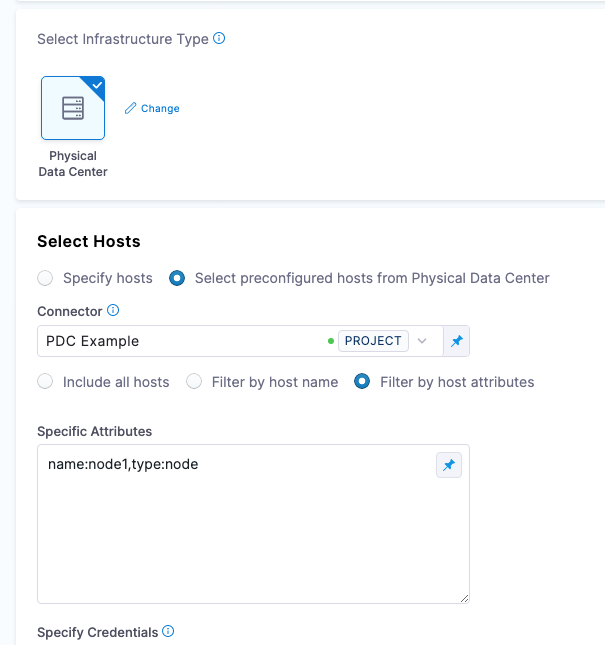

You can connect Harness to the physical data centers (PDCs) where you will deploy your services.

PDCs are typically used in traditional deployments, including [Secure Shell (SSH)](https://developer.harness.io/docs/continuous-delivery/deploy-srv-diff-platforms/traditional/ssh-ng) and [WinRM](https://developer.harness.io/docs/continuous-delivery/deploy-srv-diff-platforms/traditional/win-rm-tutorial).

## Add a Physical Data Center connector

```mdx-code-block
import Tabs from '@theme/Tabs';
import TabItem from '@theme/TabItem';
```
```mdx-code-block
<Tabs>
  <TabItem value="YAML" label="YAML" default>
```

Here's an example of a PDC connector YAML:

```yaml
connector:
  name: PDC-Connector
  identifier: PDCConnector
  description: ""
  orgIdentifier: default
  projectIdentifier: CD_Docs
  type: Pdc
  spec:
    hosts:
      - hostname: ec2-54-111-26-183.us-west-2.compute.amazonaws.com
      - hostname: ec2-54-222-142-249.us-west-2.compute.amazonaws.com
```

```mdx-code-block
  </TabItem>
  <TabItem value="API" label="API">
```

Create the PDC connector using the [Create a Connector](https://apidocs.harness.io/tag/Connectors#operation/createConnector) API.


```yaml
curl --location --request POST 'https://app.harness.io/gateway/ng/api/connectors?accountIdentifier=123456' \
--header 'Content-Type: text/yaml' \
--header 'x-api-key: pat.123456.123456' \
--data-raw 'connector:
  name: PDC-Connector
  identifier: PDCConnector
  description: ""
  orgIdentifier: default
  projectIdentifier: CD_Docs
  type: Pdc
  spec:
    hosts:
      - hostname: ec2-54-111-26-183.us-west-2.compute.amazonaws.com
      - hostname: ec2-54-222-142-249.us-west-2.compute.amazonaws.com'
```

```mdx-code-block
  </TabItem>
  <TabItem value="Harness Manager" label="Harness Manager">
```

1. In your project, org, or account, select **Connectors**, and then select **New Connector**.
2. Select **Physical Data Center**.
3. Enter a name for the connector and select **Continue**.
4. Enter the target hosts manually or by using a JSON file. Both options are described in detail below.
5. Select **Continue**.
6. Select the Harness delegate(s) you want to use to perform the connection, and then select **Save and Continue**.


```mdx-code-block
  </TabItem>
</Tabs>
```

### Manually enter hosts

To manually enter hosts in the connector, add each host's domain name or IP address on a new line.

### JSON hosts file

Here's an example of a JSON hosts file:

```
[
    {
        "hostname": "ec2-54-87-11-191.compute-1.amazonaws.com:5986",
        "hostAttributes": {
            "type": "node",
            "region": "east",
            "name": "node1",
            "ip": "54.87.11.191"
        }
    },
    {
        "hostname": "ec2-3-83-219-167.compute-1.amazonaws.com:5986",
        "hostAttributes": {
            "type": "db",
            "region": "east",
            "name": "node2",
            "ip": "3.83.219.167"
        }
    }
]
```

JSON host file details:
- The `hostname` and `hostAttributes` properties are mandatory.
- The `hostAttributes` property can have as many key-value pairs as you need.
- When you select this PDC connector in an infrastructure definition, you can select **Filter by host name** or **Filter by host attributes** to select the host(s) for deployment.
  - Specify the host attributes as a comma-separated list of `attribute:value` (for example, `region:west,type:node`).
  
  

