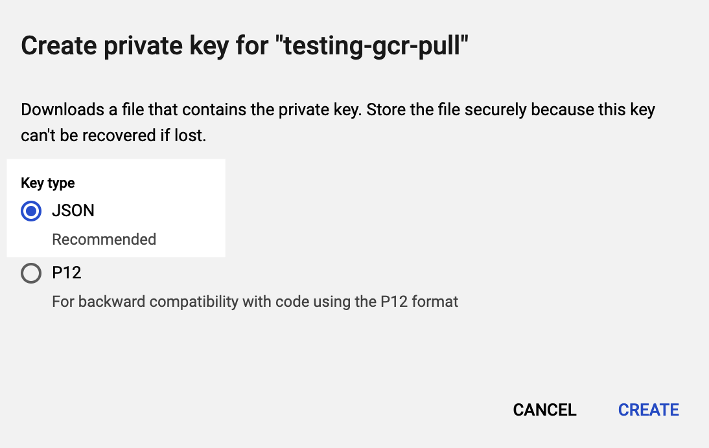

Use a Harness Google Cloud Platform (GCP) connector to integrate GCP with Harness. Use GCP with Harness to obtain artifacts, communicate with GCP services, provision infrastructure, deploy microservices, and manage other workloads.

You can use the GCP connector to connect to Kubernetes clusters in GCP. You can also use the [platform-agnostic Kubernetes Cluster connector](kubernetes-cluster-connector-settings-reference.md).

## Kubernetes role requirements

If you use the GCP connector to connect to GKE, the GCP service account used for any credentials requires the **Kubernetes Engine Developer** and **Storage Object Viewer** permissions.

For instructions on adding roles to your service account, go to the Google documentation on [Granting Roles to Service Accounts](https://cloud.google.com/iam/docs/granting-roles-to-service-accounts). For more information about GCP roles, go to the GCP documentation on [Understanding Roles](https://cloud.google.com/iam/docs/understanding-roles?_ga=2.123080387.-954998919.1531518087#curated_roles).

Alternately, you can use a service account that has only the **Storage Object Viewer** permission needed to query GCR, and then use either an in-cluster Kubernetes delegate or a direct [Kubernetes Cluster Connector](kubernetes-cluster-connector-settings-reference.md) with the Kubernetes service account token for performing deployment.

:::caution

Harness supports GKE 1.19 and later. If you use a version prior to GKE 1.19, please enable Basic Authentication. If Basic authentication is inadequate for your security requirements, use the [Kubernetes Cluster Connector](/docs/platform/Connectors/Cloud-providers/add-a-kubernetes-cluster-connector).

:::

## GCS and GCR role requirements

For Google Cloud Storage (GCS) and Google Container Registry (GCR), the following roles are required:

* Storage Object Viewer (`roles/storage.objectViewer`)
* Storage Object Admin (`roles/storage.objectAdmin`)

For more information, go to the GCP documentation about [Cloud IAM roles for Cloud Storage](https://cloud.google.com/storage/docs/access-control/iam-roles).

Ensure the Harness Delegate you have installed can reach `storage.cloud.google.com` and your GCR registry host name, for example `gcr.io`. Registry host name is declared in, for example, the **Host** field in the [Build and Push to GCR step settings](/docs/continuous-integration/use-ci/build-and-upload-artifacts/build-and-push-to-gcr.md).

## Google Artifact Registry role requirements

For Google Artifact Registry, the following roles are required:

* Artifact Registry Reader
* Artifact Registry Writer

## Google Cloud Operations Suite (Stackdriver) requirements

Most APM and logging tools are added to Harness as Verification Providers. For Google Cloud's operations suite (formerly Stackdriver), use the GCP connector.

The following roles and permissions are required:

* **Stackdriver Logs:** The minimum role requirement is **Logs Viewer** (`logging.viewer`)
* **Stackdriver Metrics:** The minimum role requirements are **Compute Network Viewer** (`compute.networkViewer`) and **Monitoring Viewer** (`monitoring.viewer`).

For more information, go to the Google documentation on [Access control](https://cloud.google.com/monitoring/access-control).

## Proxies and GCP with Harness

If you are using a proxy server in your GCP account, and you want to use GCP services with Harness, you must set the following to **not** use your proxy:

* `googleapis.com`: For details, go to the Google documentation on [Proxy servers](https://cloud.google.com/storage/docs/troubleshooting#proxy-server).
* The `token_uri` value from your Google Service Account: For details, go to the Google documentation on [Creating service account keys](https://cloud.google.com/iam/docs/creating-managing-service-account-keys#creating_service_account_keys).

## GCP connector settings

GCP connector settings include:
* **Name:** The unique name for the connector
* **Id:** Go to [Entity Identifier Reference](../../../20_References/entity-identifier-reference.md)
* **Description:** Text string
* **Tags:** Go to [Tags Reference](../../../20_References/tags-reference.md)
* **Details:** Provide credentials that enable Harness to connect to your GCP account. There are two options:
  * Select **Specify credentials here** to use a GCP service account key.
  * Select **Use the credentials of a specific Harness Delegate** to allow the connector to inherit its authentication credentials from the Harness Delegate that is running in GCP.
* **Select connectivity mode**: Select whether Harness should communicate directly with GCP or go through a Harness Delegate in GCP.

Store service account keys as Harness secrets

You can store a GCP service account key in a [Harness Encrypted Text secret](../../../Secrets/2-add-use-text-secrets.md).

To obtain the Google Cloud's service account key file, go to the Google documentation on [Creating and managing service account keys](https://cloud.google.com/iam/docs/creating-managing-service-account-keys). JSON format is required.

Learn more about credential inheritance

* **IAM role inheritance:** The connector inherits the GCP IAM role assigned to the delegate in GCP, such a Harness Kubernetes delegate running in Google Kubernetes Engine (GKE). Make sure the delegate has the IAM roles that your connector needs.
* **GCP workload identity:** If you installed the Harness [Kubernetes delegate](../../../../first-gen/firstgen-platform/account/manage-delegates/install-kubernetes-delegate.md) in a Kubernetes cluster in GKE that has [GCP Workload Identity](https://cloud.google.com/kubernetes-engine/docs/how-to/workload-identity?hl=tr#enable_on_cluster) enabled and uses the same service account and node pool annotation, then the Google Cloud Platform (GCP) connector inherits these credentials if it uses that delegate.
* **Role and policy changes:** If you find that the IAM role associated with your GCP connector don't have the policies required by the GCP service you want to access, you can modify or change the role assigned to the Harness Delegate that your GCP connector is using. You may need to wait up to five minutes for the change to take effect.
* **See also:**
  * [Add a Google Cloud Platform (GCP) connector](../../../7_Connectors/Cloud-providers/connect-to-google-cloud-platform-gcp.md)
  * [GCP Policy Simulator](https://cloud.google.com/iam/docs/simulating-access)

Learn more about connectivity modes

* **Connect through Harness Platform:** Use a direct, secure communication between Harness and GCP.
* **Connect through a Harness Delegate:** Harness communicates with GCP through a Harness Delegate in GCP. You must choose this option if you chose to inherit delegate credentials.

If connecting through a Harness Delegate, select either:

* **Use any available Delegate**: Harness selects an available delegate at runtime. To learn how Harness selects delegates, go to [Delegates overview](../../../2_Delegates/delegate-concepts/delegate-overview.md).
* **Only use Delegates with all of the following tags**: Use **Tags** to match one or more suitable delegates. To learn more about Delegate tags, go to [Use delegate selectors](../../../2_Delegates/manage-delegates/select-delegates-with-selectors.md). You can select **Install new Delegate** to add a delegate without exiting connector configuration. For guidance on installing delegates, go to [Delegate installation overview](../../../2_Delegates/delegate-concepts/delegate-overview.md).

## See also

* [AWS Connector Settings Reference](aws-connector-settings-reference.md)
* [Kubernetes Cluster Connector Settings Reference](kubernetes-cluster-connector-settings-reference.md)

