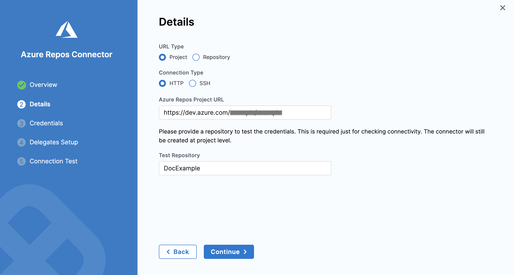
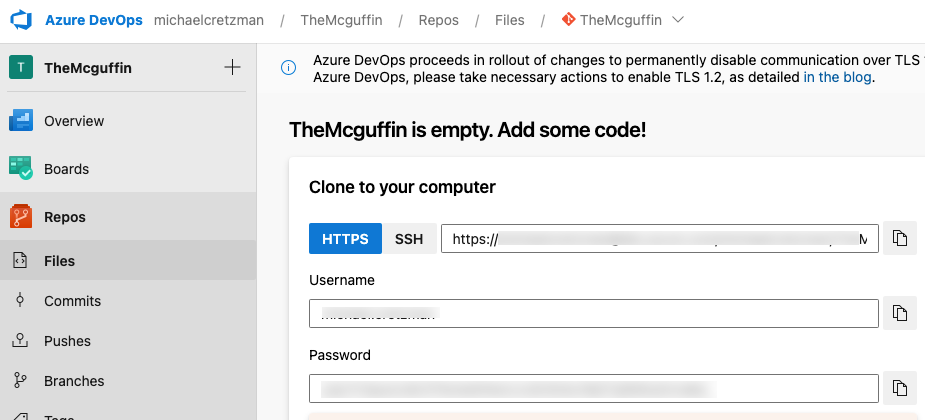
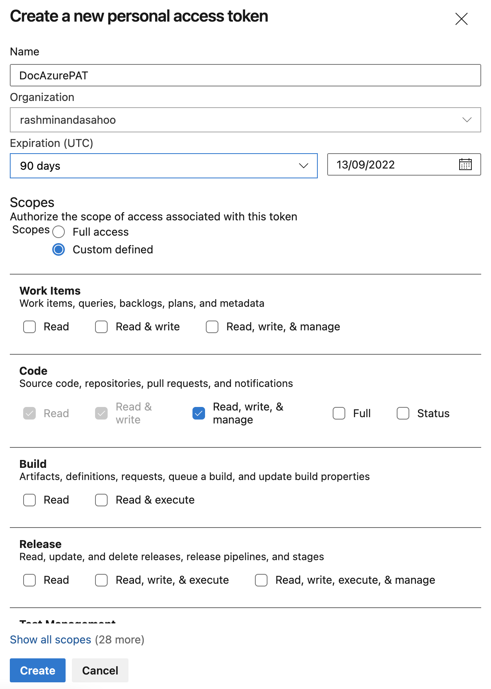

Azure Repos is a set of version control tools that you can use to manage your code. Azure Repos provides Git distributed version control and Team Foundation centralized version control (TFVC).

You can use a Harness Azure Repos connector to connect to Azure Repos Projects and individual repositories.

## Requirements

You must have:

* An Azure Project and at least one repo.
* Permission to create connectors in Harness.
* A [Harness project](../../organizations-and-projects/create-an-organization.md).

## Create the connector

1. In your Harness project, select **Project Setup**, and then select **Connectors**.

   You can also create connectors at the account and organization levels. For example, go to **Account Settings** to create a connector at the account level.

2. Select **New Connector**, and then select the **Azure Repos** connector.
3. Enter a **Name** for your connector, and then select **Continue**.
4. Select **Project** or **Repository** for the **URL Type**.
5. Select **HTTP** or **SSH** for the **Connection Type**.
6. Enter your Azure Repos Project or Repository URL.

   * Example: Repo URL, HTTP format: `https://ORG_NAME@dev.azure.com/ORG_NAME/PROJECT_NAME/_git/REPO_NAME`
   * Example: Project URL, HTTP format: `https://dev.azure.com/ORG_NAME/PROJECT_NAME`
   * You can get the URL from Azure Repos.

      

   * Be careful when copying Project URLs from Azure Repos, because the URL path can include `_git/REPO_NAME`. Don't include this part of the path when you paste the URL into the **Azure Repos Project URL** field.

      

7. If you selected **Project**, in **Test Repository**, enter the name of a repository that Harness can use to test the connector's connection.
8. Select **Continue**, and then configure **Credentials** based on the **Connection Type**:

   * For HTTP connections, enter the username and password to access the project or repo.

      

   * For SSH connections, you must provide an SSH private key stored in a [Harness encrypted text secret](../../Secrets/2-add-use-text-secrets.md). You can use `ssh-keygen -t rsa` to create a private SSH key. For more information, go to the Microsoft documentation on [Creating SSH Keys](https://docs.microsoft.com/en-us/azure/devops/repos/git/use-ssh-keys-to-authenticate?view=azure-devops#step-1-create-your-ssh-keys).

9. If required, select **Enable API Access**. This is recommended, and it is required to use Git event triggers, webhooks, and send build and PR statuses between Azure Repos and Harness.

   * You need an [Azure Repos Personal Access Token](https://docs.microsoft.com/en-us/azure/devops/organizations/accounts/use-personal-access-tokens-to-authenticate?view=azure-devops&tabs=Windows#create-a-pat) to enable API access.

      

   * In **Personal Access Token**, select a [Harness encrypted text secret](../../Secrets/2-add-use-text-secrets.md) containing an Azure Repos Personal Access Token. Harness requires the token for API access. Generate the token in your Azure account, and then add it to Harness as a secret.

10. Select **Continue**, and then configure the delegate connection. Select either:

   * **Use any available Delegate:** Harness selects an available delegate at runtime.
   * **Only use Delegates with all of the following tags:** Select specific delegates that you want Harness to use with this connector.

11. Select **Save and Continue**, and then wait while Harness tests the connector's connection. If the test succeeds, select **Finish**.

## Kubernetes delegate with self-signed certificates

If your codebase connector allows API access and connects through a Harness Delegate that uses self-signed certificates, you must specify `ADDITIONAL_CERTS_PATH` in the delegate pod, as described in [Configure a Kubernetes build farm to use self-signed certificates](/docs/continuous-integration/use-ci/set-up-build-infrastructure/k8s-build-infrastructure/configure-a-kubernetes-build-farm-to-use-self-signed-certificates#enable-self-signed-certificates).
