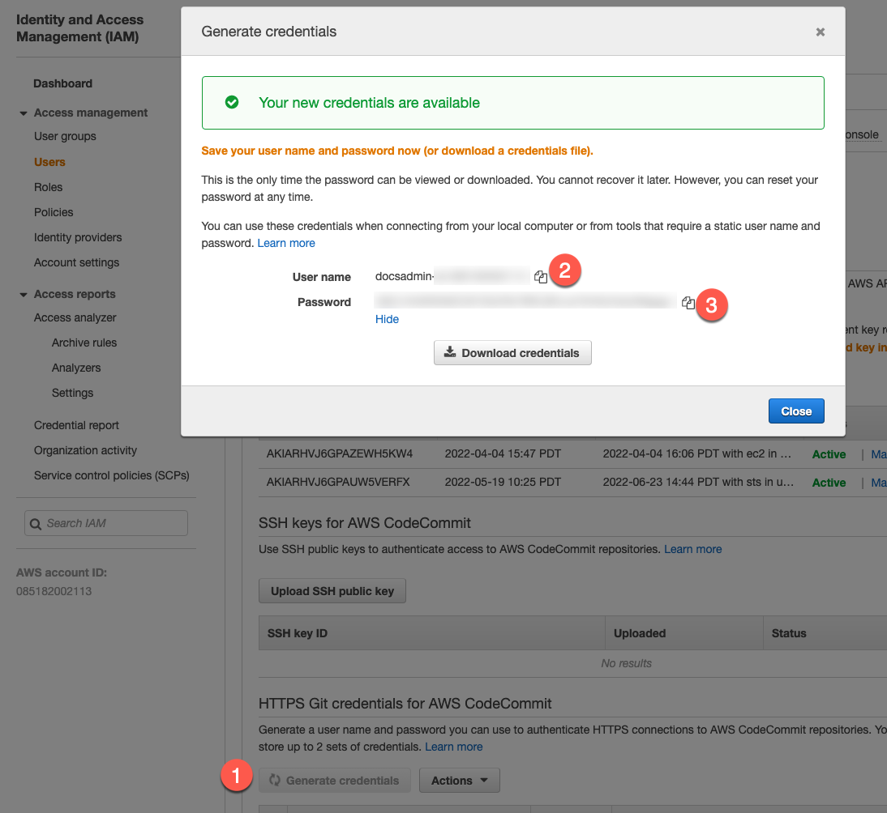
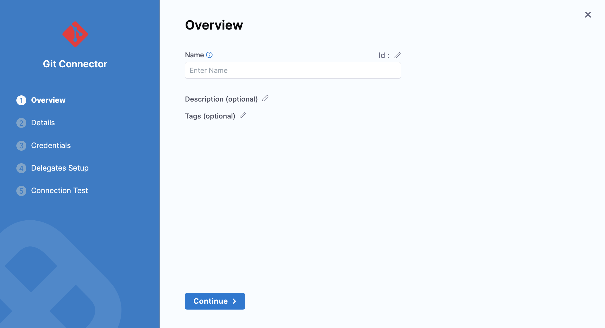

```mdx-code-block
import Tabs from '@theme/Tabs';
import TabItem from '@theme/TabItem';
```

Harness code repository connectors connect your Harness account with your Git platform. Connectors are used to pull code as well as other important files, such as Helm charts, Kubernetes manifests, and Terraform scripts, from your Git repos.

## Connect to Your Git Repositories

You can add a Code Repo Connector to the Account, Org, or Project scope. This topic will explain how to add it to the Project scope. The process is the same for Org and Account. 

## Important notes

Currently, this feature is behind the feature flag, `OPTIMIZED_GIT_FETCH_FILES`. Contact [Harness Support](mailto:support@harness.io) to enable the feature.

Harness performs a `git clone` to fetch files. When fetching very large repositories, the network connection may time out. 

Enable the feature flag, `OPTIMIZED_GIT_FETCH_FILES` to fetch very large repositories from Azure Repo. When this feature flag is enabled, Harness will use provider-specific APIs to improve performance.

:::info

If the `OPTIMIZED_GIT_FETCH_FILES` feature flag is enabled, and the GitHub organization has SAML enabled, the token must be SAML authorized to access the organization even if the repository is public. For more information, go to [GitHub authentication with SAML single sign-on](https://docs.github.com/en/enterprise-cloud@latest/authentication/authenticating-with-saml-single-sign-on/about-authentication-with-saml-single-sign-on).

:::

## Permissions

In general, the Git provider user account you use to set up the Connector needs the same permissions it would need if you were working from Git.

So, if you are using the Harness Connector to pull manifests from a repo, the user account you use in the Connector must have a `read repo` permission for your Git provider.

For Harness Git Experience, see [Source Code Manager Settings](../../7_Connectors/Code-Repositories/ref-source-repo-provider/source-code-manager-settings.md).

A public Git repo does not require a username and password/token. Harness does not validate public Git repo credentials.

## Connect to AWS CodeCommit

You can use either an AWS CodeCommit connector or the platform-agnostic Git connector to connect to AWS CodeCommit repos.

Regardless of which connector you choose, the IAM account you use to connect to CodeCommit must have the following policies:

* **AWSCodeCommitPowerUser**
* **DescribeRegions**

The [DescribeRegions](https://docs.aws.amazon.com/AWSEC2/latest/APIReference/API_DescribeRegions.html) action is required for all AWS connections, regardless of what AWS resource you use with Harness.

For instructions on setting up the IAM user for CodeCommit connections, go to the following AWS documentation:

* [Setup for HTTPS users using Git credentials from AWS](https://docs.aws.amazon.com/codecommit/latest/userguide/setting-up-gc.html)
* [AWS managed policies for CodeCommit](https://docs.aws.amazon.com/codecommit/latest/userguide/security-iam-awsmanpol.html)

```mdx-code-block
<Tabs>
  <TabItem value="codecommit" label="AWS CodeCommit Connector" default>
```
<!-- I think this needs to be revised because the instructions here don't match the "Settings reference" topic, and I don't see an AWS CodeCommit option under Code Repos in the connector drawer -->

1. In your Harness project, select **Connectors** under **Project Setup**.
2. Select **New Connector** and select **AWS CodeCommit** under **Code Repositories**.
3. Configure the [AWS CodeCommit connector settings](../../7_Connectors/Cloud-providers/ref-cloud-providers/aws-connector-settings-reference.md):

   * Enter a **Name**.
   * Select **Repository** to connect to one repo or select **Region** to connect to an entire AWS region. Selecting **Region** lets you use one connector for all repos in that region.
   * If you selected **Repository**, enter the **AWS CodeCommit Repository URL**, such as `https://git-codecommit.us-west-2.amazonaws.com/v1/repos/doc-text`. You can get this URL from your CodeCommit repo by using its **Clone URL** menu and selecting **Clone HTTPS**.
   * If you selected **Region**, provide the name of a repo that Harness can use to test the connection.
   * In **Access Key** and **Secret Key**, enter the IAM user's access key and secret key, respectively. Use [Encrypted text secrets](../../Secrets/2-add-use-text-secrets.md) to store keys.

4. After the connection test runs, select **Finish** to save the connector.

```mdx-code-block
  </TabItem>
  <TabItem value="git" label="Platform-agnostic Git connector">
```

You can connect to CodeCommit [using the Harness platform-agnostic Git connector](#use-the-platform-agnostic-git-connector), instead of the AWS CodeCommit connector.

With the generic Git connector, you must use a username and password for the IAM user, instead of an access key and secret key.

<!-- original text: In the Harness CodeCommit Connector, in **Access Key**, enter the **User name** from the IAM user credentials you generated. In **Secret Key**, use a [Harness Encrypted Text secret](../../Secrets/2-add-use-text-secrets.md) for the **Password** of the IAM user account. -->

1. On the configuration page for the IAM User, select **Security credentials**, and then generate credentials in **HTTPS Git credentials for AWS CodeCommit**.

   

2. In your Harness project, select **Connectors** under **Project Setup**.
3. Select **New Connector** and select **Git** under **Code Repositories**.
4. Configure the [Git connector settings](./ref-source-repo-provider/git-connector-settings-reference.md):

   * Enter a **Name**.
   * Select **Repository** for the **URL Type**.
   * Select **HTTP** for the **Connection Type**.
   * In **Git Repository URL**, enter the AWS CodeCommit repository URL, such as `https://git-codecommit.us-west-2.amazonaws.com/v1/repos/doc-text`. You can get this URL from your CodeCommit repo by using its **Clone URL** menu and selecting **Clone HTTPS**.
   * In **Username** and **Password**, enter the username and password that you generated for the IAM user. Use an [Encrypted text secret](../../Secrets/2-add-use-text-secrets.md) to store the password.

5. After the connection test runs, select **Finish** to save the connector.

```mdx-code-block
  </TabItem>
</Tabs>
```

## Connect to Azure Repos

Azure Repos is a set of version control tools that you can use to manage your code. Azure Repos provide the following kinds of version control:

- Git: distributed version control
- Team Foundation Version Control (TFVC): centralized version control

For steps on connecting Harness to Azure Repo, go to [Connect to Azure Repos](https://developer.harness.io/docs/platform/Connectors/Code-Repositories/connect-to-a-azure-repo).

## Connect to Bitbucket

:::note

For more details on the settings to create this connector, see [Bitbucket Connector Settings Reference](../../7_Connectors/Code-Repositories/ref-source-repo-provider/bitbucket-connector-settings-reference.md).

Harness supports both Cloud and Data Center (On-Prem) versions of Bitbucket.

:::

1. Open a Harness Project.
2. In **Project Setup**, click **Connectors**.
3. Click **New Connector**, and click **Bitbucket** in **Code Repositories**. The Bitbucket settings appear.
4. In **Name**, enter a name for this connector.
5. Select **Account** or **Repository** in **URL Type**.
6. Select **Connection Type** as **HTTP** or **SSH**. For more information, see [Connection Type](../../7_Connectors/Code-Repositories/ref-source-repo-provider/bitbucket-connector-settings-reference.md#connection-type).
7. Enter your **Bitbucket Account URL**.  
For **HTTP**, the format for the URL should be `https://bitbucket.org/<userName>/<repoName>.git`.
8. In **Test Repository**, enter your repository name to test the connection.
9. Click **Save and Continue**.
10. Enter your **Username**.
11. In **Secret Key** you can either create a new [Encrypted Text](../../Secrets/2-add-use-text-secrets.md) or use an existing one.
12. Click **Continue**.
13. In **Setup Delegates**, you can choose **Connect via any delegate** or **Connect only via delegates which has all of the following tags**.
14. Click **Save and Continue**.
15. Once the Test Connection succeeds, click **Finish**. The Connector is listed in Connectors.

## Connect to GitHub

See [Add a GitHub Connector](./add-a-git-hub-connector.md).

## Connect to GitLab

:::note
For more details on the settings to create this connector, see [GitLab Connector Settings Reference](../../7_Connectors/Code-Repositories/ref-source-repo-provider/git-lab-connector-settings-reference.md).

:::

1. Open a Harness Project.
2. In **Project Setup**, click **Connectors**.
3. Click **New Connector**, and click **GitLab** in **Code Repositories**. The GitLab Connector settings appear.
4. In **Name**, enter a name for this connector.
5. Select **Account** or **Repository** in **URL Type**.
6. Select **Connection Type** as **HTTP** or **SSH**. For more information, see [Connection Type](../../7_Connectors/Code-Repositories/ref-source-repo-provider/git-lab-connector-settings-reference.md#connection-type).
7. Enter your **GitLab Account URL**.
8. In **Test Repository**, enter your repository name to test the connection.
9. Click **Continue**.
10. In **Credentials,** Enter your **Username**.
11. In **Secret Key** you can either create a new [Encrypted Text](../../Secrets/2-add-use-text-secrets.md) or use an existing one.
12. Click **Continue**.
13. In **Setup Delegates**, you can choose **Connect via any delegate** or **Connect only via delegates which has all of the following tags**.
14. Click **Save and Continue**.
15. Once the Test Connection succeeds, click **Finish**. The Connector is listed in Connectors.

## Use the platform-agnostic Git connector

In most cases, you'll want to add a Connector for a popular Git provider like GitHub, described in [Add a GitHub Connector](./add-a-git-hub-connector.md). You can also add a platform-agnostic connection to a Git provider using **Git Repo**.

For more details on the settings to create this connector, see [Git Connector Settings Reference](../../7_Connectors/Code-Repositories/ref-source-repo-provider/git-connector-settings-reference.md).

1. In your **Project** select a module such as CD.
2. In **Project Setup**, click **Connectors**.
3. Click **New Connector**, and click **Git** in **Code Repositories**. The Git settings appear.
   
   

4. In **Name**, enter a name for this connector.
5. Select **Account** (which is an Organization) or **Repository** in **URL Type**.
6. Select **Connection Type** as **HTTP** or **SSH**. For more information, see [Connection Type](../../7_Connectors/Code-Repositories/ref-source-repo-provider/git-hub-connector-settings-reference.md#connection-type).
7. Enter the Git Account (org) or repo URL.
8. If you selected **Account**, in **Test Repository**, enter a repository name to test the connection.
9. Click **Continue**.
10. In **Credentials,** Enter your **Username**.
11. In **Secret Key** you can either create a new [Encrypted Text](../../Secrets/2-add-use-text-secrets.md) or use an existing one.
12. Click **Continue**.
13. In **Setup Delegates**, you can choose **Connect via any delegate** or **Connect only via delegates which has all of the following tags**.
14. Click **Save and Continue**.
15. Once the Test Connection succeeds, click **Finish**. The Connector is listed in Connectors.
