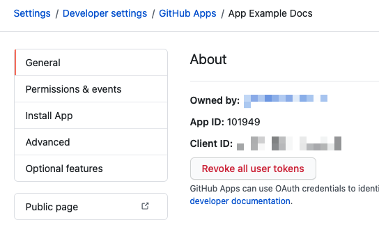

You can use a GitHub App to provide authentication for a GitHub connector. This enables API access to GitHub through the GitHub App.

GitHub recommends using GitHub Apps for GitHub connectors, because GitHub Apps offer more granular permissions than other authentication methods.

This topic assumes you have an understanding of:

* [Connecting to code repos with Harness.](./connect-to-code-repo.md)
* [Creating GitHub Apps.](https://docs.github.com/en/apps/creating-github-apps/about-creating-github-apps/about-creating-github-apps)
* [Installing GitHub Apps.](https://docs.github.com/en/apps/using-github-apps/installing-your-own-github-app)

## Permissions requirements

You must meet one or more of the following criteria:

* You can install GitHub Apps on your personal account or under an organization where you have administrative access.
* You have admin permissions on a GitHub repo under a GitHub organization, and you can install GitHub Apps in that repo.
* You will install the GitHub App in a repo that requires an organization's permission, and the organization owner has approved the application, and can provide approvals as needed to proceed with app installation.

## Create the GitHub App

You can create and register GitHub Apps in your personal GitHub account or in any GitHub organization where you have administrative access.

Follow the instructions in the GitHub documentation on [Creating a GitHub App](https://docs.github.com/en/developers/apps/creating-a-github-app). Populate the settings as follows:

* **GitHub App Name:** Enter a name.
* **Homepage URL:** Enter `https://harness.io/`.
* **Webhook:** Deselect **Active**. The app is used for authentication and doesn't need to receive webhook events.
* **Permissions:** Configure the following **Repository Permissions**.
	+ **Administration:** Select **Read & write**.
	+ **Commit statuses**: Select **Read & write**.
	+ **Contents:** Select **Read & write**.
	+ **Metadata:** Select **Read-only**.
	+ **Pull requests**: Select **Read & write**. This is required for the **Issue Comment** [event trigger](/docs/platform/pipelines/w_pipeline-steps-reference/triggers-reference/#event-and-actions) for Github.
	+ **Webhooks:** Select **Read & write**.
* **Where can this GitHub App be installed:** Select **Any account**. The app must be public to use it with a GitHub connector.

:::info Private apps

A private app can only be installed on the account that owns the app. Your app is private if you *didn't* select **Any account** for **Where can this GitHub App be installed**. You must edit your app and make it public. For instructions, go to the GitHub documentation on [Changing the visibility of a GitHub App](https://docs.github.com/en/apps/maintaining-github-apps/modifying-a-github-app-registration#changing-the-visibility-of-a-github-app).

:::

## Install the GitHub App

Follow the instructions in the GitHub documentation on [Installing your own GitHub App](https://docs.github.com/en/apps/using-github-apps/installing-your-own-github-app), and note the following:

* For **Repository access**, select **Only select repositories**, and then select the repos you want to connect with through your Harness GitHub connector.
* Configure these **Permissions**:
   * **Metadata: Read**
   * **Code: Read & write**
   * **Commit statuses: Read & write**
   * **Pull Requests: Read & write**

## Get the Installation ID and App ID

You need the **Installation ID** and **App ID** to configure your Harness GitHub connector.

1. Get the **Installation ID** from the URL of the installed app, such as:

   ```
   https://github.com/settings/installations/INSTALLATION_ID
   ```

   

2. Get the **App ID** from the app's **General** tab.

   

## Generate a private key

You need a private key for your GitHub app to configure your Harness GitHub connector.

1. Follow the instructions in the GitHub documentation for [generating private keys for GitHub Apps](https://docs.github.com/en/apps/creating-github-apps/authenticating-with-a-github-app/managing-private-keys-for-github-apps#generating-private-keys)
2. Save the private key file to your local machine. GitHub only stores the public portion of the key.
3. Open a terminal and `cd` to the folder containing the key.
4. Run the following command to convert the key file to the necessary format for the Harness GitHub connector. Replace `YOUR_KEY.pem` with the name of the PEM file you saved:

   ```
   openssl pkcs8 -topk8 -inform PEM -outform PEM -in <your-key>.pem -out converted-github-app.pem -nocrypt
   ```

5. In Harness, store the converted key file as a [Harness encrypted file secret](/docs/platform/Secrets/add-file-secrets).

## Configure the GitHub connector

You can use your GitHub App as <!-- either the [primary authentication method](/docs/platform/Connectors/Code-Repositories/ref-source-repo-provider/git-hub-connector-settings-reference#authentication) or -->the [API access authentication method](/docs/platform/Connectors/Code-Repositories/ref-source-repo-provider/git-hub-connector-settings-reference#enable-api-access) for your GitHub connector.

<!-- At 803xx release, remove below steps and uncomment tabs. -->

1. In your Harness project, select **Connectors** under **Project Setup**.
2. Create a new connector or edit an existing GitHub connector.
3. Configure the [GitHub connector settings](./ref-source-repo-provider/git-hub-connector-settings-reference.md). The GitHub App is part of the **Credentials** settings.
4. Select **Enable API access**. This setting is only available for connection types and authentication methods where it is not already enabled by default.
5. For **API Authentication**, select **GitHub App**.
6. Enter the your GitHub [installation ID and app ID](#get-the-installation-id-and-app-id).
7. Select your [private key file secret](#generate-a-private-key).
8. Select **Continue**.
9. If the connection test succeeds, select **Finish** to save the connector.

```mdx-code-block
import Tabs from '@theme/Tabs';
import TabItem from '@theme/TabItem';
```
<!--
```mdx-code-block
<Tabs>
  <TabItem value="primary" label="Primary authentication">
```

:::note

Currently, the option to use a GitHub App as the primary authentication method for a GitHub connector is behind the feature flag `CDS_GITHUB_APP_AUTHENTICATION`. Contact [Harness Support](mailto:support@harness.io) to enable the feature.

:::

:::caution

The [Git Clone step](/docs/continuous-integration/use-ci/codebase-configuration/clone-and-process-multiple-codebases-in-the-same-pipeline) doesn't support GitHub connectors that use GitHub App authentication.

:::

1. In your Harness project, select **Connectors** under **Project Setup**.
2. Create a new connector or edit an existing GitHub connector.
3. Configure the [GitHub connector settings](./ref-source-repo-provider/git-hub-connector-settings-reference.md). The GitHub App is part of the **Credentials** settings.
4. For **Authentication**, select **GitHub App**.
5. Enter the your GitHub [installation ID and app ID](#get-the-installation-id-and-app-id).
6. Select your [private key file secret](#generate-a-private-key).
7. Select **Continue**.
8. If the connection test succeeds, select **Finish** to save the connector.

```mdx-code-block
  </TabItem>
  <TabItem value="api" label="API access authentication" default>
```

1. In your Harness project, select **Connectors** under **Project Setup**.
2. Create a new connector or edit an existing GitHub connector.
3. Configure the [GitHub connector settings](./ref-source-repo-provider/git-hub-connector-settings-reference.md). The GitHub App is part of the **Credentials** settings.
4. Select **Enable API access**. This setting is only available for connection types and authentication methods where it is not already enabled by default.
5. For **API Authentication**, select **GitHub App**.
6. Enter the your GitHub [installation ID and app ID](#get-the-installation-id-and-app-id).
7. Select your [private key file secret](#generate-a-private-key).
8. Select **Continue**.
9. If the connection test succeeds, select **Finish** to save the connector.

```mdx-code-block
  </TabItem>
</Tabs>
```
-->

## Option: Set up a PR trigger

You can configure your pipelines to use [Git event triggers](/docs/platform/Triggers/triggering-pipelines) so that builds automatically run in response to events in your Git repos.

If you want to set up a PR trigger, make sure the webhook definition uses the **Pull Request** [event](/docs/platform/Pipelines/w_pipeline-steps-reference/triggers-reference#event-and-actions).
