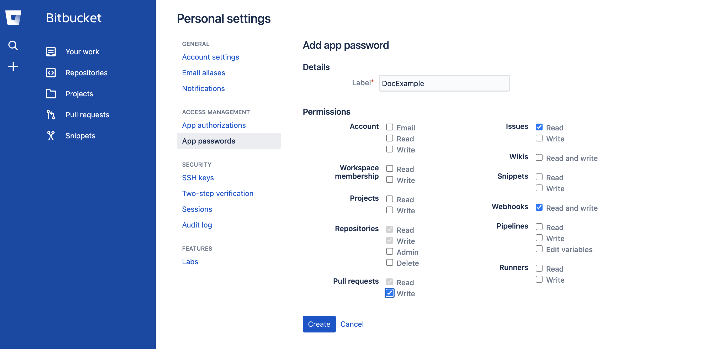

This topic describes the settings and permissions for the Bitbucket connector. Harness supports both Cloud and Data Center (On-Prem) versions of Bitbucket. The following settings are applicable to both versions.

## Overview settings

* **Name:** The unique name for this connector. Harness generates an **Id** ([Entity Identifier](../../../20_References/entity-identifier-reference.md)) based on the **Name**. You can edit the **Id** during initial connector creation. Once you save the connector, the **Id** is locked.
* **Description:** Optional text string.
* **Tags:** Optional labels you can use for filtering. For details, go to the [Tags reference](../../../20_References/tags-reference.md).

## Details settings

The **Details** settings specify which BitBucket account or repository you want this connector to connect to, whether to connect over HTTP or SSH, and the URL to use.

### URL Type

Select **Account** to connect an entire Bitbucket account. This option lets you use one connector to connect to all repositories in the specified Bitbucket account. Make sure you have at least one repo in the account; you need a repo to test the connection and save the connector.

Select **Repository** to connect to a single, specific repo in a Bitbucket account.

### Connection Type

Select the protocol, **HTTP** or **SSH**, to use for cloning and authentication. The **Connection Type** determines the URL format required for the **Bitbucket Account/Repository URL** field. It also determines the **Authentication** method you must use in the [Credentials settings](#credentials-settings).

### Bitbucket Account/Repository URL

Enter the URL for the Bitbucket account or repository that you want to connect to. The required value is determined by the **URL Type**, **Connection Type**, and your Bitbucket account type (Cloud or Data Center).

```mdx-code-block
import Tabs from '@theme/Tabs';
import TabItem from '@theme/TabItem';
```

```mdx-code-block
<Tabs>
  <TabItem value="account" label="URL Type: Account" default>
```

In the **Bitbucket Account URL** field, provide only the account-identifying portion of the Bitbucket URL, such as `https://bitbucket.org/my-bitbucket/`. Do not include any repo name or project name.

The URL format depends on the **Connection Type** and your Bitbucket account type (Cloud or Data Center). The following table provides format examples for each combination.

| Connection Type | Bitbucket Cloud | Bitbucket Data Center (On-Prem) |
| --------------- | --------------- | ------------------------------- |
| HTTP | `https://bitbucket.org/USERNAME/` or `https://bitbucket.org` | `https://bitbucket.YOUR_ORG_HOSTNAME/scm/` |
| SSH | `git@bitbucket.org:USERNAME/` | `git@bitbucket.YOUR_ORG_HOSTNAME/` |

<figure>


<figcaption>HTTP and SSH examples of Bitbucket Cloud account URLs.</figcaption>
</figure>

<figure>


<figcaption>HTTP and SSH examples of Bitbucket Data Center account URLs.</figcaption>
</figure>

```mdx-code-block
  </TabItem>
  <TabItem value="repo" label="URL Type: Repository">
```

In the **Bitbucket Repository URL** field, provide the complete URL to the Bitbucket repository that you want this connector to point to.

The URL format depends on the **Connection Type** and your Bitbucket account type (Cloud or Data Center). The following table provides format examples for each combination.

| Connection Type | Bitbucket Cloud | Bitbucket Data Center (On-Prem) |
| --------------- | --------------- | ------------------------------- |
| HTTP | `https://bitbucket.org/<username>/<repo-name>.git` | `https://bitbucket.<your-org-hostname>/scm/<project-id>/<repo-name>.git` |
| SSH | `git@bitbucket.org:<username>/<repo-name>.git` | `git@bitbucket.<your-org-hostname>/<project-id>/<repo-name>.git` |

<figure>


<figcaption>SSH example of a Bitbucket Cloud repository URL.</figcaption>
</figure>

<figure>


<figcaption>HTTP example of a Bitbucket Data Center repository URL.</figcaption>
</figure>

```mdx-code-block
  </TabItem>
</Tabs>
```

:::tip

There are several different formats possible for Bitbucket Data Center (On-Prem) accounts, such as `bitbucket.myorg.com`, `bitbucket.my.org.com`, and so on. You may also need to use a `<domain-name>:<port>` format for the authority portion of SSH URLs, such as `bitbucket.myorg.com:8080`. This depends on your server and firewall configuration. If the connection test fails, make sure you've used the appropriate URL format.


:::

### Test Repository

This field is only required if the **URL Type** is **Account**. Provide a path to a repo in your Bitbucket account that Harness can use to test the connector. Harness uses this repo path to validate the connection only. When you use this connector in a pipeline, you'll specify a true code repo in your pipeline configuration or at runtime.

For Bitbucket Cloud accounts, the **Test Repository** path format is: `<repo-name>.git`.


For BitBucket Data Center (On-Prem) accounts, you must include the project ID, such as `<project-id>/<repo-name>.git`.


## Credentials settings

Provide authentication credentials for the connector.

### Authentication

The **Connection Type** you chose in the [Details settings](#details-settings) determines the **Authentication** method.

```mdx-code-block
import Tabs2 from '@theme/Tabs';
import TabItem2 from '@theme/TabItem';
```

```mdx-code-block
<Tabs2>
  <TabItem2 value="http" label="Username and Password" default>
```

The **HTTP** Connection Type requires **Username** and **Password** authentication for all accounts and repos, including read-only repos.

In the **Username** field, enter the Bitbucket account username as specified in your Bitbucket **Account settings**. You can use either plaintext or a [Harness encrypted text secret](../../../Secrets/2-add-use-text-secrets.md).


In the **Password** field, provide a Bitbucket account-level [access token](https://support.atlassian.com/bitbucket-cloud/docs/access-tokens/), [HTTP access token](https://confluence.atlassian.com/bitbucketserver/http-access-tokens-939515499.html), or [app password](https://support.atlassian.com/bitbucket-cloud/docs/create-an-app-password/). Passwords are stored as [Harness encrypted text secrets](../../../Secrets/2-add-use-text-secrets.md).

You must provide an account-level app password or token. Repo-level tokens are not supported.

If you use a Google account to log in to Bitbucket, you must use an App password.

Bitbucket accounts with two-factor authentication must use access tokens.

```mdx-code-block
  </TabItem2>
  <TabItem2 value="ssh" label="SSH Key">
```

The **SSH** Connection Type requires an **SSH Key** in PEM format. OpenSSH keys are not supported. In Harness, SSH Keys are stored as [Harness SSH credential secrets](/docs/platform/Secrets/add-use-ssh-secrets). When creating an SSH credential secret for a code repo connector, the SSH credential's **Username** must be `git`.

For details on creating SSH keys and adding them to your Bitbucket account, go to the Bitbucket documentation about [Configuring SSH and two-step verification](https://support.atlassian.com/bitbucket-cloud/docs/configure-ssh-and-two-step-verification/).

:::tip

If you use the `keygen` command to generate an SSH key, include arguments such as `rsa` and `-m PEM` to ensure your key is properly formatted and uses the RSA algorithm. For example, this command creates an SSHv2 key:

```
ssh-keygen -t rsa -m PEM
```

Make sure to follow the prompts to finish creating the key. For more information, go to the Linux [ssh-keygen man page](https://linux.die.net/man/1/ssh-keygen).

:::

```mdx-code-block
  </TabItem2>
</Tabs2>
```

### Enable API access

You must enable API access to use Git-based triggers, manage webhooks, or update Git statuses with this connector. If you are using the Harness Git Experience, this setting is required. API access requires username and password authentication.

In the **Username** field, enter the Bitbucket account username as specified in your Bitbucket **Account settings**. You can use either plaintext or a [Harness encrypted text secret](../../../Secrets/2-add-use-text-secrets.md).


In the **Personal Access Token** field, provide a Bitbucket account-level [App password](https://support.atlassian.com/bitbucket-cloud/docs/create-an-app-password/), [Access token](https://support.atlassian.com/bitbucket-cloud/docs/access-tokens/), or [HTTP access token](https://confluence.atlassian.com/bitbucketserver/http-access-tokens-939515499.html). Passwords are stored as [Harness Encrypted Text secrets](../../../Secrets/2-add-use-text-secrets.md).

You must provide an account-level app password or token. Repo-level tokens are not supported.

:::caution

For **HTTP** Connection Types, use the same password you used earlier, and make sure the **Username** fields are both plain-text or both encrypted. Don't use a plain-text username for one field and a secret for the other.

:::

## Connectivity Mode settings

Select whether you want Harness to connect directly to your Bitbucket account or repo, or if you want Harness to communicate with your Bitbucket account or repo through a delegate.

### Delegates Setup

If you select **Connect through a Harness Delegate**, you can select **Use any available Delegate** or **Only use Delegates with all of the following tags**.

If you want to use specific delegates, you must identify those delegates. For more information, go to [Select Delegates with Tags](../../../2_Delegates/manage-delegates/select-delegates-with-selectors.md).

### Kubernetes delegate with self-signed certificates

If your codebase connector allows API access and connects through a Harness Delegate that uses self-signed certificates, you must specify `ADDITIONAL_CERTS_PATH` in the delegate pod, as described in [Configure a Kubernetes build farm to use self-signed certificates](/docs/continuous-integration/use-ci/set-up-build-infrastructure/k8s-build-infrastructure/configure-a-kubernetes-build-farm-to-use-self-signed-certificates#enable-self-signed-certificates).

## Troubleshooting

Here are some troubleshooting suggestions for BitBucket Connectors.

### Connection test failing

If the connection test returns a `not authorized` error, make sure you used the **Username** specified in the Bitbucket **Account settings**.


The connection test may also fail if the token doesn't have sufficient privileges.



### Status doesn't update in BitBucket Cloud PRs

BitBucket Cloud limits the key size for sending status updates to PRs, and this can cause incorrect status updates in PRs due to some statuses failing to send. If you encounter this issue with BitBucket Cloud, contact [Harness Support](mailto:support@harness.io) to troubleshoot this issue by enabling a feature flag, `CI_BITBUCKET_STATUS_KEY_HASH`.
