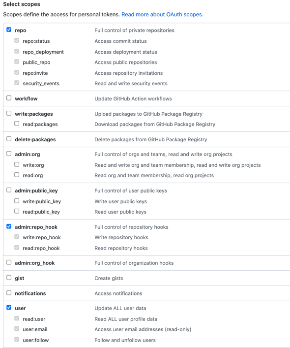
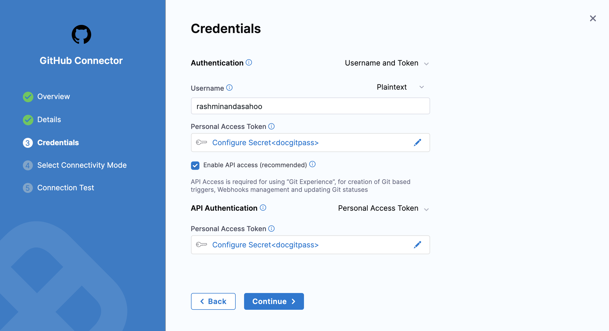

This topic provides settings and permissions for the GitHub connector. For instructions and more information about code repo connectors, go to [Connect to a Git repository](../connect-to-code-repo.md).

## Overview settings

* **Name:** The unique name for this connector. Harness generates an **Id** ([Entity Identifier](../../../20_References/entity-identifier-reference.md)) based on the **Name**. You can edit the **Id** during initial connector creation. Once you save the connector, the **Id** is locked.
* **Description:** Optional text string.
* **Tags:** Optional labels you can use for filtering. For details, go to the [Tags reference](../../../20_References/tags-reference.md).

## Details settings

The **Details** settings specify which GitHub account or repository you want this connector to connect to, whether to connect over HTTP or SSH, and the URL to use.

### URL Type

Select **Account** to connect an entire GitHub account (or organization). This option lets you use one connector to connect to all repositories in the specified GitHub account. Make sure you have at least one repo in the account; you need a repo to test the connection and save the connector.

Select **Repository** to connect to a single, specific GitHub repository.

### Connection Type

Select the protocol, **HTTP** or **SSH**, to use for cloning and authentication. The **Connection Type** determines the URL format required for the **GitHub Account/Repository URL** field. It also determines the **Authentication** method you must use in the [Credentials settings](#credentials-settings).

### GitHub Account/Repository URL

Enter the URL for the GitHub account or repository that you want to connect to. The required value is determined by the **URL Type** and **Connection Type**.

```mdx-code-block
import Tabs from '@theme/Tabs';
import TabItem from '@theme/TabItem';
```
```mdx-code-block
<Tabs>
  <TabItem value="account" label="URL Type: Account" default>
```

In the **GitHub Account URL** field, provide only the account-identifying portion of the GitHub URL, such as `https://github.com/YOUR_ACCOUNT_NAME/`. Do not include a repo name. The URL format depends on the **Connection Type**:

* **HTTP:** `https://github.com/YOUR_ACCOUNT_NAME/` or `https://github.com`
* **SSH:** `git@github.com:YOUR_ACCOUNT_NAME/`

### Test Repository

This field is only required if the **URL Type** is **Account**. Provide the name of a repo in your GitHub account that Harness can use to test the connector. Harness uses this repo to validate the connection only. When you use this connector in a pipeline, you'll specify a true code repo in your pipeline configuration or at runtime.

```mdx-code-block
  </TabItem>
  <TabItem value="repo" label="URL Type: Repository">
```

In the **GitHub Repository URL** field, provide the complete URL to the GitHub repository that you want this connector to point to. The URL format depends on the **Connection Type**:

* **HTTP:** `https://github.com/YOUR_ACCOUNT_NAME/YOUR_REPO_NAME.git`
* **SSH:** `git@github.com:YOUR_ACCOUNT_NAME/YOUR_REPO_NAME.git`

```mdx-code-block
  </TabItem>
</Tabs>
```

:::info GitHub Enterprise URLs

For Github Enterprise, the URL must include your hostname and the organization name, such as `https://mygithub.com/harness/repo-name.git` or `git@mygithub.com:harness/repo-name.git`. In these examples `mygithub.com` is the hostname and `harness` is the organization name.

:::

## Credentials settings

Provide authentication credentials for the connector.

### Authentication

Authentication is required for all accounts and repos, including read-only repos. The **Connection Type** you chose in the [Details settings](#details-settings) determines the available **Authentication** methods:

<!-- At 803xx release, uncomment below phrase and GH App tab -->

* For **HTTP** connections, you can use **Username and Token** or **OAuth**<!--, or **GitHub App**--> authentication.
* For **SSH** connections, you must use **SSH Key** authentication.

```mdx-code-block
<Tabs>
  <TabItem value="usertoken" label="Username and Token" default>
```

1. For **Authentication**, select **Username and Token**.
2. In the **Username** field, enter your personal GitHub account name. You can use either plaintext or a [Harness encrypted text secret](../../../Secrets/2-add-use-text-secrets.md).
3. In the **Personal Access Token** field, provide a GitHub [personal access token](https://docs.github.com/en/authentication/keeping-your-account-and-data-secure/managing-your-personal-access-tokens) as a [Harness encrypted text secret](../../../Secrets/2-add-use-text-secrets.md).

<!--Is this method required for accounts with 2FA? Do OAuth, GH App, & SSH key support accounts w/ 2FA? -->

:::info Personal access token permissions

To use a personal access token with a GitHub organization that uses SAML single sign-on (SSO), you must first authorize the token, as described in the GitHub documentation on [authorizing a personal access token for use with SAML single sign-on](https://docs.github.com/en/enterprise-cloud@latest/authentication/authenticating-with-saml-single-sign-on/authorizing-a-personal-access-token-for-use-with-saml-single-sign-on).

* The GitHub user account that you use to create the token must have admin permissions on the repo.
* GitHub doesn't provide a way to scope tokens for read-only access to repos. You must select all `repo`, `admin:repo_hook`, and `user` scopes.



:::

:::tip

You can validate your token from the command line before using it in Harness. For example:

`curl -i https://api.github.com -u <username>:<token>`

:::

```mdx-code-block
  </TabItem>
  <TabItem value="oauth" label="OAuth">
```

:::note

Currently, OAuth for GitHub connectors is behind a feature flag. Contact [Harness Support](mailto:support@harness.io) to enable the feature.

:::

1. For **Authentication**, select **OAuth**.
2. Select **Link to GitHub** to open a new browser tab and authorize access to your GitHub organization/account.

```mdx-code-block
  </TabItem>
  <TabItem value="ssh" label="SSH Key">
```

SSH connections require an SSH key or a GitHub deploy key.

[GitHub deploy keys](https://docs.github.com/en/developers/overview/managing-deploy-keys#deploy-keys) grant access to a single repo. Using a deploy key ensures that the connector only works with the specific repo you defined in the [Details settings](#details-settings).

SSH keys must be in PEM format. OpenSSH keys are not supported. For details on creating SSH keys and adding them to your GitHub account, go to the GitHub documentation about [adding a new SSH Key](https://docs.github.com/en/authentication/connecting-to-github-with-ssh/adding-a-new-ssh-key-to-your-github-account). In Harness, SSH Keys are stored as [Harness SSH credential secrets](/docs/platform/Secrets/add-use-ssh-secrets). When creating an SSH credential secret for a code repo connector, the SSH credential's **Username** must be `git`.

:::tip

If you use the `keygen` command to generate an SSH key, include arguments such as `rsa` and `-m PEM` to ensure your key is properly formatted and uses the RSA algorithm. For example, this command creates an SSHv2 key:

```
ssh-keygen -t rsa -m PEM
```

Make sure to follow the prompts to finish creating the key. For more information, go to the Linux [ssh-keygen man page](https://linux.die.net/man/1/ssh-keygen).

For GitHub repos, your SSH key must use ECDSA or Ed25519 instead of RSA. As an example, the following `ssh-keygen` command generates a PEM-formatted SSH key in ECDSA:

```
ssh-keygen -t ecdsa -b 256 -f /home/user/Documents/ECDSA/key -m pem
```

For more information about GitHub's deprecation of RSA support, go to the GitHub announcement on [Improving Git protocol security on GitHub](https://github.blog/2021-09-01-improving-git-protocol-security-github/#when-are-these-changes-effective).

:::

<!--
```mdx-code-block
  </TabItem>
  <TabItem value="ghapp" label="GitHub App">
```

You can use a GitHub App to authenticate a Harness GitHub connector. To use this authentication method, you need to create and install a GitHub App, get the app's **installation ID** and **app ID**, and create a private key for the app. For instructions, go to [Use a GitHub App in a GitHub connector](/docs/platform/Connectors/Code-Repositories/git-hub-app-support).

:::note

Currently, the option to use a GitHub App as the primary authentication method for a GitHub connector is behind the feature flag `CDS_GITHUB_APP_AUTHENTICATION`. Contact [Harness Support](mailto:support@harness.io) to enable the feature.

:::

:::caution

The [Git Clone step](/docs/continuous-integration/use-ci/codebase-configuration/clone-and-process-multiple-codebases-in-the-same-pipeline) doesn't support GitHub connectors that use GitHub App authentication.

:::

1. For **Authentication**, select **GitHub App**.
2. Enter the **GitHub Installation Id**. You can find the installation ID in the URL of your installed GitHub App, such as:

   ```
   https://github.com/settings/installations/INSTALLATION_ID
   ```

   

3. Enter the **GitHub Application Id**. You can find the app ID on the **General** tab when viewing your GitHub App in GitHub.

   

4. For **GitHub Private Key**, provide your GitHub App's PEM key file as a [Harness encrypted file secret](/docs/platform/Secrets/add-file-secrets).
-->
```mdx-code-block
  </TabItem>
</Tabs>
```

### Enable API access

This setting is only available for connection types and authentication methods where it is not already enabled by default.

API access is required for any operations that require Harness to call GitHub APIs, such as using the Harness Git Experience, cloning codebases, automatically detecting branch names when you manually run pipelines, using Git webhook triggers, and updating Git statuses.

Enabling API access requires configuring an API authentication method, either a personal access token or a GitHub App.

```mdx-code-block
<Tabs>
  <TabItem value="pat" label="Personal Access Token" default>
```

1. For **API Authentication**, select **Personal Access Token**.
2. In the **Personal Access Token** field, provide a GitHub [personal access token](https://docs.github.com/en/authentication/keeping-your-account-and-data-secure/managing-your-personal-access-tokens) as a [Harness encrypted text secret](/docs/platform/secrets/add-use-text-secrets).

   If you are using **Username and Token** authentication, use the same personal access token secret for both **Personal Access Token** fields.

   

<details>
<summary>Personal access token permissions</summary>

To use a personal access token with a GitHub organization that uses SAML single sign-on (SSO), you must first authorize the token, as described in the GitHub documentation on [authorizing a personal access token for use with SAML single sign-on](https://docs.github.com/en/enterprise-cloud@latest/authentication/authenticating-with-saml-single-sign-on/authorizing-a-personal-access-token-for-use-with-saml-single-sign-on).

* The GitHub user account that you use to create the token must have admin permissions on the repo.
* GitHub doesn't provide a way to scope tokens for read-only access to repos. You must select all `repo`, `admin:repo_hook`, and `user` scopes.


</details>

```mdx-code-block
  </TabItem>
  <TabItem value="ghapp" label="GitHub App">
```

To use this authentication method, you need to create and install a GitHub App, get the app's **installation ID** and **app ID**, and create a private key for the app. For instructions, go to [Use a GitHub App in a GitHub connector](/docs/platform/Connectors/Code-Repositories/git-hub-app-support).

1. For **API Authentication**, select **GitHub App**.
2. Enter the **GitHub Installation Id**. You can find the installation ID in the URL of your installed GitHub App, such as:

   ```
   https://github.com/settings/installations/INSTALLATION_ID
   ```

   

3. Enter the **GitHub Application Id**. You can find the app ID on the **General** tab when viewing your GitHub App in GitHub.

   

4. For **GitHub Private Key**, provide your GitHub App's PEM key file as a [Harness encrypted file secret](/docs/platform/Secrets/add-file-secrets).

```mdx-code-block
  </TabItem>
</Tabs>
```

## Connectivity Mode settings

Select whether you want Harness to connect directly to your GitHub account or repo, or if you want Harness to communicate with your GitHub account or repo through a delegate.

<details>
<summary>About connectivity modes</summary>

If you select **Connect through the Harness Platform**, the Harness Manager exchanges a key pair with the Secrets Manager configured in Harness using an encrypted connection. Next, the Harness Manager uses the encrypted key and the encrypted secret and then discards them. The keys never leave the Harness Manager. Secrets are always encrypted in transit, in memory, and in the Harness database.

**Connect through a Harness Delegate**, a [Harness Delegate](/docs/platform/2_Delegates/delegate-concepts/delegate-overview.md) handles the connection. This option is often used for [Harness Self-Managed Enterprise Edition Overview](/docs/self-managed-enterprise-edition/introduction/harness-self-managed-enterprise-edition-overview).

</details>

### Delegates Setup

If you select **Connect through a Harness Delegate**, you can select **Use any available Delegate** or **Only use Delegates with all of the following tags**.

If you want to use specific delegates, you must identify those delegates. For more information, go to [Select Delegates with Tags](../../../2_Delegates/manage-delegates/select-delegates-with-selectors.md).

### Kubernetes delegate with self-signed certificates

If your codebase connector allows API access and connects through a Harness Delegate that uses self-signed certificates, you must specify `ADDITIONAL_CERTS_PATH` in the delegate pod, as described in [Configure a Kubernetes build farm to use self-signed certificates](/docs/continuous-integration/use-ci/set-up-build-infrastructure/k8s-build-infrastructure/configure-a-kubernetes-build-farm-to-use-self-signed-certificates#enable-self-signed-certificates).
