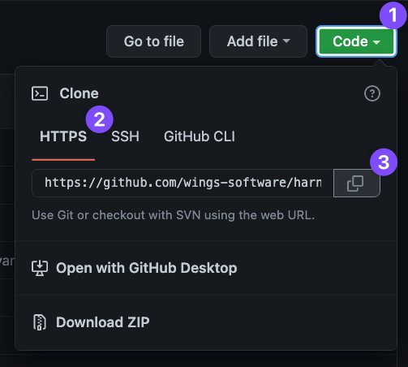

This topic provides settings and permissions for the GitHub Connector.

You can also use a GitHub App for authentication in a Harness GitHub Connector. See [Use a GitHub App in a GitHub Connector](../../Code-Repositories/git-hub-app-support.md).

## Name

The unique name for this Connector.

## ID

See [Entity Identifier Reference](../../../20_References/entity-identifier-reference.md).

## Description

Text string.

## Tags

See [Tags Reference](../../../20_References/tags-reference.md).

## URL Type

You can select Git Account (which is a GitHub **organization**) or Git Repository.

You can add a connection to your entire Git org or just a repo in the org. Selecting a Git org enables you to use one Connector for all of your subordinate repos.

Later, when you test this connection, you'll use a repo in the org.

In either case, when you use the Connector later in Harness, you'll specify which repo to use.

## Connection Type

You can select **HTTPS** or **SSH** for the connection.

You will need to provide the protocol-relevant URL in **URL**.

If you use Two-Factor Authentication for your Git repo, you connect over **HTTPS** or **SSH**. HTTPS connections require a personal access token.

**SSH** requires an SSH key in PEM format. OpenSSH keys are not supported. In Harness, SSH keys are stored as [Harness Encrypted File secrets](../../../Secrets/3-add-file-secrets.md).

:::tip

If you use the `keygen` command to generate an SSH key, include arguments such as `rsa` and `-m PEM` to ensure your key is properly formatted and uses the RSA algorithm. For example, this command creates a PEM-formatted SSHv2 key:

```
ssh-keygen -t rsa -m PEM
```

Make sure to follow the prompts to finish creating the key. For more information, go to the Linux [ssh-keygen man page](https://linux.die.net/man/1/ssh-keygen).

For GitHub repos, your SSH key must use ECDSA or Ed25519 instead of RSA. As an example, the following `ssh-keygen` command generates a PEM-formatted SSH key in ECDSA:

```
ssh-keygen -t ecdsa -b 256 -f /home/user/Documents/ECDSA/key -m pem
```

For more information about GitHub's deprecation of RSA support, go to the GitHub announcement on [Improving Git protocol security on GitHub](https://github.blog/2021-09-01-improving-git-protocol-security-github/#when-are-these-changes-effective).

:::

## GitHub Repository URL

The URL for a Git org or repo. The URL format must match the [Connection Type](#connection_type) you selected --for example:

* HTTPS: `https://github.com/wings-software/harness-docs.git`.
* SSH: `git@github.com:wings-software/harness-docs.git`.

You can get the URL from GitHub using its Code feature:


If you selected **Git Repository** in [URL Type](#url_type), enter the full URL for the repo with the format `https://github.com/[org-name]/[repo-name]`.

If you selected **Git Account** in [URL Type](#url_type), enter the URL without the repo name, like `https://github.com/[org-name]`. You will need to provide a repo name before you can use the Connector in Harness.

## Authentication

All GitHub repos, including read-only repos, require authentication.

You can use a username and password/token for HTTPS credentials. If you selected **SSH** as the connection protocol, you must add the **SSH Key** to use with the connection.

### Username

Your personal GitHub account username. You can use either plaintext or a [Harness encrypted text secret](../../../Secrets/2-add-use-text-secrets.md).

### Personal Access Token

A [Harness Encrypted Text secret](../../../Secrets/2-add-use-text-secrets.md) for the credentials of your GitHub user account.

A Personal Access Token (PAT) is required if your GitHub authentication uses two-factor authentication (2FA). In GitHub, you can create personal access tokens at <https://github.com/settings/tokens/new>.

Typically, you can validate your token from the command line before using it in Harness. For example:

`curl -i https://api.github.com -u <username>:<token>`

:::info Personal Access Token Permissions

To use a personal access token with a GitHub organization that uses SAML single sign-on (SSO), you must first authorize the token, as described in the GitHub documentation on [authorizing a personal access token for use with SAML single sign-on](https://docs.github.com/en/enterprise-cloud@latest/authentication/authenticating-with-saml-single-sign-on/authorizing-a-personal-access-token-for-use-with-saml-single-sign-on).

* The GitHub user account that you use to create the token must have admin permissions on the repo.
* GitHub doesn't provide a way to scope tokens for read-only access to repos. You must select all `repo`, `admin:repo_hook`, and `user` scopes.


:::

### SSH Key

If you selected **SSH** as the connection protocol, you must add the **SSH Key** to use with the connection as a [Harness Encrypted Text secret](../../../Secrets/2-add-use-text-secrets.md). For instructions on creating an SSH Key, go to the GitHub documentation on [adding a new SSH Key](https://docs.github.com/en/authentication/connecting-to-github-with-ssh/adding-a-new-ssh-key-to-your-github-account).

Harness also supports [GitHub deploy keys](https://docs.github.com/en/developers/overview/managing-deploy-keys#deploy-keys). Deploy keys grant access to a single repo. Using a deploy key ensures that the connector only works with the specific repo you selected in **URL Type**.

## Enable API access

This option is required for using Git-based triggers, Webhooks management, and updating Git statuses.

You should use the same [Personal Access Token](#password_personal_access_token) for both Authentication and API Authentication.

### Kubernetes delegate with self-signed certificates

If your codebase connector allows API access and connects through a Harness Delegate that uses self-signed certificates, you must specify `ADDITIONAL_CERTS_PATH` in the delegate pod, as described in [Configure a Kubernetes build farm to use self-signed certificates](/docs/continuous-integration/use-ci/set-up-build-infrastructure/k8s-build-infrastructure/configure-a-kubernetes-build-farm-to-use-self-signed-certificates#enable-self-signed-certificates).
